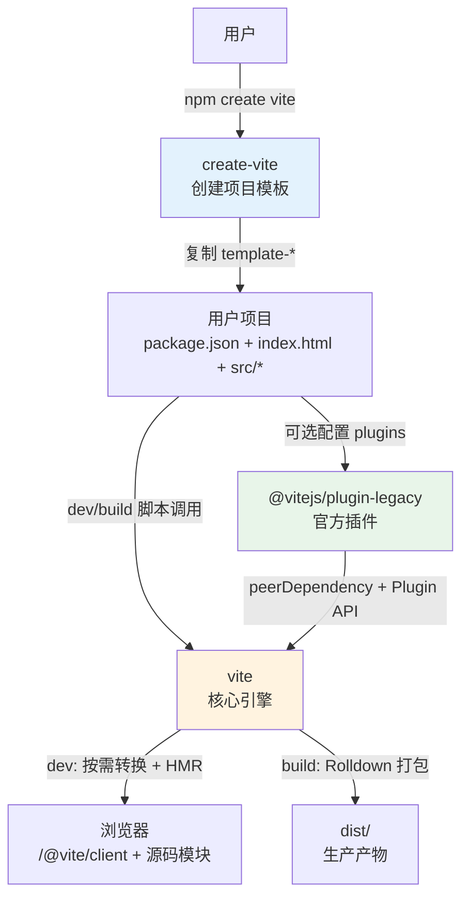
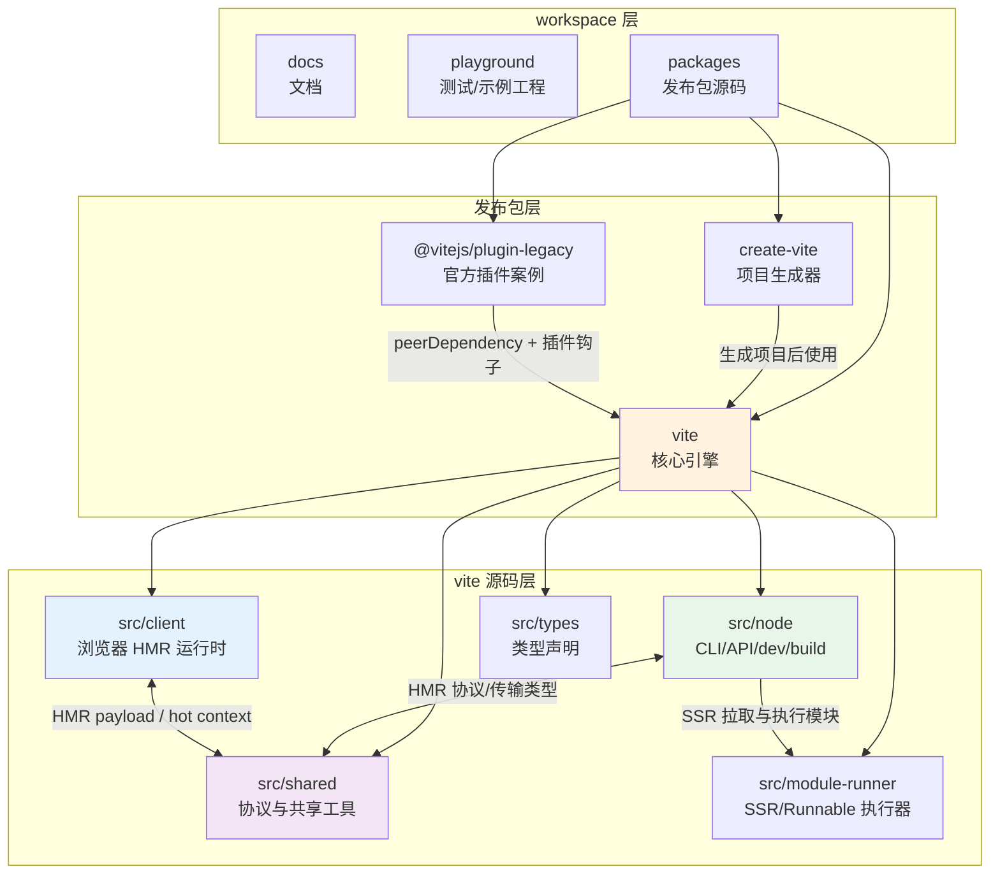
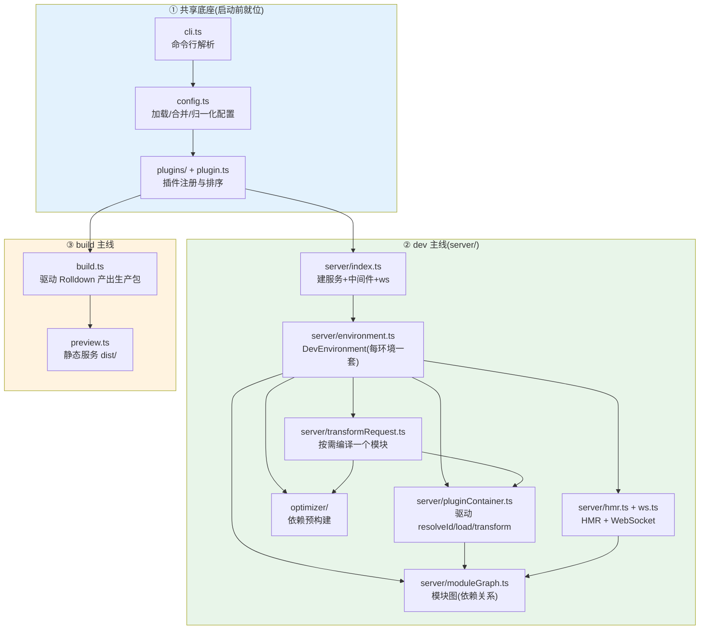

# 00 · 源码全景与模块关系：先看地图，再钻细节

> 本节目标：在钻进任何一个机制之前，先建立一张「整张仓库怎么运转」的全景图——Vite 仓库有哪些包、`packages/vite/src` 有哪些模块、每个模块大概负责什么、一次完整操作会按什么顺序穿过这些模块、哪些是必读主线哪些是选读支线。后面 01–12 节是对这张图上每个节点的「放大」，本节是那张「缩略图」。
>
> 源码基线：Vite 8.1.0。读法建议：本节先通读一遍建立直觉，之后每读完一个细节小节，回到这里的关系图对一对位置。

---

## 一、项目概述与技术栈

Vite 是一个「构建工具」。从源码分析的视角，它的两个最典型场景是：

- **dev**：浏览器请求一个模块 → Vite 现编译这一个模块 → 返回浏览器可跑的代码（按需编译，不打包）；
- **build**：把整张依赖图一次性打包成优化过的生产产物。


| 维度           | 取值                                                |
| ------------ | ------------------------------------------------- |
| 语言           | TypeScript（Vite 自身核心仍是 TS）                        |
| dev 打包器/转译   | Rolldown（预构建/配置打包）+ Oxc（TS/JSX 转译、压缩）             |
| build 打包器/转译 | Rolldown（生产构建打包，Vite 8 默认唯一引擎）+ Oxc（TS/JSX 转译、压缩） |
| 包管理          | pnpm（monorepo workspace）                          |
| 测试           | Vitest                                            |


---


## 二、仓库结构：先分清 workspace、发布包、源码目录

仓库是 pnpm monorepo，但不要把「workspace 里所有目录」都当成发布包。`pnpm-workspace.yaml` 里纳入了四类内容：


| workspace 范围               | 角色            | 是否发布     | 阅读价值       |
| -------------------------- | ------------- | -------- | ---------- |
| `packages/*`               | 真正的 npm 包源码   | 部分发布     | ⭐主线        |
| `docs`                     | 官方文档站         | 不作为本阶段主线 | 📖理解使用侧    |
| `playground/**`            | 端到端测试用例/示例工程  | 不发布      | 🟢验证行为     |
| `packages/**/__tests__/**` | 包内测试 fixtures | 不发布      | 🟢辅助理解边界情况 |


其中 `playground/**` 对源码阅读特别有用：它们不是随手写的 demo，而是一组覆盖 Vite 关键行为的真实小项目。调试源码时，可以把某个 playground 当成「实验现场」：先运行对应用例或启动该示例，再在 `packages/vite/src/node` 的配置、插件、请求转换、HMR 等关键函数里打断点，观察一次真实请求如何穿过源码。这样比凭空看函数调用更容易建立因果关系。

本阶段要读的核心在 `packages/`。这里有三个发布包，职责完全不同：

```
packages/
├─ vite/            ← 核心引擎：CLI、dev server、build、插件 API、HMR、SSR/module runner
├─ create-vite/     ← 脚手架：npm create vite / pnpm create vite 时复制模板
└─ plugin-legacy/   ← 官方插件：用 Vite 插件 API 给生产构建补旧浏览器兼容产物
```


### 2.1 三个发布包分别做什么


| 包 | npm 名 | 入口/产物 | 核心职责 | 和其他包的关系  | 本阶段读法        |
| ------------------------ | ----------------------- | -------------------------------------------------------------------------------------------------------------- | ------------------------------------------------------------------------------ | -------------------------------------------------------------------------- | --------------- |
| `packages/vite`| `vite` | `bin/vite.js`、`dist/node/index.js`、`dist/client/client.mjs`、`dist/client/env.mjs`、`dist/node/module-runner.js` | Vite 的核心引擎，提供 CLI、Node API、dev server、build、preview、插件容器、HMR 客户端、module runner | **底座包**，其他官方包和用户项目都围绕它工作                                                   | ⭐必读             |
| `packages/create-vite`   | `create-vite`           | `index.js`、`template-*`                                                                                        | 交互式创建项目，选择框架模板，复制文件，必要时安装依赖并启动     | 脚手架自身不依赖 `vite` 包；它只是生成一个会安装/使用 `vite` 的项目模板                               | 📖先知道边界即可       |
| `packages/plugin-legacy` | `@vitejs/plugin-legacy` | `dist/index.js`                                                                                                | 一个官方 Vite 插件，构建时用 Babel/SystemJS/core-js 生成 legacy chunk 和 polyfill 注入         | 以 `vite` 为 peer dependency，消费 `Plugin`、`ResolvedConfig`、`build` 等 Vite API | 📖读插件机制时可作为真实案例 |


一个容易混淆的点：`create-vite`、`plugin-legacy` 都不是 `vite` 核心运行时的子模块，但它们和 `vite` 的关系不一样。`create-vite` 是独立脚手架，本身不依赖 `vite`；`plugin-legacy` 则像普通用户插件一样，通过 `vite` 暴露的插件 API 接入构建流程。真正需要精读的主线仍然是 `packages/vite`。

### 2.2 包之间如何链接起来




这张图说明三层关系：

- **脚手架层**：`create-vite` 只负责把一个可运行项目搭出来，搭完之后就退出主流程。
- **核心层**：用户项目真正日常调用的是 `vite` 包，`vite dev`、`vite build`、`vite preview` 都从这里进入。
- **插件层**：`@vitejs/plugin-legacy` 不改 Vite 核心，而是通过标准插件钩子参与构建流水线，这正好体现 Vite 的扩展方式。


### 2.3 `vite` 包自己又拆成哪些运行时入口

`packages/vite/package.json` 和 `packages/vite/rolldown.config.ts` 共同决定了源码如何变成可被外部消费的产物：


| 对外入口                                         | 源码入口                         | 产物/导出                                 | 运行位置     | 职责                                                |
| -------------------------------------------- | ---------------------------- | ------------------------------------- | -------- | ------------------------------------------------- |
| `vite` CLI                                   | `src/node/cli.ts`            | `dist/node/cli.js`，由 `bin/vite.js` 调起 | Node     | 解析命令，分发到 dev/build/preview                        |
| `import { createServer, build } from 'vite'` | `src/node/index.ts`          | `dist/node/index.js`                  | Node     | Node API 总出口，导出配置、插件、server、build、preview、SSR 等能力 |
| `vite/internal`                              | `src/node/internalIndex.ts`  | `dist/node/internal.js`               | Node     | 少量内部兼容/实验性出口，比如 React refresh wrapper             |
| `/@vite/client`                              | `src/client/client.ts`       | `dist/client/client.mjs`              | 浏览器      | HMR 客户端、错误 overlay、CSS 更新                         |
| `/@vite/env`                                 | `src/client/env.ts`          | `dist/client/env.mjs`                 | 浏览器      | 注入 `import.meta.env` 相关运行时代码                      |
| `vite/module-runner`                         | `src/module-runner/index.ts` | `dist/node/module-runner.js`          | Node/运行时 | SSR/Runnable 环境执行模块的 runner                       |


所以阅读源码时要先问「这段代码最终跑在哪里」：`node/` 是服务端控制面，`client/` 是浏览器运行时，`shared/` 是两端协议/工具，`module-runner/` 是 SSR/Runnable 的执行器。

### 2.4 `packages/vite/src` 五大目录

`packages/vite/src` 又分五个子目录，理解它们的「运行位置」是关键——有的跑在 Node，有的跑在浏览器：


| 目录               | 运行在哪     | 职责                                               | 本阶段相关度    |
| ---------------- | -------- | ------------------------------------------------ | --------- |
| `node/`          | Node     | dev server、build、配置、插件、预构建——**绝大部分核心逻辑**         | ⭐核心       |
| `client/`        | 浏览器      | `/@vite/client` 运行时：HMR 客户端、错误覆盖层、`updateStyle`  | ⭐核心（HMR）  |
| `shared/`        | 两端共用     | HMR 协议、`createHotContext`、传输层等 node/client 都用的代码 | ⭐核心（HMR）  |
| `module-runner/` | Node/运行时 | SSR/Runnable 环境里在 Node 执行模块的 runner              | 📖选读（SSR） |
| `types/`         | —        | 对外类型声明                                           | 🟢先扫      |


> 一个重要直觉：HMR 是唯一一条「横跨 Node 和浏览器」的链路（`node/server/hmr.ts` ↔ `shared/hmr.ts` ↔ `client/client.ts`），这也是它最难调、本书单列 [08-HMR实现原理.md](./08-HMR实现原理.md) 的原因。


### 2.5 `node/` 内部再分哪些子系统

`packages/vite/src/node` 是核心源码主战场。它不是一个扁平工具箱，而是几组子系统叠起来：


| 子系统                  | 代表文件/目录                                                               | 职责                                         | 读源码时关注什么                        |
| -------------------- | --------------------------------------------------------------------- | ------------------------------------------ | ------------------------------- |
| 入口与公共 API            | `cli.ts`、`index.ts`、`internalIndex.ts`                                | 命令入口、Node API 出口、内部出口                      | 外部怎么进入 Vite                     |
| 配置系统                 | `config.ts`、`env.ts`、`constants.ts`                                   | 加载 config、合并默认值、处理 env、形成 `ResolvedConfig` | 所有流程共享的单一事实来源                   |
| 插件系统                 | `plugin.ts`、`plugins/index.ts`、`plugins/*`                            | 定义 Vite 插件形态，组装内置插件流水线                     | dev/build 如何复用同一套插件心智           |
| dev server           | `server/index.ts`、`server/middlewares/*`、`server/transformRequest.ts` | 建 HTTP 服务、中间件、按需转换模块                       | 浏览器一个请求如何被处理                    |
| 环境模型                 | `environment.ts`、`baseEnvironment.ts`、`server/environments/*`         | 把 client/ssr/runnable 等目标抽象成环境对象           | 为什么 Vite 8 不再到处传 `ssr: boolean` |
| 模块图与 HMR             | `server/moduleGraph.ts`、`server/hmr.ts`、`server/ws.ts`                | 记录依赖边、传播失效、推送更新                            | 局部更新为什么能成立                      |
| 依赖预构建                | `optimizer/*`                                                         | 扫描裸导入、预打包依赖、维护缓存                           | 为什么 dev 首次启动要先处理依赖              |
| SSR/module runner 桥接 | `ssr/*`、`module-runner/*`                                             | 在服务端拉取、转换、执行模块                             | SSR 和普通浏览器 dev 的差异              |
| build/preview        | `build.ts`、`preview.ts`                                               | 生产构建与预览静态产物                                | dev 按需编译和 build 全量打包的分叉点        |


---


## 三、模块关系图：三层包关系 + 两条核心主线

从外到内看，Vite 源码可以分成三层：




真正钻源码时，`node/` 里几十个文件还可以继续收敛成「**一个底座 + 两条主线**」：




读这张图的方式：

- 这张图是**模块关系图/阅读地图**，不是逐行调用时序图；dev 启动时序看 [01-环境准备与调试入门.md](./01-环境准备与调试入门.md)，build 入口时序看 [11-构建阶段驱动Rolldown.md](./11-构建阶段驱动Rolldown.md)。
- **共享底座**（`cli → config → plugins`）dev 和 build 都要先走一遍——所以本书把它们排在最前（[02-配置加载与归一化.md](./02-配置加载与归一化.md)、[03-插件注册与排序.md](./03-插件注册与排序.md)）。
- **dev 主线**全在 `server/` 目录，可以先把它理解成「启动一个开发服务器，然后浏览器请求什么，Vite 就临时处理什么」。
- **build 主线**相对独立（`build.ts` + `preview.ts`），复用同一套插件，但用 Rolldown 一次性打包。

---

## 四、端到端串联：一次完整 dev 请求穿过所有模块

前面先看了有哪些包、哪些目录；现在只需要建立一条最粗的运行直觉：**用户启动 dev server 后，浏览器每请求一个模块，Vite 就在 Node 侧按需处理这个模块，再把浏览器能运行的代码返回去。** 下表先看“发生了什么”，细节不用一次记住，后面章节会逐步展开。


| 步骤       | 负责模块                          | 做了什么                              | 设计意图                         | 交给下一步                     | 详见                                  |
| -------- | ----------------------------- | --------------------------------- | ---------------------------- | ------------------------- | ----------------------------------- |
| 1. 启动    | `cli.ts` → `server/index.ts`  | 解析命令、`createServer`               | 入口极薄，配置大头延后到 `resolveConfig` | `InlineConfig`            | [01-环境准备与调试入门.md](./01-环境准备与调试入门.md)             |
| 2. 配置    | `config.ts`                   | Rolldown 打包 `vite.config`、五层合并归一化 | 让 TS 配置可执行 + 收敛成单一事实         | `ResolvedConfig`          | [02-配置加载与归一化.md](./02-配置加载与归一化.md)              |
| 3. 插件    | `plugins/index.ts`            | 用户插件按 enforce 插进内部插件模板            | 可预测的有序流水线                    | 有序插件数组                    | [03-插件注册与排序.md](./03-插件注册与排序.md)               |
| 4. 建环境   | `server/environment.ts`       | 每环境建模块图/容器/预构建器/HMR               | 多目标隔离（client/ssr）            | `DevEnvironment`          | [10-多环境模型EnvironmentAPI实现.md](./10-多环境模型EnvironmentAPI实现.md) |
| 5. 预构建   | `optimizer/`                  | 扫描依赖、Rolldown 预打包、缓存              | CJS→ESM + 多文件合一，dev 才流畅      | `node_modules/.vite/deps` | [04-依赖预构建.md](./04-依赖预构建.md)                 |
| 6. 收请求   | `middlewares/transform.ts`    | 路由模块请求到转换管线                       | 中间件只做路由，转换统一入口               | `url`                     | [05-按需编译与devserver请求处理流程.md](./05-按需编译与devserver请求处理流程.md)  |
| 7. 按需编译  | `transformRequest.ts`         | 去重→缓存→resolve→load→transform      | 一个请求=一个模块的编译；五层缓存摊平成本        | `{code,map,etag}`         | [05-按需编译与devserver请求处理流程.md](./05-按需编译与devserver请求处理流程.md)  |
| 8. 驱动插件  | `pluginContainer.ts`          | 模拟 Rollup 环境，遍历钩子                 | 一套插件 dev/build 通用            | 转换后代码                     | [07-插件容器PluginContainer.md](./07-插件容器PluginContainer.md)   |
| 9. 转换    | `plugins/importAnalysis.ts` 等 | 改写 import、CSS→JS、注入 HMR           | import analysis 最后跑，统一改 URL  | 浏览器可跑代码                   | [06-核心转换链路.md](./06-核心转换链路.md)                |
| 10. 记图   | `moduleGraph.ts`              | 连 importers/importedModules 双向边   | 给缓存/HMR/失效提供数据底座             | 模块图节点                     | [09-模块图与依赖追踪.md](./09-模块图与依赖追踪.md)              |
| 11. 改文件  | `hmr.ts` + `ws.ts`            | 找 HMR 边界、WebSocket 推送             | 改一处只更新一处                     | update payload            | [08-HMR实现原理.md](./08-HMR实现原理.md)               |
| 12. 应用更新 | `client/client.ts`            | `?t=` 重新 import、跑 accept 回调       | 骗过 ESM 缓存做局部更新               | 新模块                       | [08-HMR实现原理.md](./08-HMR实现原理.md)               |


build 线则短得多：`build.ts` 把 `ResolvedConfig` 翻译成 `RolldownOptions` → `rolldown()` → `bundle.write()` 产出 `dist/`，`preview.ts` 再用 `sirv` 静态服务它（[11-构建阶段驱动Rolldown.md](./11-构建阶段驱动Rolldown.md)、[12-preview-server边界.md](./12-preview-server边界.md)）。

---


## 五、核心模块速查表


| 模块/文件                                        | 一句话职责                         | 优先级  | 复杂度  | 对应小节  |
| -------------------------------------------- | ----------------------------- | ---- | ---- | ----- |
| `config.ts`                                  | 加载/合并/归一化配置成 `ResolvedConfig` | ⭐必读  | 🔴复杂 | 02    |
| `plugins/index.ts` + `plugin.ts`             | 组装有序插件流水线、环境维度过滤              | ⭐必读  | 🟡中等 | 03    |
| `optimizer/index.ts`、`optimizer.ts`          | 依赖预构建：扫描/缓存/Rolldown 打包       | ⭐必读  | 🔴复杂 | 04    |
| `server/index.ts`                            | 建 HTTP 服务、串中间件、建环境、建 ws       | ⭐必读  | 🔴复杂 | 05/10 |
| `server/transformRequest.ts`                 | 单模块按需编译总指挥 + 五层缓存             | ⭐必读  | 🔴复杂 | 05    |
| `server/pluginContainer.ts`                  | 模拟 Rollup 环境驱动插件钩子            | ⭐必读  | 🔴复杂 | 07    |
| `plugins/importAnalysis.ts`                  | 改写 import、注入 HMR（永远最后）        | ⭐必读  | 🔴复杂 | 06    |
| `plugins/css.ts`、`asset.ts`                  | CSS 编译/注入、静态资源处理              | 📖选读 | 🟡中等 | 06    |
| `server/hmr.ts`                              | HMR 边界传播、决定局部更新/全量刷新          | ⭐必读  | 🔴复杂 | 08    |
| `server/ws.ts`                               | WebSocket 通道与协议               | 📖选读 | 🟡中等 | 08    |
| `client/client.ts`、`shared/hmr.ts`           | 浏览器端 HMR 运行时                  | ⭐必读  | 🟡中等 | 08    |
| `server/moduleGraph.ts`                      | 每环境模块图（依赖关系数据底座）              | ⭐必读  | 🟡中等 | 09    |
| `server/mixedModuleGraph.ts`                 | 老 `ModuleGraph` 兼容门面          | 📖选读 | 🟡中等 | 09    |
| `server/environment.ts`、`baseEnvironment.ts` | `DevEnvironment` 及环境类层级       | ⭐必读  | 🟡中等 | 10    |
| `build.ts`                                   | 驱动 Rolldown 产出生产包             | ⭐必读  | 🔴复杂 | 11    |
| `preview.ts`                                 | 静态服务构建产物                      | 🟢先扫 | 🟢简单 | 12    |
| `utils.ts`、`constants.ts`                    | 工具函数/常量（到处被引用）                | 🟢先扫 | 🟢简单 | 全程    |


---


## 六、推荐学习路径

按「底层→主线、简单→复杂」，也正是本书 01–12 的编排顺序：

```
01 搭好调试环境(地基)
  ↓
02 配置 → 03 插件        (启动前的共享底座:先就位)
  ↓
04 预构建 → 05 按需编译   (dev 主干:依赖准备 + 请求处理)
  ↓
06 转换链路 → 07 插件容器  (放大 transform 这一步)
  ↓
08 HMR → 09 模块图 → 10 多环境  (dev 的三大支撑结构)
  ↓
11 build → 12 preview     (切到构建侧)
```

如果只想攻克某个问题：HMR 退化全量刷新 → 08+09；Vite 8 构建差异 → 11；启动慢/依赖怪现象 → 04。

---


## 七、贯穿全书的优秀实现模式

源码分析不只为「知道它怎么做」，更为「学到可复用的工程智慧」。这些模式在多个模块反复出现，值得单独记一笔：


| 模式           | 实现位置                                          | 效果              | 可借鉴场景     |
| ------------ | --------------------------------------------- | --------------- | --------- |
| 入口只收材料，配置集中整理 | `cli.ts` 只把原始配置交出去，`resolveConfig` 统一补全 | 命令行/代码调用走同一套逻辑 | 任何有多入口的库  |
| 单一事实来源       | `ResolvedConfig` 贯穿全程                         | 避免配置散落各处不一致     | 配置驱动的系统   |
| 惰性加载重模块      | build 时才 `await import('rolldown')`           | 不用 build 不付加载成本 | 启动性能优化    |
| 并发去重 promise | `transformRequest` 的 `_pendingRequests`       | 同一资源并发只算一次      | 任何昂贵的幂等异步 |
| 多层缓存/短路      | dev 请求路径上的五层 etag/内存缓存                        | 重复访问近乎零成本       | 读多写少的服务   |
| 只标记变了，不急着全重算 | `handleModuleSoftInvalidation` 只更新时间戳          | 只更新必要模块，避免牵一发动全身 | 增量更新场景    |
| 原子提交         | 预构建写 temp 目录再 rename                          | 永不读到半成品         | 任何缓存落盘    |
| 惰性生命周期       | 首次 resolveId 才触发 `buildStart`                 | 在无明确生命周期处模拟生命周期 | 适配器/兼容层   |
| 零拷贝兼容门面      | `ModuleGraph`/`server.*` 读穿透到环境               | 重构底层而不破坏存量生态    | 大规模渐进式重构  |
| 抽象出「环境」维度    | `DevEnvironment` 取代 `ssr: boolean`            | 用对象抽象取代到处打补丁    | 多目标/多租户系统 |


> 这些模式会在对应小节展开。建议读完全书后回到这张表，把每条对到具体源码——它们才是「精通」与「会用」之间真正的分水岭，也是第三阶段「把经验升华为可迁移设计思想」的素材。

---

## 八、小结

- Vite 源码可收敛为「**一个共享底座（配置/插件）+ 两条主线（dev server / build）**」；dev 主线的一切以 `DevEnvironment` 为中心持有。
- 一次 dev 请求的关系总纲：`transformRequest`（总指挥）→ `pluginContainer`（驱动钩子）→ `plugins/*`（干活）→ `moduleGraph`（记关系）→ 沿途用 `optimizer`/缓存；改文件则走 `hmr` → `ws` → `client`。
- 用「核心模块速查表」判断必读/选读，用「学习路径」决定顺序，用「优秀实现模式表」沉淀可迁移的工程智慧。

带着这张地图，进入 [01-环境准备与调试入门.md](./01-环境准备与调试入门.md) 开始动手。