# 01 · 环境准备与调试入门：从 clone 到断点跟一次完整 dev 请求

> 本节调试目标：把一份**真实可断点的 Vite 8.1.0 源码**跑起来，并用一个最小项目，从命令行入口 `vite` 一直断点跟到「dev server 启动 → 浏览器请求一个模块 → 返回转换结果」。这是整个源码篇的地基——后面每一节都建立在「你能亲手停在这些函数里看变量」的前提上。
>
> 源码基线：Vite 8.1.0。本节不要求你看懂任何机制，只要求你把调试环境搭好、断点能停下来。

---

## 一、为什么是「调源码」而不是「读源码」

读源码最常见的失败方式，是对着 GitHub 网页一行行往下啃，啃到第三个文件就忘了自己在追什么。Vite 的 `packages/vite/src/node` 有几十个文件、上万行 TypeScript，纯靠脑补调用关系几乎不可能。

更高效的方式是**让程序停在你想看的地方**：在 `transformRequest` 打个断点，刷新浏览器，调试器停下来，你能看到 `url` 是 `/src/main.ts`、`environment.name` 是 `client`、调用栈一路从 HTTP 中间件下来。一次断点胜过十遍通读。所以本阶段的方法论是固定的：**先调通，再讲透，后小结。**

本节就是「先调通」的那一步。

---

## 二、准备可调试的源码

### 1. clone 并切到基线版本

```bash
git clone https://github.com/XY0987/vite_ori_public.git   # 本书配套 fork，main 即 8.1.0 基线 + 断点标注
cd vite_ori_public
```

确认版本：

```bash
cat packages/vite/package.json | grep '"version"'
#   "version": "8.1.0",
```

### 2. 安装依赖并构建一次

Vite 仓库是 pnpm monorepo，强制只允许 pnpm（`package.json` 的 `preinstall` 写了 `npx only-allow pnpm`）。

```bash
pnpm install
pnpm --filter=./packages/vite run build
```

为什么要先 `build`？因为命令行入口 `packages/vite/bin/vite.js` 加载的是**构建产物**而非 TS 源码：

```js
// packages/vite/bin/vite.js L62
return import('../dist/node/cli.js')
```

也就是说，`vite` 命令实际跑的是 `packages/vite/dist/node/cli.js`。这会带来一个调试上的关键问题——**断点要打在哪？** 见下文第四节。

> 想边改边调、不每次手动 build，可以开 watch：`pnpm --filter=./packages/vite run dev`，它会持续把 `src` 编译到 `dist`。本书调试用预构建产物 + sourcemap 即可，不强制开 watch。

### 3. 准备一个最小的「被调试项目」

我们需要一个用这份源码版本的小项目作为「靶子」。最省事的办法是直接用仓库自带的 playground：

```bash
ls playground/html        # 仓库自带的极简 HTML 项目，依赖 workspace 里的 vite
```

`playground/html` 通过 pnpm workspace 软链直接用 `packages/vite`，无需额外 `link`。如果你想用自己的项目，则在你的项目里执行 `pnpm link /path/to/vite/packages/vite`，把它的 `vite` 指向源码版本。

---

## 三、源码全景：一次 dev 启动的入口在哪

在打断点之前，先建立一张「从命令到服务」的端到端地图。这里画的是**真实调用顺序**，和 [00-源码全景与模块关系.md](./00-源码全景与模块关系.md) 的模块地图角度不同：前者先帮你认识有哪些模块，下面这张图按源码执行先后把它们串起来。

```mermaid
flowchart TD
  A["命令行 vite / vite dev"] --> B["bin/vite.js<br/>设置 sourcemap、DEBUG，import dist/node/cli.js"]
  B --> C["cli.ts 默认 dev 命令<br/>解析 root 参数，组装 InlineConfig"]
  C --> D["server/index.ts<br/>createServer → _createServer"]
  D --> E["config.ts resolveConfig('serve')<br/>加载 vite.config、合并 CLI 参数、兼容历史配置、补默认值、归一化"]
  E --> F["plugins/index.ts resolvePlugins<br/>用户插件按 enforce 插入内置插件，并触发 configResolved"]
  F --> G["server/index.ts<br/>准备 HTTP server、WebSocket、watcher"]
  G --> H["按 config.environments 创建环境<br/>client / ssr 各自持有 moduleGraph、pluginContainer、depsOptimizer"]
  H --> I["创建 ViteDevServer 对象<br/>保留旧 API 入口，转到新实现；注册 watcher/HMR 回调"]
  I --> J["按顺序挂载中间件<br/>transformMiddleware 在这里进入队列"]
  J --> K["返回 server，CLI 调 server.listen()"]
  K --> L["initServer<br/>HTTP 监听前初始化各环境能力"]
  L --> M["environment.listen(server)<br/>启动 HMR 通道"]
  M --> N["depsOptimizer.init()<br/>扫描并预构建依赖，准备 node_modules/.vite/deps"]
  N --> O["warmupFiles<br/>按配置预热入口模块"]
  O --> P["HTTP server 开始监听端口"]
  P --> Q["浏览器请求模块"]
  Q --> R["transformMiddleware<br/>模块请求入口中间件，选择对应 Environment（浏览器请求通常是 client）"]
  R --> S["Environment 抽象对象<br/>持有本环境 moduleGraph、pluginContainer、depsOptimizer"]
  S --> T["transformRequest<br/>并发去重、查缓存、resolveId"]
  T --> U["pluginContainer.load / transform<br/>执行本环境插件，转译代码"]
  U --> V["更新 moduleGraph<br/>返回 code / map / etag"]

  style A fill:#e3f2fd
  style E fill:#fff3e0
  style F fill:#fff3e0
  style N fill:#fff3e0
  style V fill:#e8f5e9
```



和 [00-源码全景与模块关系.md](./00-源码全景与模块关系.md) 的关系可以简单理解成：那篇是「地图」，告诉你 Vite 里有哪些模块；这张图是「路线」，告诉你一次 dev 启动会按什么顺序经过这些模块。

先不用记住每个函数名，只抓住这条主线：命令行先把用户输入整理成配置线索，Vite 再把配置补全成最终配置，排好插件，搭好开发服务器和不同运行环境；真正监听端口前，会先启动 HMR、依赖预构建和预热逻辑。等浏览器请求模块时，请求会进入对应的运行环境，再由这个环境里的插件流水线把源码转成浏览器能运行的代码。

对应到源码的关键落点：

| 步骤 | 文件 | 关键位置 | 做了什么 |
|---|---|---|---|
| 进程入口 | `packages/vite/bin/vite.js` | L48–62 `start()` | 开启 sourcemap、按 `--debug` 设 `DEBUG`，动态 import 编译后的 CLI |
| 命令解析 | `packages/vite/src/node/cli.ts` | L189–230 默认命令 | 把 CLI 参数整理成 `InlineConfig`，调用 `createServer(...)` |
| 创建服务 | `packages/vite/src/node/server/index.ts` | L473–477 `createServer` | 入口外壳，转交 `_createServer` |
| 解析配置 | `packages/vite/src/node/server/index.ts` | L493–495 `_createServer` | 如果传入的还不是 `ResolvedConfig`，就调用 `resolveConfig(inlineConfig, 'serve')` |
| 配置归一化 | `packages/vite/src/node/config.ts` | L1395 `resolveConfig` | 加载 `vite.config`、合并 CLI 参数、补默认值、归一化，产出 `ResolvedConfig`（见 [02-配置加载与归一化.md](./02-配置加载与归一化.md)） |
| 插件组装 | `packages/vite/src/node/config.ts` / `plugins/index.ts` | L2102 `resolvePlugins`、L2117 `configResolved` | 在 `resolveConfig` 内部把用户插件和内置插件排成最终插件数组（见 [03-插件注册与排序.md](./03-插件注册与排序.md)） |
| 准备服务基础设施 | `packages/vite/src/node/server/index.ts` | L509–565 | 准备 public 文件、HTTP server、WebSocket、watcher |
| 建环境 | `packages/vite/src/node/server/index.ts` | L567–584 | 按 `config.environments` 创建 client / ssr 环境，每个环境持有自己的模块图、插件容器、预构建器 |
| 创建 server 对象 | `packages/vite/src/node/server/index.ts` | L590–824 | 创建 `ViteDevServer` 对象，保留旧 API 入口并挂上 `transformRequest`、`listen`、`close` 等方法 |
| 挂中间件 | `packages/vite/src/node/server/index.ts` | L931–1041 | 按顺序挂载安全、CORS、proxy、public、`transformMiddleware`、HTML、错误处理等中间件 |
| 开始监听 | `packages/vite/src/node/cli.ts` / `server/index.ts` | L236 `server.listen()`、L714–727 | CLI 调 `server.listen()`，进入 server 自己的监听逻辑 |
| 启动环境能力 | `packages/vite/src/node/server/index.ts` / `server/environment.ts` | L1048–1084 `initServer`、L229–232 `environment.listen` | HTTP 监听前先触发环境 listen，启动 HMR 通道、`depsOptimizer.init()` 依赖预构建和 warmup |
| 收到模块请求 | `packages/vite/src/node/server/middlewares/transform.ts` | L112、L257 | `transformMiddleware` 接住模块请求，选择对应 Environment，再调用 `environment.transformRequest(url)` |
| 按需编译 | `packages/vite/src/node/server/environment.ts` / `server/transformRequest.ts` | L258、L78、L170–172 | 进入单模块编译入口，做并发去重、查缓存、`pluginContainer.resolveId` |
| 执行插件转译 | `packages/vite/src/node/server/transformRequest.ts` | L267–270、L353–358 | 用当前 Environment 的 `pluginContainer.load / transform` 执行插件，转译代码并更新模块图（见 [05-按需编译与devserver请求处理流程.md](./05-按需编译与devserver请求处理流程.md)） |

CLI 把参数交给 `createServer` 的代码（注意它只传了 `InlineConfig`，配置的「大头」都在 `resolveConfig` 里补全）：

文件：`packages/vite/src/node/cli.ts`（L215–236）

```ts
const { createServer } = await import('./server')
const server = await createServer({
  root,
  base: options.base,
  mode: options.mode,
  configFile: options.config,
  configLoader: options.configLoader,
  logLevel: options.logLevel,
  clearScreen: options.clearScreen,
  server: cleanGlobalCLIOptions(options),
  forceOptimizeDeps: options.force,
  experimental: { bundledDev: options.experimentalBundle },
})
await server.listen()
```

---

## 四、配置 VS Code 调试：让断点真正停下来

这是新手最容易卡住的地方。因为 `bin/vite.js` 跑的是 `dist/node/cli.js`（编译产物），如果你把断点打在 `src/node/server/transformRequest.ts`，默认是停不下来的——除非 sourcemap 生效。

好消息是，`packages/vite/bin/vite.js` 在非 `node_modules` 运行时主动开启了 sourcemap：

文件：`packages/vite/bin/vite.js`（L5–9）

```js
if (!import.meta.url.includes('node_modules')) {
  if (!process.env.DEBUG_DISABLE_SOURCE_MAP) {
    process.setSourceMapsEnabled(true)
  }
}
```

只要构建产物带 sourcemap（默认带），加上 VS Code 的 `node` 调试器会读 sourcemap，你就能把断点打在 `.ts` 源码上而停在正确位置。

### 先认识一下 `playground/html`

本节用 `playground/html` 做调试靶子，不是因为它页面简单，而是因为它覆盖了 Vite 处理 HTML 时最常见、也最容易出错的几类场景。

它的 `package.json` 很薄：

```json
{
  "scripts": {
    "dev": "vite",
    "build": "vite build",
    "preview": "vite preview"
  }
}
```

也就是说，进入 `playground/html` 后运行 `pnpm dev`，本质就是在这个目录下启动 `vite`。Vite 会把当前目录当成项目根目录，只服务这个 playground，而不是一次性跑所有 playground。

真正值得看的配置在 `playground/html/vite.config.js`：

| 配置 | 作用 | 为什么适合调试 |
|---|---|---|
| `base: './'` | 构建后资源使用相对路径 | 方便测试 HTML 在不同路径下的资源引用 |
| `build.rolldownOptions.input` | 显式声明多个 HTML 入口，比如 `index.html`、`nested/index.html`、`link.html` | 这是一个多页应用测试场，build 时会把这些 HTML 都当入口处理 |
| `server.warmup.clientFiles` | dev server 启动后预热指定模块 | 可以观察 warmup 如何提前触发转换流程 |
| `define` | 注入 `import.meta.env.*` 的测试值 | 方便验证环境变量替换 |
| `plugins[].transformIndexHtml` | 用多个插件改写 HTML | 可以调试 HTML 插件钩子的执行顺序，以及 dev/build 的差异 |
| `configureServer` / `configurePreviewServer` | 往 dev/preview server 里挂自定义中间件 | 可以看到插件如何扩展服务器行为 |

所以这个 playground 的重点不是业务页面，而是「HTML 入口、HTML 插件、warmup、dev/build 差异」这些机制。后面如果只想先验证普通模块转换，看 `index.html → main.js → shared.js/common.css` 这条最短链路就够了；如果要看构建阶段的多入口处理，再去看 `build.rolldownOptions.input`。

### 方式一：JS 调试终端（最推荐）

最省事的方式不是先写 `launch.json`，而是直接用 VS Code 的 **JavaScript Debug Terminal**。它的好处是：你平时怎么在终端里跑命令，现在还怎么跑；只要这个命令启动了 Node 进程，VS Code 会自动把调试器挂上去。

但这里有一个关键前提：`packages/vite/bin/vite.js` 实际 import 的是 `packages/vite/dist/node/cli.js`，不是直接执行 `src/node/cli.ts`。所以要让 TypeScript 源码断点停下来，必须先保证 `dist` 是由当前 `src` 构建出来的，并且 sourcemap 能把 `dist` 映射回 `src`。

操作步骤：

1. 在普通终端里，先到 Vite 源码仓库根目录，让 `dist` 持续跟随 `src` 更新：

```bash
pnpm --filter vite run dev
```

2. 在 VS Code 命令面板里选择 `Debug: Create JavaScript Debug Terminal`；
3. 在这个 JS 调试终端里进入示例项目目录：

```bash
cd playground/html
```

4. 运行当前项目的 dev 脚本启动 dev server：

```bash
pnpm dev
```

也可以用 `npm run dev`。注意它只会启动**当前目录对应的项目**：前面已经 `cd playground/html`，所以这里启动的是 `playground/html` 这个示例，而不是所有 playground。

如果把项目脚本拆开看，它背后真正进入的是源码仓库里的 CLI 文件，大致等价于：

```bash
node ../../packages/vite/bin/vite.js
```

本节后面统一写 `pnpm dev`，是为了贴近真实使用习惯；你只要记住它最终会通过 workspace 解析到当前源码仓库里的 Vite。

然后在 `packages/vite/src/node/server/transformRequest.ts` 里打断点，浏览器访问终端打印出来的地址。此时运行的是 `dist`，但 VS Code 会通过 sourcemap 把断点映射回 `src`，所以断点才能停在 TypeScript 源码上。

这种方式最适合源码阅读：不用先维护调试配置，换 playground 或换命令也很自然。比如要调 build，也是在 `dist` 已经构建好的前提下，在同一个 JS 调试终端里运行：

```bash
pnpm build
```

### 方式二：`.vscode/launch.json`（适合固定常用场景）

如果你经常调同一个 playground，或者想一键 F5 启动，可以在 Vite 源码仓库根目录创建 `.vscode/launch.json`（本书配套仓库已内置一份）：

```json
{
  "version": "0.2.0",
  "configurations": [
    {
      "type": "node",
      "request": "launch",
      "name": "Vite Dev: playground/html",
      "autoAttachChildProcesses": true,
      "skipFiles": ["<node_internals>/**"],
      "program": "${workspaceFolder}/packages/vite/bin/vite.js",
      "cwd": "${workspaceFolder}/playground/html",
      "console": "integratedTerminal"
    },
    {
      "type": "node",
      "request": "launch",
      "name": "Vite Dev: 你的项目",
      "autoAttachChildProcesses": true,
      "skipFiles": ["<node_internals>/**"],
      "program": "${workspaceFolder}/packages/vite/bin/vite.js",
      "args": [],
      "cwd": "/绝对路径/改成你的项目",
      "console": "integratedTerminal"
    },
    {
      "type": "node",
      "request": "launch",
      "name": "Vite Build: playground/html",
      "skipFiles": ["<node_internals>/**"],
      "program": "${workspaceFolder}/packages/vite/bin/vite.js",
      "args": ["build"],
      "cwd": "${workspaceFolder}/playground/html",
      "console": "integratedTerminal"
    }
  ]
}
```

三处关键点：

- `program` 指向 `bin/vite.js`——直接走真实的命令行入口，跟用户执行 `vite` 完全一致；
- `cwd` 是「被调试项目」的目录——Vite 会把它当成 `root`；
- `autoAttachChildProcesses: true`——Vite 在某些场景会 fork 子进程（如旧版预构建 worker），开了它子进程里的断点也能停。

### 第一次断点：停在请求处理上

1. 打开 `packages/vite/src/node/server/transformRequest.ts`，在 `transformRequest` 函数体第一行（约 L78）点一下打断点；
2. 用 JS 调试终端运行 `pnpm dev` / `npm run dev`（项目脚本最终会调用 `vite`），或者选择 `Vite Dev: playground/html` 后按 F5 启动；
3. 终端打印出本地地址后，浏览器访问它；
4. 调试器应当停在断点处。此时把鼠标悬停在 `url` 上，能看到当前正在处理的模块 URL；展开左侧 CALL STACK，能看到它是从 `transformMiddleware` 一路调下来的。

如果停不下来，按这个顺序排查：

| 现象 | 原因 | 解决 |
|---|---|---|
| 断点变灰、提示 unbound | `bin/vite.js` 跑的是 `dist`，但 `dist` 没构建或 sourcemap 没生效 | 先跑 `pnpm --filter vite run build`；确认没设 `DEBUG_DISABLE_SOURCE_MAP` |
| 服务起了但断点不停 | 改了 `src` 但 `dist` 还是旧的 | 重新 build，或开 `pnpm --filter vite run dev` 让 `dist` 持续更新 |
| 完全没起服务 | `cwd` 路径不对 | `cwd` 必须是存在的项目目录 |

---

## 五、两个最有用的「上帝视角」开关

断点之外，Vite 自带两类轻量观测手段，调试时极其顺手。

### 1. `--debug`：打开内部 debug 日志

Vite 内部大量使用 `debug` 库分模块打日志。平时直接在项目目录里给脚本透传 `--debug` 即可，背后仍然会进入前面讲过的 `bin/vite.js`（它会把 `--debug xxx` 翻译成 `DEBUG=vite:xxx`）：

```bash
# 看全部
pnpm dev -- --debug

# 只看某几类（常用）
DEBUG=vite:resolve,vite:transform,vite:hmr pnpm dev
DEBUG=vite:deps pnpm dev     # 依赖预构建
DEBUG=vite:load,vite:cache pnpm dev
```

这些日志能让你在不打断点的情况下，先对「哪些模块被 resolve/transform、预构建扫到了哪些依赖」有个整体感觉，再决定去哪打断点。

### 2. 调用栈本身就是文档

每次断点停下，左侧 CALL STACK 就是一条**经过验证的真实调用链**。本书后续每节给出的「调用链」，本质都是这样一帧帧看出来的。养成习惯：停下来先看调用栈，再看变量。

---

## 六、本节小结

回答本阶段对每节的两个固定问题：

**这段「环境准备」解决了什么问题？**
它把「读源码」变成了「调源码」：通过 clone 指定版本 + 构建产物 + sourcemap，再配合 JS 调试终端或 `launch.json`，让你能从真实命令行入口 `bin/vite.js` 启动、在 `.ts` 源码上打断点、跟任意一次 dev 请求。后续所有机制分析都能落到「亲手停在这个函数里」的确定性上。

**它带来了什么复杂度 / 代价？**
入口跑的是 `dist` 产物而非源码，调试依赖 sourcemap 正确生效；改源码需要重新 build（或开 watch）才能反映到断点。这是「发布产物」与「可调试源码」之间不可避免的一层间接，理解它能省掉大量「断点为什么不停」的困惑。

**读完你应当能做到：**

- [ ] 在本地把 Vite 8.1.0 源码 clone、install、build 起来；
- [ ] 优先用 JS 调试终端启动 `playground/html`，必要时再用 `launch.json` 固化常用调试入口；
- [ ] 在 `transformRequest` 打断点、刷新浏览器、看到断点停下并读出 `url`；
- [ ] 用 `--debug` / `DEBUG=vite:*` 打开内部日志辅助定位。

下一节进入正题：dev server 启动的第一件大事——[02-配置加载与归一化.md](./02-配置加载与归一化.md)，看 `vite.config` 是如何被 Rolldown 打包、加载、合并成那个贯穿全程的 `ResolvedConfig` 的。
