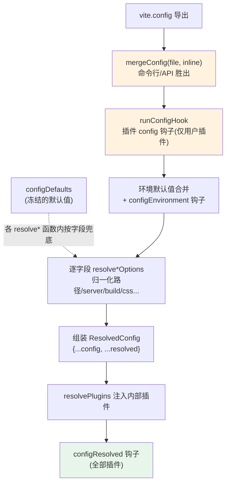

# 02 · 配置加载与归一化：vite.config 如何变成贯穿全程的 ResolvedConfig

> 本节调试目标：跟踪一次 `vite` 启动时，`vite.config.ts` 从「磁盘上一个 TS 文件」到「内存里一个被层层合并、归一化后的 `ResolvedConfig` 对象」的完整过程。重点回答三个问题：TS 配置文件是怎么被加载执行的（浏览器和 Node 都不能直接 `import` 一个 `.ts`）？用户配置、命令行参数、默认值、插件钩子是按什么顺序合并的？最终那个被传给 server / 每个插件的 `ResolvedConfig` 长什么样？
>
> 源码基线：Vite 8.1.0。入口文件：`packages/vite/src/node/config.ts`。

---

## 一、调试目标与入口

承接 [01-环境准备与调试入门.md](./01-环境准备与调试入门.md)，CLI 解析完参数后调用 `createServer(inlineConfig)`，`_createServer` 做的第一件大事就是：

文件：`packages/vite/src/node/server/index.ts`（L493 附近）

```ts
const config = await resolveConfig(inlineConfig, 'serve')
```

所有秘密都在 `resolveConfig` 里。它是一个近 800 行的大函数（`config.ts` L1405–2230），但骨架很清晰。我们先在 `config.ts` 的几个位置打上断点，再跟着变量一步步看：

### 本篇统一调试入口

从本篇开始，不再使用内容较多、主要服务于 HTML 回归测试的 `playground/html/vite.config.js` 观察配置流程，而是使用专门准备的最小示例：

```text
playground/config-plugin-debug
```

在 Vite 源码仓库根目录打开 JavaScript Debug Terminal，然后启动：

```bash
cd playground/config-plugin-debug
pnpm dev
```

这个示例的 `vite.config.js` 刻意保留了配置调试需要观察的内容：

- 从 `debug-options.js` 导入本地配置，用于观察配置文件如何被 Rolldown 打包以及 `configFileDependencies` 如何收集；
- 使用 `defineConfig(({ command, mode }) => ...)`，可以在配置工厂执行时直接看到当前命令和模式；
- 配置 `base`、`server.port`、`resolve.alias`，方便对比文件配置、CLI 参数和最终 `ResolvedConfig`；
- 插件的 `config` 钩子返回 `define` 配置，方便观察多个插件返回值如何按顺序 merge；
- 同时包含 `configEnvironment` 和环境插件，方便观察顶层配置如何继续派生 client、SSR 配置。

本篇主要跟踪 `vite.config.js → loadConfigFromFile → bundleConfigFile → loadConfigFromBundledFile → resolveConfig`。下一篇仍使用同一个示例，继续观察其中的用户插件如何过滤、排序并生成环境插件清单。

这些断点不用手动翻文件找，直接在 Cursor/VS Code 里用快速打开定位：macOS 按 `Command + P`，Windows/Linux 按 `Ctrl + P`，输入 `config.ts:1472` 这类「文件名:行号」就能跳过去。

| 推荐断点 | 核心函数 / 位置 | 函数主要作用 | 看什么 |
|---|---|---|---|
| `config.ts:1472` | `resolveConfig` → `loadConfigFromFile` | 读取并执行用户配置文件，把 `vite.config.*` 变成普通 JS 配置对象 | `configLoader` 选择 `bundle` / `runner` / `native` 哪种加载方式 |
| `config.ts:2530` | `bundleConfigFile` | `configLoader: 'bundle'` 分支的核心处理，用 Rolldown 把配置文件打成 Node 可执行的 JS | bundle 加载方式下配置文件被 Rolldown 打包的过程 |
| `config.ts:2753` | `loadConfigFromBundledFile` | 写入临时 `.mjs` 并动态 `import`，真正执行配置文件 | bundle加载方式 打包后的配置作为临时 ESM 被执行 |
| `config.ts:1481` | `resolveConfig` → `mergeConfig` | 合并文件配置与命令行/API 传入的 inline 配置 | 命令行/API 配置怎么覆盖文件配置 |
| `config.ts:1517` | `resolveConfig` → `runConfigHook` | 串行执行用户插件的 `config` 钩子，让插件参与修改原始配置 | 每个插件的 `config` 钩子如何改配置 |
| `config.ts:1677` | `resolveConfig` → `mergeConfig` | 合并环境默认配置与用户环境配置，生成每个 environment 的初始配置 | `client` 如何继承顶层配置，`ssr` / 自定义环境如何补默认值 |
| `config.ts:2041` | `resolveConfig` → `resolved = { ... }` | 组装最终 `ResolvedConfig`，把路径、server/build/preview、css/json 等字段归一化 | 默认值、兼容层和各类 `resolve*Options` 结果如何落到最终配置 |
| `config.ts:2205` | `resolveConfig` → `configResolved` hooks | 在 `ResolvedConfig` 定稿后通知所有插件 | 最终可变的 `ResolvedConfig` |

这里先在 `loadConfigFromFile` 断点观察三种 `configLoader` 的分派；接下来的调试主线默认沿 `bundle` 分支继续往下看，`runner` 和 `native` 作为另外两条加载路径了解即可，不单独展开。

---

## 二、亲手调试：vite.config 是怎么被「执行」的

最反直觉的一点：Node 不能直接 `import('./vite.config.ts')`（它不认 TS），但 Vite 偏偏让你用 TS 写配置。怎么做到的？

在 `config.ts:2530` 打断点，启动 dev，断点停下时看调用栈，你会发现链路是：

```mermaid
flowchart TD
  A["resolveConfig(inlineConfig, command)"] --> B{"configFile !== false ?"}
  B -- "否" --> Z["跳过配置文件<br/>只使用 inlineConfig / 默认值"]
  B -- "是" --> C["loadConfigFromFile(configEnv, configFile, root, loader)"]

  C --> D{"是否传了 configFile ?"}
  D -- "显式传入" --> E["path.resolve(configFile)"]
  D -- "未传入" --> F["遍历 DEFAULT_CONFIG_FILES<br/>在 root/cwd 下查找 vite.config.*"]
  E --> G{"找到配置文件 ?"}
  F --> G
  G -- "否" --> H["返回 null<br/>没有文件配置"]
  G -- "是" --> I{"configLoader"}

  I -- "bundle 默认" --> J["bundleAndLoadConfigFile"]
  I -- "runner" --> R["runnerImportConfigFile<br/>用 runnerImport 执行配置"]
  I -- "native" --> N["nativeImportConfigFile<br/>原生 import + 时间戳防缓存"]

  J --> K["bundleConfigFile"]
  K --> L["Rolldown 打包 vite.config.*<br/>platform: node / treeshake: false"]
  L --> M["externalize-deps<br/>npm 依赖外部化"]
  L --> O["inject-file-scope-variables<br/>注入 __dirname / __filename / import.meta.url"]
  M --> P["生成单 chunk JS<br/>收集 dependencies"]
  O --> P
  P --> Q["loadConfigFromBundledFile"]
  Q --> S{"配置文件是 ESM ?"}
  S -- "是" --> T["写入临时 .mjs<br/>node_modules/.vite-temp/xxx.mjs"]
  T --> U["动态 import 临时文件<br/>拿到 default 导出后删除"]
  S -- "否 CJS" --> V["临时改写 require.extensions<br/>用 _compile(bundledCode) 执行"]

  R --> W["得到 configExport"]
  N --> W
  U --> W
  V --> W

  W --> X{"configExport 是函数 ?"}
  X -- "是" --> Y["调用 configExport(configEnv)"]
  X -- "否" --> AA["直接作为用户配置"]
  Y --> AB{"返回值是对象 ?"}
  AA --> AB
  AB -- "否" --> AC["抛错：config must export or return an object"]
  AB -- "是" --> AD["返回 { path, config, dependencies }"]
  AD --> AE["resolveConfig 中 mergeConfig(fileConfig, inlineConfig)<br/>命令行/API 配置优先级更高"]
  H --> AF["进入 resolveConfig 后续归一化主流程"]
  Z --> AF
  AE --> AF

  AF --> AG["更新 mode / configEnv.mode<br/>inlineConfig.mode 优先级最高"]
  AG --> AH["过滤用户插件 apply<br/>得到 rawPlugins"]
  AH --> AI["sortUserPlugins<br/>按 enforce 分 pre / normal / post"]
  AI --> AJ["runConfigHook<br/>只执行用户插件的 config 钩子"]
  AJ --> AK["补默认 environments<br/>dev 默认 client + ssr"]
  AK --> AL["合并旧配置到新 Environment API<br/>ssr / warmup / optimizeDeps 等兼容"]
  AL --> AM["合并每个环境默认值<br/>client 继承顶层 resolve / optimizeDeps"]
  AM --> AN["runConfigEnvironmentHook<br/>执行 configEnvironment 钩子"]
  AN --> AO["resolveEnvironmentOptions<br/>得到 ResolvedEnvironmentOptions"]
  AO --> AP["加载 .env / 解析 base / cacheDir / server / build / preview"]
  AP --> AQ["构造 resolved 初稿<br/>plugins 暂时还是用户插件占位"]
  AQ --> AR["patchConfig<br/>builder 等内部兼容修补"]
  AR --> AS["resolvePlugins<br/>用户插件三桶插入 Vite 内部插件模板"]
  AS --> AT["createPluginHookUtils<br/>生成 getSortedPlugins / getSortedPluginHooks"]
  AT --> AU["configResolved 钩子<br/>此时拿到定稿 ResolvedConfig"]
  AU --> AV["resolveEnvironmentPlugins<br/>按 applyToEnvironment 生成环境插件列表"]
  AV --> AW["applyDepOptimizationOptionCompat<br/>setOptimizeDepsPluginNames"]
  AW --> AX["返回最终 ResolvedConfig"]

  style L fill:#fff3e0
  style U fill:#e8f5e9
  style V fill:#e8f5e9
  style AE fill:#e3f2fd
  style AJ fill:#fff3e0
  style AN fill:#fff3e0
  style AU fill:#fff3e0
  style AX fill:#e8f5e9
```



这张图可以分成两条主线看：上半段是「配置文件怎么被加载执行」，包括找文件、按 `configLoader` 分派、默认用 Rolldown 打包、执行导出对象或导出函数；下半段是「`resolveConfig` 怎么把配置归一化成 `ResolvedConfig`」，包括过滤/排序用户插件、执行配置阶段钩子、补环境默认值、做旧 API 兼容、解析每个环境配置、装配内部插件，最后执行 `configResolved` 并生成环境级插件列表。

核心函数可以这样理解：

| 函数 / 逻辑点 | 主要作用 |
|---|---|
| `resolveConfig` | 配置归一化总入口。它负责串起「读配置文件 → 跑配置阶段钩子（如 `config` / `configEnvironment` / `configResolved`）→ 合并默认值 → 生成 `ResolvedConfig`」整条链路。 |
| `loadConfigFromFile` | 配置文件加载入口。先找到具体的 `vite.config.*` 文件，再根据 `configLoader` 选择不同执行方式。 |
| `bundleAndLoadConfigFile` | 默认配置加载路径。先把配置文件打包成 Node 可执行代码，再执行这段代码拿到用户配置。 |
| `bundleConfigFile` | 用 Rolldown 打包配置文件。它会处理 TS/ESM、本地依赖、文件作用域变量，并收集配置依赖文件。 |
| `externalize-deps` | `bundleConfigFile` 内部插件。把 npm 依赖外部化，避免把整个 `node_modules` 打进临时配置 bundle。 |
| `inject-file-scope-variables` | `bundleConfigFile` 内部插件。给配置代码补上 `__dirname`、`__filename`、`import.meta.url` 等运行时变量。 |
| `loadConfigFromBundledFile` | 执行打包后的配置代码。ESM 走临时 `.mjs + import()`，CJS 走 `require.extensions + _compile()`。 |
| `runnerImportConfigFile` | `configLoader: 'runner'` 的路径，用 Vite 的 runner 机制执行配置文件。 |
| `nativeImportConfigFile` | `configLoader: 'native'` 的路径，尽量交给 Node 原生 `import()` 执行配置文件。 |
| `mergeConfig(fileConfig, inlineConfig)` | 把配置文件结果和命令行/API 传入配置合并。这里后者优先级更高，所以 inline 配置会覆盖文件配置。 |
| `sortUserPlugins` | 只按 `enforce` 做宏观分桶，得到 pre / normal / post 三类用户插件。 |
| `runConfigHook` | 只执行用户插件的 `config` 钩子，让插件在内部插件装配前继续改用户配置。 |
| `runConfigEnvironmentHook` | 执行 `configEnvironment` 钩子，让插件按环境修改 `client` / `ssr` / 自定义环境配置。 |
| `resolveEnvironmentOptions` | 把每个环境的用户配置归一化成 `ResolvedEnvironmentOptions`，决定 consumer、resolve、dev/build 等环境级选项。 |
| `resolvePlugins` | 把用户插件三桶插入 Vite 内部插件模板，得到最终的顶层插件数组。 |
| `createPluginHookUtils` | 插件工具函数，按插件顺序缓存和获取某个 hook 对应的插件 / hook 列表，保证后续钩子按正确顺序执行。 |
| `configResolved` 钩子 | 配置定稿后通知插件，此时插件能看到完整的 `ResolvedConfig`。 |
| `resolveEnvironmentPlugins` | 在 `configResolved` 之后按 `applyToEnvironment` 过滤或替换插件，生成每个环境自己的插件列表。 |

### 关键点 1：Vite 8 用 Rolldown 打包配置，不再是 esbuild

这是 Vite 8 的一个实现变化。CLI 选项文档写得很直白：

文件：`packages/vite/src/node/cli.ts`（L181–184）

```ts
.option(
  '--configLoader <loader>',
  `[string] use 'bundle' to bundle the config with Rolldown, or 'runner' (experimental) ...`,
)
```

默认 loader 是 `'bundle'`，它走 `bundleConfigFile`，内部调用的是从 `'rolldown'` 导入的 `rolldown()`：

文件：`packages/vite/src/node/config.ts`（L2530 附近）

```ts
const bundle = await rolldown({
  input: fileName,
  platform: 'node',
  resolve: { mainFields: ['main'] },
  treeshake: false,
  tsconfig: false,
  plugins: [ /* externalize-deps、inject-file-scope-variables */ ],
})
```

为什么要「打包」而不是直接 `import`？因为 `vite.config.ts` 可能：用 TS 语法、`import` 了其它本地文件、用了 `__dirname` 这类 CJS 变量。Rolldown 把这些都处理掉，产出一段可被 Node 执行的纯 JS——把 npm 依赖外部化（`externalize-deps`）、注入 `__dirname`/`__filename`/`import.meta.url` 等文件作用域变量（`inject-file-scope-variables`），同时记录下配置文件依赖了哪些本地文件（用于配置改动时重启 dev server）。

### 关键点 2：为什么要把 npm 包外部化

这里的“外部化”只发生在**加载 Vite 配置文件**这一步，不是业务代码的生产构建。默认 `configLoader: 'bundle'` 会把 `vite.config.ts` 先打包成一段 Node 可执行的 JS，但它并不想把 `node_modules` 里的包也一起打进去。

举个常见配置：

```ts
import vue from '@vitejs/plugin-vue'
import { defineConfig } from 'vite'
import localOptions from './build/local-options'

export default defineConfig({
  plugins: [vue()],
  ...localOptions,
})
```

打包配置文件时，Vite 更关心的是把 `vite.config.ts` 和 `./build/local-options` 这类**本地配置代码**处理成可执行 JS；而 `vite`、`@vitejs/plugin-vue` 这种 npm 包，仍然交给 Node 按正常包解析规则去加载。这样做主要有几个原因：

- 避免把整个 npm 包及其依赖树打进临时配置 bundle，配置加载会更轻；
- 保留包自己的运行时边界，比如 ESM-only 包、CJS 包、条件导出、Node 内置模块等；
- 减少“配置加载打包器”和“包自身发布格式”之间的兼容问题；
- 本地文件仍然会被打包和记录为 `dependencies`，所以这些文件变化时 dev server 还能知道要重启。

源码里对应的是 `bundleConfigFile` 里的 `externalize-deps` 插件：它遇到裸导入的 npm 包名，会先用 Vite 的解析逻辑定位到真实文件，再返回 `{ external: true }`。如果是 JSON 文件会例外地不外部化，因为这里还涉及 import attributes 的兼容问题。

所以你的理解可以更精确地说：**是为了打包“配置文件本身”，但不把配置文件里引用的 npm 包一起打进去**。本地配置代码会进入配置 bundle，第三方包尽量外部化，最后由 Node 在执行配置产物时加载。

### 关键点 3：通过临时文件 + 动态 import 执行

打包出的代码不是用 `eval`，而是写到一个临时 `.mjs` 文件再 `import`，用完即删：

文件：`packages/vite/src/node/config.ts`（L2751–2755）

```ts
await fsp.writeFile(tempFileName, bundledCode)
try {
  return (await import(pathToFileURL(tempFileName).href)).default
} finally {
  fs.unlink(tempFileName, () => {}) // 忽略错误
}
```

临时文件默认放在 `node_modules/.vite-temp/`。`.ts`/`.mts` 走 ESM 路径（如上），`.cjs`/`.cts` 则走另一条：临时改写 `require.extensions` 用 `_compile(bundledCode)` 直接编译（L2766–2778），不落临时文件。

> 调试技巧：想看打包后的配置到底长啥样，就在 L2753 断点，把 `bundledCode` 复制出来——你会看到你的 TS 配置被编译成了 JS，依赖被外部化成了 `import ... from 'xxx'`。

### 关键点 4：配置文件的查找顺序

如果你没用 `--config` 显式指定，Vite 按固定顺序找：

文件：`packages/vite/src/node/constants.ts`（L98–105）

```ts
export const DEFAULT_CONFIG_FILES: string[] = [
  'vite.config.js',
  'vite.config.mjs',
  'vite.config.ts',
  'vite.config.cjs',
  'vite.config.mts',
  'vite.config.cts',
]
```

找到第一个存在的就用。如果配置导出的是个函数（`defineConfig((env) => ({...}))`），会立刻用 `configEnv`（`{ mode, command, isSsrBuild, isPreview }`）调用它拿到对象。

顺带澄清一个常见误解：`defineConfig` 本身**不做任何归一化**，它就是个类型辅助的恒等函数：

文件：`packages/vite/src/node/config.ts`（L188–190）

```ts
export function defineConfig(config: UserConfigExport): UserConfigExport {
  return config
}
```

它的全部价值是让 TS / 编辑器给你配置补全和类型检查。真正的归一化全在 `resolveConfig` 里。

### 关键点 5：三种 configLoader 分别适合什么场景

`loadConfigFromFile` 找到配置文件后，不是固定一种执行方式，而是按 `configLoader` 分派：

| loader | 走哪个函数 | 适合的场景 | 代价 / 注意点 |
|---|---|---|---|
| `bundle`（默认） | `bundleAndLoadConfigFile` | 最通用。适合 `vite.config.ts`、ESM/CJS 混用、配置里 import 本地文件、使用 `__dirname` / `import.meta.url` 等常见情况。 | 会先用 Rolldown 打包配置文件，再执行打包产物；多一步打包，但行为最稳定，也能收集配置依赖。 |
| `runner` | `runnerImportConfigFile` | 实验性路径。用 Vite 的 runner 机制执行配置，目标是减少“先打包再执行”的中间步骤。 | 仍是实验能力，理解源码时知道它是另一条执行配置的路径即可。 |
| `native` | `nativeImportConfigFile` | 配置文件本身已经能被当前运行时原生 `import()` 执行时使用，比如纯 JS/原生 ESM 配置。 | 不经过 Rolldown 打包，所以不会帮你处理 TS 语法、CJS 文件作用域变量注入、依赖外部化这些问题；普通项目一般不用手动选它。 |

所以默认选择 `bundle` 不是为了“更复杂”，而是为了覆盖最多真实项目配置写法：TS 配置、本地依赖、CJS 变量、ESM/CJS 差异，都先被打成一段 Node 能执行的 JS。

### 关键点 6：为什么要先过滤用户插件的 apply

配置文件加载完、`mode` 更新之后，`resolveConfig` 会先做这一步：

```ts
const rawPlugins = (await asyncFlatten(config.plugins || [])).filter(filterPlugin)
```

这里的 `filterPlugin` 只回答一个问题：**这个插件要不要进入当前命令的配置流程**。

`apply` 的几种情况：

| 写法 | serve 时 | build 时 |
|---|---|---|
| 不写 `apply` | 进入 | 进入 |
| `apply: 'serve'` | 进入 | 跳过 |
| `apply: 'build'` | 跳过 | 进入 |
| `apply(config, env) { ... }` | 函数返回 true 才进入 | 函数返回 true 才进入 |

为什么这一步必须发生在 `runConfigHook` 之前？因为 `config` 钩子本身就可以改配置。如果一个只服务 build 的插件在 dev 启动时也跑了 `config` 钩子，它就可能提前改掉 dev 配置；反过来，serve-only 插件也不应该影响生产构建配置。先过滤 `apply`，可以保证后面的 `sortUserPlugins`、`runConfigHook`、`resolvePlugins` 都只处理当前命令真正生效的用户插件。

顺序上要记住两件事：

- `apply` 决定“在不在当前命令里”；
- `enforce` 决定“进入之后排在哪个桶里”。

也就是说，`apply` 是开关，`enforce` 才是位置。

---

## 三、配置是按什么顺序合并的

拿到配置文件导出的对象后，`resolveConfig` 会经历五层「叠加」，理解这个顺序能解释绝大多数「我配的值为什么没生效 / 被谁覆盖了」的问题。



### 第 1 层：文件配置 + 命令行/API 配置

文件：`packages/vite/src/node/config.ts`（L1454–1457）

```ts
if (loadResult) {
  config = mergeConfig(loadResult.config, config)
  configFile = loadResult.path
  configFileDependencies = loadResult.dependencies
}
```

注意参数顺序：`mergeConfig(文件配置, 内联配置)`，**第二个参数覆盖第一个**。内联配置就是 CLI/`createServer({...})` 传进来的那份。所以命令行 `--port 5000` 会覆盖 `vite.config` 里的 `server.port`。`mergeConfig` 是深合并：对象递归合并、数组拼接，并对 `alias`、`plugins` 等做特殊处理（`utils.ts` L1404–1522）。

### 第 2 层：插件 `config` 钩子

文件：`packages/vite/src/node/config.ts`（L1480–1481）

```ts
const userPlugins = [...prePlugins, ...normalPlugins, ...postPlugins]
config = await runConfigHook(config, userPlugins, configEnv)
```

`runConfigHook` 顺序执行每个插件的 `config` 钩子；钩子若返回新对象，则 `conf = mergeConfig(conf, res)` 并入。**两个关键事实**：

1. 此时参与的只有**用户插件**——内部插件还没加进来（它们在第 4 层之后才由 `resolvePlugins` 注入）；
2. 钩子按 `getSortedPluginsByHook('config', plugins)` 排序（`order: 'pre'` → 默认 → `'post'`），这条排序规则贯穿所有钩子，详见 [03-插件注册与排序.md](./03-插件注册与排序.md)。

这解释了为什么框架插件（如 `@vitejs/plugin-vue`）能在你不写任何配置的情况下「自动」补上一堆默认值——它们就是在 `config` 钩子里 merge 进去的。

### 第 3 层：环境默认值 + `configEnvironment` 钩子

Vite 6 引入 Environment API 后，配置里多了 `environments`（默认含 `client`、`ssr`）。每个环境会先合并各自的默认值，再跑插件的 `configEnvironment` 钩子（`config.ts` L1632–1649）。环境模型的实现细节见 [10-多环境模型EnvironmentAPI实现.md](./10-多环境模型EnvironmentAPI实现.md)。

### 第 4 层：逐字段归一化（默认值在这里兜底）

值得注意的是，Vite **没有**在顶层做一次 `mergeConfig(configDefaults, userConfig)`。默认值是在每个 `resolve*Options` 函数内部、按字段用 `mergeWithDefaults(...)` 或 `?? configDefaults.x` 增量兜底的。比如 `resolve`、`dev`、`json`、`experimental` 各有各的兜底点。这种「分散兜底」让默认值能感知上下文（例如某些默认值依赖 `command` 或 `mode`）。

### 第 5 层：组装并最终展开

文件：`packages/vite/src/node/config.ts`（L2090–2093）

```ts
resolved = {
  ...config,     // 经过钩子处理的 UserConfig 字段
  ...resolved,   // 归一化后的字段，优先级更高
}
```

`...resolved` 在后，意味着归一化后的字段（如绝对化的 `root`、补全的 `server`）会覆盖同名的原始字段。

---

## 四、最终产物：ResolvedConfig

归一化结束后，得到的 `ResolvedConfig` 是整个 Vite 运行期的「全局事实来源」——dev server、每个插件钩子的 `this.environment.config`、build 流程，拿到的都是它（或它的环境视图）。几个值得记住的字段：

| 字段 | 含义 |
|---|---|
| `configFile` | 实际加载的配置文件路径（没有则 `undefined`） |
| `configFileDependencies` | 配置加载过程中依赖到的本地文件；dev 模式下改动它们会和改动配置文件 / env 文件一样，由 Vite 自动触发 server restart |
| `inlineConfig` | **原封不动**保留的 CLI/API 输入，便于后续重启时复用 |
| `root` / `base` / `cacheDir` | 已归一化的路径 |
| `command` / `mode` / `isProduction` | `'serve'`/`'build'` + 解析后的 mode + `NODE_ENV` 推断 |
| `env` | `loadEnv` 读到的环境变量 + 注入的 `BASE_URL`/`MODE`/`DEV`/`PROD` |
| `plugins` | `resolvePlugins` 后的完整插件数组 |
| `environments` | 每个环境归一化后的配置与插件 |
| `getSortedPlugins` / `getSortedPluginHooks` | 注入的钩子排序工具 |

### `configResolved`：插件拿到「定稿」配置的时刻

在内部插件被 `resolvePlugins` 注入之后，Vite 触发 `configResolved`钩子函数：

文件：`packages/vite/src/node/config.ts`（L2102–2121）

```ts
const resolvedPlugins = await resolvePlugins(resolved, prePlugins, normalPlugins, postPlugins)
;(resolved.plugins as Plugin[]) = resolvedPlugins
Object.assign(resolved, createPluginHookUtils(resolved.plugins))

await Promise.all(
  resolved
    .getSortedPluginHooks('configResolved')
    .map((hook) => hook.call(resolvedConfigContext, resolved)),
)
```

`configResolved`钩子函数和 `config` 钩子的关键区别：

- `configResolved` 跑在**全部插件**（用户 + 内部）上，而 `config` 只跑用户插件；
- `configResolved` 是**并行**（`Promise.all`）执行的，且它**不接收返回值**——插件直接读这份定稿配置（通常存一份引用备用），而不是再去改它。

这也是插件开发的一条铁律：**想改配置用 `config` 钩子，想读最终配置用 `configResolved` 钩子。**

---

## 五、本节小结

**这段实现解决了什么问题？**
它解决了「让用户用 TS / ESM 写配置，又能被 Node 正确执行」以及「把分散的配置来源（文件、命令行、插件、默认值）收敛成一份唯一、归一化的事实」这两件事。Rolldown 打包配置文件，临时 `.mjs` + 动态 import 执行；五层合并顺序明确了优先级；`ResolvedConfig` 成为全程共享的单一事实来源。

**它带来了什么复杂度 / 代价？**
为了支持 TS 配置，每次启动都要跑一次 Rolldown 打包 + 临时文件 IO，这是启动耗时的一部分；五层合并 + 分散兜底 + 两个时机不同的钩子（`config` vs `configResolved`）虽然灵活，但也提高了「我的值被谁改了」的排查门槛——理解合并顺序是用好它的前提。Environment API 的引入又在中间塞入了环境维度，让配置结构进一步变深。

**读完你应当能做到：**

- [ ] 说清 `vite.config.ts` 从磁盘到执行的完整路径（Rolldown 打包 → 临时 .mjs → 动态 import）；
- [ ] 在 `config.ts:1481` 断点，亲眼看到命令行配置覆盖文件配置；
- [ ] 区分 `config` 钩子（改配置、仅用户插件、串行 merge）与 `configResolved` 钩子（读定稿、全部插件、并行）；
- [ ] 在排查「配置不生效」时，按五层合并顺序定位是哪一层覆盖了你的值。

下一节我们顺着 `resolveConfig` 里出现的 `prePlugins / normalPlugins / postPlugins` 与 `resolvePlugins`，把 [03-插件注册与排序.md](./03-插件注册与排序.md) 彻底讲清。
