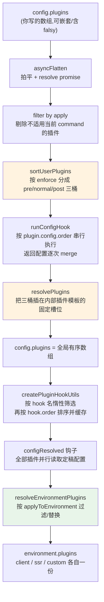

# 03 · 插件注册与排序：内部插件、用户插件、enforce / apply 与环境维度

> 本节调试目标：跟踪从 `config.plugins`（你在 `vite.config` 里写的那个数组）到 Vite 内部最终执行的那条**有序插件流水线**的全过程。回答四个问题：用户插件和 Vite 几十个内部插件是怎么交错排在一起的？`enforce: 'pre' | 'post'` 到底改变了什么？`apply: 'serve' | 'build'` 又改变了什么？Environment API 之后，每个环境的插件列表是怎么单独算出来的？
>
> 源码基线：Vite 8.1.0。入口：`packages/vite/src/node/plugins/index.ts`（`resolvePlugins`）、`packages/vite/src/node/config.ts`（`sortUserPlugins`）。

---

## 一、先建立一个关键认知：Vite 有「两套排序」

承接 [02-配置加载与归一化.md](./02-配置加载与归一化.md)：上一篇停在 `resolveConfig` 已经拿到用户插件、准备执行 `runConfigHook` 的位置。本篇继续沿同一条调用栈，直到顶层 `ResolvedConfig.plugins` 与各环境 `environment.plugins` 都定稿。

很多人把 `enforce` 和钩子的 `order` 搞混，根源是没意识到 Vite 的插件排序其实分两个维度：

| 维度 | 决定什么 | 由谁控制 | 何时计算 |
|---|---|---|---|
| **宏观位置** | 插件在那条静态插件数组里排第几（pre / 核心 / normal / build / post） | 插件的 `plugin.enforce` | `resolveConfig` 阶段，一次性 |
| **微观顺序** | 某个具体钩子（如 `transform`）执行时，实现了它的插件谁先谁后 | 钩子函数对象的 `order: 'pre'/'post'` | 每个钩子运行时，按需排序 |

外加一个**开关**：`plugin.apply` 决定这个插件**是否被纳入**（serve 还是 build），它不改变位置，只决定「在不在」。

再加一个**维度**：Environment API 让每个环境（client/ssr/...）可以有自己的插件子集，由 `applyToEnvironment` 钩子产出。

本节按「宏观位置 → enforce → apply → 微观 order → 环境维度」的顺序拆开。

---

## 二、亲手调试：插件数组是怎么拼出来的

### 本篇调试入口

继续使用上一篇创建的专用示例，而不是 `playground/html`：

```text
playground/config-plugin-debug
```

在 Vite 源码仓库根目录打开 JavaScript Debug Terminal，然后运行：

```bash
cd playground/config-plugin-debug
pnpm dev
```

`vite.config.js` 中的插件是按本篇知识点有意设计的：

- `debug:pre`、`debug:normal`、`debug:post`：观察 `plugin.enforce` 如何形成三个用户插件桶；
- `debug:serve-command`、`debug:build-command`：观察 `plugin.apply` 如何按当前 command 决定插件是否进入 `rawPlugins`；这里的 serve/build 是命令维度，不是 client/SSR 环境维度；
- `debug:normal` 的 `transform.order: 'pre'`：对比全局插件顺序与单个 hook 的局部顺序；
- `debug:per-environment`：全局阶段只是占位插件，生成 client、SSR 清单时分别替换成 `debug:client-only`、`debug:ssr-only`；
- 每个普通调试插件都实现了 `config`、`configEnvironment`、`configResolved` 和 `transform`，既能打断点，也会在终端打印实际执行顺序。

启动 serve 后，几个关键变量应当呈现出可预测的结果：

```text
rawPlugins：
  debug:pre
  debug:normal
  debug:serve-command
  debug:post
  debug:per-environment

被 apply: 'build' 排除：
  debug:build-command

sortUserPlugins：
  pre    = [debug:pre]
  normal = [debug:normal, debug:serve-command, debug:per-environment]
  post   = [debug:post]

环境替换：
  client → debug:client-only
  ssr    → debug:ssr-only
```

浏览器请求 `main.js` 后，还可以从终端里的 `[transform]` 日志验证：`debug:normal` 虽是普通插件，但它的 `transform.order: 'pre'` 会让这个 hook 在其他普通 `transform` 之前执行。

在 `config.ts:1507` 和 `config.ts:1511` 打断点，启动 dev，观察两个变量：`rawPlugins`（过滤后的用户插件）和 `[prePlugins, normalPlugins, postPlugins]`（分桶后的结果）。然后沿 `runConfigHook → resolvePlugins → createPluginHookUtils → configResolved → resolveEnvironmentPlugins` 继续走：

| 推荐断点 | 核心函数 / 位置 | 函数主要作用 | 看什么 |
|---|---|---|---|
| `config.ts:1507` | `resolveConfig` → `asyncFlatten(...).filter(filterPlugin)` | 拍平用户插件数组，并按 `apply` 过滤当前命令不需要的插件 | `rawPlugins` 里还剩哪些用户插件 |
| `config.ts:1511` | `sortUserPlugins` | 按 `enforce` 把用户插件分成 pre / normal / post 三桶 | 自己的插件被分进了哪个桶 |
| `config.ts:2802` | `runConfigHook` | 按各用户插件的 `plugin.config.order` 对 `config` 钩子排序并串行执行，再把返回值 merge 回当前配置 | `p.name`、`conf`、`res`，以及后一个钩子如何看见前一个钩子的结果 |
| `plugins/index.ts:42` | `resolvePlugins` | 把用户插件三桶插入 Vite 内部插件模板，形成全局有序插件数组 | pre / normal / post 分别插在哪些内部插件之间 |
| `plugins/index.ts:183` | `createPluginHookUtils` | 为每个 hook 按需计算并缓存插件顺序，产出 `getSortedPlugins/getSortedPluginHooks` | `sortedPluginsCache` 是否按 hook 名复用 |
| `plugins/index.ts:224` | `getSortedPluginsByHook` | 在已经排好的插件数组上，再按各插件的 `plugin[hookName].order` 做 pre / normal / post 排序 | 同一插件可在不同 hook 中处于不同微观位置 |
| `config.ts:2205` | `configResolved` 调用点 | 所有顶层插件就位后，并行通知插件读取最终配置 | `resolved.plugins` 是全局清单，返回值不会再 merge |
| `plugin.ts:400` | `resolveEnvironmentPlugins` | 按 `applyToEnvironment` 为每个环境生成自己的插件列表 | client / ssr 环境下插件列表是否不同 |

这一节不要只看数组结果，最好配合源码里的三处注释一起读：`config.ts:1507` 前后的注释把主线压成一句话——先 `apply` 过滤，再 `enforce` 分桶，再跑 `config` 钩子；`plugins/index.ts:97` 的注释说明内部插件数组就是 Vite 的“插件模板”；`plugins/index.ts:238` 的注释说明 `hook.order` 是钩子级排序，不会改变插件在全局数组中的位置。

所以调试时建议按这个顺序观察变量：先看 `rawPlugins` 里哪些插件被 `apply` 留下，再看三个桶里插件名的顺序，最后进 `resolvePlugins` 看这三桶被插到内部插件模板的哪个槽位。这样读，比单独背 `enforce/apply/order` 的定义更不容易混。

整个装配分五个阶段。



核心函数先对齐：

| 函数 | 输入 → 输出 | 在主线中的职责 |
|---|---|---|
| `filterPlugin` | `PluginOption[] → Plugin[]` | 去 falsy，并用 `apply` 做 command 级准入。 |
| `sortUserPlugins` | 用户插件 → `[pre, normal, post]` | 只看 `enforce`，桶内稳定保留注册顺序。 |
| `runConfigHook` | 当前配置 + 用户插件 → 新配置 | 只跑用户插件；按 `plugin.config.order` 排序、串行 await、逐次 `mergeConfig`。 |
| `resolvePlugins` | 三个用户桶 + `ResolvedConfig` → 顶层插件数组 | 以内部插件模板为骨架；是否注入 build 插件由 `isBuild/anyEnvBundled` 决定。 |
| `createPluginHookUtils` | 顶层或环境插件数组 → 两个查询函数 | 每个 hook 第一次查询时排序并缓存，避免每次调用重复筛选。 |
| `getSortedPluginsByHook` | 某 hook 名 + 插件数组 → 实现该 hook 的插件 | 在数组宏观顺序上应用各插件的 `plugin[hookName].order` 微观排序。 |
| `resolveEnvironmentPlugins` | 顶层插件数组 + 环境 → 环境插件数组 | 用 `applyToEnvironment` 对每个环境保留、排除或替换插件。 |

### 关键点 1：拍平插件并按 apply 过滤

文件：`packages/vite/src/node/config.ts`（L1498–1517）

```ts
const filterPlugin = (p: Plugin | FalsyPlugin): p is Plugin => {
  if (!p) {
    return false                              // 剔除 false/null/undefined
  } else if (!p.apply) {
    return true                               // 没写 apply → 始终纳入
  } else if (typeof p.apply === 'function') {
    return p.apply({ ...config, mode }, configEnv)  // 自定义判定
  } else {
    return p.apply === command                // 'serve' 或 'build'
  }
}

const rawPlugins = (await asyncFlatten(config.plugins || [])).filter(filterPlugin)
const [prePlugins, normalPlugins, postPlugins] = sortUserPlugins(rawPlugins)
```

这里同时做了两件事：`asyncFlatten` 允许你在 `plugins` 里写嵌套数组和 `false &&` 这种条件插件（很常见的写法）；`filterPlugin` 则按 `apply` 把不属于当前命令的插件直接踢掉——**被踢掉的插件不会进入任何桶**。

### 关键点 2：按 enforce 稳定分桶

文件：`packages/vite/src/node/config.ts`（L2369–2389）

```ts
export function sortUserPlugins(plugins) {
  const prePlugins = [], postPlugins = [], normalPlugins = []
  if (plugins) {
    plugins.flat().forEach((p) => {
      if (p.enforce === 'pre') prePlugins.push(p)
      else if (p.enforce === 'post') postPlugins.push(p)
      else normalPlugins.push(p)
    })
  }
  return [prePlugins, normalPlugins, postPlugins]
}
```

注意：**桶内保持注册顺序**（稳定的 `forEach` push）。也就是说，两个都不写 `enforce` 的插件，谁写在 `plugins` 数组前面谁先执行。

### 关键点 3：runConfigHook 为什么必须串行

`runConfigHook`（`config.ts` L2783–2830）并不是简单 `Promise.all`。它先用 `getSortedPluginsByHook('config', plugins)` 应用各插件的 `plugin.config.order`，再逐个 `await`：

```ts
for (const p of getSortedPluginsByHook('config', plugins)) {
  const handler = getHookHandler(p.config)
  const res = await handler.call(context, conf, configEnv)
  if (res && res !== conf) conf = mergeConfig(conf, res)
}
```

这里有三层顺序同时生效：用户插件先经 `enforce` 形成宏观数组；`config` 自己还能用 `order` 微调；钩子返回值按实际执行顺序逐次合并。它必须串行，因为后一个插件收到的 `conf` 应包含前一个插件的修改。与之相反，`configResolved` 只读定稿配置、无返回值合并，所以在 `config.ts:2205` 用 `Promise.all` 并行执行。

这里直接调用 `getSortedPluginsByHook`，而没有使用后面的 `createPluginHookUtils` 缓存，是因为 `config` 属于特殊的一次性前置钩子：

- 此时只处理用户插件，Vite 内置插件还要等配置定稿后才能创建；
- `config` 在一次配置解析中只运行一次，缓存它的候选列表没有复用收益；
- 每个 `config` 返回值都会合并进 `conf`，内置插件随后读取这个最终配置完成初始化；
- 等 `resolvePlugins` 装配出完整插件数组后，才创建 `createPluginHookUtils`，为会被重复查询的 `resolveId`、`load`、`transform` 等 hook 缓存参与插件及顺序。

因此完整关系是：**用户插件 → 排序并串行运行 `config` → 得到最终配置 → 创建并装配内置插件 → 为后续 hook 建立按需排序缓存**。后续缓存固定的是“某个 hook 由哪些插件按什么顺序参与”，不是 hook 的执行结果；例如每个模块请求仍会重新执行一遍对应的 `transform` handler。

### 关键点 4：resolvePlugins 把三桶插进内部插件模板

这是最关键的一步。`resolvePlugins`（`plugins/index.ts` L42–181）返回一个大数组，三个用户桶被插在内部插件之间的固定槽位：

文件：`packages/vite/src/node/plugins/index.ts`（L65–162，已省略细节）

```ts
return [
  optimizedDepsPlugin(),
  !isWorker && watchPackageDataPlugin(...),
  preAliasPlugin(config),
  aliasPlugin(...),              // bundled 环境可替换成 nativeAliasPlugin

  ...prePlugins,                 // ← 用户 enforce:'pre'

  modulePreloadPolyfillPlugin(),
  ...oxcResolvePlugin(...),
  htmlInlineProxyPlugin(config),
  cssPlugin(config),
  esbuildBannerFooterCompatPlugin(config),
  oxcRuntimePlugin(), oxcPlugin(config),
  nativeJsonPlugin(...),
  wasmHelperPlugin(),
  webWorkerPlugin(config),
  assetPlugin(config),
  forwardConsolePlugin(...),

  ...normalPlugins,              // ← 用户普通插件

  definePlugin(config),
  cssPostPlugin(config),
  buildHtmlPlugin(config),
  workerImportMetaUrlPlugin(config),
  assetImportMetaUrlPlugin(config),
  ...buildPlugins.pre,           // build 专用前置
  dynamicImportVarsPlugin(config),
  importGlobPlugin(config),

  ...postPlugins,                // ← 用户 enforce:'post'

  ...buildPlugins.post,          // build 专用后置(import 分析、压缩、manifest...)
  devtoolsIntegrationPlugin,

  clientInjectionsPlugin(config),
  cssAnalysisPlugin(config),
  importAnalysisPlugin(config),  // ← 永远最后
].filter(Boolean) as Plugin[]
```

上面是与 Vite 8.1.0 数组一一对齐的**简化模板**：保留了真实相对顺序，省略了条件表达式和构造参数，不能把它复制成可运行代码。尤其不要把插件名里的 `build` 理解成“serve 时一定不存在”：`buildPlugins` 的注入条件是 `anyEnvBundled = isBuild || 某个环境 isBundled`；普通非 bundled dev 下它为空，而 `buildHtmlPlugin` 等通用模板成员仍可能存在，只是由 hook 的环境与条件决定是否工作。

这张「模板」是 Vite 插件机制的骨架，几条规律值得记住：

- **别名解析永远在最前**（`preAliasPlugin`/`aliasPlugin`），所以你 `enforce: 'pre'` 也改不了别名先解析这个事实；
- **`importAnalysisPlugin` 永远在最后**——它负责把 import 语句改写成浏览器可用的 URL、注入 HMR 上下文，必须等所有人改完代码后才动手（详见 [06-核心转换链路.md](./06-核心转换链路.md)）；
- 用户的 `pre` 在「核心转换插件之前」、`normal` 在「之后」、`post` 在「build 前置之后、build 后置之前」。这正是官方文档里那张「插件执行顺序」表的来源。

#### 数组装配完以后，谁决定运行哪个插件

这个数组只是**插件注册表**，不会从头到尾自动执行一遍。后续某个流程需要一个 hook 时，才会拿 hook 名查询对应的插件：

```ts
// 示意代码
const plugins = getSortedPlugins('transform')
for (const plugin of plugins) {
  await getHookHandler(plugin.transform)(code, id)
}
```

`createPluginHookUtils` 第一次收到 `'transform'`、`'resolveId'` 等 hook 名时，会遍历完整数组，只留下实现了该 hook 的插件，再按各插件的 `plugin[hookName].order` 排序并缓存。因此不是每次都遍历大数组、现场判断所有字段，而是**按 hook 惰性生成并复用候选列表**。

候选列表由不同的驱动者在不同阶段消费：

- 配置解析阶段由 `runConfigHook`、`configResolved` 调用配置类 hook；
- dev server 收到模块请求后，由 PluginContainer 依次驱动 `resolveId → load → transform`；
- HMR、服务器启动/关闭等流程调用各自的 hook；
- build 阶段则由 Rolldown 消费对应环境的插件及构建 hook。

具体遍历方式还取决于 hook 语义：`resolveId`、`load` 通常遇到第一个有效结果就停止；`transform` 要让代码依次经过所有候选插件；通知型 hook 则可能并行执行。详见 [07-插件容器PluginContainer.md](./07-插件容器PluginContainer.md)。

#### 内置插件：为什么几乎零配置也能工作

当前数组里大部分成员都不是用户配置的，而是 Vite 在 `resolvePlugins` 中自动创建的内置插件。它们共同提供开箱即用的能力：

- `preAliasPlugin`、`aliasPlugin`：处理依赖优化结果和 `resolve.alias`；
- `optimizedDepsPlugin`：读取并服务预构建后的依赖；
- `oxcPlugin`、`nativeJsonPlugin`：转换 TypeScript/JSX 等语法并把 JSON 变成模块；
- `cssPlugin`、`cssPostPlugin`、`cssAnalysisPlugin`：完成 CSS 解析、预处理、CSS Modules、URL 改写以及 dev 注入或 build 收集；
- `assetPlugin`、`wasmHelperPlugin`、`webWorkerPlugin`：让静态资源、Wasm 和 Worker 可以按模块方式导入；
- `definePlugin`、`clientInjectionsPlugin`：替换定义值，并注入 dev client、环境变量等运行时代码；
- `importAnalysisPlugin`：最后分析和改写 import URL、连接模块图并注入 HMR 上下文；
- build 插件：在构建时补充 HTML、import 分析、压缩、manifest 等产物处理能力。

不过要区分两层职责：**dev server 本身**负责监听端口、组织中间件和接收 HTTP 请求；**内置插件流水线**负责理解并转换请求对应的 HTML、JS、TS、CSS 和资源。也就是说，执行一个几乎没有配置的 `vite` 之所以能直接开发，不是因为“没有配置”，而是因为 Vite 已经用默认配置、服务器基础设施和这组内置插件替你完成了配置。

本篇只建立内置插件的全景和装配顺序；它们在一次真实请求中如何协作，继续看 [05-按需编译与devserver请求处理流程.md](./05-按需编译与devserver请求处理流程.md) 和 [06-核心转换链路.md](./06-核心转换链路.md)。

### 关键点 5：serve / build 到底哪里不同

| 观察点 | 普通 `vite` serve | `vite build` / bundled 环境 |
|---|---|---|
| `apply` | 保留未写 `apply` 与 `apply: 'serve'` 的插件 | 保留未写 `apply` 与 `apply: 'build'` 的插件 |
| `buildPlugins` | 普通按需转换环境不需要构建插件，因此是 `{ pre: [], post: [] }`，展开后不会插入任何内容 | 执行 `resolveBuildPlugins(config)`，把构建专用插件分成 `pre`、`post` 两组插入模板的不同位置 |
| 末端分析 | `clientInjections/cssAnalysis/importAnalysis` 仍在模板尾部 | 同一模板先生成，再由环境过滤和各 hook 条件决定实际参与 |
| 插件容器 | 每个 dev environment 建独立容器，按请求驱动 | Rolldown 构建环境消费对应插件清单，整体驱动构建钩子 |

所以 dev 和 build **最终实际参与的插件数组确实不同**，但 Vite 没有分别硬编码两套完整数组。二者共用 `resolvePlugins` 这一套插件模板，再通过 `apply`、`command`、`isBundled` 和环境过滤增删插件。

源码注释把这个意图说得很清楚：

文件：`packages/vite/src/node/plugin.ts`（L202–214）

```ts
/**
 * Plugin invocation order:
 * - alias resolution
 * - `enforce: 'pre'` plugins
 * - vite core plugins
 * - normal plugins
 * - vite build plugins
 * - `enforce: 'post'` plugins
 * - vite build post plugins
 */
enforce?: 'pre' | 'post'
```

---

## 三、enforce 与 apply 到底改了什么

### enforce：只改「在数组里的位置」

`enforce` 仅在 `sortUserPlugins` 里被读一次，决定你的插件进哪个桶、进而插在模板的哪个槽位。它**不影响某个钩子运行时的执行先后**——那是 `order` 的事（见下一节）。

一句话：`enforce` 是「webpack loader 式」的宏观分层，`order` 是「这次钩子调用」的微观插队。

### apply：只改「在不在」，不改位置

`apply` 在 `filterPlugin` 里决定纳入与否：没写 → 始终纳入；`'serve'` → 仅 dev 和 preview（两者 `command` 都是 `'serve'`）；`'build'` → 仅构建；函数 → 自定义判定，接收合并后的 config 和 `ConfigEnv`（含 `mode`/`command`/`isSsrBuild`/`isPreview`）。

> 实战意义：一个只在生产构建时做事的插件（比如分析产物体积），写 `apply: 'build'` 能让它在 dev 期完全不存在，既省开销又避免它的钩子干扰 dev 流程。

---

## 四、微观顺序：钩子运行时的 order

当某个钩子真正执行时（比如处理一个模块要跑所有插件的 `transform`），Vite 不是按数组原始顺序，而是用 `getSortedPluginsByHook` 在「实现了该钩子的插件」里再排一次序：

文件：`packages/vite/src/node/plugins/index.ts`（L210–242）

```ts
export function getSortedPluginsByHook(hookName, plugins) {
  const sortedPlugins = []
  let pre = 0, normal = 0, post = 0
  for (const plugin of plugins) {
    const hook = plugin[hookName]
    if (hook) {
      if (typeof hook === 'object') {
        if (hook.order === 'pre') { sortedPlugins.splice(pre++, 0, plugin); continue }
        if (hook.order === 'post') { sortedPlugins.splice(pre + normal + post++, 0, plugin); continue }
      }
      sortedPlugins.splice(pre + normal++, 0, plugin)
    }
  }
  return sortedPlugins
}
```

这就是为什么你可以这样写一个 `transform` 钩子，让它在大多数 `transform` 之前跑，而插件本身仍是普通 `enforce`：

```ts
{
  name: 'my-plugin',
  transform: {
    order: 'pre',
    handler(code, id) { /* ... */ },
  },
}
```

**`enforce` 定宏观槽位，`order` 定这次钩子里的微观插队，二者正交。** 搞清这一点，几乎所有「我的钩子为什么没在预期时机跑」的问题都能自解。

### createPluginHookUtils：排序结果为什么能复用

`createPluginHookUtils`（`plugins/index.ts` L183–222）闭包持有一个 `Map<hookName, Plugin[]>`。`getSortedPlugins('transform')` 第一次调用时才运行 `getSortedPluginsByHook`，之后直接返回缓存；`getSortedPluginHooks` 再把插件映射成解包后的 handler。

这同时解释两个现象：

1. 同一个插件可以给 `resolveId` 写 `order: 'pre'`、给 `transform` 写默认 order——缓存按 **hook 名** 隔离；
2. 环境 PluginContainer 会对自己的 `environment.plugins` 再创建一套工具，因此顶层清单与 client/ssr 清单不会共用错误的排序缓存。

---

## 五、环境维度：每个环境的插件列表

Environment API 之后，存在**两份插件清单**：

| 清单 | 位置 | 用于 |
|---|---|---|
| 全局 `config.plugins` | `ResolvedConfig.plugins` | `config` 钩子执行完后，由用户插件和 Vite 内置插件装配成的完整清单；用于执行 `configResolved` 等顶层钩子，也是生成各环境插件清单的来源 |
| 每环境 `environment.plugins` | `ResolvedEnvironmentOptions.plugins` | 从全局清单按 `applyToEnvironment` 为 client、SSR 等环境分别筛选或替换得到；对应环境的 PluginContainer 用它执行 `resolveId`、`load`、`transform`、热更新等模块处理钩子 |

每个环境的插件列表由 `resolveEnvironmentPlugins` 算出，核心是 `applyToEnvironment` 钩子：

文件：`packages/vite/src/node/plugin.ts`（L390–415）

```ts
export async function resolveEnvironmentPlugins(environment) {
  const environmentPlugins = []
  for (const plugin of environment.getTopLevelConfig().plugins) {
    if (plugin.applyToEnvironment) {
      const applied = await plugin.applyToEnvironment(environment)
      if (!applied) continue                    // falsy → 该环境排除此插件
      if (applied !== true) {                   // 返回插件 → 用返回的替换原插件
        environmentPlugins.push(...(await asyncFlatten(arraify(applied))).filter(Boolean))
        continue
      }
    }
    environmentPlugins.push(plugin)             // true 或没写 → 原样纳入
  }
  return environmentPlugins
}
```

`applyToEnvironment` 有三种返回语义：

- 返回 `false`、`undefined`、`null` 等 falsy 值：生成当前环境的插件数组时跳过该插件；它只是不参与当前环境，不影响全局清单和其它环境；
- `true`（或不写该钩子）：原样纳入；
- 返回 `Plugin | Plugin[]`：用返回值**替换**原插件——这是「同一个插件名，在不同环境用不同实现」的常用手法。

例如下面的插件只想转换浏览器端代码，不参与 SSR：

```ts
const clientOnlyPlugin = {
  name: 'client-only',

  applyToEnvironment(environment) {
    return environment.name === 'client'
  },

  transform(code, id) {
    // 这里只会处理 client 环境请求的模块
    return code
  },
}
```

它始终存在于全局 `config.plugins` 中，但生成环境清单时结果不同：

```text
client 环境：applyToEnvironment 返回 true  → environment.plugins 包含该插件
ssr 环境：   applyToEnvironment 返回 false → environment.plugins 跳过该插件
```

因此浏览器请求会进入它的 `transform`，SSR 请求不会。这里改变的是插件**是否进入某个环境的流水线**，不是插件的执行顺序。

`perEnvironmentPlugin` 的定位是：**辅助创建“不同环境使用不同实现”的插件**，省去手写环境占位和替换逻辑。它会创建一个只带 `name` 和 `applyToEnvironment` 的“占位插件”，自己不实现 `resolveId`、`load`、`transform` 等工作钩子：

文件：`packages/vite/src/node/plugin.ts`（L421–430）

```ts
export function perEnvironmentPlugin(name, applyToEnvironment) {
  return { name, applyToEnvironment }
}
```

使用时，传入的 `applyToEnvironment` 根据当前环境返回真正工作的插件：

```ts
const plugin = perEnvironmentPlugin('my-compiler', (environment) => {
  if (environment.name === 'client') {
    // 返回一个真正工作的 client 插件，里面可以定义完整的插件钩子
    return {
      name: 'my-compiler:client',
      transform(code, id) {
        return transformForBrowser(code, id)
      },
    }
  }

  if (environment.name === 'ssr') {
    // SSR 环境替换成另一套插件和 transform 实现
    return {
      name: 'my-compiler:ssr',
      transform(code, id) {
        return transformForNode(code, id)
      },
    }
  }

  // 其它环境不需要这个插件
  return false
})
```

全局清单中保存的是名为 `my-compiler` 的占位插件，它本身没有 `transform`。生成 client 清单时，回调返回的 `my-compiler:client` 插件替换占位插件，后续执行其中的 `transformForBrowser`；生成 SSR 清单时则替换成 `my-compiler:ssr`，执行 `transformForNode`；其它环境返回 `false`，不加入任何插件。这个工厂的价值是把“每个环境选择不同插件实现”的样板代码封装起来。

每个环境会用自己的 `environment.plugins` 建一个独立的 PluginContainer（`createEnvironmentPluginContainer`），于是 `resolveId/load/transform` 的排序是基于**环境过滤后的列表**计算的。换句话说，client 和 ssr 完全可以走两条不同的转换流水线。详见 [07-插件容器PluginContainer.md](./07-插件容器PluginContainer.md) 和 [10-多环境模型EnvironmentAPI实现.md](./10-多环境模型EnvironmentAPI实现.md)。

### 四个机制是正交关系，不是优先级链

可以用四个问题预测任一 hook 是否执行：

| 机制 | 回答的问题 | 不负责什么 |
|---|---|---|
| `apply` | 当前 `serve/build` 命令是否接纳这个用户插件？ | 不区分 client/ssr，不排序。 |
| `enforce` | 被接纳后，插件落在顶层模板哪个宏观槽位？ | 不保证所有 hook 都最先/最后。 |
| `hook.order` | 执行某一个具体 hook 时，在实现该 hook 的插件中排哪里？ | 不改变其它 hook，也不改变顶层数组。 |
| `applyToEnvironment` | 顶层插件到了某个环境后，是保留、排除还是替换？ | 不重新判断 command，不负责 hook 排序。 |

顺序上是 `apply → enforce/runConfigHook → resolvePlugins → configResolved → applyToEnvironment → 环境内按 hook.order 查询`。它们“正交”是指职责互不替代，不是说计算时没有先后。

---

## 六、常见误解、设计原因与调试技巧

### 常见误解

1. **“`enforce: 'pre'` 能跑在 alias 前。”** 不能。用户 pre 的槽位就在 `aliasPlugin` 之后。
2. **“`hook.order` 会移动整个插件。”** 不会；它只重排当前 hook 的候选列表。
3. **“`apply: 'serve'` 只等于浏览器 dev。”** `apply` 看的是 `command`；preview 的配置命令也是 serve，但它并不运行 dev 转换流水线，插件是否有对应可触发 hook 还要看服务边界。
4. **“环境插件清单只是全局清单的 filter。”** 不完整。`applyToEnvironment` 还能返回插件或插件数组，直接替换原插件。
5. **“`configResolved` 后环境清单早已固定。”** 恰好相反：Vite 8.1.0 在 `configResolved` 之后才执行 `resolveEnvironmentPlugins`，兼容生态插件在 `configResolved` 中调整顶层插件。

### 为什么这样设计

- **固定模板保证核心不变量**：alias 在用户 pre 前、import analysis 在末端，不让任意插件破坏基础解析和最终 import 改写。
- **宏观与微观分离**：`enforce` 足以表达大多数插件位置；只有单个 hook 需要插队时才使用 `order`，避免复制插件或过度分桶。
- **顶层与环境分离**：应用级钩子只执行一次，转换级钩子按 client/ssr 隔离，既避免重复副作用，也允许不同运行时采用不同实现。
- **按 hook 惰性缓存**：插件数量和 hook 次数都可能很大；只为真正调用的 hook 排序一次。

### 调试变量与技巧

- 在 `config.ts:2802` Watch `p.name`、`conf`、`res`，验证配置钩子是串行 merge；
- 在 `plugins/index.ts:42` 对比 `isBuild`、`anyEnvBundled`、`buildPlugins.pre/post`；
- 在 `plugins/index.ts:224` Watch `hookName`、`plugin.name`、`hook.order`、三个游标 `pre/normal/post`；
- 在 `config.ts:2205` 展开 `resolved.plugins.map(p => p.name)`，这是顶层全局清单；
- 在 `plugin.ts:400` 同时观察 `environment.name` 与 `applied`，然后对比 `resolved.environments.client.plugins`、`resolved.environments.ssr.plugins`；
- 准备一个插件，让 `enforce: 'post'` 与 `transform.order: 'pre'` 同时存在，最容易亲眼验证两套排序互不覆盖。

---

## 七、本节小结

**这段实现解决了什么问题？**
它把「用户随手写的插件数组」与「Vite 几十个内部插件」融合成一条可预测、可扩展的有序流水线。`enforce` 解决宏观分层（pre/核心/normal/build/post），`order` 解决某次钩子的微观插队，`apply` 解决 dev/build 的纳入裁剪，`applyToEnvironment` 解决多环境下「同名插件不同实现」的诉求。四个机制各管一维，正交组合。

**它带来了什么复杂度 / 代价？**
代价是「两套排序 + 一个开关 + 一个环境维度」叠加后的认知负担——初学者极易把 `enforce` 和 `order` 混为一谈，也容易忽视 `apply` 和 `applyToEnvironment` 的存在。要准确预测一个钩子的执行时机，必须同时考虑这四者。这是「灵活的插件系统」与「直觉的执行顺序」之间的取舍。

**读完你应当能做到：**

- [ ] 在 `config.ts:1511` 断点，看到自己的插件被分进了哪个桶；
- [ ] 解释 `enforce`（宏观位置）、`order`（微观钩子顺序）、`apply`（纳入与否）、`applyToEnvironment`（环境维度）四者各管什么；
- [ ] 用钩子对象写法 `transform: { order: 'pre', handler }` 精确控制某钩子的执行时机；
- [ ] 说清 `runConfigHook` 为何串行，而 `configResolved` 为何可以并行；
- [ ] 区分 `ResolvedConfig.plugins` 全局清单与 `environment.plugins` 环境清单；
- [ ] 知道 `importAnalysisPlugin` 永远最后、别名永远最前，从而预判内部插件与自己插件的相对位置。

下一节进入 dev 启动后的第一项重活——[04-依赖预构建.md](./04-依赖预构建.md)，看 Vite 8 如何用 Rolldown 把第三方依赖预打包，以及那套缓存哈希是怎么决定「要不要重新预构建」的。
