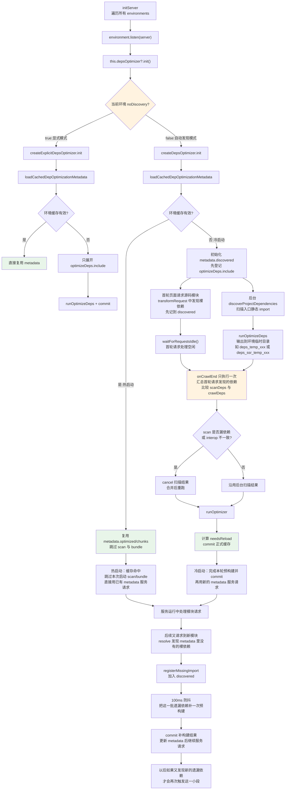
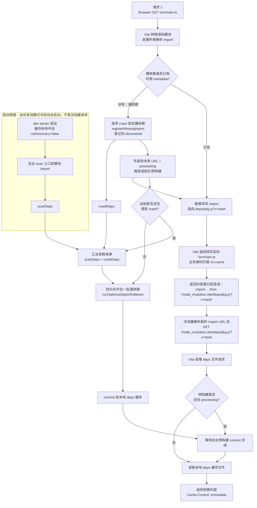
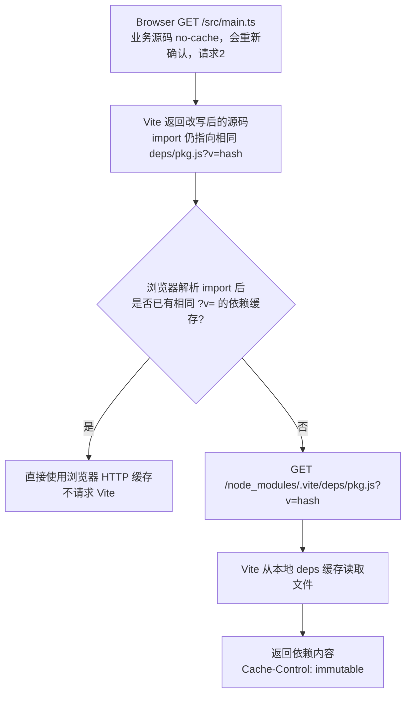

# 04 · 依赖预构建：触发时机 → 缓存机制 → Rolldown 预打包实现

> 本节调试目标：跟踪 Vite dev 启动时对 `node_modules` 依赖做的那次「预构建」。回答三件事：它在什么时机触发（冷启动扫描 vs 运行时发现）？缓存靠什么哈希决定是否复用、产物落在哪？底层用谁（Vite 8 已是 Rolldown）把依赖打成 ESM，CJS→ESM 互操作怎么处理？
>
> 源码基线：Vite 8.1.0。入口目录：`packages/vite/src/node/optimizer/`。本节是第一阶段 [05 依赖预构建（使用篇）](../../01-第一阶段-使用篇/01-核心使用/05-依赖预构建.md) 的实现版——使用篇讲「现象与配置」，这里讲「为什么是这样实现的」。

---

## 一、从插件装配到依赖预构建：中间发生了什么

上一篇仍停留在 `resolveConfig` 内部：Vite 已经得到最终配置，装配好顶层插件，并为 client、SSR 等环境算出各自的插件清单。但这时只是**配置准备完成**，dev server 尚未开始监听，依赖预构建也没有启动。

### 本篇调试入口

本篇继续使用前两篇的专用示例：

```text
playground/config-plugin-debug
```

不使用 `playground/html`，因为它的浏览器业务代码没有合适的裸 npm 依赖；配置文件中导入的 `vite`、`node:path` 属于配置加载阶段的 Node 依赖，不是业务依赖预构建的扫描目标。

专用示例现在声明了 `lodash` 依赖，并在 `main.js` 中静态导入：

```js
import cloneDeep from 'lodash/cloneDeep.js'
```

这是一个浏览器业务模块中的裸依赖导入。Vite 扫描 `index.html → main.js` 时会发现它，并把对应的 CommonJS 依赖预构建成浏览器可直接加载的 ESM 产物。

先在 Vite 源码仓库根目录进入示例：

```bash
cd playground/config-plugin-debug
```

第一次使用 `--force` 强制走冷启动路径：

```bash
pnpm dev -- --force
```

打开终端输出的页面地址，让浏览器请求 `index.html` 和 `main.js`。调试时重点观察 `lodash/cloneDeep.js` 如何进入 `metadata.discovered`，以及最终如何写入 `node_modules/.vite/deps/_metadata.json`。停止服务后去掉 `--force` 再启动：

```bash
pnpm dev
```

第二次启动用于观察缓存哈希命中后如何直接复用 metadata，跳过扫描和预打包。这两个命令正好对应下文的冷启动与热启动两条路径。

无论执行 `pnpm dev -- --force` 还是 `pnpm dev`，都会先经过同一条 dev server 启动主线；`--force` 只影响进入 `depsOptimizer.init()` 后是否复用旧缓存。下面先从上一篇结束的插件装配位置继续向后追踪，看看上述命令如何一步步走到依赖预构建入口：

```mermaid
flowchart TD
  A["CLI 调用 createServer"] --> B["_createServer"]
  B --> C["resolveConfig(inlineConfig, 'serve')"]
  C --> D["得到 ResolvedConfig<br/>配置、插件、环境选项均已定稿"]
  D --> E["创建 Connect 中间件、HTTP/WS 服务、文件监听器"]
  E --> F["遍历 ResolvedConfig.environments<br/>此时环境默认值和创建工厂已补齐"]
  F --> G["createEnvironment<br/>创建 client / SSR / 自定义环境"]
  G --> H["DevEnvironment 构造阶段<br/>初始化本环境 moduleGraph、HMR channel、请求状态<br/>并按条件创建 depsOptimizer"]
  H --> I["environment.init()<br/>创建该环境的 PluginContainer"]
  I --> I1["所有环境初始化完成<br/>创建 server 级 moduleGraph/pluginContainer 兼容门面<br/>底层仍指向各环境自己的实例"]
  I1 --> I2["注册 watcher change/add/unlink<br/>文件变化时更新模块图并触发 HMR"]
  I2 --> I3["挂载前置中间件<br/>计时、非法请求、CORS、Host 校验"]
  I3 --> I4["执行 configureServer hooks<br/>注册用户前置中间件并收集 post hooks"]
  I4 --> I5["挂载核心中间件<br/>缓存、proxy、base、public、transform、静态文件"]
  I5 --> I6["挂载收尾中间件<br/>HTML fallback、用户 post hooks、HTML 转换、404、error"]
  I6 --> I7["包装 httpServer.listen<br/>要求真正监听前先执行 initServer"]
  I7 --> J["_createServer 返回 ViteDevServer"]
  J --> K["CLI 调用 server.listen()"]
  K --> K1["server.listen → startServer"]
  K1 --> L["进入包装后的 httpServer.listen<br/>await initServer(true)"]
  L --> M{"是否为 bundled dev?"}
  M -- "否" --> M1["client.pluginContainer.buildStart()<br/>补齐 Rollup 启动生命周期"]
  M -- "是" --> M2["跳过 client buildStart"]
  M2 --> N["并行调用所有 environment.listen(server)"]
  M1 --> N["并行调用所有 environment.listen(server)"]
  N --> O["this.hot.listen()<br/>启动当前环境 HMR 通道"]
  O --> P["await Promise.all"]
  P --> P1["this.bundledDev?.listen()<br/>bundled dev 分支"]
  P --> P2["this.depsOptimizer?.init()<br/>普通 dev 依赖优化分支"]
  P2 --> Q["loadCachedDepOptimizationMetadata<br/>读取当前环境的 metadata"]
  Q --> R["缓存有效：直接复用"]
  Q --> S["缓存无效：登记 crawl 回调<br/>启动后台扫描"]
  S --> U["后台继续扫描与预构建<br/>并和真实模块请求协调"]
  R --> V["environment.listen 继续执行"]
  S --> V
  P1 --> V
  V --> W["warmupFiles<br/>按配置预热入口模块"]
  W --> T["initServer 完成<br/>HTTP Server 正式监听端口"]
```



沿源码逐步看，这条链路分为五段。

### 第 1 段：`resolveConfig` 返回最终配置

`createServer` 进入 `_createServer` 后，首先把用户传入的 `InlineConfig` 解析成 `ResolvedConfig`：

```ts
const config = isResolvedConfig(inlineConfig)
  ? inlineConfig
  : await resolveConfig(inlineConfig, 'serve')
```

上一篇讲解的插件过滤、排序、内置插件装配和环境插件清单计算，都发生在这次 `resolveConfig` 中。它返回以后，`_createServer` 才能依据最终的 `config.server`、`config.environments` 等配置搭建服务器。

### 第 2 段：创建服务器基础设施和各运行环境

`_createServer` 先创建 Connect 中间件容器、HTTP/HTTPS Server、WebSocket Server 和文件监听器，然后遍历 `config.environments`。这里的 `config` 已经是 `ResolvedConfig`，所以 `environmentOptions` 不是用户在 `vite.config` 中写下的原始对象，而是 Vite 归一化后的 `ResolvedEnvironmentOptions`。

需要先区分“环境配置”和“环境实例”：

```text
config.environments[name]     环境配置：描述叫什么、面向谁、如何解析和优化
environments[name]            环境实例：运行时真正持有模块图、插件容器等能力的对象
```

用户通常只声明环境及其行为，例如：

```ts
export default defineConfig({
  environments: {
    worker: {
      consumer: 'server',
      resolve: {
        conditions: ['worker'],
      },
    },
  },
})
```

在 dev 模式下，即使用户没有声明，Vite 也会先补齐默认的 `client` 和 `ssr` 环境。随后 `resolveEnvironmentOptions` 为每份环境配置合并默认值，并由 `resolveDevEnvironmentOptions` 补上创建运行时实例所需的工厂：

```ts
createEnvironment:
  environmentName === 'client'
    ? defaultCreateClientDevEnvironment
    : defaultCreateDevEnvironment
```

默认情况下，client 工厂创建带浏览器 HMR/WebSocket 能力的 `DevEnvironment`；SSR 和其它非 client 环境使用 `createRunnableDevEnvironment` 创建可在服务端运行模块的环境。用户只有在实现 Worker 等高级运行时时，才需要自己配置 `dev.createEnvironment` 覆盖默认工厂。

所以这里真正执行的是：

```text
用户 EnvironmentOptions
→ 补 client/ssr 与各项默认值
→ ResolvedEnvironmentOptions（已经具有 dev.createEnvironment）
→ 调用 createEnvironment 工厂
→ 得到 DevEnvironment / RunnableDevEnvironment 实例
```

源码接下来才会遍历这些已归一化的环境配置并创建实例：

```ts
await Promise.all(
  Object.entries(config.environments).map(async ([name, environmentOptions]) => {
    const environment = await environmentOptions.dev.createEnvironment(
      name,
      config,
      { ws },
    )
    environments[name] = environment
    await environment.init({ watcher, previousInstance })
  }),
)
```

这里通常会创建 client 和 SSR 两个环境，也可以包含用户定义的环境。调用 `createEnvironment` 构造 `DevEnvironment` 时，会先初始化该环境自己的 `moduleGraph`、HMR channel、请求状态，并按条件创建 `depsOptimizer`；随后 `environment.init()` 再根据该环境的插件清单创建 PluginContainer。

所有环境初始化完成后，`server/index.ts` 还会创建 `server.moduleGraph` 和 `server.pluginContainer`。这两个不是新的环境级数据，而是为了兼容旧 API 提供的 server 级门面，内部仍然转发到 client、SSR 等环境各自的模块图和插件容器。

因此每个环境都有自己的一组 `moduleGraph + pluginContainer + depsOptimizer`，预构建也不是全局单例能力，而是挂在具体环境上的能力。

`environment.init()` 此时只创建该环境的 PluginContainer，**不会启动依赖预构建**。这一步只是让环境具备后续执行 `resolveId`、`load`、`transform` 等 hook 的能力。

### 第 3 段：`server.listen()` 触发真正的启动流程

`_createServer` 返回 `ViteDevServer` 后，CLI 再调用 `server.listen()`。它经过 `startServer()` 最终调用底层 `httpServer.listen()`。Vite 提前包装了这个方法，要求真正监听端口前先完成 `initServer(true)`：

```ts
httpServer.listen = async (port, ...args) => {
  await initServer(true)
  return listen(port, ...args)
}
```

这解释了为什么创建出 server 对象不等于服务已经启动：`createServer()` 负责“搭好对象”，`server.listen()` 才进入“启动环境能力并监听端口”的阶段。

### 第 4 段：`initServer` 让每个环境开始监听

普通非 bundled dev 下，`initServer` 先为 client 环境触发一次兼容 Rollup 生命周期的 `buildStart`，再并行调用所有环境的 `listen()`：

```ts
await environments.client.pluginContainer.buildStart()
await Promise.all(
  Object.values(environments).map((environment) =>
    environment.listen(server),
  ),
)
```

`DevEnvironment.listen()` 才是依赖预构建真正接入启动链路的位置：

```ts
async listen(server) {
  this.hot.listen()
  await Promise.all([
    this.bundledDev?.listen(),
    this.depsOptimizer?.init(),
  ])
  warmupFiles(server, this)
}
```

它同时启动 HMR、bundled dev 或依赖优化器，完成初始化后再预热用户配置的文件。普通 dev 环境走 `depsOptimizer.init()`；如果环境禁用了依赖优化或改走 bundled dev，则可能没有这一步。

这里 `Promise.all` 等待的是 `depsOptimizer.init()` 完成**初始化**，不是等待全部依赖预构建结束。缓存命中时直接复用旧产物；缓存失效时，`init()` 启动后台扫描后就会返回，随后继续执行 `warmupFiles` 并监听端口，扫描和预打包则在后台继续。

### 第 5 段：生产预构建产物，再由插件消费

这里有两个容易混淆的角色：

- `depsOptimizer` 是**生产端和状态机**：读取缓存、发现依赖、调用 Rolldown 预打包、写入 metadata，并处理运行时新发现的依赖；
- 上一篇看到的 `optimizedDepsPlugin()` 是**请求消费端**：浏览器请求预构建文件时，它通过当前环境的 `depsOptimizer` 查找对应产物；如果产物仍在后台生成，还会等待对应的 processing promise。

所以衔接关系不是“插件数组装配完，`optimizedDepsPlugin` 立即开始预构建”，而是：

```text
resolveConfig 装配 optimizedDepsPlugin
→ _createServer 创建环境及 depsOptimizer
→ server.listen 启动环境
→ depsOptimizer.init 检查缓存并启动预构建状态机
→ 冷启动时在后台扫描、生产并提交预构建产物
→ 后续模块请求由 optimizedDepsPlugin 消费产物
```

到这里，上一篇的“配置与插件装配”才真正过渡到本篇的“依赖预构建状态机”。

---

## 二、optimizer 目录速览

预构建的核心逻辑集中在 `packages/vite/src/node/optimizer/`。前面调用链中的 `depsOptimizer.init()` 从这里进入真正的缓存判断、依赖发现与 Rolldown 打包流程，共涉及 6 个文件：

| 文件 | 职责 | 优先级 |
|---|---|---|
| `index.ts` | 核心 API：`runOptimizeDeps`、缓存读写、哈希、Rolldown 打包 | ⭐必读 |
| `optimizer.ts` | dev 运行时编排：`createDepsOptimizer`、`registerMissingImport`、`onCrawlEnd` | ⭐必读 |
| `scan.ts` | 入口发现 + Rolldown 实验性扫描 | ⭐必读 |
| `rolldownDepPlugin.ts` | 预打包用的 resolve/load 插件（取代了 Vite 5 的 `esbuildDepPlugin.ts`） | 📖选读 |
| `resolve.ts` | `optimizeDeps.include` 的 glob 展开 | 🟢先扫 |
| `pluginConverter.ts` | 旧 esbuild 插件 → Rolldown 适配层（兼容用） | 📖选读 |

> 一个版本提示：Vite 8 里**已经没有** `esbuildDepPlugin.ts`，预构建底层全面切到了 Rolldown。代码里残留的 `esbuild` 字眼多是历史注释。

---

## 三、亲手调试：冷启动 vs 热启动两条路

预构建没有统一写死成 `createDepsOptimizer(...).init()` 这一种入口。每个 `DevEnvironment` 构造时，如果当前环境启用了依赖优化，会根据自己的 `environment.config.optimizeDeps.noDiscovery` 选择 optimizer：

```text
noDiscovery = false → createDepsOptimizer          自动发现模式
noDiscovery = true  → createExplicitDepsOptimizer  显式 include 模式
```

随后 `initServer` 会遍历所有运行时 Environment 实例并调用各自的 `environment.listen(server)`；每个环境再通过 `this.depsOptimizer?.init()` 启动自己已经选好的 optimizer。这里的 `listen()` 属于各 Environment 实例，不是只调用某一个固定环境。

推荐按下面四处打断点：

- `server/environment.ts:210`：观察 `environment.name`、`optimizeDeps.noDiscovery`，确认选择了哪种 optimizer；
- `server/environment.ts:249`：观察每个环境进入自己的 `listen()`；
- `optimizer/optimizer.ts:171`：自动发现模式的 `init()`；
- `optimizer/optimizer.ts:879`：显式 include 模式的 `init()`。

自动发现模式在 `optimizer.ts:171` 读取缓存：命中就直接复用；未命中才启动 scan、请求 crawl 和后续批量预构建。显式模式则进入 `optimizeExplicitEnvironmentDeps`，只处理当前环境的 `optimizeDeps.include`。完整分流如下：



这里的 crawl 不是单纯“收集网络请求 URL”。浏览器请求源码模块后，会进入 `transformRequest`，然后按 Vite 已注册好的插件链执行 `resolveId → load → transform`，其中既包括用户配置的插件，也包括 Vite 内置插件。依赖发现主要发生在这条插件转换/解析链路里：`importAnalysis` 会分析源码里的 import，`resolve` 插件如果发现还没预构建过的裸依赖，就调用 `registerMissingImport` 把它登记到 `metadata.discovered`。`waitForRequestsIdle()` 只是用来判断这轮由请求触发的源码模块处理是否已经空闲。

图中的“跳过本次启动 scan/bundle”只发生在**热启动缓存命中**时。冷启动不会跳过：它会先走 `discoverProjectDependencies → runOptimizeDeps → commit`，生成新的 metadata 后再服务请求。服务启动后，如果自动发现模式下又遇到 metadata 中没有的新裸依赖，才继续走 `registerMissingImport → 防抖 runOptimizer → commit`。这个补构建过程是事件驱动的：发现一批新遗漏依赖就补一次，后面再发现新的，才会再补一次。

### 触发时机不在「创建服务」，而在「开始监听」

很多人以为预构建在 `createServer` 时就开始了，其实不是。`initServer` 会让每个环境分别进入自己的 `listen()`，再由可选的 `depsOptimizer` 启动对应模式：

文件：`packages/vite/src/node/server/environment.ts`（L249–253）

```ts
async listen(server) {
  this.hot.listen()
  await Promise.all([this.bundledDev?.listen(), this.depsOptimizer?.init()])
  warmupFiles(server, this)
}
```

自动发现模式的 `init()`（`optimizer.ts:171`）会读取缓存：哈希匹配就直接返回；否则注册 `onCrawlEnd` 并启动后台扫描。显式模式的 `init()`（`optimizer.ts:879`）则调用 `optimizeExplicitEnvironmentDeps`，只预构建 `include`。

---

## 四、缓存机制：什么决定「要不要重新预构建」

这是预构建里最值得搞懂的部分，因为它直接解释了使用篇里那些「为什么改了依赖不生效 / 为什么突然重新预构建了」。

### 不是“三层哈希”，而是两层职责

文件：`packages/vite/src/node/optimizer/index.ts`（L1402–1415）

```ts
function getDepHash(environment) {
  const lockfileHash = getLockfileHash(environment)   // 锁文件 + patches
  const configHash = getConfigHash(environment)       // 影响预构建的配置字段
  const hash = getHash(lockfileHash + configHash)
  return { lockfileHash, configHash, hash }
}
```

这不是三个并列的缓存判定哈希：

| 层 | 字段 | 作用 |
|---|---|---|
| 磁盘缓存复用层 | `lockfileHash`、`configHash`，以及二者合成的 `hash` | 启动时只有前两个字段参与 `_metadata.json` 复用判定；`hash` 作为当前预构建内容的基础指纹。 |
| 浏览器版本层 | `browserHash = hash(hash + deps + timestamp)` | 形成依赖 URL 的 `?v=`，让浏览器长期缓存，并在依赖集合/会话变化时切换版本。它不参与“磁盘缓存是否可复用”的 if 判断。 |

- **`lockfileHash`**：来自第一个匹配到的锁文件内容，并纳入对应 patches 目录的 mtime；
- **`configHash`**：覆盖影响优化结果的配置、环境消费端、插件名与 `optimizeDeps` 相关选项；
- **`fileHash`**：每个已优化入口还有一份产物稳定性指纹。重跑后旧依赖的 `fileHash` 变化，会参与 `needsReload`，但也不是启动缓存判定层。

### 缓存命中判定

启动时 `loadCachedDepOptimizationMetadata` 读 `_metadata.json`，逐一比对：

文件：`packages/vite/src/node/optimizer/index.ts`（L430–458）

```ts
if (cachedMetadata) {
  if (cachedMetadata.lockfileHash !== getLockfileHash(environment)) {
    environment.logger.info('Re-optimizing dependencies because lockfile has changed', { timestamp: true })
  } else if (cachedMetadata.configHash !== getConfigHash(environment)) {
    environment.logger.info('Re-optimizing dependencies because vite config has changed', { timestamp: true })
  } else {
    log?.(`(${environment.name}) Hash is consistent. Skipping. Use --force to override.`)
    return cachedMetadata     // ← 命中,直接复用
  }
}
```

终端里那句熟悉的 `Re-optimizing dependencies because lockfile has changed` 就出自这里。`--force` 则跳过这段判定强制重建。

### 产物与原子提交

client 产物目录默认 `node_modules/.vite/deps`，其它环境会追加名字，例如 SSR 是 `deps_ssr`。`runOptimizeDeps` 永远先写唯一的 `deps[_env]_temp_<hash>/`；成功后 `commit()` 先把 `_metadata.json` 写进临时目录，再执行“旧正式目录 → 备份临时名，新处理目录 → 正式目录”，最后后台删除旧目录。源码采用 rename-rename，而不是 delete-rename，尽量缩短正式目录不一致的窗口；Windows 则走带确认的 `safeRename`。

> 调试技巧：在 `index.ts:438` 断点，把 `cachedMetadata.lockfileHash` 和 `getLockfileHash(environment)` 都打出来对比，就能确切知道这次为什么重建（或为什么没重建）。

---

## 五、每个环境一套 optimizer：client 与 SSR 不共用状态

`DevEnvironment` 构造时（`server/environment.ts` L193–214）按本环境的 `optimizeDeps` 配置创建 optimizer；bundled environment 或显式禁用时不创建。缓存目录由 `getDepsCacheSuffix` 决定：

| 环境 | consumer / platform 默认值 | 缓存目录 | 典型启动时机 |
|---|---|---|---|
| `client` | `client` / `browser` | `cacheDir/deps` | dev server listen 时初始化 |
| `ssr` | `server` / `node`（SSR target 为 webworker 时是 browser） | `cacheDir/deps_ssr` | SSR 环境真正实例化并 listen / 被使用时初始化 |
| 自定义环境 | 由环境配置决定 | `cacheDir/deps_<environment.name>` | 对应环境生命周期内初始化 |

两套 optimizer 各自持有 `metadata`、`discovered`、`processing` promise、扫描和重跑队列。原因不是简单复制：浏览器与 Node 的 externalize、conditions、platform、interop 结果都可能不同，共用产物会把运行时语义混在一起。

---

## 六、两条发现依赖的路径

Vite 怎么知道要预构建哪些依赖？有两条路。

### 路径 1：冷启动扫描（scan.ts）

`discoverProjectDependencies` → `scanImports`（`scan.ts` L118–198）用 Rolldown 的实验性扫描器从入口（`optimizeDeps.entries` → `build.rolldownOptions.input` → 项目下的 `**/*.html`）爬一遍，把所有裸 import（`import x from 'lodash-es'` 里的 `lodash-es`）记录下来。

文件：`packages/vite/src/node/optimizer/scan.ts`（L5，扫描器来源）

```ts
import { scan } from 'rolldown/experimental'
```

### 路径 2：运行时发现（optimizer.ts）

扫描不可能 100% 覆盖（动态 import、只在某路由才加载的依赖等）。当一个请求实际 resolve 到一个还没预构建的 node_modules 依赖时，resolve 插件会调 `registerMissingImport`：

文件：`packages/vite/src/node/optimizer/optimizer.ts`（L644–681，已省略）

```ts
function registerMissingImport(id, resolved) {
  const optimized = metadata.optimized[id]
  if (optimized) return optimized
  // ...已知 chunk/discovered 直接返回...
  missing = addMissingDep(id, resolved)   // 标记 newDepsDiscovered = true
  if (!waitingForCrawlEnd) {
    debouncedProcessing()                 // 冷启动爬取未结束时不触发,避免抖动
  }
  return missing
}
```

这正是使用篇里「访问某个页面时卡一下 + 终端打印 new dependencies optimized + 页面刷新」的来源：运行时发现了新依赖，触发了一次防抖（100ms）后的重新预构建。

### 两条路的协调：holdUntilCrawlEnd

默认 `holdUntilCrawlEnd: true`。它的作用是：把扫描结果「扣住」，等静态 import 爬取（`onCrawlEnd`）确认没有遗漏的依赖后再一次性提交，避免「扫描发现一批 → 提交 → 爬取又发现一批 → 再提交」式的多次刷新。`onCrawlEnd`（`optimizer.ts` L725–845）会对比「扫描发现的」和「爬取发现的」，决定是直接用扫描结果还是补一轮。

这里的“crawl”不是 scan 的别名。每次非预构建模块进入 `doTransform` 后，`transformRequest.ts:235` 会调用 `_registerRequestProcessing(id, () => result)`；`setupOnCrawlEnd` 维护 `registeredIds/seenIds`，所有登记请求完成且连续 50ms 无新任务后，`waitForRequestsIdle()` 才 resolve。于是 optimizer 比较的是“静态扫描推测的依赖”和“浏览器/Runner 实际请求链走出来的依赖”。

---

## 七、底层打包：Rolldown + CJS/ESM 互操作

### 用 Rolldown 打包

文件：`packages/vite/src/node/optimizer/index.ts`（L890 附近，已省略）

```ts
const bundle = await rolldown({
  ...rolldownOptions,
  input: flatIdDeps,
  logLevel: 'silent',
  plugins,
  platform,
  transform: { target: ESBUILD_BASELINE_WIDELY_AVAILABLE_TARGET, ...rolldownOptions.transform, define },
  resolve: { extensions: ['.tsx', '.ts', '.jsx', '.js', '.css', '.json'], ...rolldownOptions.resolve },
})
// ...
return await bundle.write({
  format: 'esm', sourcemap: 'hidden', dir: processingCacheDir, entryFileNames: '[name].js',
})
```

每个依赖被打成一个（或少数几个）ESM 文件、`format: 'esm'`，这就兑现了使用篇说的两件事：**CJS/UMD → ESM 的格式归一**、**多文件 → 单文件的请求合并**。

### CJS→ESM 互操作怎么处理

CommonJS 包没有具名导出（只有一个 `module.exports`），但你常写 `import { debounce } from 'lodash'`。Vite 通过 `needsInterop` 标记 + import 改写解决：

1. 预打包时检测依赖是否需要 interop（无 ESM 语法、或导出对不上），结果记在 metadata 的 `needsInterop`；
2. dev 期 `importAnalysis` 插件在改写 import 时，对 `needsInterop === true` 的依赖调用 `interopNamedImports`，把 `import { debounce } from 'lodash'` 改写成「先默认导入再取属性」的形式。

例如源码里写的是：

```ts
import { debounce } from 'lodash'
```

dev 转换后大致会变成：

```ts
import __vite__cjsImport0_lodash from "/node_modules/.vite/deps/lodash.js?v=xxxx"
const debounce = __vite__cjsImport0_lodash["debounce"]
```

也就是浏览器层面不再要求 `lodash` 真的提供 ESM 具名导出，而是先拿到 CJS 包被预构建后的默认导出对象，再从对象上取 `debounce` 属性。

`optimizeDeps.exclude` 的依赖则交给 `rolldownCjsExternalPlugin` 处理：把被外部化的 CJS `require()` 包成 ESM import（`rolldownDepPlugin.ts` L376–430）。

---

## 八、请求侧如何消费：从裸导入到长缓存的闭环

这一节只画**浏览器看到的网络请求链路**，不重复前面冷启动状态机的全部细节。这里最容易误解的是：不是“同一个资源连续请求两次”，也不是 HTTP 重定向；第一次请求的是业务源码模块，Vite 返回“被改写过 import 的源码”。浏览器执行这份源码时，才会按新的 import URL 请求另一个资源，也就是预构建依赖文件。若这个依赖 URL 已经命中浏览器 HTTP 缓存，就不会再到 Vite 服务端。

### 首次加载：源码请求引出依赖资源请求



### 后续加载：依赖 URL 命中浏览器缓存



关键边界：

1. 这里的“两类请求”是两个不同资源：业务源码模块和预构建依赖文件；不是同一个资源被连续请求两次，也不是 HTTP 302/301 重定向。
2. 运行中最直观的触发点是“漏依赖”：请求 1 转换源码时，如果 `resolve` 发现 metadata 里没有这个裸依赖，就调用 `registerMissingImport` 登记到 `discovered`。
3. 如果还在首轮 crawl，漏依赖先等 `onCrawlEnd` 和 scanDeps 汇总；如果首轮 crawl 已结束，就走防抖，把这一批漏依赖补一次预构建。
4. 解析新裸依赖时会提前拿到未来文件路径，所以请求 1 可以先返回改写后的 URL。
5. 依赖资源请求才是真正读取依赖内容的地方；如果预构建还没 commit，`optimizedDepsPlugin.load` 会等待 `processing`，避免读半成品。
6. 缓存命中路径不会触发 Rolldown；只有发现 metadata 里没有的新依赖，或冷启动 scan 得到新依赖集合时，才会进入预构建。
7. 成功响应因带内容版本号，使用一年 `immutable`；业务源码仍是 `no-cache`。

`_metadata.json` 可以理解成“预构建缓存目录的目录索引”，它自己不是依赖代码，真正的产物还是 `deps/vue.js`、`deps/lodash.js` 这些文件。

磁盘上会保存的是**已经构建完成、下次启动可以复用**的信息：

| 字段 | 简单理解 |
|---|---|
| `lockfileHash/configHash/hash` | 这份缓存是基于哪份 lockfile 和 Vite 配置生成的，用来判断下次启动还能不能复用。 |
| `browserHash` | 写到依赖 URL 的版本号，也就是 `?v=xxx`，用来配合浏览器长期缓存。 |
| `optimized` | 已经预构建好的入口依赖清单，比如 `vue` 对应哪个文件、文件指纹是多少、是否需要 CJS interop。 |
| `chunks` | Rolldown 拆出来的共享 chunk 清单。 |

不会写进 `_metadata.json` 的是**本次 dev server 运行中的临时状态**：

| 字段 | 为什么不持久化 |
|---|---|
| `discovered` | 当前进程中新发现、等待本轮预构建处理的依赖队列。构建成功后，它们会变成正式的 `optimized`。 |
| `processing` | 当前 Node 进程里的 Promise，用来让依赖文件请求等待后台预构建完成。进程退出后 Promise 就不存在了，不能也不应该从磁盘恢复。 |

所以判断缓存时，只看已经落盘的正式结果；“正在发现中、正在构建中”的状态只服务当前这次 dev server。

还有一个小细节：`browserHash` 可以理解成这一批预构建依赖的“统一版本号”。写 `_metadata.json` 时，Vite 只存一份总版本号，不会给 `vue`、`lodash`、`react` 每个依赖都重复存一遍同样的值。下次启动读缓存时，再把这份总版本号补回每个依赖对象里，用来生成：

```text
/node_modules/.vite/deps/vue.js?v=同一个browserHash
/node_modules/.vite/deps/lodash.js?v=同一个browserHash
```

这样同一批预构建产物使用同一个浏览器缓存版本；版本号不变，浏览器就能继续复用缓存，版本号变了才会请求新文件。

---

## 九、关键函数与断点速查

| 函数 | 文件 | 行 | 作用 |
|---|---|---|---|
| `createDepsOptimizer` | `optimizer/optimizer.ts` | 40–766 | dev 运行时编排器 |
| `loadCachedDepOptimizationMetadata` | `optimizer/index.ts` | 397–472 | 读缓存、判定是否复用 |
| `discoverProjectDependencies` | `optimizer/index.ts` | 293–321 | 包装扫描 |
| `scanImports` | `optimizer/scan.ts` | 118–198 | Rolldown 扫描入口 |
| `runOptimizeDeps` | `optimizer/index.ts` | 531–982 | 跑 Rolldown 预打包 |
| `getDepHash` | `optimizer/index.ts` | 1402–1415 | 计算磁盘缓存基础 hash |
| `getOptimizedBrowserHash` | `optimizer/index.ts` | 1417–1423 | 计算浏览器 URL 版本 |
| `registerMissingImport` | `optimizer/optimizer.ts` | 644–681 | 运行时发现依赖 |
| `onCrawlEnd` | `optimizer/optimizer.ts` | 725–845 | 爬取结束后协调扫描/优化 |
| `optimizedDepsPlugin.load` | `plugins/optimizedDeps.ts` | 42–117 | 请求侧等待产物、校验版本并读文件 |

推荐断点：

| 推荐断点 | 核心函数 / 位置 | 函数主要作用 | 看什么 |
|---|---|---|---|
| `optimizer/optimizer.ts:171` | `createDepsOptimizer` → `init` | 预构建运行时编排器的启动入口，决定走缓存还是重新扫描/优化 | 热启动命中缓存 vs 冷启动分叉 |
| `optimizer/index.ts:438` | `loadCachedDepOptimizationMetadata` | 读取 `_metadata.json`，用 lockfile/config hash 判断缓存能不能复用 | lockfile/config 哈希比对结果，解释为什么重建 |
| `optimizer/index.ts:890` | `runOptimizeDeps` → `build` | 调用 Rolldown 把收集到的依赖预打包成浏览器可直接加载的 ESM | `flatIdDeps` 里有哪些依赖，Rolldown 真正怎么被调用 |
| `optimizer/index.ts:625` | `DepOptimizationResult.commit` | 把 metadata 写入临时目录，再 rename-rename 切换正式缓存 | `processingCacheDir/depsCacheDir/temporaryPath` 与目录切换顺序 |
| `optimizer/optimizer.ts:644` | `registerMissingImport` | 运行时发现未预构建依赖，登记到 `metadata.discovered` 并触发防抖重建 | `waitingForCrawlEnd` 与防抖逻辑 |
| `optimizer/optimizer.ts:725` | `onCrawlEnd` | 合并 scan 与真实请求 crawl 的发现结果 | `scanDeps/crawlDeps/scannerMissedDeps/outdatedResult` |
| `optimizer/optimizer.ts:453` | `createDepsOptimizer` → `runOptimizer` | 重新预构建完成后判断是否必须整页刷新 | 是否因为 interop/hash/fileHash 变化触发 full reload |
| `plugins/optimizedDeps.ts:52` | `optimizedDepsPlugin.load` | 请求侧解析 `?v=`、等待 processing 并防止旧版本读错文件 | `browserHash/info.processing/metadata !== newMetadata` |

---

## 十、常见误解、设计原因与调试技巧

### 常见误解

1. **“`optimizer.ts:453` 是预构建入口。”** 不是；入口断点在 `optimizer.ts:171`，453 已进入优化结果提交前的 reload 判定。
2. **“缓存由 lockfile/config/browser 三层并列哈希决定。”** 启动复用只比较 lockfile/config；browserHash 服务 URL 版本，fileHash 服务重跑兼容判定。
3. **“scan 完成就能立刻发布结果。”** 默认 `holdUntilCrawlEnd: true` 会等待真实请求 crawl，对不上时丢弃扫描结果并重跑。
4. **“client 和 SSR 共用 node_modules/.vite/deps。”** 它们有独立 optimizer 与目录，SSR 默认是 `deps_ssr`。
5. **“504 一定是服务器异常。”** outdated optimized dep 的 504 是 full reload 切版本时主动终止旧请求的正常路径；processing error 的 504 才会记错误日志。

### 为什么这样设计

- **扫描与真实 crawl 并行**：扫描争取快，真实请求纠偏，二者汇合比完全阻塞启动或频繁 reload 更稳定；
- **临时目录 + 原子切换**：读者只看到完整旧版本或完整新版本，不会看到半份 JS 与半份 metadata；
- **磁盘身份与浏览器版本分层**：磁盘缓存可跨启动复用，浏览器 URL 又能针对运行时新依赖精细换代；
- **环境级 optimizer**：browser/node 的解析和 externalize 语义隔离；
- **processing promise**：可以提前把未来 URL 写进模块代码，又不会在产物落盘前竞态读取。

### 调试变量

- 冷/热启动对比：`cachedMetadata`、`metadata.optimized`、`waitingForCrawlEnd`；
- hash 定位：`cachedMetadata.lockfileHash/configHash` 对比实时计算值；
- crawl 协作：`registeredIds/seenIds`、`scanDeps/crawlDeps`；
- 重跑刷新：`needsInteropMismatch`、旧/新 `metadata.hash`、每个依赖的 `fileHash`；
- 原子提交：`processingCacheDir`、`depsCacheDir`、`temporaryPath`；
- 请求消费：Network 中的 `?v=`，以及 `optimizedDepsPlugin.load` 的 `info.processing/browserHash`。

---

## 十一、本节小结

**这段实现解决了什么问题？**
它解决了「浏览器原生 ESM 直跑业务代码，但海量第三方依赖是 CJS、且包内文件碎」的矛盾：用 Rolldown 把依赖预打包成单文件 ESM（格式归一 + 请求合并），把磁盘缓存身份与浏览器 URL 版本分层，用「冷启动扫描 + 运行时发现 + holdUntilCrawlEnd 协调」兼顾首屏速度与发现完整性，并通过 processing promise 与原子提交把请求消费闭合起来。

**它带来了什么复杂度 / 代价？**
代价是一套相当复杂的状态机：扫描与运行时发现两条路要协调、防抖与 crawl-end 要配合、缓存哈希要覆盖所有影响因素否则会「该重建没重建」。它也引入了一次性的启动成本（首次预打包）和「改 node_modules 源码被缓存挡住」这类反直觉现象——本质是「用一次预处理换 dev 期成百上千次请求的流畅」这个取舍的副作用。

**读完你应当能做到：**

- [ ] 解释预构建的触发时机（环境 `listen()` 时 `init()`，而非建服务时）；
- [ ] 说清磁盘缓存 hash 与 browserHash 的职责分层，并知道 fileHash 只参与重跑稳定性判断；
- [ ] 区分冷启动扫描与运行时发现两条依赖发现路径，理解 `holdUntilCrawlEnd` 为什么存在；
- [ ] 解释 client/SSR 为什么拥有两套 optimizer、metadata 和缓存目录；
- [ ] 从裸导入改写一路追到 `optimizedDepsPlugin.load → processing → immutable`，讲清请求侧消费闭环；
- [ ] 在 `index.ts:438` 断点定位「为什么这次重新预构建了」。

下一节进入 dev 期的主干流程——[05-按需编译与devserver请求处理流程.md](./05-按需编译与devserver请求处理流程.md)，跟一个模块请求从进入到返回，串起 `resolveId → load → transform`。
