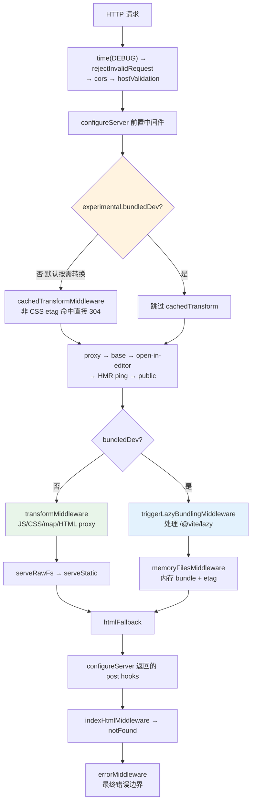
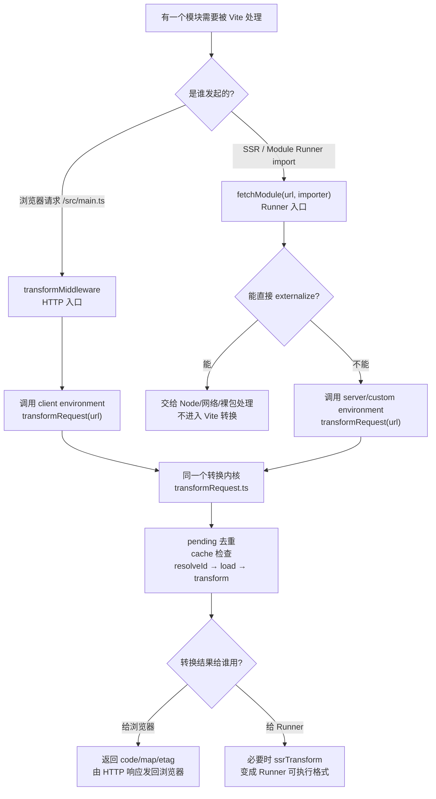
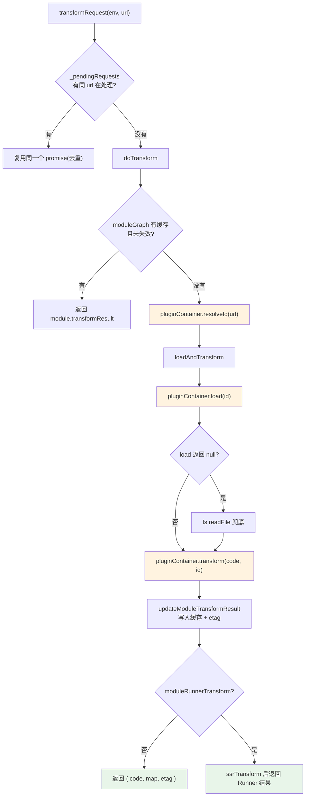

# 05 · 按需编译与 dev server 请求处理流程：跟一个模块请求走完全程

> 本节调试目标：跟踪一次浏览器对单个模块（比如 `/src/main.ts`）的 HTTP 请求，从进入 dev server 中间件，到经过 `resolveId → load → transform`，再到把转换结果发回浏览器的**完整链路**。这是 Vite「dev 不打包、按需编译」的心脏——理解它，HMR、模块图、转换链路才有落脚点。
>
> 源码基线：Vite 8.1.0。核心入口：`packages/vite/src/node/server/transformRequest.ts`。

---

## 一、什么是「按需编译」

承接 [04-依赖预构建.md](./04-依赖预构建.md)：上一篇的 optimizer 会等待“首轮静态 import 请求 crawl 结束”，并把预构建依赖 URL 改写为带 `?v=` 的长期缓存地址。本篇从这些请求如何进入 dev server 开始，解释谁登记 crawl、谁消费预构建结果，以及普通按需转换与实验性 bundled dev 在哪里分叉。

webpack 时代，dev server 启动时要先把整个依赖图打包一遍，项目越大启动越慢。Vite 反过来：启动时几乎不编译业务代码，而是把每个模块的编译**推迟到浏览器真正请求它的那一刻**。浏览器按 ESM 规范，遇到 `import './foo'` 就发一个 HTTP 请求，Vite 收到请求才现编译这一个模块、返回浏览器能跑的代码。

所以在默认 dev 模式下，「按需编译」的本质是：**一个模块请求 = 一次可缓存的 resolve + load + transform**。但这不只来自浏览器 HTTP：Module Runner / SSR 的 `fetchModule` 也会复用同一条 `environment.transformRequest` 内核；而 `experimental.bundledDev` 会绕开这条逐模块 HTTP 转换路径，改走惰性 bundling 与内存文件。

本篇主线只跟浏览器请求 `/src/main.ts` 这一类 HTTP 模块请求。先按“这一段负责什么”建立直觉，再到对应源码位置打断点：

| 推荐断点 | 核心函数 / 位置 | 函数主要作用 | 看什么 |
|---|---|---|---|
| `server/index.ts:1022` / `server/index.ts:1066` | `_createServer` → Internal middlewares | 按顺序注册 dev server 的内部中间件，并在默认按需转换与 `experimental.bundledDev` 之间分叉 | 默认模式会先装 `cachedTransformMiddleware`，再装 `transformMiddleware/serveRawFs/serveStatic`；bundled dev 会改装 `triggerLazyBundlingMiddleware/memoryFilesMiddleware` |
| `middlewares/transform.ts:293` | `transformMiddleware` → `environment.transformRequest(url)` | 浏览器模块请求的 HTTP 入口，识别 JS/CSS/import/HTML proxy 请求后，把真正的转换交给当前 client environment | `/src/main.ts` 这类 URL 如何被清理、区分 CSS direct/import，并进入统一的 transformRequest 管线 |
| `transformRequest.ts:109` | `transformRequest` → `_pendingRequests` | 给同一 URL 的并发转换做 Promise 去重，并处理“转换过程中模块被失效”后的重跑 | pending 请求存在时，如何比较 `pending.timestamp` 和 `module.lastInvalidationTimestamp` 决定复用还是 abort 后重跑 |
| `transformRequest.ts:192` | `doTransform` → `pluginContainer.resolveId` | 把浏览器 URL 解析成 Vite 内部模块 id，为后续 load/transform 建立准确身份 | URL 缓存没命中时如何调用插件 `resolveId`，以及解析后的 `id` 如何关联到 moduleGraph |
| `transformRequest.ts:235` | `doTransform` → `_registerRequestProcessing` | 把普通源码模块登记为“正在处理的请求”，供依赖 optimizer 判断首轮静态 import crawl 是否结束 | 预构建依赖文件会被排除，普通模块的 `loadAndTransform` Promise 会进入 idle 统计 |
| `transformRequest.ts:307` | `loadAndTransform` → `pluginContainer.load` | 进入 load 阶段，先让插件虚拟加载模块；插件都不处理时，再按文件路径读磁盘源码 | 第一个非空 `load` 结果如何胜出，`loadResult == null` 时如何回退到 `fsp.readFile` |
| `transformRequest.ts:419` | `loadAndTransform` → `pluginContainer.transform` | 进入 transform 阶段，让插件链串行改写 code/map，产出浏览器可执行代码 | 每个插件如何接收上一轮 code，最终的 `transformResult.code/map` 如何写回响应和模块缓存 |
| `middlewares/transform.ts:309` | `transformMiddleware` → optimize deps error branches | 处理转换过程中依赖预构建相关的特殊错误，把不同 optimizer 状态转换成对应 HTTP 响应 | `ERR_OPTIMIZE_DEPS_PROCESSING_ERROR`、`ERR_OUTDATED_OPTIMIZED_DEP`、`ERR_CLOSED_SERVER` 等分支分别如何响应 |
| `send.ts:54` | `send` → etag/cache/sourcemap | dev 响应的最后出口，统一设置 Content-Type、Cache-Control、Etag，并追加 sourcemap | 最后一层 `If-None-Match` 如何返回 304，预构建依赖和业务模块的缓存头如何不同 |

---

## 二、中间件全景：请求先经过谁

`_createServer` 用 Connect 按注册顺序串起中间件（`server/index.ts` L965–1103）。顺序本身就是路由优先级，不能只摘出 `transformMiddleware` 看：



| 中间件组 | 作用与顺序意义 |
|---|---|
| 安全与协议层 | 非法请求、CORS、Host 校验最先执行，避免后续文件/代理逻辑处理危险输入。 |
| `configureServer` 前置 | 插件可以在 Vite 内部处理中间件之前直接消费请求；返回的 post hook 则延后到 HTML fallback 之后、index HTML 之前。 |
| `cachedTransformMiddleware` | 仅默认模式安装；非 CSS 带 `If-None-Match` 命中时直接 304。 |
| proxy / base | 代理优先于源码转换，base 在后续中间件前统一剥离/重定向路径。 |
| open-editor / HMR ping / public | 内部控制请求和 public 原样资源在 transform 前被消费。 |
| transform + rawFs + static | 默认模式的模块编译和静态文件兜底。 |
| lazy bundling + memory files | bundled dev 的替代路径，不安装逐模块 transform/static 三件套。 |
| HTML fallback / post hooks / index HTML / 404 / error | 最后处理页面导航、用户后置响应、HTML 转换与统一错误。 |

`transformMiddleware` 本身更像一个「模块请求分流器」：它先过滤掉不属于模块转换的请求；遇到 sourcemap 请求时走单独的 map 返回逻辑；遇到 JS、CSS、`?import`、HTML proxy 这类模块请求时，才继续清理 URL、区分直接 CSS 与被 import 的 CSS，最后把活交给统一的 `transformRequest`。它从不直接调用插件容器——一律通过 `environment.transformRequest(url)`。这一点和第 10 节的 Environment API 是对上的：请求进入中间件后，真正干活的是当前环境，而不是一个全局 server。

源码里这条链路的注释已经把几个关键边界标出来了：`middlewares/transform.ts:293` 说明这里是“中间件 → 转换管线”的交接点；`transformRequest.ts:109` 解释 `_pendingRequests` 为什么要同时处理并发去重和失效后的重跑；`transformRequest.ts:413` 强调只有成功 load 的模块才进模块图，避免不存在或被拒绝访问的请求污染状态。带着这些注释看下面的代码，会更容易理解为什么这条路径里到处都是缓存和失效判断。

文件：`packages/vite/src/node/server/middlewares/transform.ts`（L293–305）

```ts
// resolve, load and transform using the plugin container
const result = await environment.transformRequest(url)
if (result) {
  const isDep = DEP_VERSION_RE.test(url) || depsOptimizer?.isOptimizedDepUrl(url)
  return send(req, res, result.code, type, {
    etag: result.etag,
    cacheControl: isDep ? 'max-age=31536000,immutable' : 'no-cache',  // 预构建依赖可长缓存
    headers: server.config.server.headers,
    map: result.map,
  })
}
```

注意这里对「预构建依赖」用了 `immutable` 长缓存（它们带 `?v=` 版本号），对业务模块用 `no-cache`——这正是 [04-依赖预构建.md](./04-依赖预构建.md) 里 `?v=` 的消费端。

---

## 三、补充：谁还会触发 `transformRequest`

如果你只想跟完本篇的浏览器请求主线，可以先跳过这一节。这里作为补充只说明一件事：**Vite 的按需编译不只服务浏览器 HTTP 请求，也服务 SSR / Module Runner；它们入口不同，但最终会汇入同一个 `transformRequest` 转换内核。**

先不要急着记 `DevEnvironment` 这些内部名字，可以先看两类模块请求入口，再看它们共同汇入的转换内核：

| 场景 | 入口源码 | 这一步做什么 |
|---|---|---|
| 浏览器请求模块 | `middlewares/transform.ts:293` | 浏览器请求 `/src/main.ts`、`.vue`、`.css` 等文件时，HTTP 中间件把 URL 交给 `environment.transformRequest(url)` 编译。 |
| SSR / Module Runner 请求模块 | `ssr/fetchModule.ts` | Runner 需要执行某个模块时，先判断能不能 externalize；不能外部化的模块，也交给 `environment.transformRequest(url)` 编译。 |
| 共享转换内核 | `transformRequest.ts:109` / `transformRequest.ts:192` / `transformRequest.ts:307` / `transformRequest.ts:419` | 真正完成去重、缓存、`resolveId`、`load`、`transform` 的地方。 |

流程可以这样看：



所以这里的关键不是“有几个入口”，而是要纠正一个常见误解：**SSR 不经过浏览器 HTTP 中间件，但它仍然会复用 Vite 的 `transformRequest`。** 只有 builtin、网络 URL、满足 externalize 条件的裸包会提前返回，不进入这条转换链路。

---

## 四、亲手调试：transformRequest 全链路

在 `transformRequest.ts:78`（`transformRequest`）、`transformRequest.ts:157`（`doTransform`）、`transformRequest.ts:269`（`loadAndTransform`）各打一个断点，刷新浏览器，跟着调用栈走一遍。整条链路是：



### 第 1 步：去重（_pendingRequests）

同一个模块可能被多个 import 同时请求。`transformRequest` 用 `_pendingRequests` 保证同一 url 只跑一次转换，并发请求共享同一个 promise：

文件：`packages/vite/src/node/server/transformRequest.ts`（L109–154，已省略）

```ts
const pending = environment._pendingRequests.get(url)
if (pending) {
  return environment.moduleGraph.getModuleByUrl(url).then((module) => {
    if (!module || pending.timestamp > module.lastInvalidationTimestamp) {
      return pending.request          // 复用进行中的转换
    } else {
      pending.abort()                 // 期间模块失效了,中止并重转
      return transformRequest(environment, url, options)
    }
  })
}
```

### 第 2 步：缓存检查（doTransform）

文件：`packages/vite/src/node/server/transformRequest.ts`（L157–238）

```ts
async function doTransform(environment, url, options, timestamp) {
  const { pluginContainer } = environment
  let module = await environment.moduleGraph.getModuleByUrl(url)
  if (module) {
    const cached = await getCachedTransformResult(environment, url, module, timestamp)
    if (cached) return cached        // 命中内存缓存,直接返回
  }
  const resolved = module
    ? undefined
    : ((await pluginContainer.resolveId(url, undefined)) ?? undefined)  // resolve
  const id = module?.id ?? resolved?.id ?? url
  // ...再按 id 查一次缓存...
  const result = loadAndTransform(environment, id, url, options, timestamp, module, resolved)
  // ...登记到「请求处理中」用于预构建 crawl-end 判定...
  return result
}
```

这里就是 `resolveId` 的调用点：把浏览器请求的 url（如 `/src/main.ts` 或裸 import `lodash`）解析成磁盘上的真实 `id`。

紧接着 `transformRequest.ts:235` 有一条容易忽略但非常关键的支线：

```ts
if (!depsOptimizer?.isOptimizedDepFile(id)) {
  environment._registerRequestProcessing(id, () => result)
}
```

这里先分清两类请求，逻辑就不冲突了：**普通源码模块请求会登记，预构建产物请求不会登记。** 浏览器请求 `/src/main.ts`、`/src/App.vue` 这类源码模块时，Vite 会把当前 `id` 放进一个“正在处理的源码模块清单”；等这个模块的 `loadAndTransform` 跑完，再从清单里划掉。划掉的目的，是告诉 optimizer：“这个源码模块已经处理完了，它在转换过程中可能发现的新 import 也已经有机会发起后续请求。”只有清单清空，并且 50ms 内没有新的源码模块加入，optimizer 才认为“这一轮浏览器静态 import 触发的源码请求基本结束”，于是继续执行 `onCrawlEnd`。如果不划掉，optimizer 会一直等；如果太早划掉，又可能在模块还没完成 import analysis 时误判 crawl 结束。而 `/node_modules/.vite/deps/...` 这类预构建产物是 optimizer 已经生成出来的结果，不是继续发现依赖的源码入口，所以一开始就不会被放进这个清单。

### 第 3 步：load + transform（loadAndTransform）

文件：`packages/vite/src/node/server/transformRequest.ts`（L303–419，已省略）

```ts
// load
const loadResult = await pluginContainer.load(id)
let code, map
if (loadResult == null) {
  // 没有插件 load,回退读文件系统
  code = await fsp.readFile(file, 'utf-8')
} else { /* 用插件 load 的结果 */ }

// transform
const transformResult = await pluginContainer.transform(code, id, { inMap: map, moduleType })
```

`resolveId / load / transform` 三个动作都委托给 PluginContainer，由它驱动所有插件——这正是下一节 [07-插件容器PluginContainer.md](./07-插件容器PluginContainer.md) 的主题。它们的语义差异（resolveId/load 是「第一个非空胜出」，transform 是「依次链式」）也在那一节细讲。

### 第 4 步：按环境收尾、写缓存并发送

转换结果通过 `moduleGraph.updateModuleTransformResult` 缓存进模块图（并登记 etag，用于下次 304），再由 `send` 写回浏览器：

文件：`packages/vite/src/node/server/moduleGraph.ts`（L469 附近）

```ts
updateModuleTransformResult(mod, result) {
  if (this.environment === 'client') {
    const prevEtag = mod.transformResult?.etag
    if (prevEtag) this.etagToModuleMap.delete(prevEtag)
    if (result?.etag) this.etagToModuleMap.set(result.etag, mod)
  }
  mod.transformResult = result
}
```

`send`（`server/send.ts`）发送前还会再做一次 etag 304 兜底，并把 sourcemap 注入到响应里。

server consumer 的 `dev.moduleRunnerTransform` 默认是 `true`（`config.ts` L909–927），所以 `loadAndTransform` 在插件 transform 后还会调用 `ssrTransform`；client 则生成 weak etag。两者都只在 `timestamp > mod.lastInvalidationTimestamp` 时写缓存，防止转换期间发生 HMR/full reload 后，旧请求把过期结果覆盖回来。

---

## 五、优化依赖错误为什么单独处理

前面的主线还是正常的“请求进入 `transformMiddleware` → 调用 `environment.transformRequest(url)`”。但是 `transformRequest` 过程中可能碰到 optimizer 的状态变化，比如依赖还在 processing、当前 `?v=` 已经过期、server 正在重启。此时这些信号会先被抛回 `transformMiddleware` 的 `catch` 分支，**由 `transformMiddleware` 当场转译成明确的 HTTP 结果**，而不是继续丢给最后的通用 `errorMiddleware`：

| 错误码 | HTTP | 是否记录 | 含义 |
|---|---:|---|---|
| `ERR_OPTIMIZE_DEPS_PROCESSING_ERROR` | 504 | error | 等待预构建 processing 失败，属于异常。 |
| `ERR_OUTDATED_OPTIMIZED_DEP` | 504 | 不记录 | 当前 `?v=` 已过期，full reload 会请求新版本，是正常切换。 |
| `ERR_CLOSED_SERVER` | 504 | 不记录 | server 重启/关闭期间的旧请求，不应继续返回旧结果。 |
| `ERR_FILE_NOT_FOUND_IN_OPTIMIZED_DEP_DIR` | 404 | warn | metadata 指向的优化文件不存在，可能是不兼容依赖。 |
| `ERR_LOAD_URL` | `next()` | 不在此处响应 | 转换链无法加载，让 static/HTML/其它中间件继续尝试。 |
| `ERR_DENIED_ID` | 403/`next()` | 由访问检查决定 | 再做一次文件服务白名单判断，避免泄露任意磁盘文件。 |

504 在这里不是“网关超时”的字面网络故障，而是让浏览器停止消费旧依赖请求的协议选择。把 outdated 当普通异常打印，会在每次发现新依赖时制造虚假红色错误。

---

## 六、五层缓存：为什么 Vite dev 第二次访问很快

把上面串起来，会发现 Vite 在一条请求路径上叠了**五层缓存/短路**，这是 dev 流畅的关键：

| 层 | 位置 | 短路效果 |
|---|---|---|
| 1. HTTP 304（转换前） | `cachedTransformMiddleware` L88–109 | 浏览器带 etag 命中 → 不进转换，直接 304 |
| 2. CSS 专用 304 | `transform.ts` L274–286 | 直接/被 import 的 CSS etag 可能相同，单独判定 |
| 3. 并发去重 | `transformRequest.ts` L109–154 | 同 url 并发请求共享一个转换 promise |
| 4. 内存转换缓存 | `transformRequest.ts` L241–267 | `module.transformResult` 未失效则直接返回 |
| 5. 发送前 304 | `send.ts` L54–58 | 兜底再判一次 etag |

第 4 层还和 HMR 的「软失效」联动：当一个模块只是因为依赖改了 import 时间戳而需要更新，`handleModuleSoftInvalidation`（`transformRequest.ts` L531–619）只用 MagicString 改写 import 上的 `?t=` 时间戳，**不重新解析/转换整个模块体**。这条优化的细节在 [08-HMR实现原理.md](./08-HMR实现原理.md) 展开。

五层不是重复防御，而是处理五种不同成本和竞态：

1. **转换前 304** 最便宜，连 Promise 和模块图查询主线都不进入；
2. **CSS 专用 304** 隔离同一 CSS 的 direct 与 import 两种响应形态，避免混用 etag；
3. **并发 Promise 去重** 解决首访瀑布中同 URL 同时到达，此时浏览器还没有可用 etag；
4. **内存 transformResult** 服务不同请求/入口对同一模块的复用，并接受 HMR 精确失效；
5. **发送前 304** 覆盖没被前置中间件短路、但转换结果最终仍与客户端一致的路径。

再叠加 `timestamp > lastInvalidationTimestamp` 的写入门槛，缓存不仅追求快，还必须保证“旧工作永远不能覆盖新状态”。

---

## 七、experimental.bundledDev：同一服务器里的另一条路

当 `experimental.bundledDev` 开启，client `DevEnvironment` 在构造时创建 `BundledDev` 并禁用 deps optimizer（`server/environment.ts` L130–136）。中间件层随之发生结构性替换：

- 不安装 `cachedTransformMiddleware`、`transformMiddleware`、`serveRawFsMiddleware`、`serveStaticMiddleware`；
- `/@vite/lazy?id=...&clientId=...` 由 `triggerLazyBundlingMiddleware` 调 `bundledDev.triggerLazyBundling`；
- bundle 输出保存在 `memoryFiles`，由 `memoryFilesMiddleware` 直接响应，并在该层处理 etag 304；
- HTML fallback/index HTML 仍保留，因此页面入口与内存 bundle 能在同一 Connect 服务中协作。

这条实验路径的“按需”粒度是惰性 bundle/chunk，而不是默认模式的单模块 `resolve → load → transform → send`。调试时如果发现 `middlewares/transform.ts:293` 永远不命中，先看 `config.experimental.bundledDev`，不要误判成路由坏了。

---

## 八、核心函数与断点速查

| 函数 | 文件 | 行 |
|---|---|---|
| `transformMiddleware` | `server/middlewares/transform.ts` | 115–384 |
| `transformRequest` | `server/transformRequest.ts` | 78–154 |
| `doTransform` | `server/transformRequest.ts` | 157–238 |
| `getCachedTransformResult` | `server/transformRequest.ts` | 241–267 |
| `loadAndTransform` | `server/transformRequest.ts` | 269–519 |
| `send` | `server/send.ts` | 32–107 |
| `setupOnCrawlEnd` | `server/environment.ts` | 416–478 |
| `triggerLazyBundlingMiddleware` | `server/middlewares/triggerLazyBundling.ts` | 4–37 |
| `memoryFilesMiddleware` | `server/middlewares/memoryFiles.ts` | 6–54 |

推荐断点（按链路顺序）：

| 推荐断点 | 核心函数 / 位置 | 函数主要作用 | 看什么 |
|---|---|---|---|
| `middlewares/transform.ts:293` | `transformMiddleware` | dev server 处理模块请求的中间件入口，把 URL 交给当前环境编译 | 从中间件进入 `transformRequest` 的交接点 |
| `transformRequest.ts:192` | `doTransform` → `pluginContainer.resolveId` | 把浏览器请求 URL 解析成模块 id / 磁盘文件路径 | 第一次 `resolveId`，看 url→id 解析 |
| `transformRequest.ts:235` | `_registerRequestProcessing` | 把非预构建模块转换纳入首轮请求 crawl 统计 | `id/result` 如何连接到 optimizer 的 crawl-end |
| `transformRequest.ts:307` | `loadAndTransform` → `pluginContainer.load` | 先让插件加载模块内容，没人处理再回退到 `fs.readFile` | 第一个对模块内容动手的钩子 |
| `transformRequest.ts:419` | `loadAndTransform` → `pluginContainer.transform` | 串行运行所有 `transform` 钩子，把源码改成浏览器可执行模块 | 进入转换链路，观察 code 如何变化 |
| `middlewares/transform.ts:309` | optimizer 错误分派 | 把预构建状态机错误映射成 504/404/next | 区分正常 outdated 与真正 processing error |
| `send.ts:54` | `send` | 设置响应头、处理最后一层 etag 304，并按需注入 sourcemap | 最后的 etag 304 与 sourcemap 注入，整条链路出口 |

---

## 九、常见误解、设计原因与调试技巧

### 常见误解

1. **“所有请求都会进 transformMiddleware。”** proxy、public、控制请求会提前消费；HTML/静态资源也可能向后落；bundled dev 更是完全不安装它。
2. **“一条 HTTP 请求必然做一次完整转换。”** 五层短路可能在中间件、并发 Promise、模块图或发送阶段返回。
3. **“SSR 有独立编译器，不走这条链。”** SSR/Runner 有独立环境和收尾格式，但内部模块仍复用 `environment.transformRequest`。
4. **“waitForRequestsIdle 是网络连接空闲。”** 它只统计登记过的模块转换 Promise，并用 50ms 静默窗口判定 crawl end。
5. **“optimizer 的 504 都是错误。”** outdated/closed 是版本切换控制流，processing failure 才是异常。
6. **“bundledDev 只是多一个中间件。”** 它替换默认 client 请求管线并禁用 deps optimizer，执行模型不同。

### 为什么这样设计

- Connect 的有序中间件让安全、代理、静态资源、模块转换和 HTML 各守边界，插件还能插入前置/后置处理；
- HTTP 与 Module Runner 共享转换内核，避免 client/server 两套 resolve/load/transform 行为漂移，同时保留环境级插件和输出格式；
- 请求 crawl 直接复用真实 transform Promise，比单独再爬一份模块图更准确；
- optimizer 错误专门映射，能把“旧版本主动退场”与“服务异常”区分开；
- 多层缓存按成本从低到高短路，同时用 invalidation timestamp 防止竞态污染。

### 调试变量与技巧

- 中间件装配：`config.experimental.bundledDev`、`postHooks`；
- HTTP 路由：`req.url/method/sec-fetch-dest/accept/if-none-match`；
- 双入口：对比 client 与 ssr environment 的 `name/consumer/moduleRunnerTransform`；
- 请求核心：`url → resolved.id → code → transformResult`，以及 `_pendingRequests`；
- crawl 协作：`depsOptimizer.isOptimizedDepFile(id)`、`registeredIds/seenIds`；
- 缓存安全：`timestamp` 与 `mod.lastInvalidationTimestamp`；
- 优化依赖错误：`e.code`、`res.statusCode/statusMessage`；
- bundled dev：`moduleId/clientId` 与 `memoryFiles` 中命中的 `filePath/etag`。

---

## 十、本节小结

**这段实现解决了什么问题？**
它实现了 Vite 默认 dev 的核心能力——把模块转换推迟到浏览器或 Module Runner 真正请求时，由环境复用 `resolveId → load → transform` 内核；HTTP 入口负责路由与缓存协议，Runner 入口负责 externalize 与执行格式。五层缓存降低重复成本，请求登记又与预构建 crawl-end 闭合；实验性 bundled dev 则在同一服务器中提供另一套惰性 bundle 路径。

**它带来了什么复杂度 / 代价？**
按需编译把「一次性打包的复杂度」换成了「请求期的状态管理复杂度」：并发去重、缓存失效时机、软/硬失效、与预构建 crawl-end 的联动，都集中在这条请求路径上。任何一处缓存判定写错，就会表现为「改了没生效」或「明明没改却重转」。dev 行为也因此与 build（一次性整体打包）存在天然差异——这也是 [12-preview-server边界.md](./12-preview-server边界.md) 要强调「dev/preview 都不能替代真实生产验证」的根源之一。

**读完你应当能做到：**

- [ ] 说清一次模块请求的完整链路：中间件 → `transformRequest` → `doTransform` → `loadAndTransform` → `resolveId/load/transform` → send；
- [ ] 解释默认模式下为什么一个模块请求会对应一条可缓存的 `resolve → load → transform` 管线；
- [ ] 按源码顺序列出完整中间件，并指出普通模式与 bundled dev 的分叉；
- [ ] 区分 HTTP 与 Module Runner 两个入口，说明它们如何共享转换内核；
- [ ] 解释 `transformRequest.ts:235` 如何把请求 crawl 与 optimizer 的 `onCrawlEnd` 接起来；
- [ ] 数得出请求路径上的五层缓存，并解释每层针对的成本/竞态不同；
- [ ] 区分 optimized dep 的 processing/outdated/missing 错误响应；
- [ ] 在 `transformRequest.ts` 的几个断点处，亲眼看到 url→id→code 的演变。

下一节深入 `transform` 这一步内部，看 [06-核心转换链路.md](./06-核心转换链路.md)——import analysis、CSS、asset、sourcemap 这些内置插件是怎么协作把源码改写成浏览器可跑代码的。
