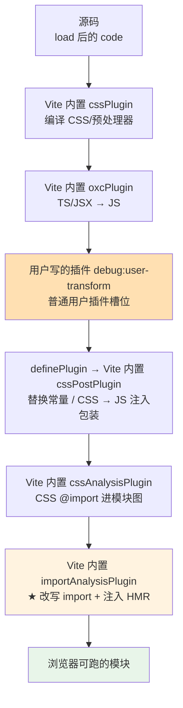

# 06 · 核心转换链路：import analysis、CSS、asset 与 sourcemap 的协作

> 本节调试目标：把 [05-按需编译与devserver请求处理流程.md](./05-按需编译与devserver请求处理流程.md) 里 `pluginContainer.transform` 这一步「放大」，看 Vite 几个最核心的内置转换插件——import 分析、CSS、静态资源——如何在转换链路里依次接力，把一份源码改写成浏览器能直接跑的模块；以及 sourcemap 如何在这条链路里被一层层串起来、合并传递。
>
> 源码基线：Vite 8.1.0。涉及文件：`plugins/importAnalysis.ts`、`plugins/css.ts`、`plugins/asset.ts`、`server/pluginContainer.ts`。

---

## 一、准备专用调试目录：覆盖 TS / CSS / asset

前几篇用的 `playground/config-plugin-debug` 主要服务配置加载和插件排序，业务模块太简单，不适合本篇观察 TS、CSS、asset、sourcemap 在 transform 链路里的接力。本篇改用一个专门的最小 playground：

```text
playground/transform-chain-debug
├─ index.html
├─ package.json
├─ vite.config.ts
└─ src
   ├─ main.ts
   ├─ message.ts
   ├─ style.css
   ├─ theme.module.css
   ├─ logo.svg
   └─ note.txt
```

这个目录已经覆盖本篇需要的几类请求：`main.ts` 触发 TS 与 import analysis，`style.css` 触发普通 CSS，`theme.module.css` 触发 CSS Modules，`logo.svg?url` 与 `note.txt?raw` 触发 asset 插件分支。`vite.config.ts` 里还放了一个 `debug:user-transform` 插件，用来观察用户写的 `transform` hook 在队列里什么时候执行。启动时在 Vite 源码仓库根目录运行：

```bash
cd playground/transform-chain-debug
pnpm dev
```

打开页面后，浏览器会先请求 `/src/main.ts`，随后根据 import 继续请求 CSS、CSS Module、SVG URL 和 raw 文本。后面的断点都以这个目录为准。

## 二、前置断点：先抓住一次真实模块请求

承接 [05-按需编译与devserver请求处理流程.md](./05-按需编译与devserver请求处理流程.md)，本篇不从插件清单倒推，而是直接请求一个同时包含 TS、CSS、CSS Modules 和 asset import 的模块，沿 `transformRequest → loadAndTransform → PluginContainer` 跑完整主线。建议先在下面这些经 Vite 8.1.0 本地源码核对过的位置打断点：

| 推荐断点 | 核心函数 / 位置 | 函数主要作用 | 重点观察 |
|---|---|---|---|
| `server/transformRequest.ts:192` | `doTransform` → `resolveId` | 把浏览器 URL 解析为内部模块 id | `url`、`resolved?.id`，以及 URL 缓存与 id 缓存为何各查一次 |
| `server/transformRequest.ts:307` | `loadAndTransform` → `pluginContainer.load` | 先让插件提供源码；全都返回空才读文件系统 | `loadResult`、`code`、`map`、`moduleType` |
| `server/transformRequest.ts:419` | `loadAndTransform` → `pluginContainer.transform` | 把 load 结果交给串行 transform 链 | 输入 `code` / `inMap` 如何进入第一轮 transform |
| `server/pluginContainer.ts:650` | `EnvironmentPluginContainer.transform` | 遍历所有命中的 transform hook，并把上一轮结果传给下一轮 | `plugin.name`、每轮输入输出 code/map；可设条件断点 `plugin.name === 'vite:import-analysis'` 或 `'vite:css-post'` |
| `server/pluginContainer.ts:650` | 用户插件 `debug:user-transform` | 用户写的 transform hook 也在同一个 hookSequential 队列里执行 | 条件断点 `plugin.name === 'debug:user-transform'`，对比它和 Vite 内置插件的前后顺序 |
| `plugins/css.ts:437` | `vite:css` → `compileCSS` | 预处理器、PostCSS/Lightning CSS、`@import`、`url()` | `raw`、`css`、`deps`、`map` |
| `plugins/css.ts:618` | `vite:css-post` | dev 下将 CSS 包成可执行 JS | `modulesCode`、`cssContent`、返回的 `moduleType` |
| `plugins/css.ts:1233` | `vite:css-analysis` → `updateModuleInfo` | 把 CSS 编译期发现的依赖补进模块图 | `pluginImports`、`isSelfAccepting` |
| `plugins/importAnalysis.ts:284` | `vite:import-analysis` → `parseImports` | 在最终代码上扫描 import/export | `imports`、`exports`、`source` |
| `server/pluginContainer.ts:669` | transform map 入链 | 收集本轮插件 sourcemap | `plugin.name`、`result.map`、`ctx.sourcemapChain` |
| `server/pluginContainer.ts:1172` | `_getCombinedSourcemap` | 有人读取最终 map 时才合并 | `combinedMap`、`sourcemapChain` 与空 map |

上面准备的 `src/main.ts` 会先触发 TS 转换和 import analysis；后续 import 会继续触发普通 CSS、CSS Modules、asset `?url` 与 `?raw` 分支。

## 三、完整主线：一次请求如何变成浏览器模块

```mermaid
flowchart TD
  A["GET /src/main.ts"] --> B["transformMiddleware<br/>去掉 ?import / 解包 /@id/"]
  B --> C{"CSS 且 Accept 含 text/css？"}
  C -- "是" --> D["注入 ?direct<br/>响应真实 CSS"]
  C -- "否" --> E["environment.transformRequest(url)"]
  D --> E
  E --> F["doTransform：按 URL 查模块图与内存缓存"]
  F --> G{"已有新鲜缓存？"}
  G -- "是" --> Z["直接返回 TransformResult"]
  G -- "否" --> H["pluginContainer.resolveId(url)"]
  H --> I["按 resolved id 再查模块图与缓存"]
  I --> J["loadAndTransform"]
  J --> K{"服务端文件访问允许？"}
  K -- "否" --> K1["抛 ERR_DENIED_ID"]
  K -- "是" --> L["pluginContainer.load(id)<br/>按顺序执行所有插件 load hook<br/>第一个非空即返回结束"]
  L --> M{"插件返回内容？"}
  M -- "否" --> N["fs.readFile<br/>提取文件内联 sourcemap"]
  M -- "是" --> O["读取 code / map / moduleType"]
  N --> P["成功 load 后确保模块图节点存在"]
  O --> P
  P --> Q["pluginContainer.transform<br/>进入 transform hook 队列"]
  subgraph TQ["pluginContainer.transform 内部：hookSequential"]
    direction TD
    CSS_HOOK["Vite 内置 vite:css<br/>编译 CSS / @import / url()"]
    CSS_HOOK --> OXC_HOOK["Vite 内置 vite:oxc<br/>TS / JSX → JS"]
    OXC_HOOK --> USER_HOOK["用户写的插件 debug:user-transform<br/>普通用户插件槽位"]
    USER_HOOK --> CSS_POST_HOOK["Vite 内置 vite:css-post<br/>CSS → JS 注入包装"]
    CSS_POST_HOOK --> CSS_ANALYSIS_HOOK["Vite 内置 vite:css-analysis<br/>把 CSS 依赖写进模块图<br/>标记可直接 HMR 的 CSS"]
    CSS_ANALYSIS_HOOK --> IMPORT_ANALYSIS_HOOK["Vite 内置 vite:import-analysis<br/>最终改写 import / HMR / JS 模块图"]
  end
  Q --> CSS_HOOK
  IMPORT_ANALYSIS_HOOK --> W["_getCombinedSourcemap<br/>惰性合并 map 链"]
  W --> X["规范化 sources / ignoreList"]
  X --> Y{"moduleRunnerTransform？"}
  Y -- "是" --> Y1["ssrTransform"]
  Y -- "否" --> Y2["生成 weak etag"]
  Y1 --> AA["未在处理中失效才写 transformResult 缓存"]
  Y2 --> AA
  AA --> Z

  style J fill:#e3f2fd
  style USER_HOOK fill:#ffe0b2
  style IMPORT_ANALYSIS_HOOK fill:#fff3e0
  style W fill:#fff3e0
  style Z fill:#e8f5e9
```



这里要特别区分 `load` 和 `transform`：`load` 是 hookFirst，第一个插件返回内容后就停；`transform` 是 hookSequential，会继续遍历所有命中的 transform hook，并把“当前的” `code/map/moduleType` 传给下一轮。本篇调试目录里的 `debug:user-transform` 没有写 `enforce`，属于普通用户插件；按 `resolvePlugins` 的槽位，它会出现在 `vite:oxc` 之后、`definePlugin` / `vite:css-post` 之前。图里只画本篇关心的核心 transform 节点，所以用它代表“用户写的 transform hook 也在同一条队列中执行”。

如果某个 transform hook 返回 `null` / `undefined`，含义是“我不修改当前结果”。这不会阻止后续 hook 执行，也不会让后续 hook 读到 `null`；下一轮继续拿到上一轮保留下来的 `code/map/moduleType`。只有返回了 `code`、`map` 或 `moduleType`，PluginContainer 才更新当前结果，再继续传给下一个 hook。

这张图还有三个边界要分清：`resolveId` 已在 `loadAndTransform` 之前完成；`loadAndTransform` 的真实职责是访问校验、load、文件系统兜底、transform、map 归一化和缓存提交；在默认 dev 模式（未开启 `experimental.bundledDev`）下，`vite:import-analysis` 是最后一个内部 transform 插件，但开启 bundled dev 后 client 环境会变成 `isBundled`，此时它和 `vite:css-analysis` 都通过 `applyToEnvironment` 退出，转换由 Rolldown 的增量 bundle 路径接管。

核心函数速查：

| 函数 / 插件 | 主要作用 |
|---|---|
| `doTransform` | URL/id 两级查缓存，必要时 resolve，然后进入 `loadAndTransform`。 |
| `loadAndTransform` | 一次按需模块请求的 load/transform 总控；只在处理期间未失效时写回缓存。 |
| `EnvironmentPluginContainer.load` | 按 hook filter 跳过不匹配插件，第一个非空结果胜出；命中后后续 load hook 不再执行。 |
| `EnvironmentPluginContainer.transform` | 遍历所有命中的 transform hook；每个插件接收上一轮的 code/moduleType/map，返回结果再传给下一个插件。 |
| `cssPlugin` / `compileCSS` | 编译 CSS、解析预处理依赖并通过 `addWatchFile` 注册监听。 |
| `oxcPlugin` | Vite 内置语法转换插件，默认把 TS/JSX 转为 JS；`config.oxc === false` 时不装配。 |
| `cssPostPlugin` | dev 下把 CSS 变成调用 `updateStyle` 的 JS；`?direct` 请求返回空结果，保留真实 CSS。 |
| `cssAnalysisPlugin` | 把 CSS `@import`、预处理器依赖等写入模块图，并判断这个 CSS 更新时能否自己完成 HMR。 |
| `importAnalysisPlugin` | 在最终 JS 上改写 URL、提取 HMR accept 信息、更新 JS 模块图。 |
| `_getCombinedSourcemap` | 消费累积的 map 链；遇到 `{ mappings: '' }` 时停止继续追溯更早的源码映射。 |

## 四、转换链路里都有谁，谁先谁后

承接 [03-插件注册与排序.md](./03-插件注册与排序.md)，dev 期 `transform` 钩子不是一条外层请求流程，而是 `pluginContainer.transform` 内部遍历的 hook 队列。只看核心位置，可以这样理解：



图里高亮的 `debug:user-transform` 是本篇调试目录里的用户插件占位，用来标出普通用户插件也会进入同一条 transform 队列。

读这一节时，可以把源码里的转换注释当成路标：`css.ts:437` 说明 `cssPlugin` 只负责编译 CSS，不负责注入页面；`css.ts:618` 说明 `cssPostPlugin` 才把 CSS 包成 JS；`importAnalysis.ts:284` 说明 import analysis 先用词法扫描拿到位置，再在后面统一做 URL 归一化和 MagicString 改写；`pluginContainer.ts:1172` 说明 sourcemap 是惰性合并的，不是每个插件返回后立刻合。

这些注释背后的共同原则是“职责拆开，最后收口”：前面的插件尽量只做自己那一层转换，`importAnalysisPlugin` 最后基于最终代码改 import/HMR，PluginContainer 再把 sourcemap 链收成浏览器能消费的一份 map。

两个「位置铁律」要记住：

- **`oxcPlugin`** 负责把 TS/JSX 语法转成浏览器认的 JS（Vite 8 用 Oxc，详见专题章）。它是「转语法」，不负责改 import 路径。
- **默认 dev 模式中 `importAnalysisPlugin` 最后跑**——这里指未开启 `experimental.bundledDev` 的逐模块按需转换路径。它必须等所有人都改完 code，才能基于最终代码去改写 import 语句、注入 HMR 上下文。源码里它被放在 `resolvePlugins` 返回数组末尾；bundled dev 环境则会跳过它。

下面按「JS 模块」和「CSS 模块」两条最典型的链路分别拆。

---

## 五、关键点 1：importAnalysisPlugin 把 import 改写成浏览器 URL

这是整条链路里最重的一个插件（`importAnalysis.ts` 的 `transform` 钩子 L264–1028，七百多行）。它只做一件大事：**扫描代码里的所有 import/export，把它们改写成浏览器能直接请求的形式，并顺手把 HMR 接进去**。

### 第 1 步：用 es-module-lexer 词法分析

文件：`packages/vite/src/node/plugins/importAnalysis.ts`（L264–284）

```ts
await init
let imports, exports
source = stripBomTag(source)
;[imports, exports] = parseImports(source)   // es-module-lexer
```

`es-module-lexer` 是个极快的 WASM 词法器，只扫出 import/export 的位置，不构建完整 AST——对「只需要知道有哪些 import、在哪」这个需求足够且高效。

### 第 2 步：逐个改写 import 路径

浏览器不认 `import { debounce } from 'lodash-es'`（裸模块名）、也不认 `import './foo'`（相对路径要变成服务器 URL）。`normalizeUrl` 把每个 import 解析成浏览器 URL（`/node_modules/.vite/deps/lodash-es.js?v=xxx`、`/src/foo.ts` 等），并用 MagicString 在原位置覆盖。几个细节：

文件：`packages/vite/src/node/plugins/importAnalysis.ts`（L426–444）

```ts
if (isExplicitImportRequired(url)) {
  url = injectQuery(url, 'import')        // 非 JS/CSS 资源加 ?import
} else if ((isRelative || isSelfImport) && !DEP_VERSION_RE.test(url)) {
  const versionMatch = DEP_VERSION_RE.exec(importer)
  if (versionMatch) {
    url = injectQuery(url, versionMatch[1])  // 继承 importer 的 ?v= 版本
  }
}
```

这里产生的是 `?import`、继承自预构建依赖 importer 的 `?v=xxx`，以及依赖节点已有 HMR 时间戳时的 `?t=xxx`。但不要把 Network 里所有 query 都归给它：CSS `<link>` 的 `?direct` 由 `transformMiddleware` 根据 `Accept: text/css` 注入；CSS `url()` 和 asset URL 也会各自在对应插件中继承 `?t=`；浏览器收到 HMR update 后重新 import 时还会在客户端追加 `?t=`。

### 第 3 步：注入 HMR 上下文

如果代码里用了 `import.meta.hot`，import analysis 会在文件头注入创建 HMR 上下文的代码：

文件：`packages/vite/src/node/plugins/importAnalysis.ts`（L779–784，已简化）

```js
import { createHotContext as __vite__createHotContext } from "/@vite/client";
import.meta.hot = __vite__createHotContext("<模块的规范化 url>");
```

同时它会词法分析 `import.meta.hot.accept(...)` 的参数，把「这个模块接受哪些依赖的更新」记录到模块图。这一步是 HMR 能工作的前提，细节在 [08-HMR实现原理.md](./08-HMR实现原理.md)。

### 第 4 步：回写模块图

最后调用 `moduleGraph.updateModuleInfo(...)`，把「这个模块 import 了哪些 url、接受哪些 HMR 依赖」写入模块图——这是 [09-模块图与依赖追踪.md](./09-模块图与依赖追踪.md) 的数据来源。

---

## 六、关键点 2：CSS 为什么需要 compile / post / analysis 三段协作

CSS 在 Vite 里由**三个阶段**协作。前两个改变内容形态，第三个不再改代码，而是补齐模块图和 HMR 语义。

| 插件 | 职责 |
|---|---|
| `cssPlugin`（`vite:css`） | **编译**：跑预处理器（sass/less/stylus）、PostCSS/LightningCSS、处理 `@import` 和 `url()` 重写 |
| `cssPostPlugin`（`vite:css-post`） | **打包/注入**：dev 期把编译好的 CSS 包成一段 JS（通过 JS 注入 `<style>`）；build 期收集 CSS 产出 `.css` 文件 |
| `cssAnalysisPlugin`（`vite:css-analysis`） | **建图**：读取 `addWatchFile` 汇总的 CSS/预处理器依赖，写入模块图；普通 CSS 更新时可以自己触发样式替换，CSS Modules 因导出 class 映射可能变化，不能按普通 CSS 处理。 |

### dev 期：CSS 是怎么「变成 JS」的

浏览器不能 `import './App.css'` 后自动让样式生效。dev 期 Vite 所谓“把 CSS 包成 JS”，不是把 CSS 变成业务逻辑，而是生成一个临时 JS 模块：这个模块保存 CSS 字符串，执行时调用客户端的 `updateStyle`，把样式插入或更新到页面的 `<style>` 标签里。这样 CSS 文件也能按 ESM 请求、缓存和 HMR 的方式被浏览器处理。

源码里生成的 JS 大致长这样：

文件：`packages/vite/src/node/plugins/css.ts`（L610–623，已简化）

```ts
const code = [
  `import { updateStyle as __vite__updateStyle, removeStyle as __vite__removeStyle } from ${JSON.stringify(clientPath)}`,
  `const __vite__id = ${JSON.stringify(id)}`,
  `const __vite__css = ${JSON.stringify(cssContent)}`,
  `__vite__updateStyle(__vite__id, __vite__css)`,
  `${modulesCode || 'import.meta.hot.accept()'}`,             // CSS 默认自接受 HMR
  `import.meta.hot.prune(() => __vite__removeStyle(__vite__id))`,
].join('\n')
return { code, map: { mappings: '' }, moduleType: 'js' }   // 强制 moduleType 为 js
```

注意结尾 `moduleType: 'js'`——CSS 模块在送进浏览器前已经变成了一个 JS 模块。这也是为什么 CSS 默认就有 HMR（代码里写死了 `import.meta.hot.accept()`），改 CSS 几乎总是「无刷新更新」。

客户端的 `updateStyle`（`client/client.ts` L566–595）就是创建/更新一个 `<style data-vite-dev-id="...">` 标签。

> 一个易错点：浏览器直接以 `Accept: text/css` 请求 CSS（比如 `<link>`）时，中间件会加 `?direct` query，`cssPostPlugin` 检测到 `?direct` 就**返回原始 CSS 而不包成 JS**——保证 `<link>` 拿到的是真 CSS。

---

## 七、关键点 3：asset 的 ?url / ?raw / 内联

`assetPlugin` 不实现 `transform`，它通过 `resolveId` + `load` 把资源 import 转成 JS。几个常见后缀的处理：

文件：`packages/vite/src/node/plugins/asset.ts`（L202–249）

```ts
async handler(id) {
  if (rawRE.test(id)) {                     // ?raw → 把文件内容作为字符串导出
    const file = checkPublicFile(id, config) || cleanUrl(id)
    this.addWatchFile(file)
    return {
      code: `export default ${JSON.stringify(await fsp.readFile(file, 'utf-8'))}`,
      map: { mappings: '' },
      moduleType: 'js',
    }
  }
  // ...
}
```

| 后缀 | 行为 |
|---|---|
| `?url` | 导出资源的最终 URL 字符串（`export default "/assets/x.png"`） |
| `?raw` | 导出文件文本内容字符串 |
| `?inline` | 强制内联成 data URL（base64 / 优化后的 SVG） |
| `?no-inline` | 强制不内联 |
| 无后缀图片等 | 小于阈值的内联为 data URL，否则返回 URL |

`public/` 目录下的文件**不经过转换**，原样服务/拷贝；如果你从 `/public` 里 `import '/foo.png'` 而不加 `?url`，import analysis 会直接报错提示——这是有意的约束。

---

## 八、关键点 4：sourcemap 入链、按需合并

每个 transform 插件都可能产出自己的 sourcemap（Oxc 转 TS 产生一份、CSS 编译产生一份……）。如果只保留最后一份，浏览器调试时定位就会错乱。Vite 的做法不是“每轮立刻合并”，而是先把 map 压进 `sourcemapChain`；只有 transform 返回最终 map、插件主动调用 `this.getCombinedSourcemap()`，或后续需要给浏览器/SSR 提供最终映射时，才进入 `_getCombinedSourcemap` 消费尚未合并的链。

文件：`packages/vite/src/node/server/pluginContainer.ts`（L619–669）

```ts
if (result.map) {
  if (debugSourcemapCombine) {
    result.map.name = plugin.name
  }
  ctx.sourcemapChain.push(result.map)     // 每个插件的 map 入链
}
```

链路结束时，`_getCombinedSourcemap`（`pluginContainer.ts` L1172–1236）用 `@jridgewell/remapping` 把链上所有 map「自后向前」两两合并成一份最终 map：

文件：`packages/vite/src/node/server/pluginContainer.ts`（L1222–1225）

```ts
combinedMap = combineSourcemaps(cleanUrl(this.filename), [
  m as RawSourceMap,
  combinedMap as RawSourceMap,
]) as SourceMap
```

合并的意义：浏览器里你点一个报错堆栈，能一路映射回最原始的 `.ts`/`.vue` 源码行号，哪怕它中间经过了 Oxc、PostCSS 等好几层改写。

这里有两个容易混淆的空值：

- `null`：这个插件没有贡献新的 sourcemap，链路继续沿用前面的映射。例如 `importAnalysis` dev 期只改 import 字符串、不改变行结构，就可以返回 `null`。
- `{ mappings: '' }`：这是一个“空映射”标记，表示从这里开始已经无法可靠映射回更早的源码。它不是让后面重新生成一条完整链，而是告诉 Vite：前面的映射关系到这里断开，后续合并不要再继续往前追。

例如 `cssPostPlugin` 把 CSS 包成一段 JS 后，代码形态已经从“样式文本”变成“执行 updateStyle 的 JS 模块”。这时再把 JS 的行列号强行追回原始 CSS 行列号意义不大，所以它返回 `{ mappings: '' }`，相当于在这里切断旧映射。

推荐断点：

| 推荐断点 | 核心函数 / 位置 | 函数主要作用 | 看什么 |
|---|---|---|---|
| `pluginContainer.ts:650` | `EnvironmentPluginContainer.transform` | 按插件顺序串行调用每个 `transform` 钩子 | 当前跑到哪个插件，`code` 在插件间如何传递 |
| `plugins/importAnalysis.ts:284` | `importAnalysisPlugin` → `transform` | 扫描并改写 import/export，同时接入 HMR 与模块图 | `parseImports(source)` 扫出了哪些 import |
| `plugins/css.ts:618` | `cssPostPlugin` → `transform` | dev 期把 CSS 包成 JS，通过 `updateStyle` 注入页面 | CSS 如何变成带 HMR 的 JS 模块 |
| `plugins/asset.ts:202` | `assetPlugin` → `load` | 处理 `?raw`、`?url`、图片等静态资源 import | 资源 import 如何变成 `export default` |
| `pluginContainer.ts:669` | `EnvironmentPluginContainer.transform` | 收集每个插件返回的 sourcemap，压入 sourcemap 链 | 哪些插件贡献了 map |
| `pluginContainer.ts:1172` | `TransformPluginContext._getCombinedSourcemap` | 把 sourcemap 链合并成最终返回给浏览器的一份 map | 空 map、null map、正常 map 如何影响合并 |

---

## 九、默认转换链与 experimental.bundledDev 分支

默认 dev 模式（未开启 `experimental.bundledDev`）是一条“浏览器请求一个模块，Vite 就逐个模块跑 `resolve → load → transform`”的链路。`vite:oxc` 在这条链里只负责把命中的 `.ts/.tsx/.jsx` 语法转换为 JS，并返回 `moduleType: 'js'` 和 sourcemap；import URL 改写、HMR 注入、CSS 依赖建图仍由后面的插件接力完成。

开启 `experimental.bundledDev` 的目标不是“在默认链路上多加一个插件”，而是把 client dev 的核心处理交给 Rolldown 的增量 bundle 路径：请求仍然是按需触发，但模块之间的依赖关系、import 改写和部分转换由 bundler 统一管理。这样做的目的，是让 bundled dev 更接近真实打包语义，并探索用增量 bundle 改善复杂项目 dev 链路的可扩展性。

所以不同插件在 bundled 环境下的返回差异，本质是在给这条新路径让位或适配它：

1. `vite:oxc` 返回 Rolldown 可用的 `nativeTransformPlugin`，目的是把 TS/JSX 语法转换能力交给 Rolldown 的插件体系继续复用，而不是继续走默认的逐模块 JS transform 形态。
2. `vite:import-analysis` 与 `vite:css-analysis` 退出，目的是避免和 bundler 重复维护 import 关系、模块图和依赖边。默认 dev 需要它们补齐浏览器 ESM 请求语义；bundled dev 则由 Rolldown 的图和增量产物接管这部分职责。
3. `cssPostPlugin` 仍然保留样式运行时代码，目的是 dev 下 CSS 依然要能注入页面和参与 HMR；但它改用 `import.meta.hot._internal` 获取 `updateStyle/removeStyle`，避免再通过普通 `/@vite/client` import 走默认链路的注入方式。

因此本文断点主线默认针对稳定的默认 dev 模式（逐模块按需转换）。调试 bundled dev 时应改从 `server/bundledDev.ts` 和 lazy bundling 中间件进入，不能拿本篇的 `loadAndTransform → import-analysis` 调用栈作硬性预期。

## 十、HTML 不走这条链路

最后澄清一个常见误解：`index.html` 本身**不经过**上面的模块 transform 链路。dev 期它由 `indexHtmlMiddleware` 从磁盘读出，交给 `devHtmlHook`（`server/middlewares/indexHtml.ts` L204–456）做改写：注入 `/@vite/client` 脚本、把内联 `<script>`/`<style>` 抽成 `?html-proxy` 虚拟模块——这些虚拟模块**才**进入上面的转换链路。用户的 `transformIndexHtml` 钩子也在这里被调用。

---

## 十一、常见误解、设计取舍与调试技巧

### 常见误解

1. **“assetPlugin 在 transform 队列里把图片转成 JS”**：它主要用 `resolveId/load` 处理 `?url/?raw`；流程图中的位置表示产物参与后续 transform，不表示assetPlugin实现了 transform hook。
2. **“所有 query 都是 import analysis 加的”**：`?direct`、HMR `?t=`、预构建 `?v=`分别有不同生产者，必须结合请求来源判断。
3. **“CSS 包成 JS 后就完成建图了”**：`cssPostPlugin` 只解决浏览器怎么执行和注入 CSS；`cssAnalysisPlugin` 才负责把 CSS 里发现的依赖写进模块图，并判断普通 CSS 更新时能否自己完成 HMR。
4. **“每个插件返回 map 后立即做完整合并”**：这里只入链，真正合并是惰性的。

### 为什么这样设计

- load 与 transform 分开，使虚拟模块、资源模块和文件模块共享后续转换链；
- import analysis 放到末尾，保证它看到的是浏览器最终要执行的代码和最终 import 位置；
- CSS 拆三段，让编译、运行时包装、模块图维护可分别适配 dev/build、client/server 与 bundled/non-bundled 环境；
- sourcemap 惰性合并避免每经过一个 transform 都重复做昂贵 remapping。

---

## 十二、本节小结

**这段实现解决了什么问题？**
它把一次真实模块请求收敛到 `loadAndTransform`：插件 load 优先、文件系统兜底，再串行经过 CSS 编译、Oxc、CSS post/analysis 和最终 import analysis。query 的生产者各负其责，sourcemap 先入链再惰性合并；bundled dev 则通过环境插件替换走另一套增量 bundle 路径。

**它带来了什么复杂度 / 代价？**
代价是链路很长、各插件之间有隐含的顺序依赖（默认 dev 模式下 import analysis 必须最后、CSS 必须先编译再包 JS），以及一堆「query 后缀语义」（`?import`/`?v=`/`?t=`/`?direct`/`?raw`/`?url`）需要各插件协同识别。sourcemap 链虽然保证了准确性，但多层合并本身也有性能与边界（空 map、null map）的处理成本。理解这些后缀和顺序，是读懂 Network 面板和排查「改了没生效 / sourcemap 错位」的基础。

**读完你应当能做到：**

- [ ] 从 `transformRequest.ts:307` 跟完 load 插件、文件系统兜底、transform 与缓存提交；
- [ ] 说出默认 dev 模式转换链路里核心插件的顺序，并解释 import analysis 为什么最后；
- [ ] 解释 dev 期 CSS 是如何被包成 JS、通过 `updateStyle` 注入 `<style>` 的，以及 `?direct` 的作用；
- [ ] 区分 CSS compile/post/analysis 三段分别负责内容、运行时形态和模块图；
- [ ] 说清 `?url`/`?raw`/`?inline` 三种 asset 后缀的不同处理；
- [ ] 解释 sourcemap 为什么先入链、何时惰性合并，并能区分普通 dev 与 bundled dev 分支。

下一节我们把视角从「插件做了什么」切到「插件容器怎么驱动插件」——[07-插件容器PluginContainer.md](./07-插件容器PluginContainer.md)，看 `resolveId/load/transform` 的钩子调用栈与 Rollup/Rolldown 兼容是怎么实现的。
