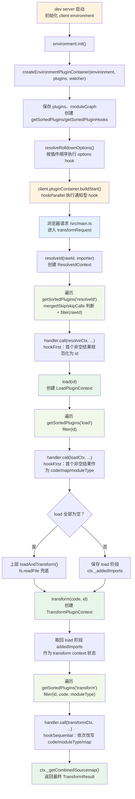

# 07 · 插件容器 PluginContainer：调试钩子调用栈，理解 Rollup/Rolldown 钩子兼容

> 本节调试目标：跟进 [05-按需编译与devserver请求处理流程.md](./05-按需编译与devserver请求处理流程.md) 里那三个反复出现的调用——`pluginContainer.resolveId/load/transform`——看插件容器内部是怎么遍历插件、调用钩子、组织 `this` 上下文的；以及它为什么能让一套 Rollup 风格的插件钩子在「dev 不打包」的环境下照常工作（即 PluginContainer 的本质：在 dev server 里「模拟」一个 Rollup/Rolldown 构建环境）。
>
> 源码基线：Vite 8.1.0。入口：`packages/vite/src/node/server/pluginContainer.ts`。

---

## 一、前置断点：跟一遍 dev 下的插件钩子

承接 [06-核心转换链路.md](./06-核心转换链路.md)，这里继续使用 dev 模式。先重启 dev server 观察一次 `buildStart`，再请求 `/src/main.ts` 跟进 `resolveId → load → transform`：

| 推荐断点 | 核心函数 / 位置 | 函数主要作用 | 重点观察 |
|---|---|---|---|
| `server/index.ts:1124` | `initServer → pluginContainer.buildStart` | dev server 启动时触发 client 环境的 `buildStart` 生命周期 | 确认调用来自 dev 流程，而不是 build 流程 |
| `server/pluginContainer.ts:352` | `EnvironmentPluginContainer.buildStart` | 用 promise 保证生命周期只启动一次 | `_started`、`_buildStartPromise` |
| `server/pluginContainer.ts:319` | `hookParallel` | 取出当前插件的 `buildStart` hook，随后按并行或顺序方式执行 | `plugin.name`、`hook.sequential` |
| `server/pluginContainer.ts:439` | resolve hook filter | 在调用 JS handler 前过滤 id | `filter(rawId)` 是否直接跳过插件 |
| `server/pluginContainer.ts:478` | 取得 `resolveId` handler | 在调用插件前停住，观察 hookFirst 调度 | `plugin.name`、`rawId`、`importer`、`mergedSkip` |
| `server/pluginContainer.ts:568` | 取得 `load` handler | 在调用插件前停住，观察 hookFirst 调度 | `plugin.name`、`id`，以及谁返回第一个非空 `LoadResult` |
| `server/pluginContainer.ts:619` | transform hook filter | 同时按 id/code/moduleType 过滤 | filter 不匹配时 handler 根本不会执行 |
| `server/pluginContainer.ts:650` | 取得 `transform` handler | 在调用插件前停住，观察 hookSequential 调度 | `plugin.name`、前后 `code`、`moduleType` |

`buildStart` 源自 Rollup 插件 API，Rolldown 继续兼容这套生命周期。Vite 8 build 时由 Rolldown 调用，dev 时则由 PluginContainer 模拟调用。这里的 `EnvironmentPluginContainer.buildStart()` 负责调度各插件的 `buildStart` hook，并不是创建插件容器。

## 二、PluginContainer 到底是什么

准确地说，Vite 的插件 API 起源于 Rollup 插件模型，并一直保持对 Rollup 插件生态的兼容；到了 Vite 8，build 底层已经切换为 Rolldown，源码中的插件类型和构建实现也来自 `rolldown`。`resolveId`、`load`、`transform`、`buildStart` 等钩子的名称和核心语义仍沿用 Rollup 约定，因此已有 Rollup 插件通常可以继续复用。

build 阶段由 Rolldown 驱动这些插件钩子；而 Vite dev **不打包**，只是来一个请求转换一个模块。为了让同一套插件在 dev 期照样运行，**PluginContainer** 会模拟这套与 Rollup 兼容、由 Rolldown 承接的插件运行环境——保留相同的钩子和 `this` 上下文 API，但底层改为「按需调用」而非「整体构建」。

> 一句类比：PluginContainer 是一个「Rollup 模拟器」。插件以为自己跑在 Rollup 里，其实跑在 Vite dev server 里。这个设计最早借鉴自 Preact 的 WMR（源码文件头注释有说明）。

读源码时可以抓住两条线。第一条是生命周期模拟：默认 client 环境为了向后兼容，会在 dev server 初始化时执行 `buildStart`；其它尚未启动的环境，则由 `pluginContainer.ts:409` 附近在第一次 `resolveId` 时兜底触发。第二条是钩子调度语义：`pluginContainer.ts:319` 附近的 `hookParallel` 说明通知型钩子默认并行，而 `resolveId/load/transform` 又分别是 hookFirst 和 hookSequential。

所以 PluginContainer 不是一个简单的 for 循环容器，它同时在做三件事：按插件顺序调钩子、给钩子伪造 Rollup 风格的 `this`、把 dev 不存在的构建生命周期用“足够接近”的方式补出来。

---

## 三、类结构：容器负责调度，Context 负责提供 `this`

先不用记类名，只要分清两个角色：

- **容器**像流水线调度员：决定插件按什么顺序执行、哪个结果生效、什么时候停止。
- **Context** 像发给插件的工具箱：Vite 调用 `handler.call(ctx, ...)` 时，`ctx` 就是插件钩子里的 `this`，插件通过它调用 `this.resolve()`、`this.parse()`、`this.addWatchFile()` 等 API。

本篇只看真正执行插件 hook 的 `EnvironmentPluginContainer`：

| 类 | 通俗理解 | 主要职责 |
|---|---|---|
| `EnvironmentPluginContainer` | 每个环境自己的流水线 | 保存该环境的插件，真正执行 `buildStart/resolveId/load/transform` |

一个 `DevEnvironment` 拥有一个对应的 `EnvironmentPluginContainer`，所以 client 和 ssr 各有一套独立的插件流水线。真正遍历插件、创建 Context、执行 hook 的始终是这个环境容器。

```text
client DevEnvironment ──拥有──> client EnvironmentPluginContainer
ssr DevEnvironment    ──拥有──> ssr EnvironmentPluginContainer
```

接下来再看 Context。插件 hook 里可以使用 `this.resolve()`、`this.parse()` 等 API，这个 `this` 不是插件对象本身，而是 Vite 创建的 Context 实例。几个 Context 不是互相独立的工具箱，而是一条逐层增加能力的继承链：

```text
MinimalPluginContext
└─ PluginContext
   ├─ ResolveIdContext
   └─ LoadPluginContext
      └─ TransformPluginContext
```

`MinimalPluginContext` 是最轻量的一层，只保存插件元信息、logger 和当前 environment，主要提供给 `options` 这类只需要基础能力的 hook。`PluginContext` 继承它，再加入当前插件、所属 `EnvironmentPluginContainer`，以及 `resolve/parse/addWatchFile/getModuleInfo` 等完整插件 API。

三个具体 Context 继续继承 `PluginContext`，只补充当前阶段特有的状态：

| Context | 继承关系 | 用在哪个 hook | 额外保存的状态 |
|---|---|---|---|
| `ResolveIdContext` | 继承 `PluginContext` | `resolveId` | skip/skipCalls，避免插件默认递归调用自己 |
| `LoadPluginContext` | 继承 `PluginContext` | `load` | `addWatchFile()` 收集到的依赖 |
| `TransformPluginContext` | 继承 `LoadPluginContext` | `transform` | 当前 id、原始 code 和 sourcemapChain |

因此，`ResolveIdContext` 也能使用 `PluginContext` 提供的公共 API；`TransformPluginContext` 则同时拥有 load 阶段的依赖收集能力和 transform 阶段的 sourcemap 状态。

后面看到 `handler.call(ctx, ...)` 时，可以直接翻译成：**容器选中一个插件，并把当前阶段对应的 Context 作为 `this` 交给它。**

## 四、完整主线：生命周期与 resolveId → load → transform

下面以默认 client dev 流程为主线。启动和请求入口前面已经讲过，这里只保留定位节点；重点放在插件容器内部：**三个核心 hook 都按插件顺序遍历，但各自的筛选条件和返回值语义不同。**



这张图里有几个容易读错的边界：

- `createEnvironmentPluginContainer` 只负责创建容器并跑 `options` hook，不会立刻执行 `buildStart`；
- `resolveId/load/transform` 都会按 `getSortedPlugins(hookName)` 的顺序取插件，但筛选条件不一样：`resolveId` 有 `skip/skipCalls + filter(rawId)`，`load` 是 `filter(id)`，`transform` 是 `filter(id, code, moduleType)`；
- `skip/skipCalls` 是 `resolveId` 的额外逻辑，用来配合插件里的 `this.resolve()`：默认跳过当前插件，避免同一个 `resolveId` 递归调用自己；
- filter 是插件 hook 的快速匹配条件。Vite 会先判断当前 `id/code/moduleType` 是否值得交给这个插件；不匹配就跳过它，只有匹配后才设置 `ctx._plugin` 并进入插件 hook；
- `resolveId`、`load` 是 `hookFirst`：没有结果时才继续下一个插件，第一个有效结果返回；
- `transform` 是 `hookSequential`：每个命中的插件都接收上一轮的 `code/moduleType/map`，返回 `null/undefined` 表示本轮不修改；
- `load` 会把 `ctx._addedImports` 暂存起来，`transform` 再取回，这样 transform 阶段还能知道 load 阶段通过 `addWatchFile()` 增加了哪些依赖；
- 没有插件在 `load` 阶段提供源码时，文件系统兜底发生在上层 `loadAndTransform()`，不是 `EnvironmentPluginContainer.load()` 自己读文件。

核心函数速查：

| 函数 / 类 | 主要作用 |
|---|---|
| `createEnvironmentPluginContainer` | 用环境过滤后的插件创建容器，并先解析 Rolldown options。 |
| `EnvironmentPluginContainer.buildStart` | 用 promise 去重启动；通知型 hook 默认并行，遇到 `sequential` hook 时会先等前一批并行任务完成，再单独执行它。 |
| `resolveId` | 处理 skip、hook filter 和旧 `ssr` 参数兼容；第一个非空结果返回。 |
| `load` | 为每次调用创建 `LoadPluginContext`；第一个非空结果返回，并保存 meta/watch imports。 |
| `transform` | 复用 load 阶段收集的 imports，让 code/moduleType/map 在插件间依次传递。 |
| `getCachedFilterForPlugin` | 编译并缓存对象式 hook 的 filter，在进入 handler 前完成 id/code/moduleType 过滤。 |
| `PluginContext.resolve` | 递归调用容器 resolve；默认 `skipSelf`，通过 `skipCalls` 记录调用链避免自递归。 |
| `getModuleInfo` | 只暴露 dev 模块图能可靠提供的 `id/meta`，其余字段通过 Proxy 明确报错。 |
| `hookParallel` | 驱动 `buildStart/watchChange/buildEnd/closeBundle` 等通知型 hook。 |

---

## 五、关键点 1：三个钩子的不同语义

三个核心方法看似对称，调用语义却各不相同——这是理解插件行为的关键。

### resolveId：第一个非空结果返回（hookFirst）

文件：`packages/vite/src/node/server/pluginContainer.ts`（L381–518，已简化）

```ts
for (const plugin of this.getSortedPlugins('resolveId')) {
  ctx._plugin = plugin
  const handler = getHookHandler(plugin.resolveId)
  const result = await this.handleHookPromise(
    handler.call(ctx as any, rawId, importer, normalizedOptions),
  )
  if (!result) continue
  // ...规范化 id...
  // resolveId() is hookFirst - first non-null result is returned.
  break
}
```

遍历所有实现了 `resolveId` 的插件，**谁第一个返回非空就用谁的**，立即 break。这就是为什么 `enforce: 'pre'` 的 resolve 插件（如别名）能「抢先」决定一个模块解析到哪。

### load：第一个非空结果返回（hookFirst）

`load` 同样是「第一个非空返回」。如果所有插件都返回 `null`，不是容器自己读文件，而是上层 `loadAndTransform` 回退到 `fs.readFile`（见 [06-核心转换链路.md](./06-核心转换链路.md)）。

### transform：所有插件依次链式处理（hookSequential）

文件：`packages/vite/src/node/server/pluginContainer.ts`（L527–685，已简化）

```ts
for (const plugin of this.getSortedPlugins('transform')) {
  ctx._updateActiveInfo(plugin, id, code)
  const handler = getHookHandler(plugin.transform)
  result = await this.handleHookPromise(handler.call(ctx as any, code, id, optionsWithSSR))
  if (!result) continue
  if (isObject(result)) {
    if (result.code !== undefined) {
      code = result.code                  // 后一个插件拿到前一个的产物
      if (result.map) ctx.sourcemapChain.push(result.map)
    }
  } else {
    code = result
  }
}
return { code, map: ctx._getCombinedSourcemap(), moduleType: ... }
```

`transform` 是**链式**的：每个插件拿到的是上一个插件改写后的 `code`，map 累积进 `sourcemapChain` 最后合并（见 [06-核心转换链路.md](./06-核心转换链路.md)）。

| 钩子 | 语义 | 一句话 |
|---|---|---|
| `resolveId` | hookFirst | 第一个给出结果的说了算 |
| `load` | hookFirst | 第一个加载到内容的说了算 |
| `transform` | hookSequential | 所有人接力，依次改写 |

**这三种语义的差异，是预测插件行为的核心。** 比如你写了个 `resolveId` 但前面有插件先返回了，你的就不会被调到；`transform` 会继续向后遍历，但只有 hook filter 匹配的插件才会真正进入 handler。

---

## 六、关键点 2：filter 与 skip 决定“是否调用”

Vite 8 支持对象式 hook：

```ts
transform: {
  filter: { id: { include: /\.tsx?$/ }, moduleType: ['ts', 'tsx'] },
  handler(code, id) {
    // ...
  },
}
```

容器在 `getHookHandler` 之前调用缓存后的 filter：`resolveId/load` 过滤 id，`transform` 可同时过滤 id、当前 code 和 moduleType。这不是“handler 内部早返回”，而是 handler 根本不进，减少跨 JS/native hook 调度和无效检查。

`skip`/`skipCalls` 解决的是另一件事（和配置的filter不同）：插件在自己的 `resolveId` 里调用 `this.resolve(id, importer)` 时，默认 `skipSelf`，否则同一个插件会无限递归。Vite 8 用包含 `{ id, importer, plugin, called }` 的调用信息传播这条约束；显式传 `skipSelf: false` 才允许再次调用当前插件，同时仍记录相同调用以避免无界递归。

## 七、关键点 3：钩子的 this 上下文

### 钩子的 `this` 上下文

调用钩子时用 `handler.call(ctx, ...)` 显式绑定 `this`。注意三个钩子用的是**专属上下文**（`ResolveIdContext`/`LoadPluginContext`/`TransformPluginContext`），而不是缓存的通用 `PluginContext`——所以你单步进插件钩子时，`this` 上看到的是对应钩子特化的那个类。这些上下文提供了 `this.resolve`、`this.parse`、`this.addWatchFile`、`this.error` 等 Rollup 风格 API。

---

## 八、关键点 4：Rollup / Rolldown 兼容边界

PluginContainer 的「模拟」体现在它实现了 Rolldown 提供的 Rollup 兼容上下文接口，但对 dev 不适用的部分做了取舍。

### 类型与版本：来自 Rolldown

Vite 8 里这些钩子和上下文类型都从 `'rolldown'` 导入。类型名仍是 `RollupMinimalPluginContext`、`RollupPluginContext`，表达的是 Rolldown 对 Rollup 插件 API 的兼容契约，并不代表底层仍由 Rollup 执行。上下文还提供 `viteVersion`、`rollupVersion`、`rolldownVersion` 给插件做兼容判断，`this.parse` 则直接委托给 Rolldown 的 AST 解析。

### 刻意「不支持」的部分

| 概念 | dev 期处理 |
|---|---|
| `this.cache` | **不提供**——dev 没有 Rollup 那种构建缓存，类型上直接 `Omit<..., 'cache'>` |
| `this.emitFile` / `this.setAssetSource` / `this.getFileName` | dev 期调用会走 `_warnIncompatibleMethod` 告警——这些是 build 产物相关 API，dev 没有产物 |
| `getModuleInfo` | 环境容器返回只有 `id/meta` 的 Proxy；访问其它不支持字段会明确抛错（唯独 `then` 返回 `undefined`，避免异步返回值被当成 PromiseLike）。 |

这种「实现大部分、对不适用的明确告警」的策略，比「假装支持然后悄悄返回错值」要友好得多——插件作者能在 dev 期就发现自己用了 build-only 的 API。

### 旧 `ssr` 参数的兼容

老插件的 `transform(code, id, { ssr })` 里那个 `ssr` 布尔参数，在 Environment API 后已被环境模型取代。容器用 getter/setter 做了兼容垫片：访问 `options.ssr` 时给出弃用警告，但仍能正确路由到 ssr 环境。这是「渐进式演进、不一刀切破坏生态」的典型手法。

### buildStart 在 dev 中何时触发

Rollup 构建有明确的 `buildStart` 生命周期，dev 没有与之完全对应的「开始打包」时刻。Vite 因此分两种情况补齐这个生命周期：

1. 默认 client 环境：`server/index.ts:1120–1124` 在 `initServer` 阶段主动调用 `client.pluginContainer.buildStart()`，这是为了保持向后兼容。
2. 其它尚未启动的环境：`server/pluginContainer.ts:408–410` 在第一次 `resolveId` 时兜底调用 `buildStart()`，并等待 `_buildStartPromise`。

因此，`pluginContainer.ts` 里的 `buildStart` 虽然沿用了构建钩子的名字，实际仍是 dev 插件容器的代码。`_started` 与 `_buildStartPromise` 保证无论从启动阶段还是首次请求进入，都只初始化一次，并让并发调用等待同一结果。

还要注意 Environment API 下的范围：默认 `buildStart/watchChange/buildEnd/closeBundle` 主要保持 client 环境的向后兼容行为；开启 `server.perEnvironmentStartEndDuringDev`，或插件声明 `perEnvironmentStartEndDuringDev`，才会让对应 start/end hook 在其它环境也执行。

---

## 九、常见误解、为什么这样设计与调试技巧

### 常见误解

1. **“PluginContainer 就是遍历插件的 for 循环”**：它还承担生命周期去重、环境路由、上下文模拟、filter/skip、错误定位和 sourcemap 合并。
2. **“transform 插件一定都会执行”**：只是顺序遍历不会因某个返回值提前 break；filter 不匹配仍会跳过。
3. **“load 全空后容器负责读文件”**：文件系统兜底属于 `loadAndTransform`，容器只返回 `null`。
4. **“dev 的 ModuleInfo 与 build 完全一样”**：dev 没有完整 bundle 图，故只承诺能可靠提供的字段。
5. **“看到 buildStart 就进入了 build 模式”**：这里是 dev 插件容器在模拟 Rollup 生命周期；默认 client 环境在 `initServer` 时主动执行，其它未启动环境才由第一次 resolve 兜底触发。

### 为什么这样设计

- hookFirst 让解析/加载可以被一个权威插件短路，hookSequential 让转换天然可组合；
- 在 handler 前执行 filter，既减少调用成本，也为 Rolldown 原生 filter 下推保留一致语义；
- `skipCalls` 把递归解析变成显式调用链，而不是依赖脆弱的全局“当前插件”开关；
- 对 build-only API 明确告警、对不支持 ModuleInfo 字段明确抛错，避免插件拿到貌似合法但实际错误的数据。

---

## 十、本节小结

**这段实现解决了什么问题？**
它让一套源自 Rollup、如今由 Rolldown 兼容并驱动的插件钩子，能在「dev 不打包、按需转模块」的环境里照常工作。PluginContainer 模拟出相同的钩子调用与 `this` 上下文，用三种调用语义（resolveId/load 第一个非空返回、transform 依次链式）驱动插件，并在 dev 启动或环境首次 resolve 时补齐 `buildStart` 等生命周期。这正是 Vite「一套插件生态、dev 与 build 通用」的根基。

**它带来了什么复杂度 / 代价？**
代价是「模拟」永远不可能 100% 等同真品：dev 没有 `cache`、`emitFile` 等 build 能力，只能告警；`buildStart` 的触发时机要由 dev 自己补齐；旧 `ssr` 参数要靠垫片兼容。这些缝隙是「dev/build 行为不完全一致」类问题的温床。抽象层（容器）一边带来了生态复用的巨大收益，一边也带来了「插件在 dev 能跑、build 行为却不同」的约束——这个权衡正是第三阶段「抽象的代价与收益」要回的话题。

**读完你应当能做到：**

- [ ] 解释 PluginContainer 的本质是「在 dev server 里模拟由 Rolldown 承接的 Rollup 兼容插件环境」；
- [ ] 区分 resolveId/load（第一个非空返回）与 transform（依次链式）的调用语义，并据此预测插件行为；
- [ ] 解释默认 client 环境与其它环境触发 `buildStart` 的时机差异，以及 promise 如何避免重复初始化；
- [ ] 用条件断点停在某个具体插件的钩子上，读出 filter、skipCalls 与 `this` 上下文；
- [ ] 解释 `getModuleInfo` Proxy 为什么只承诺 dev 可可靠提供的字段；
- [ ] 说出 dev 期被刻意「不支持/告警」的几个 Rollup API，及其背后的原因。

下一节进入 dev 体验的灵魂——[08-HMR实现原理.md](./08-HMR实现原理.md)，从文件保存一路追到浏览器局部更新。
