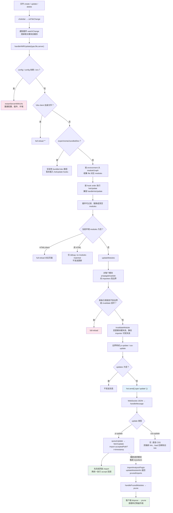

# 08 · HMR 实现原理：从文件变更到浏览器更新的完整链路

> 本节调试目标：保存一个文件，跟踪从「chokidar 监听到变更」到「浏览器局部更新（或全量刷新）」的完整链路——包括服务端如何找到 HMR 边界、WebSocket 推送什么、`/@vite/client` 收到后怎么重新拉模块并执行 accept 回调。这是 dev 体验的灵魂，也是「为什么我的 HMR 退化成了全量刷新」这类问题的答案所在。
>
> 源码基线：Vite 8.1.0。服务端：`server/hmr.ts`、`server/ws.ts`；客户端：`client/client.ts`、`shared/hmr.ts`。

---

## 一、先建立 HMR 的整体直觉

在看源码前，先把 HMR 想成一句话：

**文件变了以后，Vite 不直接把新代码塞进浏览器，而是告诉浏览器“哪个模块需要重新 import，以及谁负责处理这次更新”。**

这里面有三个角色：

1. **服务端**：监听文件变化，查模块图，判断这次变化能不能局部更新。能局部更新就发 `update` 消息（更新），不能就发 `full-reload`（重新加载）。
2. **浏览器端 `@vite/client`**：通过 WebSocket 收消息。收到 `update` 后，它会用 `import('/src/foo.js?t=时间戳')` 重新拉取新模块，避免命中浏览器 ESM 缓存。
3. **业务模块里的 `import.meta.hot`**：告诉 Vite“这个模块或这个依赖变了，我知道怎么处理”。如果没有人接住更新，Vite 只能一路往上找；找到顶还没人接，就退化成整页刷新。

`import.meta.hot` 只在 dev 的模块里存在。常用能力有三类：`accept` 声明“我能处理更新”，`dispose` 在旧模块被替换前清理副作用，`prune` 在模块不再被导入时清理残留资源（使用层面的写法见 [01-框架插件集成机制.md](../../01-第一阶段-使用篇/02-框架集成与测试/01-框架插件集成机制.md)）。先抓住 `accept`，后面的边界传播就容易理解很多。

一个最小例子：

```js
// main.js
import { render } from './render.js';
import { message } from './message.js';

render(message);

if (import.meta.hot) {
  import.meta.hot.accept('./message.js', (newMessageModule) => {
    render(newMessageModule.message);
  });
}
```

这段代码的意思不是“Vite 自动知道怎么替换页面”，而是 `main.js` 主动声明：

> 如果 `message.js` 变了，不用刷新页面，把新的 `message.js` 模块给我，我自己重新 render。

所以当你保存 `message.js` 时，链路大致是：

1. Node 侧 watcher 发现 `message.js` 变了。
2. Vite 在模块图里找到它的上游：`main.js` 导入了 `message.js`。
3. Vite 发现 `main.js` 写过 `import.meta.hot.accept('./message.js', cb)`，说明 `main.js` 能接住这次更新。
4. 服务端通过 WebSocket 发一条 JSON 指令，大意是：`main.js` 负责处理，实际要重新拉的是 `message.js`。
5. 浏览器端重新 import `message.js?t=xxx`，拿到新模块后执行 `main.js` 里注册的回调。

这里有两个容易误解的点：

- **HMR 不是把源码字符串推给浏览器**。服务端推的是更新指令，真正的新代码还是浏览器重新发 HTTP 请求拿的。
- **HMR 也不是无条件局部更新**。必须有人通过 `import.meta.hot.accept` 接住变化；框架插件（比如 Vue 插件）会帮组件代码自动注入这类逻辑，所以平时你很少手写。

那我们平时写的 Vue 组件为什么能自动热更新？这里不要把重心放在 `import { ref } from 'vue'` 这类 node_modules 依赖上。它们在 dev 里通常已经被依赖预构建处理，并带有稳定的缓存地址，一般不是本节 HMR 传播的主角。

更值得观察的是**源码模块之间的依赖**。例如 `App.vue` 引入了一个本地文件 `./message.js`：

```vue
<!-- App.vue：你写的代码 -->
<template>
  <p>{{ message }}</p>
</template>

<script setup>
import { message } from './message.js';
</script>
```

```js
// message.js：一个普通源码依赖
export const message = 'hello';
```

`.vue` 文件并不是原样交给浏览器执行。Vue 插件会把它拆成 script、template、style 等模块，再拼回一个带 HMR 逻辑的 JS 主模块。大致可以理解成下面这样：

```js
// App.vue 转换后的主模块：伪代码
// 当前模块自己的 URL 可以理解成：/src/App.vue
import script from '/src/App.vue?vue&type=script&setup=true&lang.js';
import { render } from '/src/App.vue?vue&type=template&id=xxxx&lang.js';

script.render = render;
script.__hmrId = '/src/App.vue';

__VUE_HMR_RUNTIME__.createRecord(script.__hmrId, script);

if (import.meta.hot) {
  // 不传 dep，表示“当前模块 /src/App.vue 自己接住自己的更新”
  import.meta.hot.accept((newModule) => {
    const nextComponent = newModule.default;
    const isTemplateOnlyChange = newModule._rerender_only;

    if (isTemplateOnlyChange) {
      // 只改了 template：组件状态可以保留，只替换 render 函数
      __VUE_HMR_RUNTIME__.rerender(nextComponent.__hmrId, nextComponent.render);
      return;
    }

    // script 也变了：组件选项可能变了，需要重新加载组件定义
    __VUE_HMR_RUNTIME__.reload(nextComponent.__hmrId, nextComponent);
  });
}

export default script;
```

而 script 子模块里会保留你写的源码依赖，大致是：

```js
// /src/App.vue?vue&type=script&setup=true&lang.js：伪代码
import { message } from '/src/message.js';

export default {
  setup() {
    return { message };
  },
};
```

这里 `message.js` 的路径不是 HMR 阶段凭空知道的，而是在 transform 里的 import analysis 阶段解析出来的。Vite 会扫描 `import { message } from './message.js'`，把相对路径解析成 `/src/message.js`，然后在模块图里记录一条边：

```txt
/src/App.vue?vue&type=script&setup=true&lang.js
  imports → /src/message.js
```

所以保存 `message.js` 时，服务端可以先从 `/src/message.js` 找到它的 importer，再沿着 importer 往上找谁能接住更新。**静态 import 负责建立依赖边；`import.meta.hot.accept` 负责声明更新边界。**这两个信息加起来，Vite 才知道“谁变了”和“谁能处理”。

这块可以先记成一条主线：

1. 文件变了，先把它映射到模块图里的模块节点。
2. 根据模块图找到“谁引用了这个文件”，也就是它的 importers。
3. 顺着 importers 往上找 HMR 边界：谁通过 `import.meta.hot.accept` 声明能处理这次变化，更新就停在哪里。
4. 一路找不到能接住的模块，就说明局部更新不安全，最后退化成 `full-reload`。

也就是说，HMR 的服务端核心不是“直接替换某段代码”，而是先回答两个问题：**这个文件被谁引用？这条引用链上谁能接住更新？**

先把几个路径分清楚：

| 你写的内容 | Vite / Vue 插件看到的模块 URL | HMR 里大概扮演的角色 |
|---|---|---|
| `App.vue` 主模块 | `/src/App.vue` | Vue 插件生成的组件入口，里面会注册 `import.meta.hot.accept()`，通常是接住组件更新的边界 |
| `<script setup>` | `/src/App.vue?vue&type=script&setup=true&lang.js` | 组件逻辑子模块，里面保留你写的 import、变量、setup 逻辑 |
| `<template>` | `/src/App.vue?vue&type=template&id=xxxx&lang.js` | render 函数子模块，template 改动时通常只需要 rerender |
| `<style>` | `/src/App.vue?vue&type=style&index=0&lang.css` | 样式子模块，更多走 CSS HMR，替换样式而不是重载组件 |
| `import { message } from './message.js'` | `/src/message.js` | 普通依赖模块，变更后会沿 importer 往上找谁能接住 |
| `import { ref } from 'vue'` | 预构建依赖 URL | 第三方依赖通常来自 node_modules 预构建结果，不是本节源码 HMR 的重点 |

### 客户端到底在匹配什么

后面源码里会频繁看到 `path` 和 `acceptedPath`。这两个字段不要一上来就当源码变量背，先把它们理解成一次“对账”：

- `path`：去哪个模块下面找 HMR 回调。
- `acceptedPath`：这次变的是哪个模块，应该重新 import 谁。

也就是说，服务端发来的 payload 不是直接说“执行某个函数”，而是说：

```
去 path 这个模块里，
找一个关心 acceptedPath 的回调，
重新拉 acceptedPath，
再把新模块交给这个回调。
```

看两个场景就够了。

**场景 A：Vue 组件自己更新**

Vue 插件会让 `/src/App.vue` 主模块自己接住自己的更新。可以理解成它在浏览器端登记了这样一条规则：

| 谁注册回调 | 这个回调关心谁变化 | 回调做什么 |
|---|---|---|
| `/src/App.vue` | `/src/App.vue` | 交给 Vue runtime 判断 `rerender` 还是 `reload` |

所以服务端发来的 payload 大概是：

```js
{
  type: 'js-update',
  path: '/src/App.vue',
  acceptedPath: '/src/App.vue',
}
```

客户端收到后做的匹配就是：

1. 先用 `path = '/src/App.vue'` 找到 `/src/App.vue` 登记过的 HMR 回调。
2. 再看这个回调是否关心 `acceptedPath = '/src/App.vue'`。
3. 匹配上了，就重新 import `/src/App.vue?t=xxx`，然后执行 Vue 插件生成的回调。

**场景 B：某个模块手写接受依赖更新**

假设你写了：

```js
// main.js
import { message } from './message.js';

if (import.meta.hot) {
  import.meta.hot.accept('./message.js', (newMessageModule) => {
    console.log(newMessageModule.message);
  });
}
```

这就等于在浏览器端登记了另一条规则：

| 谁注册回调 | 这个回调关心谁变化 | 回调做什么 |
|---|---|---|
| `/src/main.js` | `/src/message.js` | 拿到新的 `message.js` 模块后执行用户回调 |

所以 `message.js` 变更时，如果服务端找到 `main.js` 能接住这次变化，就会发：

```js
{
  type: 'js-update',
  path: '/src/main.js',
  acceptedPath: '/src/message.js',
}
```

客户端匹配时就是：

1. 用 `path = '/src/main.js'` 找到 `main.js` 登记过的 HMR 回调。
2. 看这个回调是否关心 `acceptedPath = '/src/message.js'`。
3. 匹配上了，就重新 import `/src/message.js?t=xxx`，把新模块传给 `accept` 回调。

如果这段 accept 写在 `App.vue` 的 script 子模块里，`path` 也可能是 `/src/App.vue?vue&type=script&setup=true&lang.js` 这种带 query 的模块 URL。关键不在于 URL 长不长，而在于这条规则始终不变：

> `path` 找负责处理更新的模块，`acceptedPath` 找本次真正变化并需要重新 import 的模块。

### Vue 组件的“边界”到底是什么

HMR 边界不是页面上的某块 DOM，也不等于“一定完整组件保存状态后重新渲染”。**边界是一个模块：更新传播到这个模块时，有 accept 回调能处理它，于是传播停止。**

对 Vue 来说，常见边界是 `/src/App.vue` 这个组件主模块。更新到了这个边界后，真正怎么处理，交给 Vue 的 HMR runtime：

| 变化类型 | Vue runtime 通常怎么处理 | 状态是否保留 |
|---|---|---|
| 只改 template | `rerender(id, render)`：替换 render 函数，让组件重新渲染 | 通常保留组件实例和本地状态 |
| 改 script | `reload(id, component)`：组件选项、setup、生命周期都可能变了，重新加载组件定义 | 不保证保留组件内部状态 |
| 改 style | CSS HMR：替换样式标签 | 不影响组件 JS 状态 |
| 改 `./message.js` 这类源码依赖 | 从 `/src/message.js` 沿 importer 往上找边界；可能被手写 accept 接住，也可能冒泡到 Vue 组件边界 | 取决于最终命中的边界和框架处理方式 |

所以 Vue HMR 的直觉是：

1. **你写的是 `.vue`**，但浏览器执行的是 Vue 插件生成的 JS 模块。
2. **Vue 插件自动写了 `import.meta.hot.accept`**，帮组件主模块成为 HMR 边界。
3. **路径匹配发生在客户端 runtime**：`path` 找模块，`acceptedPath` 找这个模块关心的依赖。
4. **状态是否保留不是 Vite 核心决定的**，而是 Vue runtime 根据 template/script/style 的变化类型决定。
5. **node_modules 依赖通常不是这条链路的重点**，本节更关注 `/src` 下源码模块之间的传播和边界。

换句话说，框架插件的价值就在于：它比 Vite 核心更懂“一个组件由哪些部分组成、哪些变化能保留状态、哪些变化必须重载”。Vite 核心负责发现文件变了、找边界、发更新协议；Vue 插件负责把组件编译成能接住更新的模块。

带着这个直觉再看源码，后面的 `acceptedHmrDeps`、`acceptedPath`、`boundary` 就不再是孤立名词：它们都在回答同一个问题——**这个变化由谁接住，浏览器应该重新拉哪个模块。**

## 二、前置断点：服务端与浏览器各打一组

承接 [07-插件容器PluginContainer.md](./07-插件容器PluginContainer.md)，HMR 仍然复用插件与模块图，但调试轴从 HTTP 请求切换成“文件事件 → 热更新协议”。先按运行进程分开打断点：

**Node 侧：**

| 推荐断点 | 核心函数 / 位置 | 函数主要作用 | 重点观察 |
|---|---|---|---|
| `server/index.ts:947` | `watcher.on('change')` → `onFileChange(file)` | chokidar 监听到文件更新后，先把路径归一化，再触发每个 environment 的 `watchChange`，随后让模块图清空该文件对应模块的 transform 缓存，最后把 `update` 事件交给 HMR 主入口 | `file` 如何被 normalize；`watchChange` 是否先于模块图失效；`moduleGraph.onFileChange(file)` 会影响哪些模块 |
| `server/hmr.ts:416` | `handleHMRUpdate(type, file, server)` | 服务端 HMR 总调度器：判断文件类型、准备时间戳和 HMR context，并按 client/ssr 等 environment 收集这个文件对应的模块节点 | `type`、`file`、`timestamp`；同一个文件在不同 `server.environments` 下收集到的 `options.modules` 是否一致 |
| `server/hmr.ts:435` | config/env 分支 | 配置文件、配置依赖或 `.env` 变化会绕过模块级 HMR，因为插件链、环境变量、define 结果都可能整体变化；这里直接重启 dev server，避免旧 server 状态继续处理新请求 | `isConfig`、`isConfigDependency`、`isEnv` 哪个命中；`restartServerWithUrls(server)` 如何中断后续 HMR |
| `server/hmr.ts:537` | 插件 `hotUpdate` / `handleHotUpdate` 调度 | 先让插件接管受影响模块列表：插件可以过滤无关模块、补充虚拟模块、甚至返回空数组强制后续不做局部更新；兼容旧 `handleHotUpdate` 时还要同步 client/ssr 混合模块图 | hook 前后的 `clientHotUpdateOptions.modules`、`mixedHmrContext.modules`；插件返回值如何改写后续边界计算输入 |
| `server/hmr.ts:682` | `hmr(environment)` → `updateModules(...)` | 每个 environment 独立进入更新计算：若插件阶段留下的模块为空，HTML 走全量刷新，普通文件只打 debug；否则把过滤后的模块列表交给 `updateModules` 生成最终 payload | 当前 `environment.name`；`options.modules` 是否为空；空模块时是 full reload 还是 no modules matched |
| `server/hmr.ts:731` | `updateModules` → `propagateUpdate(mod, ...)` | 对每个变更模块沿 `importers` 反向传播，寻找能接受本次更新的 HMR 边界；同时先记录待失效模块，后面找不到边界就退化成 full reload | 每个 `mod` 对应的 `boundaries`；`hasDeadEnd` 是 `true` 还是具体原因字符串；`traversedModules` 如何避免重复遍历 |
| `server/hmr.ts:911` | `propagateUpdate` → `acceptedHmrDeps` 命中 | 如果上层模块写了 `import.meta.hot.accept(dep, cb)`，就表示“这个依赖变了我能自己处理”。Vite 找到这种模块后，就不用继续往更上层找，也不用整页刷新；客户端稍后会重新拉取变更依赖，并执行这里注册的回调 | `node` 是实际变更的依赖，`importer` 是接住更新的上层模块；命中后看 update payload 里是否是 `path = importer`、`acceptedPath = node` |
| `server/hmr.ts:929` | `acceptedHmrExports` 判定 | 处理“只接受部分导出”的情况：如果 importer 实际使用的导出都在被接受集合中，就不用继续向上冒泡；否则还要找更上层 importer，找不到就全量刷新 | `importedBindingsFromNode` 与 `acceptedHmrExports` 的交集关系；未全部接受时是否继续递归 `propagateUpdate(importer, ...)` |
| `server/hmr.ts:828` | `hot.send({ type: 'update', updates })` | 把服务端算出的 HMR 边界转成 WebSocket JSON 指令；这里不会推送新代码，只告诉浏览器哪些 `path/acceptedPath` 需要重新 import | `updates` 中 `type`、`path`、`acceptedPath`、`explicitImportRequired`；多个边界是否合并在同一个 payload |
| `plugins/importAnalysis.ts:1017` / `server/hmr.ts:1027` | `importAnalysisPlugin` → `handlePrunedModules` | 这是 HMR 的副线，不是 `handleHMRUpdate → updateModules` 主线。浏览器重新拉模块后会触发 transform，`importAnalysisPlugin` 重新分析 import 关系；如果 `updateModuleInfo` 发现某些旧依赖已经没有 importer，才调用 `handlePrunedModules` 发送 prune | `prunedImports` 里有哪些孤儿模块；最终发给客户端的 `paths` 是否对应需要清理副作用的模块 |
| `server/moduleGraph.ts:171` | `invalidateModule(mod, ...)` | 清除模块 transform/etag/SSR 缓存，并按 importer 关系递归失效上游；HMR 场景会记录 `lastHMRTimestamp`，静态 importer 可软失效以复用旧 transform 结果只更新时间戳 | `softInvalidate`、`invalidationState`、`lastHMRTimestamp`；哪些 importer 被硬失效，哪些只是软失效 |

**浏览器 DevTools 侧：**

| 推荐断点 | 核心函数 / 位置 | 函数主要作用 | 重点观察 |
|---|---|---|---|
| `client/client.ts:211` | `handleMessage(payload)` | 浏览器端 HMR 消息总入口：按 `payload.type` 分发 connected/update/custom/full-reload/prune/error，并在 update 前后触发 Vite 内部监听事件 | `payload.type`；有错误覆盖层时首次 update 是否被升级为 `location.reload()` |
| `client/client.ts:239` | JS update 分支 | 对服务端发来的每个 `js-update` 调用 `hmrClient.queueUpdate(update)`，把重新 import 和 accept 回调执行交给共享 HMR runtime | `update.path` 与 `update.acceptedPath` 的差异；同一个 payload 内是否有多个 JS 更新并行排队 |
| `client/client.ts:247` | CSS link update 分支 | 只处理通过 `<link>` 直接引用的 CSS：根据旧 link 找到目标样式表，拼上 `?t=` 生成新地址，克隆新 link，等新样式加载完成后再移除旧 link | `searchUrl`、`newPath`；为什么是先插入新 link 再删除旧 link，而不是直接改 `href` |
| `shared/hmr.ts:256` | `HMRClient.queueUpdate(update)` | 把同一次源码变更触发的多个更新先放进队列，等当前微任务结束后统一 `Promise.all` 拉取新模块，再按服务端发送顺序执行回调 | `updateQueue` 的收集与清空；`pendingUpdateQueue` 如何保证同批更新只 flush 一次 |
| `shared/hmr.ts:297` | `fetchUpdate(update)` → `importUpdatedModule` | 先筛出本次 `acceptedPath` 命中的 accept 回调，执行 dispose 清理旧副作用，再用带时间戳的 URL 动态 import 最新模块，避免浏览器命中旧 ESM 缓存 | `qualifiedCallbacks`、`acceptedPath`、`isSelfUpdate`；失败时是否进入 `warnFailedUpdate` |
| `shared/hmr.ts:307` | `fetchUpdate` 返回的延迟回调 | 新模块全部拉取完成后才真正执行业务/框架注册的 accept 回调，并只把命中依赖对应的新模块 namespace 传给回调 | `deps` 如何映射到 `fetchedModule`；`currentFirstInvalidatedBy` 在回调前后如何设置和恢复 |
| `shared/hmr.ts:220` | `prunePaths(paths)` | 服务端发现旧模块不再被导入时，客户端按路径先执行 dispose 回调，再执行 prune 回调，让样式注入、事件监听等副作用有机会释放 | `disposeMap`、`pruneMap`、`dataMap`；同一路径是否既有 dispose 又有 prune |


## 三、完整主线总览

HMR 是一条横跨「Node 服务端」和「浏览器客户端」的链路，中间用 WebSocket 连接。这里最容易误解的一点是：服务端并不会把“新代码”直接推给浏览器，它推的是一份 JSON 指令；浏览器收到后再用带 `?t=` 的 URL 重新 import 新模块。

图里的 `watchChange + 模块图失效` 指的是：Vite 刚收到文件变化时，先通知插件“这个文件变了”，再把模块图里这个文件相关的旧 transform 缓存清掉。它还不是在算 HMR 边界，只是在为后面的重新分析和重新转换做准备。

源码里的注释也在强调这个分工：`server/hmr.ts:416` 是服务端总入口，负责收集模块和跑 `hotUpdate`；`server/hmr.ts:911` 是边界传播的关键判断，说明在哪里“接住”更新；`server/ws.ts:395` 说明 WebSocket 只广播 JSON payload；`shared/hmr.ts:307` 说明客户端会先拉取所有新模块，再统一执行回调，避免多个更新之间出现半新半旧的状态。带着这个分工看全景图，HMR 会清楚很多。



服务端用 `server/index.ts:947` 的 `watcher.on('change')` 起步：

文件：`packages/vite/src/node/server/index.ts`（L926–949）

```ts
watcher.on('change', (file) => {
  onFileChange(file).catch((e) => server.config.logger.error(e))
})
```

`onFileChange` 先调用各环境模块图的 `onFileChange`，对文件关联节点执行硬失效、清掉旧 transform/ETag 缓存；随后才调用 `handleHMRUpdate('update', file)` 计算 HMR 边界与更新时间戳。这里不是软失效：软失效发生在后续沿静态 import 边向 importer 传播时。

核心函数速查：

| 函数 | 主要作用 |
|---|---|
| `handleHMRUpdate` | 处理 restart/full-reload 快速分支，按环境收集模块并运行 hot update hooks。 |
| `getSortedHotUpdatePlugins` | 同时兼容 `hotUpdate` 与旧 `handleHotUpdate`，按 hook order 排序并缓存。 |
| `updateModules` | 将模块变化转换为边界、失效状态和最终 `update/full-reload` payload。 |
| `propagateUpdate` | 沿 importers 向上寻找 self/deps/exports 接受边界，返回 dead-end 原因。 |
| `invalidateModule` | 清 transform/etag/SSR 缓存，并根据静态导入关系向 importer 传播软或硬失效。 |
| `handlePrunedModules` | 被 `importAnalysisPlugin` 在模块图更新后调用，给孤儿模块更新时间戳并发送 `prune`，保证未来重新导入时副作用可再次执行。 |
| `handleMessage` | 浏览器端按 `update/full-reload/prune/error/custom` 分派。 |
| `HMRClient.queueUpdate/fetchUpdate` | 批量拉新模块、调用 dispose，再执行匹配的 accept 回调。 |

---

## 四、关键点 1：handleHMRUpdate 前半段先决定是否进入模块 HMR

`handleHMRUpdate` 并不是一进来就跑 `propagateUpdate`。它的前半段按成本从低到高做四层分流：

1. 配置文件、配置依赖或当前 mode 的 env 文件变化：调用 `restartServerWithUrls`，因为 config、插件数组、define 和 environments 都可能变化；
2. Vite client 自身源码变化：client 不能热更新自己，向所有环境发送 `full-reload: '*'`；
3. `experimental.bundledDev`：只有进入这条实验性 bundled dev 路径时，此处分支才会直接返回；默认逐模块 dev HMR 仍正常支持 `hotUpdate`、`handleHotUpdate`，这里只是 bundled dev 暂未接入这套 hook 调度；
4. 普通文件：按每个 environment 的模块图取 `getModulesByFile(file)`，create 事件还会加入之前 resolve 失败的模块，然后执行插件 `hotUpdate`。

插件 hook 的返回值不是附加模块，而是**替换后续传播所用的 modules 列表**。返回空数组可以吞掉本次环境更新；返回自定义节点可以把一个文件变化映射到框架虚拟模块。旧 `handleHotUpdate` 只在 `type === 'update'` 时走兼容路径，新的 `hotUpdate` 同时覆盖 create/delete/update。

默认各环境的 `hmr(environment)` 用 `Promise.all` 并行；框架若要求 client/ssr 有顺序，可用 `server.hotUpdateEnvironments` 接管调度。

## 五、关键点 2：服务端如何找到完整 HMR 边界

HMR 的核心难题是：一个文件改了，**谁来「接住」这次更新？** 如果模块自己 `import.meta.hot.accept()` 了，它能自我更新；否则要往上找——它的导入者里有没有人接受它的更新？一直找不到，就只能全量刷新页面。这个「向上找接受者」的过程就是 `propagateUpdate`。

文件：`packages/vite/src/node/server/hmr.ts`（L824–947，已大幅简化）

```ts
function propagateUpdate(node, traversedModules, boundaries, currentChain = [node]) {
  if (traversedModules.has(node)) return false
  traversedModules.add(node)

  // 模块还没在浏览器里加载过(未分析) → 停止传播
  if (node.id && node.isSelfAccepting === undefined) return false

  // 模块自接受 → 它自己就是边界
  if (node.isSelfAccepting) {
    boundaries.push({ boundary: node, acceptedVia: node, ... })
    return false
  }

  // 部分接受导出：先把自己记作边界，仍继续检查 importer 实际用了什么
  if (node.acceptedHmrExports) boundaries.push({ boundary: node, acceptedVia: node })
  else if (!node.importers.size) return true

  // 沿依赖图反向遍历：找“哪些文件引用了当前 node”
  for (const importer of node.importers) {
    if (importer.acceptedHmrDeps.has(node)) {
      boundaries.push({ boundary: importer, acceptedVia: node, ... })  // importer 接住 node 的更新
      continue
    }
    // 当前 importer 也接不住，就继续看“谁又引用了 importer”
    // 如果递归返回 true，说明这条引用链一路都没人接住，需要把 full-reload 信号传回上层
    if (!currentChain.includes(importer) &&
        propagateUpdate(importer, traversedModules, boundaries, currentChain.concat(importer))) {
      return true
    }
  }
  return false
}
```

这里要注意：`propagateUpdate(node)` 每次都是以**当前 node** 为起点，沿依赖图反向找“谁引用了当前 node”。如果某个 importer 能接住当前 node 的变化，这条路径就停住；如果接不住，就把这个 importer 当成新的当前 node，继续往上找它的 importer。

所以它不是一次性遍历整张图，而是沿当前变更模块的反向依赖路径一层层往上走。一个文件被多个地方引用时，会分叉成多条路径；每条路径都能找到安全边界，才可以局部 HMR。只要其中一条路径一路找不到边界，就会退化成 `full-reload`。

完整判定不只是 self accept 与 accepted deps：

1. **尚未分析**：`node.id` 存在但 `isSelfAccepting === undefined`，说明模块未真正被浏览器加载分析，停止传播，不构成 dead end；
2. **self accept**：模块自己成为边界；
3. **accept exports**：模块先成为部分接受边界；对每个 importer，再用 `importedBindings` 判断它从该节点使用的导出是否全部包含在 `acceptedHmrExports` 中。全部被接受则这条 importer 路径不用继续传播，否则继续向上；
4. **accept deps**：如果 importer 写了 `import.meta.hot.accept(dep, cb)` 接受当前 node，说明它能处理这个依赖的变化；这条路径到 importer 就停住，后面由客户端重新拉取 node 并执行 importer 里注册的回调；
5. **无 importer 且无 accept exports**：已经走到引用链顶端，仍然没人声明能接住更新，这条路径就是“无边界路径”，返回 `true`；
6. **其它情况**：继续沿依赖图反向递归，也就是继续找“谁引用了当前 importer”。只要任意一条引用链返回 `true`，说明局部更新不安全，本轮就会退化为 full reload。

`acceptExports` 的“部分”语义很重要：它不是无条件截断传播。只有 importer 实际使用的 bindings 都在接受列表内，这条边才安全；否则未接受导出的消费者仍需继续向上找边界。

### 什么时候退化成全量刷新

`updateModules`（`hmr.ts` L711–809）发 `{ type: 'full-reload' }` 的核心原因只有一个：**这次变化没法保证局部替换后页面仍然一致**。源码里主要对应下面几类场景：

| 场景 | 什么时候会出现 | 为什么要 full reload |
|---|---|---|
| 没有具体模块可更新 | `updateModules` 被传入空数组，常见于 `import.meta.hot.invalidate()` 一路把更新交给上层，最后没有留下可安全处理的模块 | 服务端不知道该让哪个模块执行 accept 回调，只能刷新页面重新建立状态 |
| 某条引用链找不到 HMR 边界 | 改了一个普通工具文件、全局状态文件，沿着“谁引用了它”一路往上找，都没人 `accept` | 没有任何模块声明“我能处理这个变化”，局部替换可能留下旧状态或旧引用 |
| 同一轮更新里 invalidate 绕回 accepted path | 某个 accept 回调里又调用 `import.meta.hot.invalidate()`，并且沿循环依赖链回到本轮已经接受过的路径，源码标记为 `circular import invalidate` | 继续局部更新可能在循环依赖里反复失效，执行顺序和模块状态都不可靠 |
| 顶层 HTML 模板变化 | 改的是作为页面入口的 `index.html` / client HTML，而不是被 JS import 的普通模块 | HTML 是整个文档模板，改了它需要重新加载页面，不能只替换某个 JS 模块 |

`import.meta.hot.invalidate(message)` 可以理解成“当前模块虽然先接住了更新，但运行回调时发现自己处理不了”。它会从浏览器发一个 `vite:invalidate` 事件给服务端，携带当前模块路径、提示信息和 `firstInvalidatedBy`。服务端收到后，不是马上刷新页面，而是把这个模块的 importers 拿出来重新调用 `updateModules`：

```txt
当前边界模块接不住
  ↓ vite:invalidate
服务端从它的 importers 继续往上找边界
  ↓
找到上层边界 → 继续局部更新
找不到 / 绕回本轮 accepted path → full-reload
```

所以 `vite:invalidate` 的作用是：**让客户端在运行时主动放弃当前 HMR 边界，把更新继续交还给服务端向上冒泡**。它是 HMR 的“二次传播”机制，不是普通业务自定义事件。

普通文件在 `handleHMRUpdate` 收集不到模块时**不会一概 full reload**：HTML 会按页面路径 reload；其它文件只记录 `no modules matched` 并返回。不能把“模块图没有节点”当成统一刷新条件。

> 循环依赖也不是“检测到就立刻刷新”。边界进入环时，服务端把 `isWithinCircularImport: true` 放进 update payload；客户端仍先尝试重新 import，只有 import 失败才 reload 以恢复 ESM 执行顺序。运行 `vite --debug hmr` 可以看到服务端打印的准确循环路径。上面的 `circular import invalidate` 则是另一种情况：invalidate 已沿同一更新链回到 accepted path，服务端直接判定无法安全局部恢复。

服务端找到边界后，给改动模块打上 HMR 时间戳并通过 WebSocket 推送更新。

---

## 六、关键点 3：update、full-reload、restart、prune 不是一回事

| 动作 / 消息 | 谁触发 | 浏览器行为 | 服务端状态 |
|---|---|---|---|
| `update` | 找到 HMR 边界 | JS 重新 import 并执行 accept；link CSS 换标签 | server 不重启 |
| `full-reload` | dead end、顶层 HTML、Vite client 等 | 当前页面整体 reload | server 仍是原实例 |
| `restart` | config/config 依赖/env 变化 | 连接断开后 client 轮询 server，恢复时 reload | 重建配置、插件、环境和监听 |
| `prune` | 模块图更新发现模块已无 importer | 执行 dispose/prune 回调，清理副作用 | 节点更新时间戳，未来重导入会重新执行 |

`prune` 不是“更新模块”，而是“某些模块已经从当前模块图里消失，需要清理它们留下的副作用”。这里要把服务端发现 prune 和客户端执行 prune 分开看：

1. **服务端发现谁被剪掉**：这主要发生在 `importAnalysisPlugin` 重新分析 import 关系时。比如某次 transform 后，`updateModuleInfo` 发现旧依赖已经没有 importer，就返回 `prunedImports`，随后调用 `handlePrunedModules(prunedImports, environment)` 发 `{ type: 'prune', paths }`。
2. **客户端执行清理回调**：CSS 插件不是负责“发现 prune”的主入口，它是在生成 CSS 代理 JS 时注入 `import.meta.hot.prune(() => removeStyle(id))`。等浏览器收到服务端发来的 `prune` payload，`@vite/client` 才会执行这个回调，把之前插入的 `<style>` 删除。

所以更准确的理解是：`importAnalysisPlugin` 负责更新模块图并找出离图模块；`cssPostPlugin` 负责给 CSS 模块注册“如果我离图了，请这样清理样式”的客户端回调。二者配合完成 CSS 残留样式清理，但职责并不一样。

## 七、关键点 4：WebSocket 协议

消息都是 WebSocket 上的 **JSON 字符串**，子协议 `vite-hmr`。类型定义在 `packages/vite/types/hmrPayload.d.ts`：

| `type` | 含义 | 关键字段 |
|---|---|---|
| `connected` | 连接建立 | — |
| `update` | 模块更新 | `updates: Update[]` |
| `full-reload` | 整页刷新 | `path?` |
| `prune` | 模块被移除 | `paths: string[]` |
| `error` | 错误 | `err` |
| `custom` | 自定义事件 | `event`, `data` |

单条 `update` 的结构（注意 `path` 是边界、`acceptedPath` 是真正改了的模块）：

```ts
{
  type: 'js-update' | 'css-update'
  path: string          // HMR 边界模块 url
  acceptedPath: string  // 改动模块 url(客户端重新 import 的目标)
  timestamp: number     // ?t= 用的时间戳
}
```

服务端广播很朴素——`JSON.stringify` 后发给所有就绪的客户端：

文件：`packages/vite/src/node/server/ws.ts`（L395–400）

```ts
const stringified = JSON.stringify(payload)
wss.clients.forEach((client) => {
  if (client.readyState === 1) {
    client.send(stringified)
  }
})
```

还有两个细节：连接建立时发 `{ type: 'connected' }`；没有客户端时，`error`/`full-reload` 类消息会被缓冲，等下个客户端连上补发。客户端发给服务端的只有 `custom` 类型（如 `import.meta.hot.invalidate` 触发的 `vite:invalidate`）。

---

## 八、关键点 5：客户端如何分别更新 JS 与 CSS

`/@vite/client` 是注入到页面的运行时（`CLIENT_PUBLIC_PATH = '/@vite/client'`，由 dev HTML 钩子在 `<head>` 注入一个 `<script type="module">`）。它监听 WebSocket，所有消息进 `handleMessage`：

文件：`packages/vite/src/client/client.ts`（L206 起，`handleMessage`）

对 `update` 类型，客户端把更新排队（`queueUpdate` 保证并发更新顺序正确），然后对每条更新调 `fetchUpdate`，核心是**用带新时间戳的 url 重新 import 改动模块**：

文件：`packages/vite/src/client/client.ts`（L175–189）

```ts
const [acceptedPathWithoutQuery, query] = acceptedPath.split(`?`)
const importPromise = import(
  /* @vite-ignore */
  base +
    acceptedPathWithoutQuery.slice(1) +
    `?${explicitImportRequired ? 'import&' : ''}t=${timestamp}${query ? `&${query}` : ''}`
)
```

`?t=${timestamp}` 是关键：浏览器 ESM 模块有缓存，同一个 url 不会重复执行。加一个变化的 `?t=` 时间戳 query，就骗过浏览器缓存，强制重新加载这一个模块。

重新 import 拿到新模块后，执行注册过的 accept 回调：

文件：`packages/vite/src/shared/hmr.ts`（L297–307）

```ts
return () => {
  this.currentFirstInvalidatedBy = firstInvalidatedBy
  for (const { deps, fn } of qualifiedCallbacks) {
    fn(deps.map((dep) => (dep === acceptedPath ? fetchedModule : undefined)))
  }
}
```

这里的 `fn` 更准确地说是 `import.meta.hot.accept` 注册时包出来的回调。底层先按 `deps` 顺序组装一个数组：命中的 `acceptedPath` 放入刚 import 到的新模块，没命中的位置放 `undefined`。外层包装再把它还原成你写 API 时看到的参数形态：

- `import.meta.hot.accept((newModule) => {})`：self accept，`newModule` 是当前模块的新版本；
- `import.meta.hot.accept('./message.js', (newMessageModule) => {})`：依赖级 accept，`newMessageModule` 是 `/src/message.js` 的新版本；
- `import.meta.hot.accept(['./a.js', './b.js'], (modules) => {})`：多个依赖时，`modules` 是按 deps 顺序排列的新模块数组，只有本次命中的位置有值。

CSS 有两条 HMR 路径，不能混为一谈：

- JS 中 `import './style.css'`：`cssPostPlugin` 已把 CSS 包成 JS，并注入 `import.meta.hot.accept()`；服务端通常形成 `js-update`，客户端重新 import 这个 CSS-JS 模块，`updateStyle` 更新同一个 `<style data-vite-dev-id>`；
- HTML `<link rel="stylesheet" href="/style.css">`：模块节点类型是 `css`，服务端形成 `css-update`；客户端克隆旧 `<link>`，给新 href 加 `?t=`，等 load/error 后才移除旧标签，避免直接换 href 造成无样式闪烁。

CSS Modules 会导出 class 映射，编辑时导出值可能变化，所以 `cssAnalysisPlugin` 不把它标为普通 CSS 那样的自接受；它需要由能处理导出变化的上层边界接住。

### accept 是什么时候注册的

回顾 [06-核心转换链路.md](./06-核心转换链路.md)：`importAnalysis` 在转换模块时，发现 `import.meta.hot.accept(...)`，会注入 `import.meta.hot = __vite__createHotContext(...)`。`createHotContext`（`client/client.ts` L614–615）每次模块执行都新建一个 `HMRContext`；你调用 `hot.accept(...)` 时，回调被存进客户端的 `hotModulesMap`。更新到来时 `fetchUpdate` 从这里取出匹配的回调来执行。

---

## 九、关键点 6：软失效与硬失效

这里的“失效”不是把模块从模块图里删掉，而是给模块图节点打一个缓存标记：**下次浏览器再请求这个模块时，旧的编译结果还能不能复用？**

硬失效就是最保守的答案：不能复用。这个模块自己的源码已经变了，或者它受到了无法只靠改时间戳解决的影响，Vite 必须重新 `load`、重新 `transform`，生成一份全新的浏览器代码。

软失效则表示：模块本身代码没变，旧的 transform 结果大体还能用，只是它 import 的某个依赖变了，所以下次返回这个模块时把 import URL 上的 HMR 时间戳改一下即可。

用一个场景看会更容易：

```js
// Card.vue 的 script 子模块里
import { message } from './message.js';
```

现在你保存了 `message.js`。

第一步，`message.js` 自己必须硬失效。因为它的源码真的变了，旧的 transform 结果不能再复用，下次请求必须重新读文件、重新跑插件转换。

第二步，Vite 会顺着模块图找到它的 importer，比如 `Card.vue` 的 script 子模块。这个 importer 自己的源码没有变，只是它里面那句 import 需要指向新版 `message.js`：

```js
// 旧的
import { message } from '/src/message.js';

// 下次返回时改成类似这样
import { message } from '/src/message.js?t=1700000000000';
```

这种情况下，`Card.vue` 的 script 子模块就有机会软失效：旧的 transform 结果大体还能用，不必完整重跑一遍插件链，只需要把 import URL 上的时间戳改掉。

所以这里不是简单“全删掉重来”，而是给模块留一张“下次请求怎么办”的小纸条：

- **硬失效**：纸条上写“旧结果不能用了”。下次请求这个模块时，重新读源码、重新跑插件转换。
- **软失效**：纸条上保存“旧结果还能用”。下次请求这个模块时，拿旧结果改一下 import URL 上的时间戳，再返回给浏览器。

源码里这张“小纸条”就是 `invalidationState`：硬失效时记成 `'HARD_INVALIDATED'`，软失效时暂存旧的 `TransformResult`。

这也正好和 [05-按需编译与devserver请求处理流程.md](./05-按需编译与devserver请求处理流程.md) 里的 transform 缓存接上了：`Card.vue` 的 script 子模块如果只是软失效，下次请求时不需要重新跑完整插件链，而是由 `transformRequest.ts` 的 `handleModuleSoftInvalidation` 复用旧 transform 结果，并用 `MagicString` 把里面指向 `message.js` 的 import URL 改成带新 `?t=` 的版本。这里不是 `importAnalysisPlugin` 重新 transform，只是软失效恢复时按和 import analysis 一致的 URL 规则做一次轻量改写。

---

## 十、常见误解、为什么这样设计与调试技巧

### 常见误解

1. **“服务端把新代码通过 WebSocket 推给浏览器”**：它只推 JSON 指令；新代码仍经 HTTP/模块运行时加载。
2. **“找不到模块图节点就一定 full reload”**：模块图只记录浏览器实际请求、分析过的模块。比如你改了一个暂时没有被当前页面 import 的普通文件，Vite 可能只是发现“当前页面没人用它”，于是只打印 `no modules matched`，不发送任何 HMR 消息。HTML 入口文件比较特殊，才更可能触发页面 reload。
3. **“acceptExports 等于整个模块都能热更新”**：它只表示“这个模块里的某几个导出可以自己处理更新”。

   例如 `settings.js` 里有两个导出，但 `acceptExports` 声明里只写了 `theme`：

   ```js
   export const theme = 'dark';
   export function createClient() {}

   if (import.meta.hot) {
     import.meta.hot.acceptExports(['theme'], (newModule) => {
       // 这里只处理 theme 变化
     });
   }
   ```

   如果上游是这样：

   ```js
   import { theme } from './settings.js';
   ```

   它只用了 `theme`，而 `theme` 已经出现在 `acceptExports(['theme'])` 这个声明里，这条路径可以停住。

   但如果上游是这样：

   ```js
   import { theme, createClient } from './settings.js';
   ```

   它还用了 `createClient`，但 `createClient` 没有出现在 `acceptExports(...)` 声明里。Vite 不能假装这条路径安全，所以还要继续往上找边界。
4. **“循环依赖一律服务端 full reload”**：比如 A import B，B 又 import A，服务端可能仍然先发 update，只是在 payload 里标记“这个更新处在循环引用里”。客户端会先尝试重新 import；如果循环里的 ESM 执行顺序导致 import 失败，再 reload 兜底。
5. **“CSS HMR 都是替换 link”**：JS 里 `import './style.css'` 的 CSS 会被包装成 JS 代理模块，更新时调用 `updateStyle` 改 `<style>`；只有 HTML 里直连的 `<link rel="stylesheet">` CSS 才走克隆标签。
6. **“prune 与 dispose 是同一个回调”**：不是。`dispose` 是“这个模块要被新版本替换了，先清理旧副作用”，比如清定时器、解绑事件；`prune` 是“这个模块已经不再被任何地方 import 了，彻底清理残留资源”，比如删除 CSS 模块之前插入的 `<style>`。收到 `prune` payload 时，客户端会先跑这个路径上的 `dispose`，再跑 `prune`。

### 为什么这样设计

- 服务端只算边界与协议，浏览器重新加载模块，复用原生 ESM 和 HTTP 缓存；
- 边界判定做得细，是为了在“尽量局部更新”和“不能留下错误旧状态”之间取平衡：能证明某条引用链安全，就停在最近的边界；证明不了，就继续往上找，宁可多更新一点或刷新页面，也不让未被覆盖的消费者继续拿旧结果运行；
- 先完成同批模块 fetch，再统一执行回调，避免回调观察到“部分模块已新、部分仍旧”的中间态；
- 软失效保留旧转换结果，把 importer 级联重编压缩成稳定的 URL 时间戳改写；
- restart/full-reload/update/prune 分层，分别处理全局配置、页面状态、模块状态和副作用清理。

---

## 十一、本节小结

**这段实现解决了什么问题？**
它实现了「改一处、只更新一处」的开发体验：`handleHMRUpdate` 先区分 restart 与模块级更新，再让插件按环境筛选节点；`propagateUpdate` 综合 self/deps/exports/importedBindings 找边界；客户端分别应用 JS、imported CSS、link CSS，并用 prune 清理离图副作用。软失效让静态 importer 只改时间戳而不完整重转。

**它带来了什么复杂度 / 代价？**
代价是一套相当精巧的边界传播算法 + 跨端协议：能否局部更新，取决于 accept 边界、导出使用情况、循环执行顺序、模块是否已被分析等多个条件；有的路径停止传播，有的无消息，有的尝试 update 后失败再刷新，真正 dead end 才直接 full reload。跨端的时间戳、缓存、软/硬失效也要严丝合缝地配合，状态稍有不一致就会出现「更新了但没生效」或「重复执行副作用」。这是「极致 dev 体验」必须付出的工程复杂度。

**读完你应当能做到：**

- [ ] 说清 HMR 从文件保存到浏览器更新的完整链路与各环节文件；
- [ ] 区分 update、full-reload、restart、prune 的触发条件与状态影响；
- [ ] 解释 `propagateUpdate` 如何综合 accept deps、accept exports 和 imported bindings 找边界；
- [ ] 准确说明普通循环依赖与 circular invalidate 的不同退化语义；
- [ ] 区分 imported CSS 的 `<style>` 更新与 link CSS 的标签替换；
- [ ] 用 `invalidationState` 判断一次失效是软失效还是硬失效；
- [ ] 说明 `?t=` 时间戳为什么能强制浏览器重新加载单个模块；
- [ ] 联合 Node 断点、WS Frames 与浏览器 Sources 诊断一次 HMR 为何没有执行 accept。

下一节深入 HMR 赖以工作的数据结构——[09-模块图与依赖追踪.md](./09-模块图与依赖追踪.md)。
