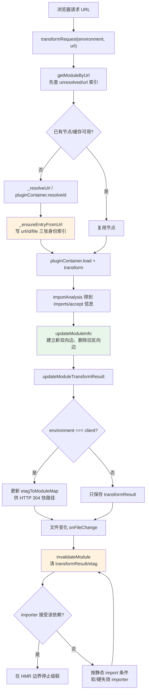
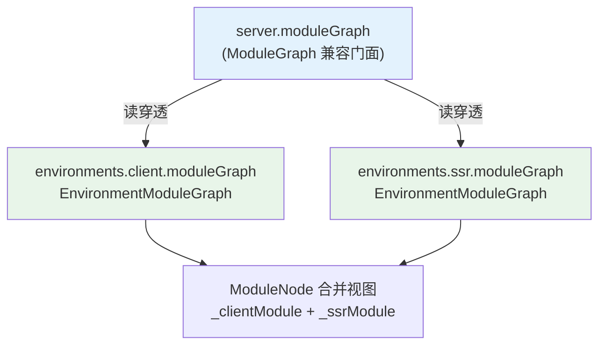

# 09 · 模块图与依赖追踪：以及「每环境独立模块图」的演变

> 本节调试目标：看清 Vite dev server 在内存里维护的那张「模块图」——它记录了每个模块的 url/id/文件、谁导入谁、HMR 接受关系、转换缓存。理解它，前面几节（按需编译的缓存、HMR 的边界传播）才有了统一的数据底座。同时讲清 Environment API 之后，模块图如何从「一张混合图」演变成「每个环境一张独立图」，以及为兼容老生态保留的那层 `ModuleGraph` 门面。
>
> 源码基线：Vite 8.1.0。入口：`packages/vite/src/node/server/moduleGraph.ts`、`server/mixedModuleGraph.ts`。

---

## 一、模块图是什么、为什么需要它

承接 [08-HMR实现原理.md](./08-HMR实现原理.md)：上一篇的 `propagateUpdate` 能沿 `importers` 向上找 HMR 边界，并不是临时扫描源码，而是在读取本篇要讲的模块图。

调试时要先记住一条入口链路：浏览器模块请求先进 `transformMiddleware`，再到 `transformRequest` 的 `resolve -> load -> transform` 管线。这里容易误解的是，模块图不是在一个地方“一次性扫描完成”的，而是分两步逐渐长出来：

1. `loadAndTransform` 里先把“当前请求模块”放进图。源码位置是 `transformRequest.ts` 的 `mod ??= await moduleGraph._ensureEntryFromUrl(url, undefined, resolved)`。这一步发生在成功拿到 `code` 之后、执行插件 `transform` 之前，主要是建立当前模块的 `url/id/file` 索引，让后续缓存、HMR、sourcemap 都能通过同一个节点找到它。注意，这里还没有扫描当前模块源码里的 import，也就还没有真正建立“谁依赖谁”的边。
2. 随后 `pluginContainer.transform(code, id, ...)` 开始按顺序执行插件。`vite:import-analysis` 被放在内部插件链末尾，等前面的插件都改写完代码后，再用 `es-module-lexer` 扫描最终代码里的 import。扫描到 `import './foo.ts'` 这类依赖时，它不是把这段 import 文本塞进当前节点，而是把 `./foo.ts` resolve 成模块 URL/ID，并调用 `_ensureEntryFromUrl` 为“被导入的模块”创建或复用节点；同时把这些依赖 URL 临时收集到 `importedUrls` 集合里。到这一步为止，只能说依赖节点准备好了、依赖清单收集好了，还没有把双向依赖边正式写进模块图。
3. 扫描完成后，`vite:import-analysis` 调用 `moduleGraph.updateModuleInfo(importerModule, importedUrls, ...)`。这一步才是真正“连边”：更新当前模块的 `importedModules`，同时把当前模块写进依赖模块的 `importers`，并记录 HMR 的 `acceptedHmrDeps`、`acceptedHmrExports`、`isSelfAccepting` 等信息。

所以可以把 `_ensureEntryFromUrl` 理解成“建节点、建索引”，把 `updateModuleInfo` 理解成“按 import 分析结果重建依赖边”。前者既会被 `transformRequest` 用来登记当前模块，也会被 `import-analysis` 用来登记依赖模块；后者主要由 `import-analysis` 在 transform 末尾触发。

建议先打好下面这些断点，再刷新一次 dev 页面、改一次被入口静态导入的模块：

| 推荐断点 | 核心函数 / 位置 | 常见进入路径 | 函数主要作用 | 重点观察 |
|---|---|---|---|---|
| `server/index.ts:614` | `_createServer` → `new ModuleGraph` | dev server 创建阶段装配 `server.moduleGraph` 时进入 | 创建旧版混合 `ModuleGraph` 门面：它本身不再是真实单一模块图，而是通过 client/ssr 两个惰性 getter 读到各自的 `EnvironmentModuleGraph`，让旧插件仍能用 `server.moduleGraph` API | `environments.client.moduleGraph` 与 `environments.ssr.moduleGraph` 是否是两张独立图；传给 `new ModuleGraph` 的 getter 何时求值；旧 `server.moduleGraph` 调用最终落到哪张环境图 |
| `moduleGraph.ts:363` | `EnvironmentModuleGraph._ensureEntryFromUrl` | 当前请求模块从 `transformRequest.ts` 的 `loadAndTransform` 进入；被 import 的依赖从 `vite:import-analysis` 的 `normalizeUrl` 进入 | 确保某个 URL 在模块图中有节点：先去 unresolved URL 缓存和 `idToModuleMap` 复用旧节点，首次遇到时才创建 `EnvironmentModuleNode`，并登记 `urlToModuleMap`、`idToModuleMap`、`fileToModulesMap` 三类索引；这里不负责建立 import 依赖边 | `rawUrl` 如何去掉 `?import`/时间戳；`resolvedId` 是否命中旧节点；新节点的 `url/id/file` 分别是什么；同一个文件是否在 `fileMappedModules` 下挂了多个模块 |
| `moduleGraph.ts:257` | `EnvironmentModuleGraph.updateModuleInfo` | `vite:import-analysis.transform` 末尾进入；即使本次没有 import，也会进入以清空上一次 transform 留下的旧边 | 根据 import-analysis 扫描出的 `importedUrls` 重建模块关系：更新当前模块的 `importedModules`，把当前模块写入依赖模块的 `importers`，删除本次不再导入的旧边，并记录 HMR 的接受依赖、接受导出和自接受状态 | `prevImports` 和 `nextImports` 有什么差异；哪些旧依赖进入 `noLongerImported`；依赖模块的 `importers` 是否新增/删除当前模块；`acceptedHmrDeps`、`acceptedHmrExports`、`isSelfAccepting` 是否符合源码里的 `import.meta.hot.accept` |
| `moduleGraph.ts:171` | `EnvironmentModuleGraph.invalidateModule` | 文件变更后 HMR 流程进入：`handleHMRUpdate` / `updateModules` 会对受影响模块调用；全量失效时 `invalidateAll` 也会批量进入 | 清除模块的 `transformResult`、ETag、SSR 错误等缓存，并沿 `importers` 反向传播失效；静态 importer 可走软失效，保留旧 transform 结果，下一次请求只更新时间戳，避免不必要的完整重编译 | `softInvalidate` 是否为真；`invalidationState` 是旧 `transformResult` 还是 `HARD_INVALIDATED`；`seen` 如何避免循环递归；`lastHMRTimestamp` 是否更新；哪些 importer 被继续级联失效 |
| `moduleGraph.ts:469` | `updateModuleTransformResult` | 整个插件 `transform` 链结束后写入，也就是 `vite:import-analysis.transform` 已经完成、`updateModuleInfo` 已经更新完依赖关系之后；软失效复用旧结果并更新时间戳时也会再次写入 | 把本次转换结果挂到模块节点的 `transformResult` 上，作为后续请求的内存缓存；client 环境还会维护 `etagToModuleMap` 反向索引，让 304 / sourcemap 等请求能从 ETag 找回模块 | 写入前后 `mod.transformResult` 和 `etag` 如何变化；旧 ETag 是否从 `etagToModuleMap` 移除；只有 client 图是否维护 ETag 反查；SSR / module runner 场景的 result 结构有何不同 |

dev server 处理的不是一个个孤立的模块，而是一张相互 import 的网。很多能力都依赖「知道这张网长什么样」：

- HMR 要沿 import 关系向上找边界（[08-HMR实现原理.md](./08-HMR实现原理.md)）；
- 缓存要知道某个模块的转换结果存在哪、是否失效（[05-按需编译与devserver请求处理流程.md](./05-按需编译与devserver请求处理流程.md)）；
- 文件改动时要知道这个文件对应哪些模块、要让谁失效。

模块图（`EnvironmentModuleGraph`）就是这张网在内存里的表示：节点是 `EnvironmentModuleNode`，边是 import/被 import 关系。

读源码时建议把模块图拆成三类信息来看：第一类是身份信息（`url/id/file`），解决“这个请求到底对应哪个模块”；第二类是关系信息（`importers/importedModules/acceptedHmrDeps`），解决“HMR 往哪传播、在哪里停”；第三类是缓存信息（`transformResult/etag/invalidationState`），解决“这次请求能不能短路”。`moduleGraph.ts` 里新增的小册注释基本都围绕这三类信息展开。

---

## 二、节点结构：一个模块记了哪些信息

文件：`packages/vite/src/node/server/moduleGraph.ts`（`EnvironmentModuleNode`，L14–81）

| 字段 | 含义 |
|---|---|
| `environment` | 所属环境名（`client`/`ssr`/自定义） |
| `url` | 浏览器请求用的 url（以 `/` 开头） |
| `id` | resolve 后的真实 id（含 query） |
| `file` | 去掉 query 的文件路径 |
| `type` | `'js' \| 'css' \| 'asset'` |
| `importers` | **谁导入了我**（`Set<节点>`）——HMR 向上传播靠它 |
| `importedModules` | **我导入了谁**（`Set<节点>`） |
| `acceptedHmrDeps` | 我接受哪些依赖的 HMR 更新 |
| `isSelfAccepting` | 我是否自接受 HMR |
| `transformResult` | 缓存的转换结果（含 etag） |
| `lastHMRTimestamp` | 最近一次 HMR 时间戳（`?t=` 用） |
| `invalidationState` | 软/硬失效状态 |
| `staticImportedUrls` | 仅静态 import 的 url 集合（软失效用） |

一个模块同时是「别人的导入者」和「别人的被导入者」，`importers` 与 `importedModules` 这对双向边，就是整张图的骨架。

### 四张公开索引表

`EnvironmentModuleGraph` 暴露四张 Map。它们不是四份模块数据，而是四种“从不同入口找到同一个 `EnvironmentModuleNode`”的索引：

文件：`packages/vite/src/node/server/moduleGraph.ts`（L93–97）

```ts
urlToModuleMap: Map<string, EnvironmentModuleNode> = new Map()
idToModuleMap: Map<string, EnvironmentModuleNode> = new Map()
etagToModuleMap: Map<string, EnvironmentModuleNode> = new Map()
// 同一个文件可能对应多个 query 变体的模块
fileToModulesMap: Map<string, Set<EnvironmentModuleNode>> = new Map()
```

假设项目根目录是 `/demo`，浏览器请求 `/src/App.vue?vue&type=style&index=0&lang.css`，它 resolve 后对应的模块节点大致是：

```ts
const styleNode = {
  url: '/src/App.vue?vue&type=style&index=0&lang.css',
  id: '/demo/src/App.vue?vue&type=style&index=0&lang.css',
  file: '/demo/src/App.vue',
}
```

四张索引表会从不同 key 指向这个节点：

| 索引表 | key 是什么 | value 是什么 | 什么时候用 | 例子 |
|---|---|---|---|---|
| `urlToModuleMap` | 浏览器请求 URL | 单个模块节点 | 请求进来、按 URL 找缓存或节点 | `'/src/App.vue?vue&type=style&index=0&lang.css' -> styleNode` |
| `idToModuleMap` | 插件 resolve 后的 id | 单个模块节点 | 插件链、缓存逻辑已经拿到 resolved id 时 | `'/demo/src/App.vue?vue&type=style&index=0&lang.css' -> styleNode` |
| `fileToModulesMap` | 去掉 query 后的文件路径 | 模块节点集合 `Set` | 文件变更时，chokidar 只知道哪个文件变了 | `'/demo/src/App.vue' -> Set { appNode, styleNode }` |
| `etagToModuleMap` | transform 结果的 ETag | 单个模块节点 | client 侧 HTTP 304 / ETag 反查 | `'W/"91a0-def456"' -> styleNode` |

这里最容易混淆的是 `id` 和 `file`：`id` 保留 query，用来区分同一文件拆出的不同模块；`file` 去掉 query，用来在文件变更时一次找回这个文件关联的所有模块。所以 `fileToModulesMap` 的 value 必须是 `Set`，例如 `/demo/src/App.vue` 可能同时对应普通 SFC 节点、template 节点、style 节点。

为什么 `etagToModuleMap` 只在 `environment === 'client'` 时维护？因为 ETag 反查服务的是浏览器 HTTP 缓存路径：浏览器带 `If-None-Match` 请求模块时，dev server 可以用 ETag 快速找回之前的 client transform 结果，决定是否返回 304。SSR / module runner 虽然也需要缓存转换结果，但它们不是通过浏览器 HTTP 条件请求来取模块，不需要用 ETag 反查节点，所以只保存 `mod.transformResult` 就够了。

还要区分“图有四张公开索引表”和“节点创建时登记三张表”：`_ensureEntryFromUrl` 只写 URL、ID、file 三张身份索引；ETag 要等 transform 成功并调用 `updateModuleTransformResult` 后才有。另有内部的 `_unresolvedUrlToModuleMap`，它缓存节点或正在 resolve 的 Promise，用来合并同一原始 URL 的并发解析，不属于上述四张公开索引。

---

## 三、亲手调试：一个模块怎么进图、怎么连边

在 `moduleGraph.ts:363`（`_ensureEntryFromUrl`）和 `moduleGraph.ts:257`（`updateModuleInfo`）打断点，刷新页面，看节点如何被创建、边如何被连起来。



### 核心函数速查

| 函数 / 结构 | 主要作用 | 为什么关键 |
|---|---|---|
| `EnvironmentModuleNode` | 保存身份、双向依赖、HMR 边界和转换缓存 | 把“模块”从一个文件名提升为某环境中的运行状态节点 |
| `getModuleByUrl` / `getModuleById` / `getModulesByFile` | 从不同身份维度命中节点 | 请求、插件解析、文件监听使用的 key 不同，不能只建一张表 |
| `_ensureEntryFromUrl` | resolve URL 并创建/复用节点 | 用 `_unresolvedUrlToModuleMap` 合并并发 resolve，避免重复节点 |
| `updateModuleInfo` | 原子式替换 import 集合，补新反向边并剪掉旧反向边 | HMR 必须读到当前依赖，而不是历史依赖 |
| `updateModuleTransformResult` | 写缓存并维护 client ETag 索引 | 把转换缓存与 HTTP 条件请求连接起来 |
| `invalidateModule` | 标记软/硬失效、清缓存、按 accept 边界向上递归 | 同时保证正确性与“只改时间戳”的性能优化 |

### 创建节点：_ensureEntryFromUrl

请求一个模块时，`_ensureEntryFromUrl`（L363–421）先 resolve url 拿到 id，若图里还没有就新建 `EnvironmentModuleNode`，同时写入 `urlToModuleMap`、`idToModuleMap`、`fileToModulesMap`。它还用 `_unresolvedUrlToModuleMap` 缓存「url → 节点的 promise」，对并发解析同一 url 做去重。

### 连边：updateModuleInfo

节点创建只是有了「点」，「边」是 `importAnalysis` 转换完模块、知道它 import 了哪些 url 后，调 `updateModuleInfo` 连起来的。`updateModuleInfo` 同时接收两类关系输入：`importedUrls` 写入普通的 `importedModules/importers` 双向边，`normalizedAcceptedUrls` 写入 `acceptedHmrDeps`，表示“传播到当前模块时能不能停”。

文件：`packages/vite/src/node/server/moduleGraph.ts`（L270–300，已简化）

```ts
for (const imported of importedModules) {
  if (typeof imported === 'string') {
    resolvePromises.push(
      this.ensureEntryFromUrl(imported).then((dep) => {
        dep.importers.add(mod)        // 被导入者记下「mod 导入了我」
        resolveResults[nextIndex] = dep
      }),
    )
  } else {
    imported.importers.add(mod)
    resolveResults[nextIndex] = imported
  }
}
// ...
mod.importedModules = nextImports     // mod 记下「我导入了这些」
```

这是双向的：`mod.importedModules` 加入依赖，每个依赖的 `importers` 加入 `mod`。`updateModuleInfo` 还会做「剪枝」——比 上次少 import 的依赖，要从它们的 `importers` 里移除 `mod`，并收集可能变成孤儿的模块。HMR 的 accept 关系（`acceptedHmrDeps`）也在这里一并更新。

### importAnalysis 的 accept 支线：先收集，后 normalize

`import.meta.hot.accept(...)` 是 import-analysis 里容易看乱的一条支线。它为什么不在前面扫描 `imports` 时顺手完整处理，而是先收集、后面再 normalize？原因是前面的 `imports.map(...)` 按 `parseImports(source)` 的语法点逐个处理，普通 `import './foo'` 会进入 `specifier -> normalizeUrl -> importedUrls` 这条普通依赖流程，顺带做 safe module 记录、预热转换、URL 改写等动作；但 `accept('./foo')` 里的 `'./foo'` 不是普通 import specifier，语义上也不应该进入 `importedUrls`。因此前面遇到 `import.meta.hot.accept(...)` 时只用 `lexAcceptedHmrDeps` 把参数先收集到 `acceptedUrls`，等普通 import 扫描结束后，再单独 normalize 成 `normalizedAcceptedUrls`，最终由 `updateModuleInfo` 写入 `acceptedHmrDeps`。这样可以避免把“普通依赖边”和“HMR 接受边界”混在同一条处理链里。

### 失效：invalidateModule

文件改动时 `onFileChange` → `invalidateModule`（L166–234）会先更新 `invalidationState`，删除旧 ETag 索引并清空 `transformResult`，再向 `importers` 级联。`seen` 既防环，也允许“先软后硬”时升级最终状态：源码把状态更新放在 `seen` 判断之前，正是为了避免循环图里漏掉升级。若 importer 已通过 `acceptedHmrDeps` 接受当前模块，传播在这条边停止；否则静态 JS import 可软失效，动态/监听关系或非 JS importer 需要硬失效。软失效会把旧 transform 结果暂存进 `invalidationState`，配合 [05-按需编译与devserver请求处理流程.md](./05-按需编译与devserver请求处理流程.md) 的 `handleModuleSoftInvalidation` 实现「复用代码，只改 import 时间戳」。

---

## 四、从「一张混合图」到「每环境一张图」

这是 Environment API 带来的最大演变。

### 旧世界：一张混合 client+ssr 的图

Environment API 之前，`server.moduleGraph` 是一张图，里面混着 client 和 ssr 的模块（ssr 模块用单独字段区分）。这有个结构性问题：同一个文件在 client 和 ssr 下可能转换结果不同、依赖关系不同，硬塞进一张图既别扭又容易串味。

### 新世界：每个环境一张 EnvironmentModuleGraph

现在每个 `DevEnvironment` 持有自己的 `EnvironmentModuleGraph`，节点上带 `environment` 标记。client 和 ssr 的图**完全独立**——同一个文件在两个环境里是两个不同的节点，各有各的转换结果和 import 边。

文件：`packages/vite/src/node/server/environment.ts`（L142–144）

```ts
this.moduleGraph = new EnvironmentModuleGraph(name, (url: string) =>
  this.pluginContainer!.resolveId(url, undefined),
)
```

注意构造时传入的 resolve 回调指向**本环境的** pluginContainer——所以每张图的解析也是环境隔离的。

### 兼容层：mixedModuleGraph.ts

可问题来了：海量生态插件还在用 `server.moduleGraph` 和 `ModuleNode`。直接改名会炸掉整个生态。Vite 的解法是保留 `ModuleGraph`/`ModuleNode`，但把它做成**两张环境图之上的门面**：

文件：`packages/vite/src/node/server/index.ts`（L614–618）

```ts
let moduleGraph = new ModuleGraph({
  client: () => environments.client.moduleGraph,
  ssr: () => environments.ssr.moduleGraph,
})
```

`ModuleGraph` 不复制真实图数据。`getModuleByUrl` 会同时查询 client/ssr；URL/ID Map 对两图取近似并集；file Map 合并两边节点；但 ETag Map 和 `getModuleByEtag` 明确只读 client 图。返回的 `ModuleNode` 保存 `_clientModule` + `_ssrModule`：`importers`/`importedModules` 是兼容并集，`acceptedHmrDeps`、`isSelfAccepting`、`transformResult` 等浏览器 HMR/转换语义主要取 client 节点。`DualWeakMap` 缓存这个包装，避免同一对底层节点每次查询都产生不同对象。访问 `server.moduleGraph` 还会给出弃用警告。



它只混合默认 `client` 与 `ssr`，不会自动覆盖任意自定义环境。新代码应直接使用 `server.environments[name].moduleGraph`；mixed 门面是旧生态迁移桥，不是 Environment API 的统一入口。

### 常见误解

1. **“模块图按文件一对一建节点”**：错。同一文件可因 query、环境或解析结果形成多个节点，所以 `fileToModulesMap` 的值是 `Set`。
2. **“有四张 Map，所以进图时四张一起写”**：错。节点先写 URL/ID/file；ETag 在 client transform 成功后才写。
3. **“失效就是删节点”**：错。通常保留身份与依赖信息，清转换结果并记录失效状态；下一次请求再重算。
4. **“软失效什么都不做”**：错。它仍清当前缓存，但保留旧 transform 结果用于重写依赖时间戳，避免完整 load/transform。
5. **“server.moduleGraph 就是所有环境图的总和”**：错。它仅兼容混合 client/ssr，且不同字段有不同投影语义。

### 为什么这样设计

- **双向边换取低成本传播**：正向边方便知道“我依赖谁”，反向边让文件变化时无需全图扫描即可向 importer 传播；代价是每次 transform 都必须对称增删。
- **多索引换取热路径 O(1) 查找**：HTTP URL、resolved ID、磁盘文件、ETag 来自不同入口，各自维护索引比反复遍历图更适合 dev 热路径。
- **失效状态而非删除节点**：身份和关系仍有价值，保留节点能支持 HMR、请求去重与缓存重建；软/硬两级进一步减少无意义重转。
- **真实环境图 + mixed 门面**：新模型获得隔离，旧插件获得迁移期兼容；代价是门面不可能让所有字段都同时代表两个环境。

---

## 五、本节小结

**这段实现解决了什么问题？**
模块图给 dev server 提供了一张「谁导入谁、各模块状态如何」的内存地图，让按需编译的缓存、文件失效、HMR 边界传播都有了统一的数据底座。`importers`/`importedModules` 双向边支撑 HMR 向上传播，四张公开索引表支撑不同 key 的快速查找。Environment API 把它从「一张混合图」重构为「每环境一张独立图」，让 client/ssr 互不串味。

**它带来了什么复杂度 / 代价？**
「每环境独立图」更干净，但为了不破坏生态，必须额外维护一层 `mixedModuleGraph` 门面，把对两张图的读写合并成老的 `ModuleNode` 视图——这层门面本身有理解成本和潜在的语义缝隙（比如 `transformResult` 只取 client）。双向边的维护、软/硬失效的级联、并发解析去重，也都是必须严格正确否则就出「改了没生效 / 内存泄漏孤儿节点」的精细活。这是「正确的底层抽象」与「不破坏存量生态」之间的取舍。

**读完你应当能做到：**

- [ ] 说出 `EnvironmentModuleNode` 的关键字段，特别是 `importers`/`importedModules` 双向边的作用；
- [ ] 解释一个模块如何「进图」（`_ensureEntryFromUrl`）与「连边」（`updateModuleInfo`）；
- [ ] 区分四张公开索引表与 `_ensureEntryFromUrl` 实际写入的三张身份索引，并说明 ETag 只在 client transform 结果写入时维护；
- [ ] 说明软/硬失效如何沿双向边传播，以及 accept 边界为什么会截断传播；
- [ ] 说清从「混合图」到「每环境独立图」的演变，以及 `mixedModuleGraph` 门面为什么存在；
- [ ] 在 `updateModuleInfo` 断点观察双向边的建立。

下一节顺势讲清楚承载这些独立模块图的容器——[10-多环境模型EnvironmentAPI实现.md](./10-多环境模型EnvironmentAPI实现.md)。
