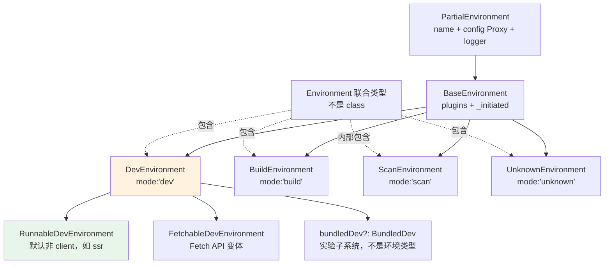
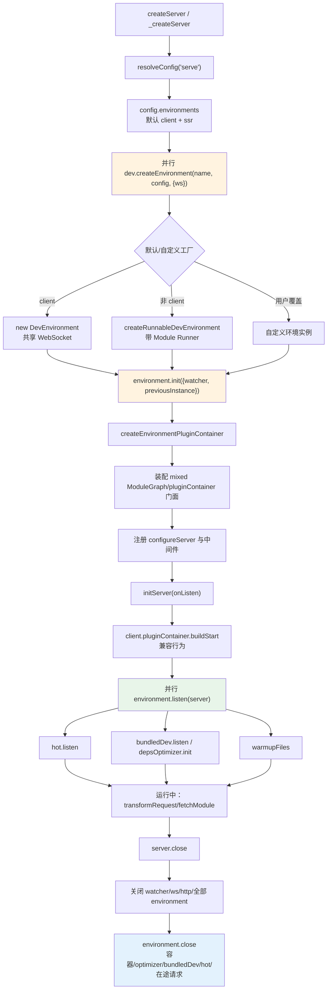
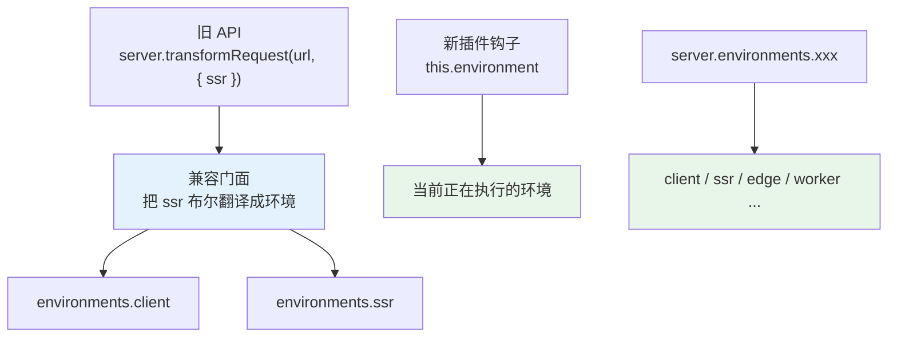

# 10 · 多环境模型（Environment API）的实现：DevEnvironment、独立模块图与请求转换的重构

> 本节调试目标：把前面几节反复出现的「环境」（client/ssr/...）这个概念彻底落地——看 `DevEnvironment` 是个什么对象、它持有哪些东西（模块图、插件容器、依赖优化器、HMR 通道），环境是怎么从 `config.environments` 创建出来的，以及老的 `server.moduleGraph`/`server.transformRequest` 如何映射到「某个环境上的操作」。
>
> 源码基线：Vite 8.1.0。入口：`server/environment.ts`、`baseEnvironment.ts`、`environment.ts`。本节讲**实现**；用法见第一阶段第 4 章，设计动因留待第三阶段。

---

## 一、为什么要有「环境」这个抽象

承接 [09-模块图与依赖追踪.md](./09-模块图与依赖追踪.md)：上一节已经看到模块图不再只有一张，而是每个 `DevEnvironment` 各有一张。本节要回答的问题是：**既然有多张图，那这些“环境”对象到底是谁、谁创建、何时启动，又如何兼容旧的 server API？**

先说结论：Environment API 是 Vite 把「client / ssr / edge 等不同运行目标」从一个 `ssr: boolean` 升级成一个对象模型的过程。这个对象就是环境，它自己持有配置、插件容器、模块图、依赖优化器、HMR 通道和请求转换入口。

读这节时可以抓住四个问题：

1. **环境对象长什么样**：看 `DevEnvironment` 持有哪些东西。
2. **环境从哪里来**：看 `_createServer` 如何按 `config.environments` 创建 client、ssr 和自定义环境。
3. **环境什么时候真正启动**：区分 `init()`、`listen()`、`close()` 三个阶段。
4. **旧 API 如何接到新模型上**：理解 `server.moduleGraph`、`server.transformRequest({ ssr })` 这些旧入口如何读穿透到具体环境。

为什么需要这个对象模型？Vite 6 之前，dev server 的世界基本是「为浏览器服务」的：一张模块图、一个转换流程。但现代应用早就不止「浏览器」一个目标：

- **SSR**：同一份代码要在 Node 里跑，转换方式（外部化依赖、不注入 HMR client）和浏览器不同；
- **Edge / Workers**：又是一套运行时，连 API 都和 Node 不一样；
- 一个项目可能**同时**有 client + ssr + edge 多个目标并发跑。

旧模型用 `ssr: boolean` 这一个布尔到处打补丁，越来越力不从心。Environment API 的解法不是继续在旧流程里多传几个参数，而是让每个运行目标拥有自己的运行子系统。

带着这条主线，再打下面这些断点：

| 推荐断点 | 核心函数 / 位置 | 常见进入路径 | 函数主要作用 | 重点观察 |
|---|---|---|---|---|
| `server/index.ts:593` | `_createServer` → `environmentOptions.dev.createEnvironment` | `createServer` 完成配置解析、创建 watcher/ws 后，遍历 `config.environments` 时进入 | 按环境名调用各自的 dev 工厂创建运行时实例：默认 `client` 生成浏览器侧 `DevEnvironment`，`ssr` 等非 client 环境生成带 runner 能力的 `RunnableDevEnvironment`，自定义环境也在这里接入 | `name` 是 `client` 还是 `ssr`；`environmentOptions.dev.createEnvironment` 来自默认工厂还是用户覆盖；传入的 `context` 是否带共享 `ws`；返回实例的 class、`mode`、`config.consumer` 有什么差异 |
| `server/environment.ts:142` | `DevEnvironment` constructor → `new EnvironmentModuleGraph` | 工厂内部 `new DevEnvironment(...)` / `createRunnableDevEnvironment(...)` 构造环境实例时进入 | 初始化环境级状态，并创建本环境独立模块图；模块图的 resolve 回调闭包绑定到 `this.pluginContainer!.resolveId`，保证同一个 URL 在 client/ssr 下能走各自的插件容器解析 | `name`、`options.isBundled`、`config.experimental.bundledDev` 如何影响 `bundledDev` 与 `disableDepsOptimizer`；`moduleGraph.environment` 是哪个环境；此时 `_pluginContainer` 是否还没创建但 resolve 闭包已绑定 |
| `server/environment.ts:236` | `DevEnvironment.init` → `createEnvironmentPluginContainer` | 环境实例创建后，`_createServer` 立即调用 `environment.init({ watcher, previousInstance })` 时进入；server 重启创建新环境时也会进入 | 为当前环境创建独立插件容器，只做插件容器初始化，不启动 HMR、依赖优化器或 warmup；`_initiated` 保证重复 init 直接返回 | `_initiated` 从 `false` 到 `true` 的变化；`this.config.plugins` 是否已经按环境过滤/替换；`watcher` 与 `previousInstance` 如何传入；init 后 `depsOptimizer` 是否尚未 `init()` |
| `server/index.ts:614` | `_createServer` → `new ModuleGraph` | 全部环境 create + init 完成后，装配旧 `server.moduleGraph` 兼容 API 时进入 | 创建旧版混合模块图门面：它不是新的真实模块图，而是通过 client/ssr 两个 getter 读到各自环境的 `EnvironmentModuleGraph`，让旧插件继续使用 `server.moduleGraph` | `environments.client.moduleGraph` 与 `environments.ssr.moduleGraph` 是否独立；传给 `new ModuleGraph` 的 getter 何时求值；访问旧 `server.moduleGraph` 时是否触发弃用提示；自定义环境是否不在这个二分门面里 |
| `server/index.ts:1115` | `_createServer` 内 `initServer` | 非 middleware 模式下包裹 `httpServer.listen` 后、真正监听端口前进入；middleware 模式或无 httpServer 时 `_createServer` 末尾直接进入 | 作为启动副作用闸门，保证 server 只初始化一次：先为 client 插件容器调用兼容性的 `buildStart`，再按需并行调用所有环境的 `listen(server)` | `serverInited`、`initingServer` 如何避免重复初始化；`onListen` 与 `options.listen` 如何决定是否执行 `environment.listen`；为什么只对 client 提前 `buildStart`，其它环境延迟到首次 transform |
| `server/environment.ts:249` | `DevEnvironment.listen` | `initServer` 判断需要启动环境副作用后，对 `Object.values(environments)` 并行调用时进入 | 启动本环境的 hot channel，并并行启动 `bundledDev.listen()` / `depsOptimizer.init()`，最后触发 `warmupFiles(server, this)`；预构建和 warmup 都是在 listen 阶段才真正开始 | `this.hot.listen()` 是否是共享 WebSocket 或自定义 hot channel；`bundledDev` 与 `depsOptimizer` 是否互斥；`depsOptimizer.init()` 是否会启动扫描；`warmupFiles` 收到的是哪个环境 |
| `server/environment.ts:366` | `DevEnvironment.close` | server 关闭、重启替换环境，或 `closeServer` 批量关闭 `server.environments` 时进入 | 收口环境级资源：标记 `_closing`、取消 crawl-end 等待，并行关闭插件容器、bundled dev、依赖优化器、自定义 hot channel，同时等待 `_pendingRequests` 清空 | `_closing` 是否置为 `true`；`Promise.allSettled` 里哪些项存在；共享 WebSocket 为什么不在环境 close 中关闭；`_pendingRequests.size` 如何循环等待到 0 |
| `server/index.ts:626` | `_createServer` 内 `closeServer` | 调用 `server.close()` 或 dev server 重启清理旧实例时进入 | 收口 server 级资源：并行关闭 watcher、共享 ws、所有环境、http server 与旧 SSR 兼容 runner；环境内部资源再交给各自 `environment.close()` 处理 | server 级 `ws.close()` 与环境级 `hot.close()` 的边界；`Object.values(server.environments)` 是否覆盖 client/ssr/自定义环境；`closeServerPromise` 如何避免重复关闭；关闭后 `resolvedUrls` 与 `_ssrCompatModuleRunner` 如何清空 |

---

## 二、先分清几个 Environment 相关类型

这一节不是让你背类型继承图，而是先排除一个常见误解：**`Environment` 不是某个所有环境都继承的 class**。在 Vite 源码里，它更多是一个公共入口类型，用来把 dev、build、scan 等不同阶段的环境放到同一套模型下。

先从文件名开始看，避免读源码时跳错文件：

| 文件 | 定义了什么 | 在环境模型里的作用 |
|---|---|---|
| `packages/vite/src/node/environment.ts` | 公共 `Environment` 联合类型与 `perEnvironmentState` | 给 dev、build、scan、unknown 几类环境一个统一类型入口；读这里能先确认“Environment 不是基类，而是一组具体环境的集合” |
| `packages/vite/src/node/baseEnvironment.ts` | `PartialEnvironment`、`BaseEnvironment`、`UnknownEnvironment` | 抽出所有环境共享的基础能力：环境名、按环境代理后的 config、logger、plugins 与 `_initiated` 标记；后面的 dev/build/scan 环境都复用这层 |
| `packages/vite/src/node/server/environment.ts` | dev 期工作的 `DevEnvironment` | 承载本节主线：每个 dev 环境自己的模块图、插件容器、依赖优化器、HMR 通道与请求转换入口都挂在这里 |
| `packages/vite/src/node/optimizer/scan.ts` | 依赖扫描专用 `ScanEnvironment` | 给依赖预构建扫描阶段一个受限环境上下文，让扫描插件能拿到 `this.environment`，但刻意不暴露完整 dev server 能力 |
| `packages/vite/src/node/build.ts` | `BuildEnvironment` 与构建编排 | 把同一套 Environment API 延伸到 build 期，让构建也能按 client/ssr/自定义环境分别组织插件、配置与输出流程 |

下面这张图只看两层关系：虚线表示“`Environment` 这个联合类型包含哪些成员”，实线表示“这些具体环境复用了哪条基类链”。



要点：

- `Environment` 是 `packages/vite/src/node/environment.ts:7` 的**联合类型**（`DevEnvironment | BuildEnvironment | ScanEnvironment | UnknownEnvironment`），不是一个基类，也不能 `new Environment()`；
- 真正干 dev 期活的是 `DevEnvironment`；
- 默认 `client` 环境是直连浏览器的 `DevEnvironment`，默认 `ssr`（及其它非 client 环境）是 `RunnableDevEnvironment`（带一个能在 Node 里执行模块的 runner）。
- `BaseEnvironment` 才是共享 `name/config/logger/plugins/_initiated` 的实现基类，不能把它等同于公共 `Environment` 类型。
- `BundledDev` 不是 `BundledDevEnvironment`：Vite 8.1.0 本地源码没有后者。它是 `DevEnvironment.bundledDev` 持有的实验性 Rolldown dev 子系统。

---

## 三、DevEnvironment：dev 期真正干活的环境对象

如果说 `Environment` 是“一个运行目标”的抽象名字，那 `DevEnvironment` 就是 dev server 里真正干活的环境实例。前面 04~09 讲过的预构建、请求转换、模块图、HMR，在新模型里都不是挂在一个全局 server 上，而是落到某个 `DevEnvironment` 上。

文件：`packages/vite/src/node/server/environment.ts`（构造函数 L112–214，已摘要）

| 属性 | 说明 | 为什么重要 |
|---|---|---|
| `moduleGraph` | 本环境独立的 `EnvironmentModuleGraph` | client 和 ssr 不再共用一张图；模块缓存、HMR 依赖边都按环境隔离 |
| `pluginContainer` | 本环境的插件容器（`init()` 时创建） | 同一个插件 hook 可以在不同环境里得到不同的 `this.environment`、resolve 结果和配置视图 |
| `depsOptimizer` | 本环境的依赖预构建器（client 实验态可能禁用） | 依赖扫描、预构建缓存也跟环境绑定，避免不同运行目标共用错误结果 |
| `hot` | HMR 通道（client 是 WebSocket，其它可自定义） | HMR 不再只是浏览器 WebSocket；非 client 环境可以有自己的热更新通信方式 |
| `_pendingRequests` | 本环境的请求去重表 | 同一个 URL 在不同环境下可以并行转换，去重和关闭等待都要按环境管理 |
| `bundledDev?` | `isBundled` 或 client `experimental.bundledDev` 开启时创建的实验性 Rolldown dev 子系统 | 这是实验支线，不是默认 dev 主线，也不是新的环境类型 |

可以这么理解：**前面 04~09 讲的那些机制，其实都是「某个 DevEnvironment 上的机制」**。client 有一套（模块图 + 容器 + 优化器 + HMR），ssr 又有独立的一套。

构造函数里把模块图的 resolve 回调绑定到「本环境的插件容器」：

文件：`packages/vite/src/node/server/environment.ts`（L142–144）

```ts
this._pendingRequests = new Map()
this.moduleGraph = new EnvironmentModuleGraph(name, (url: string) =>
  this.pluginContainer!.resolveId(url, undefined),
)
```

这一句就是「环境隔离」的具象：每张图的 resolve 走各自的插件容器，因此 client 解析 `foo` 和 ssr 解析 `foo` 可以得到不同结果。

### `init`、`listen`、`close` 的分工

- `init()`（L219–240）：创建 `pluginContainer`（用本环境过滤后的插件，见 [03-插件注册与排序.md](./03-插件注册与排序.md) 的 `applyToEnvironment`）；
- `listen()`（L249–252）：启动 HMR 通道、初始化 `depsOptimizer`、warmup 文件。预构建在这里才真正开始（呼应 [04-依赖预构建.md](./04-依赖预构建.md)）。
- `close()`（L366–389）：标记 closing、取消 crawl-end 等待，并行关闭插件容器、bundled dev、依赖优化器与自定义 hot channel，同时等待 `_pendingRequests` 清空。

`_createServer` 并不是构造后立刻 listen：L590–607 先并行 create + init，等 server 对象和中间件装配完成，`initServer`（L1115–1146）才在真正监听或 `options.listen` 要求下并行调用全部环境的 `listen(server)`。server 关闭时，L626–641 再把所有 `environment.close()` 与 watcher/ws/http 关闭放进同一个 `Promise.allSettled`。

`transformRequest` 只是个薄壳，转交给 [05-按需编译与devserver请求处理流程.md](./05-按需编译与devserver请求处理流程.md) 讲的那个 `transformRequest(this, url, ...)`：

文件：`packages/vite/src/node/server/environment.ts`（L274–276）

```ts
transformRequest(url, options) {
  return transformRequest(this, url, options)
}
```

---

## 四、环境是怎么创建出来的

`_createServer` 根据 `config.environments`（[02-配置加载与归一化.md](./02-配置加载与归一化.md) 里归一化好的，默认含 client + ssr）逐个创建环境实例：

文件：`packages/vite/src/node/server/index.ts`（L574–589，已简化）

```ts
await Promise.all(
  Object.entries(config.environments).map(async ([name, environmentOptions]) => {
    const environment = await environmentOptions.dev.createEnvironment(name, config, { ws })
    environments[name] = environment
    await environment.init({ watcher, previousInstance })
  }),
)
```

每个环境的 `createEnvironment` 工厂由配置决定：

| 环境 | 默认工厂 | 产物 |
|---|---|---|
| `client` | `defaultCreateClientDevEnvironment` | 直连浏览器的 `DevEnvironment`（`hot: true`、走 WebSocket） |
| 其它（含 `ssr`） | `defaultCreateDevEnvironment` | `RunnableDevEnvironment`（带 Node 端 runner） |

你也可以在 `vite.config` 的 `environments.xxx.dev.createEnvironment` 里提供自定义工厂，造出 edge/workerd 等环境——这就是第一阶段「多运行时并发」用法的实现基础。

### 可跟随的完整装配主线

这张图只追一件事：一个环境从配置项变成可工作的运行对象，经历了哪些阶段。先看主线 create → init → listen → close，`bundledDev`、worker 等支线先不要代入。



### 核心函数速查

| 函数 / 类型 | 主要作用 |
|---|---|
| `PartialEnvironment` | 用 Proxy 组成“环境选项优先、顶层配置兜底”的 config 视图，并给日志加环境标签 |
| `BaseEnvironment` | 提供插件 getter 与 `_initiated` 幂等标记 |
| `resolveDevEnvironmentOptions` | client 选择 `defaultCreateClientDevEnvironment`，其它环境选择 `defaultCreateDevEnvironment` |
| `defaultCreateClientDevEnvironment` | 创建浏览器 client 环境并绑定共享 WebSocket |
| `defaultCreateDevEnvironment` | 经 `createRunnableDevEnvironment` 创建默认 server consumer 环境 |
| `_createServer` | 并行创建、初始化全部 dev 环境，再装配兼容门面和中间件 |
| `DevEnvironment.init/listen/close` | 分别负责容器初始化、副作用启动与环境资源回收 |
| `ScanEnvironment` / `devToScanEnvironment` | 给依赖扫描提供受限环境上下文，刻意不暴露模块图和 server |
| `BundledDev` | 实验性 client full-bundle dev engine，产物驻留 `memoryFiles` |

---

## 五、老 API 如何映射到环境

这一节是兼容支线，不是新的主入口。读它只需要抓住一点：Environment API 内部已经按环境拆开了，但旧插件还会访问 `server.moduleGraph`、`server.transformRequest(url, { ssr })` 这些 server 级 API，所以 Vite 要在 server 上保留一层门面，把旧调用翻译到默认环境上。

### server.moduleGraph → 两张环境图的门面

如 [09-模块图与依赖追踪.md](./09-模块图与依赖追踪.md) 所述，`server.moduleGraph` 是 `ModuleGraph`，读穿透到 `environments.client.moduleGraph` 和 `environments.ssr.moduleGraph`，访问时给弃用警告。

### 旧 API：`ssr` 布尔只是选环境开关

文件：`packages/vite/src/node/server/index.ts`（L691–699 附近）

```ts
// 旧的 server.transformRequest(url, { ssr }) 路由到对应环境
server.transformRequest = (url, options) =>
  environments[options?.ssr ? 'ssr' : 'client'].transformRequest(url)
```

这里要看的是“旧写法如何接到新模型上”：以前调用 `server.transformRequest(url, { ssr: true })`，意思是“按 SSR 方式转换这个模块”；Environment API 后，真正干活的对象已经变成 `environments.ssr`，所以这个布尔值只剩一个作用：在 `client` 和 `ssr` 两个默认环境之间选一个。

`server.pluginContainer` 同理，也是盖在 client/ssr 两个环境插件容器之上的兼容门面。它们是为了让旧插件继续可用，不是 Environment API 的新入口。

### 新插件：直接从 `this.environment` 读取当前环境

新插件不应该继续把“当前目标”理解成 `ssr: true/false`。在 `resolveId`、`load`、`transform` 这些插件钩子里，Vite 会把当前环境挂到 hook 上下文的 `this.environment`：

```ts
transform(code, id) {
  if (this.environment.name === 'ssr') {
    // 这里处理 SSR 环境的转换逻辑
  }
}
```

这才是 Environment API 想表达的新模型：插件钩子不是在问“是不是 SSR”，而是在问“我现在服务的是哪个环境”。如果以后有 `edge`、`worker` 这类自定义环境，`ssr: boolean` 已经表达不了，但 `this.environment.name` 或 `server.environments.edge` 可以直接定位到它。

build 期也沿用这个方向，只是通过 `injectEnvironmentToHooks`（见 [11-构建阶段驱动Rolldown.md](./11-构建阶段驱动Rolldown.md)）把环境注入到插件钩子上下文里。



---

## 六、ScanEnvironment 与 bundled dev 支线

前面讲的是默认 dev 主线：`DevEnvironment` 被创建、初始化、启动，然后处理请求。源码里还有两个名字容易让读者分心，放在这里单独收口。

**`ScanEnvironment`** 位于 `optimizer/scan.ts:42`。它不是一个新的运行时目标，而是依赖预构建扫描阶段用的“受限环境视图”：扫描插件可以拿到合法的 `this.environment.mode === 'scan'`，但 `devToScanEnvironment` 只投影 name/config/logger/plugins/pluginContainer，刻意不暴露模块图和完整 dev server。这样扫描阶段能复用环境化插件上下文，又不会误用运行期能力。

**`BundledDev`** 位于 `server/bundledDev.ts`。它也不是新的 `Environment` 类型，而是挂在 `DevEnvironment.bundledDev` 上的实验性 Rolldown dev 子系统。只有环境配置 `isBundled`，或 client 开启 `experimental.bundledDev` 时才会创建它，并禁用依赖优化器。默认 dev 仍然是插件容器逐请求 `resolveId/load/transform`；不能因为这条实验支线使用 Rolldown，就把默认 dev 描述成 Rolldown 打包。

### 常见误解

1. **“Environment 是所有环境的基类”**：错，它是联合类型；共享基类名叫 `BaseEnvironment`。
2. **“server/environment.ts 定义 Environment 类型”**：错，它定义 `DevEnvironment`；联合类型在上一级 `node/environment.ts`。
3. **“init 就启动了 dev server”**：错，init 只建环境插件容器；listen 才启动 hot、optimizer/bundled dev 与 warmup。
4. **“ssr 是一个特殊硬编码类”**：默认上它是非 client 工厂创建的 `RunnableDevEnvironment`，差异更多来自 consumer 配置与 runner。
5. **“ScanEnvironment 也有完整模块图”**：错，扫描视图刻意限制访问。
6. **“BundledDevEnvironment 是联合类型成员”**：错，本源码没有这个类型；只有挂在 `DevEnvironment` 上的 `BundledDev`。

### 为什么这样设计

- **对象封装环境差异**：把配置、插件、图、缓存、HMR 放进实例，减少在每层传 `ssr` 布尔。
- **create/init/listen 分阶段**：先建对象和插件容器，等 server 装配完成后再启动有副作用的通道；重启也能遵守“新 init → 旧 close → 新 listen”。
- **受限 ScanEnvironment**：扫描插件复用环境化 hook 上下文，却不获得不应使用的运行期能力。
- **兼容门面隔离迁移成本**：旧 API 暂时映射到 client/ssr，新 API 可以自然扩展自定义环境。

---

## 七、本节小结

**这段实现解决了什么问题？**
它把「一个构建/运行目标」抽象成 `Environment` 对象，让 client、ssr、edge 等目标各自拥有独立的配置、插件列表、模块图、插件容器、预构建器和 HMR 通道，从根本上取代了到处打补丁的 `ssr: boolean` 旧模型，支撑「多环境、多运行时并发」。前面 04~09 的所有机制，本质都是「挂在某个 DevEnvironment 上」的。

**它带来了什么复杂度 / 代价？**
这是 Vite 6 以来最大的内部重构，引入了一整套类型层级（PartialEnvironment → BaseEnvironment → DevEnvironment → Runnable/Fetchable）和「全局配置 vs 每环境配置」「全局插件 vs 每环境插件」「混合模块图 vs 每环境图」的双轨结构。为了不破坏存量生态，又必须维护一层把老 server API 读穿透到环境的兼容门面。结构变深、概念变多，是换取「正确的多目标抽象」必须付的学习与维护成本——这正是第三阶段「渐进式演进：大规模重构如何保持向后兼容」要复盘的案例。

**读完你应当能做到：**

- [ ] 说清 `DevEnvironment` 持有哪些东西，并把 04~09 的机制对应到「某个环境上」；
- [ ] 解释环境如何从 `config.environments` 创建，client 与 ssr 默认工厂的区别；
- [ ] 说明老的 `server.moduleGraph`/`server.transformRequest({ssr})` 如何映射到环境；
- [ ] 说清 `Environment` 联合类型、`BaseEnvironment` 基类与同名/近名文件各自职责；
- [ ] 按 create → init → listen → close 复述 `_createServer` 的环境生命周期；
- [ ] 区分默认按需 dev、`ScanEnvironment` 和实验性 `BundledDev` 的边界；
- [ ] 在断点处对比 client 与 ssr 两个环境实例的差异。

接下来两节切换到 build 侧：[11-构建阶段驱动Rolldown.md](./11-构建阶段驱动Rolldown.md)。
