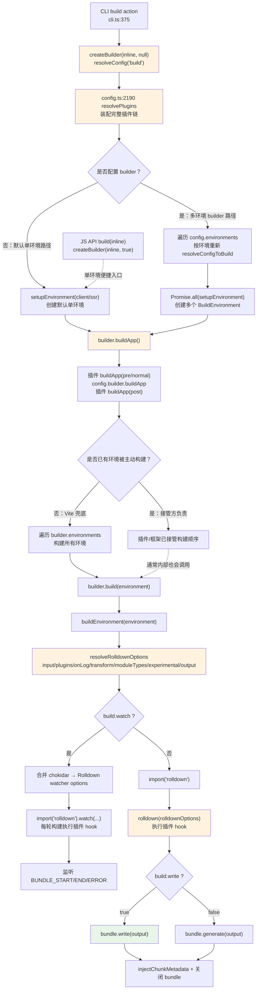

# 11 · 构建阶段：Vite 8 如何驱动 Rolldown 产出生产包，与旧版 Rollup 驱动的差异

> 本节调试目标：跟踪一次 CLI `vite build`，从 `createBuilder()` / `buildApp()` 的多环境编排，一直到 `rolldown()` 被调用、`bundle.write()` 写出产物的完整链路。重点看 Vite 8 是怎么「驱动」Rolldown 的（构造 input/output 选项、把环境插件注入钩子），以及它与 Vite 2–7 时代「驱动 Rollup」相比，实现上变了什么、`rollupOptions`/`manualChunks` 这些老配置怎么兼容过来。
>
> 源码基线：Vite 8.1.0。入口：`packages/vite/src/node/build.ts`。底层打包器：Rolldown `~1.1.2`。

---

## 一、dev 与 build 的根本不同

承接 [10-多环境模型EnvironmentAPI实现.md](./10-多环境模型EnvironmentAPI实现.md)：上一节的 `Environment` 联合类型里包含 `BuildEnvironment`，本节就从它进入生产构建。先打好这些断点：

| 推荐断点 | 核心函数 / 位置 | 函数主要作用 | 看什么 |
|---|---|---|---|
| `cli.ts:375` | build 命令 action → `createBuilder(inlineConfig, null)` / `builder.buildApp()` | CLI `vite build` 的真实入口，先创建 builder，再交给 `buildApp` 编排整个应用的构建顺序 | `--app` 如何注入 `builder: {}`；是否配置 `builder` 如何决定默认单环境路径还是多环境 builder 路径 |
| `build.ts:565` | `build` → `createBuilder(inlineConfig, true)` | JS API `build()` 的单环境便捷入口，创建 builder 后选择第一个 build environment 执行构建 | 这里为什么强制传 `useLegacyBuilder = true`，以及它和 CLI `vite build` 的 `buildApp()` 主流程有什么区别 |
| `build.ts:1866` | `createBuilder` → `setupEnvironment/buildApp/build` | Vite 8 build 多环境模型的编排入口，负责解析配置、创建 BuildEnvironment，并返回能统一调度多个环境的 builder | 未配置 `builder` 时的默认单环境路径，与配置 `builder` 后的多环境路径如何分叉；`config.environments` 如何变成 `builder.environments`；`buildApp` 如何允许插件/框架接管 client/ssr 构建顺序 |
| `build.ts:853` | `resolveRolldownOptions` → input/output/plugins | 把 Vite 的 build 配置集中翻译成 RolldownOptions，是 Vite 驱动 Rolldown 前最关键的配置装配点 | 普通应用、lib、SSR 三种 input 如何取值；`options.rolldownOptions` 如何覆盖默认值；返回对象里 `input/plugins/onLog/transform/moduleTypes/experimental` 分别是什么 |
| `build.ts:644` | `resolveRolldownOptions` → `injectEnvironmentToHooks` | 给每个构建插件的 hook 注入当前 environment，让 build 期插件也能拿到环境上下文 | `environment.name`、`environment.config.consumer`、插件数组顺序，以及包装后 hook 中的 `this.environment` 如何和上一节 Environment API 对上 |
| `build.ts:809` | `buildOutputOptions` → `resolveBuildOutputs` | 为每个 output 补齐 Vite 的生产默认值，再合并用户传入的 Rolldown output 配置 | `dir/format/entryFileNames/chunkFileNames/assetFileNames/minify` 如何根据 SSR、lib、普通应用变化；用户 `output` 放在最后如何覆盖默认值 |
| `build.ts:889` | watch 分支 → `import('rolldown').watch` | `build.watch` 开启时创建持续构建 watcher，并把 chokidar 配置转换后交给 Rolldown | `rolldownOptions.watch`、`options.watch`、`watcher` 三层如何合并；`BUNDLE_START/BUNDLE_END/ERROR` 事件里如何清理 chunk metadata、关闭结果和增强错误 |
| `build.ts:923` | 非 watch 分支 → `rolldown(rolldownOptions)` | 一次性生产构建真正进入 Rolldown 打包器的入口，也是 Vite 8 与旧 Rollup 驱动链路的核心分界点 | 传入 Rolldown 的 `input/output/plugins/onLog/transform/moduleTypes/experimental.viteMode`，以及此时已经不再走 dev 的逐模块 HTTP transform 管线 |
| `build.ts:927` | `bundle.write/generate` → `injectChunkMetadata` | 按 output 配置逐个产出文件或内存结果，并把 chunk metadata 写回供后续插件/manifest 使用 | `options.write` 如何决定 `write` 还是 `generate`；多 output 时返回数组如何累积；`output.output` 中 chunk/asset 如何进入 `chunkMetadataMap` |
| `build.ts:1127` | `onRollupLog` → 用户 `onLog/onwarn` 分派 | 承接 Rolldown 日志并兼容 Rollup 时代的 `onwarn`，最终落到 Vite logger 或用户回调 | 用户同时配置 `onLog` 与 `onwarn` 时的调用顺序；`normalizeUserOnWarn` 如何只把 warn 交给旧回调，其他级别仍走默认日志处理 |
| `utils.ts:1278` / `utils.ts:1288` | `setupRollupOptionCompat` → `defineProperty` | 把旧 `rollupOptions` 兼容到新 `rolldownOptions`，并通过 getter/setter 维持运行时读写一致 | 两者同时存在时为什么以 `rolldownOptions` 为准；只写旧字段时如何赋给新字段；后续读取 `rollupOptions` 为什么实际拿到的是 `rolldownOptions` |

前十节讲的都是 dev：不打包、按需编译、靠模块图和 HMR。build 则相反——它要把整个依赖图**一次性打包**成优化过的生产产物（代码分割、压缩、hash 文件名、manifest）。

相较长期使用 Rollup 的稳定版构建链，Vite 8 的关键变化是：**生产 build 改由 Rolldown 驱动**（Rust 写的 Rollup 兼容打包器）。它和“dev/build 更一致”并不矛盾，但要把两层分开看：

- **引擎层**：转译 / 压缩收敛到 Oxc。默认 unbundled dev 显式走 `vite:oxc` 插件；Rolldown 打包路径里则内置用 Oxc 做 transform / minify。
- **打包层**：凡是需要打 bundle 的地方收敛到 Rolldown——生产 `vite build`、开发期依赖预构建、实验性 `experimental.bundledDev`。
- **插件层**：dev/build 共用同一套插件与 `this.environment`。

不一致的是执行模型：默认开发仍按浏览器请求做 ESM 按需转换，并不先把业务代码整图打包。

源码里的几处位置可以帮你区分边界：`build.ts:853` 先调用 `resolveRolldownOptions`，真正打包从 L923 的 `rolldown(rolldownOptions)` 开始；`build.ts:644` 给插件钩子注入 `this.environment`；`utils.ts:1288` 是 `setupRollupOptionCompat` 函数内部的 `Object.defineProperty`，不是 `mergeWithDefaults`。关键词是“配置翻译 + 打包器驱动 + 兼容层”，不是 dev 的请求期转换。

更准确地看，CLI `vite build` 本身不是“直接调用打包器”的薄封装，而是一个构建编排流程：先通过 `resolveConfig` 把用户配置、默认值、环境配置和插件配置归一化；再创建一个或多个 `BuildEnvironment`；接着通过 `builder.buildApp()` 和插件 `buildApp` hook 决定环境构建顺序；最后对每个环境调用 `buildEnvironment()`，把 Vite 配置转换为 `RolldownOptions`，交给 Rolldown 执行真正的打包输出。需要注意的是，源码里导出的 `build()` 是 JS API 的单环境便捷入口，会强制走 `createBuilder(inlineConfig, true)`；CLI `vite build` 走的是 `createBuilder(inlineConfig, null)` + `builder.buildApp()`。

---

## 二、亲手调试：build 的入口链路

用 [01-环境准备与调试入门.md](./01-环境准备与调试入门.md) 配的 `Vite Build: playground/html` 启动调试，在 `cli.ts:375`、`build.ts:1866` 和 `build.ts:923`（`rolldown(...)`）打断点。CLI 主链路是：



### 1. 两个入口：CLI `vite build` 与 JS API `build()`

流程图主线是 CLI `vite build`：它在 `cli.ts` 创建 builder，再调用 `buildApp()` 编排整个应用构建。

文件：`packages/vite/src/node/cli.ts`（L375–377）

```ts
const builder = await createBuilder(inlineConfig, null)
await builder.buildApp()
await builder.runDevTools()
```

JS API 导出的 `build()` 则是便捷封装：只创建并构建一个环境，取 `builder.environments` 的第一个环境直接返回产物。

文件：`packages/vite/src/node/build.ts`（L565–572）

```ts
export async function build(inlineConfig = {}) {
  const builder = await createBuilder(inlineConfig, true)
  const environment = Object.values(builder.environments)[0]
  if (!environment) throw new Error('No environment found')
  return builder.build(environment)
}
```

两者都会经过 `resolveConfigToBuild`，用 `'build'` 命令、`'production'` 模式解析配置，所以 [03-插件注册与排序.md](./03-插件注册与排序.md) 里 `apply: 'build'` 的插件、build 专用内部插件都会被纳入。

### 2. `buildApp`：谁先主动构建，谁就接管构建顺序

图里“是否已有环境被主动构建”这一步，指的是：插件 `buildApp` hook，或 `config.builder.buildApp`，已经显式调用了 `builder.build(environment)`。

`builder.build` 在 `buildEnvironment` 返回后会把 `environment.isBuilt = true`。`buildApp` 末尾只有在“所有环境都还没被构建”时，才会兜底遍历 `builder.environments`。一旦任意环境已被主动构建，Vite 就认为构建顺序已被接管，剩下哪些环境要不要构建、按什么顺序构建，都交给接管方负责。

### 3. 插件链如何进入 Rolldown，以及 worker 支线何时触发

主链路走到 `resolveRolldownOptions` 时，Vite 会把当前环境的 `environment.plugins` 放进 `RolldownOptions.plugins`，再交给 `rolldown()` 或 `rolldown.watch()`。这些插件并不是 `resolveRolldownOptions` 自己创建的：`resolveConfig()` 末尾会在 `config.ts:2190` 调用 `resolvePlugins()`；`resolvePlugins()` 从 `plugins/index.ts:42` 开始拼出完整插件数组，内部插件、用户插件、build/bundled 扩展插件都在这里汇总。`resolveBuildPlugins()` 只是其中的补充步骤，用来追加 build/bundled 专用的 pre/post 插件。

当业务源码里出现 worker 入口时，这条主链路会分出一条支线。负责识别入口的是完整插件链里的两个内部插件：

- `webWorkerPlugin(config)`（`plugins/index.ts:137`）：处理 `?worker` / `?sharedworker` 模块 id
- `workerImportMetaUrlPlugin(config)`（`plugins/index.ts:148`）：处理 `new Worker(new URL('./worker.ts', import.meta.url))`

Rolldown 只负责按插件链调用这些 hook；真正识别到 worker 入口后，是插件自己在 build/bundled 场景下调用 `workerFileToUrl()` 或 `bundleWorkerEntry()`，再为 worker 单独创建 `BuildEnvironment` 并跑一次子构建。watch 模式也是同一条插件链，只是 hook 会在 watcher 的每轮构建里触发。

和这条支线相邻、但职责不同的两个插件可以顺带记住：`webWorkerPostPlugin` 是 worker 子环境的后处理插件，主要处理 IIFE worker 里 `import.meta` 不可用；`esmExternalRequirePlugin` 是 SSR target 为 webworker 时的外部依赖兼容插件，用来把外部 CJS `require()` 转成 ESM import。

### 核心函数速查

| 函数 / 类型 | 主要作用 |
|---|---|
| `build` | 对外单环境便捷 API：强制创建单环境 builder 后构建第一个环境 |
| `resolveConfigToBuild` | 用 command/mode/nodeEnv=`build/production/production` 解析配置 |
| `BuildEnvironment` | build 期环境对象；`init` 当前只做幂等标记 |
| `createBuilder` | 根据 `config.builder` 和调用参数选择单环境或多环境路径，并准备环境配置/插件 |
| `resolvePlugins` | 完整插件链装配入口；内部插件、用户插件、build/bundled 扩展插件都在这里汇总 |
| `resolveBuildPlugins` | `resolvePlugins` 的 build/bundled 扩展层；只补充构建专用 pre/post 插件 |
| `buildEnvironment` | 分派 watch 与一次性 build，管理输出、错误和 bundle 生命周期 |
| `resolveRolldownOptions` | 把环境配置翻译为最终 `RolldownOptions` |
| `injectEnvironmentToHooks` | 给插件 hook 注入当前 BuildEnvironment |
| `onRollupLog` | 映射 Rolldown 日志，并兼容用户 `onLog`/`onwarn` |
| `setupRollupOptionCompat` | 迁移旧字段，并为 `rollupOptions` 挂上兼容代理 |

---

## 三、核心：rolldown() 被怎么调用

断点停在 `build.ts:923`（`rolldown(...)`）时，看 `rolldownOptions` 这个变量——它就是 Vite 喂给 Rolldown 的全部配置。

文件：`packages/vite/src/node/build.ts`（L921–927）

```ts
// write or generate files with rolldown
const { rolldown } = await import('rolldown')   // 惰性加载,不用 build 不付加载成本
startTime = Date.now()
bundle = await rolldown(rolldownOptions)

const res: RolldownOutput[] = []
for (const output of arraify(rolldownOptions.output!)) {
  res.push(await bundle[options.write ? 'write' : 'generate'](output))
}
```

几个关键点：

- **打包器从 `'rolldown'` 导入**（不再是 `'rollup'`）；
- **惰性 `await import('rolldown')`**——只有真正 build 时才加载这个较重的 Rust 模块；
- 一次 `rolldown(...)` 拿到 bundle，再对每个 output 调 `write`（写盘）或 `generate`（内存）。watch 模式不进入这段代码，而是在 L889–897 动态导入独立的 `watch`，合并 Vite/chokidar 选项后调用 `watch({...})`。

### input/output 选项怎么来

`resolveRolldownOptions(environment, ...)`（L590–821）负责把 Vite 的配置翻译成 Rolldown 的 `RolldownOptions`：

| 最终字段 | 精确来源与覆盖关系 |
|---|---|
| `input` | lib 模式优先 `rolldownOptions.input`，否则从 `lib.entry` 绝对化；非 lib 时依次是字符串 `build.ssr`、`rolldownOptions.input`、`root/index.html` |
| `preserveEntrySignatures` | SSR=`allow-extension`，lib=`strict`，普通 app=`false`；随后展开的用户 `rolldownOptions` 可覆盖 |
| `plugins` | 最终强制使用 `environment.plugins.map(injectEnvironmentToHooks)`，不直接采用用户传入的 `rolldownOptions.plugins` |
| `external` | 显式取 `options.rolldownOptions.external` |
| `onLog` | Vite 安装统一入口并转给 `onRollupLog`，后者再兼容用户 `onLog`/`onwarn` |
| `transform.target` | 默认来自 `build.target`；再展开用户 `rolldownOptions.transform`，因此用户 target 可覆盖 |
| `transform.define` | 用户 define 后，再固定保留 `'process.env.NODE_ENV'`，让 Vite define 插件负责实际替换 |
| `moduleTypes['.css']` | 用户 moduleTypes 后强制 `.css='js'`，CSS 继续交给 Vite 插件 |
| `experimental` | 合并用户值后强制 `viteMode: true`，并按 `build.chunkImportMap/base` 装配 chunkImportMap |
| `output` | `resolveBuildOutputs` 处理 lib 多格式；`buildOutputOptions` 补 dir、文件名、sourcemap、minify 等默认值，最后 `...output` 让单项用户配置覆盖 |

### 把「环境」注入插件钩子

build 复用的是 dev 同一套插件（呼应 [07-插件容器PluginContainer.md](./07-插件容器PluginContainer.md) 的「dev/build 一套插件生态」），但 Rolldown 的钩子上下文里没有 Vite 的「环境」概念。Vite 用 `injectEnvironmentToHooks` 把每个插件克隆一份、给它的 `resolveId/load/transform` 等钩子包一层，注入 `this.environment`：

文件：`packages/vite/src/node/build.ts`（L644–646）

```ts
// inject environment and ssr arg to plugin load/transform hooks
const plugins = environment.plugins.map((p) =>
  injectEnvironmentToHooks(environment, chunkMetadataMap, p),
)
```

这样插件在 build 期也能通过 `this.environment` 知道自己在为哪个环境打包，与 dev 行为对齐（见 [10-多环境模型EnvironmentAPI实现.md](./10-多环境模型EnvironmentAPI实现.md)）。

---

## 四、与旧版 Rollup 驱动的差异

这是本节最有「决策视角」的部分，也是企业升级最关心的。

### 配置兼容：rollupOptions ↔ rolldownOptions

老项目写的是 `build.rollupOptions`。Vite 8 用 `setupRollupOptionCompat` 把它做成 `rolldownOptions` 的 getter/setter 代理——你写 `rollupOptions`，实际读写的是 `rolldownOptions`：

文件：`packages/vite/src/node/utils.ts`（L1269–1301，已简化）

```ts
export function setupRollupOptionCompat(buildConfig, path) {
  buildConfig.rolldownOptions ??= buildConfig.rollupOptions   // 老字段迁移
  Object.defineProperty(buildConfig, 'rollupOptions', {
    get() { return buildConfig.rolldownOptions },
    set(newValue) { buildConfig.rolldownOptions = newValue },
    configurable: true,
    enumerable: true,
  })
}
```

所以绝大多数老配置「无感」迁移：你不改 `rollupOptions` 也能跑，只是它实际走了 Rolldown。

两个细节必须说准确：

1. 若 `rollupOptions` 与 `rolldownOptions` 同时存在，L1278 的 `??=` 保留 `rolldownOptions`，旧字段被忽略；
2. `utils.ts:1288` 是 `setupRollupOptionCompat` 内部用 `Object.defineProperty` 挂上兼容代理的位置。之后读写 `rollupOptions` 都会落到 `rolldownOptions`，并可能触发运行期弃用提示。

### manualChunks 怎么办

一个常见疑问：老的 `output.manualChunks` 还能用吗？答案是：**能，但它被透传给 Rolldown 处理**。Vite 8 源码本身已不再解释 `manualChunks`——用户写在 `rollupOptions.output.manualChunks` 的值，经代理变成 `rolldownOptions.output`，再被 `...output` 展开进 Rolldown 的 output 选项，由 Rolldown（兼容 Rollup API）来解释。Vite 自己的原生分包旋钮是 Rolldown 的 `output.codeSplitting`。

> 迁移建议：新项目优先用 `rolldownOptions` + `codeSplitting`；老项目的 `rollupOptions` + `manualChunks` 可继续跑，但要在产物上验证分包结果是否符合预期，因为底层换了打包器，分包细节可能有差异。

### 其它实现层差异

| 方面 | Vite 8（Rolldown） | 旧版（Rollup） |
|---|---|---|
| 打包器导入 | `import('rolldown')` | `import('rollup')` |
| 默认压缩 | `build.minify: 'oxc'`，解析 output 时映射为 Rolldown/Oxc minify 选项 | terser / esbuild 插件 |
| CSS | `.css` 强制 `'js'` 模块类型，Vite 插件处理 | Rollup 插件管线 |
| 日志 API | `onLog` | `onwarn`（有兼容层） |
| 类型 | `RolldownOptions`/`RolldownOutput` | `RollupOptions`/`RollupOutput` |

### 日志兼容：用户怎么接管构建警告

你可以在配置里自定义构建期日志。Rollup 时代常见写法是 `build.rollupOptions.onwarn`，用来过滤噪音警告或改写提示；Rolldown 时代对应的新 API 是 `onLog`，能处理更多日志级别。Vite 不能把这两套配置原样扔给打包器，否则要么旧项目的 `onwarn` 失效，要么 Vite 自己想统一处理的 unresolved import、忽略名单、插件名前缀会失控。

所以 `resolveRolldownOptions` 会强制挂上自己的 `onLog`，统一转入 `onRollupLog`（L1127–1209）。打包器发出日志后，先经过 Vite 默认处理，再按用户配置分派：

- 用户只配了 `onLog`：把日志和 Vite 默认处理器一起交给用户；
- 用户只配了旧 `onwarn`：把旧回调适配成新日志形态，继续生效；
- 两者都配了：用户 `onLog` 拿到一个已融合旧 `onwarn` 的 default handler；
- 都没配：直接走 Vite 自己的 `viteLog`。

一句话：这是给用户配置项做的兼容路由，不是 Vite 内部随便换了个日志函数名。

### worker 是独立的嵌套构建

遇到 worker 入口时，`plugins/worker.ts:162` 的 `bundleWorkerEntry` 会检查 `bundleChain` 防止递归 worker import，调用 `config.worker.plugins(newBundleChain)` 生成新插件实例，构造并 init 一个 `BuildEnvironment('client', workerConfig)`，再单独 `rolldown({...}) + bundle.generate(...)`。它复用 worker 的 `rolldownOptions/format` 和主构建目标，但有独立插件状态、output 与 bundle 生命周期。

这也是 `worker.plugins` 被规范为“返回新数组的函数”的原因：嵌套构建若复用主构建插件对象，插件内部缓存很容易互相污染。

---

## 五、多环境构建：createBuilder 与 buildApp

`build()` 是单环境便捷封装；多环境（client + ssr + ...）走 `createBuilder` + `buildApp`。

`createBuilder`（L1866–2012）的分叉，核心就是有没有配置 `builder`：

- **未配置 `builder`**：只创建默认单环境——普通应用是 `client`，有 `build.ssr` 时是 `ssr`。
- **配置了 `builder`**（或 CLI `--app` 注入 `builder: {}`）：遍历 `config.environments`，默认每个环境**重新 resolve 一次配置**，拿到各自独立的插件实例；可用 `sharedConfigBuild` / `sharedPlugins` 复用。

再看 JS API `build()` 为什么要传 `createBuilder(inlineConfig, true)`。这个函数的历史约定很简单：只构建一个目标——普通应用就是客户端包，开了 SSR 就只构建服务端包——然后直接返回这份产物。所以 `true` 的作用是：忽略配置里有没有写 `builder`，都只创建一个 `BuildEnvironment`，再调用 `builder.build(environment)`，不会进入 `buildApp()` 去依次构建 client、ssr 等多个环境。

实际影响是：你在 `vite.config` 里写了 `builder: {}`，如果程序里调用的是 `build()`，仍然只会得到一个环境的构建结果。CLI `vite build` 传的是 `null`，所以才会按“有没有配置 `builder`”决定只建一个环境，还是遍历 `config.environments`。

如果要一次把 client、ssr 等都构建出来，调用链就要换成 `createBuilder` + `builder.buildApp()`。`buildApp`（L1895–1928）会按顺序调度各个环境：先跑插件的 `buildApp` hook，再按需要调用 `builder.build(environment)`；框架也可以在这里接管“先 client 还是先 ssr”。这也是 SSR 元框架通常不用 JS API `build()`、而直接用 builder 的原因。

---

## 六、常见误解与设计取舍

### 常见误解

#### 1. “工具链一致”不等于“默认 dev 也整图打包”

这是最容易和前文打架的一点。Vite 8 说的“更一致”，指的是**引擎与打包器收敛**，不是把默认开发模型改成 webpack 式整图打包。可以按三层理解：

1. **Oxc 是转译 / 压缩引擎**  
   默认 unbundled dev 里，业务 TS/JSX 由 `vite:oxc` 插件按请求转译。  
   进入 Rolldown 打包路径后，Oxc 仍然作为底层能力参与 JS/TS 处理和压缩。

2. **Rolldown 是打包器**  
   凡是要打 bundle 的场景都收敛到它：
   - 开发期依赖预构建（optimizer，预构建 `node_modules`，不是业务整图打包）
   - 生产 `vite build`
   - 实验性 `experimental.bundledDev`（开发期也惰性打包业务代码）

3. **插件生态共用**  
   同一套插件通过 `this.environment` 在不同模式下工作；bundled 环境下 `vite:oxc` 还会切换成 Rolldown 的 `nativeTransformPlugin`。

默认仍不同的是**执行模型**：

| 场景 | 业务源码怎么处理 | Oxc 怎么参与 | Rolldown 出现在哪 |
|---|---|---|---|
| 默认 `vite` / `vite dev` | 按请求走插件容器 | `vite:oxc` 显式转译 | 不打包业务代码；依赖预构建会用 |
| 实验性 `experimental.bundledDev` | 开启后才惰性 bundle + 内存文件 | 经 Rolldown / native transform | `BundledDev` → `dev(...)` |
| `vite build` | 整图打包成生产产物 | 经 Rolldown 的 `transform` / `minify` | `buildEnvironment` → `rolldown(...)` |

#### 2. 其他高频误解

- **“rolldownOptions 原样传给 Rolldown”**：错。Vite 会重算 input/plugins/onLog/transform/moduleTypes/experimental/output，其中各字段覆盖顺序不同。
- **“watch 是 rolldown(...).watch()”**：错。本版本动态导入并调用独立 `watch({...})`。
- **“写 rollupOptions 和 rolldownOptions 会深合并”**：错。两者同时存在时 `rolldownOptions` 胜出，之后旧字段只是代理。
- **“manualChunks 被 Vite 翻译成 codeSplitting”**：错。`manualChunks` 随兼容 output 交给 Rolldown 解释；`codeSplitting` 是另一项 Rolldown 输出能力，不能机械视为一一替代。
- **“worker 复用主构建 bundle”**：错。worker 有独立环境、插件实例和 Rolldown 调用。

### 为什么这样设计

- **集中翻译 options**：Vite 保留上层约定，Rolldown 专注依赖图与产物；但必须清楚维护字段覆盖顺序。
- **环境化 hook 包装**：dev/build 插件都能读取 `this.environment`，避免插件再维护两套环境判断。
- **惰性导入 + watch 分支**：不执行 build 就不加载重打包器，watch 又能保持长生命周期与增量状态。
- **代理兼容旧字段**：降低迁移门槛，但兼容 API 不代表底层行为与 Rollup 完全一致，产物仍需验证。
- **worker 隔离插件实例**：牺牲一部分创建成本，换取嵌套构建不污染主构建状态。

---

## 七、本节小结

**这段实现解决了什么问题？**
它实现了 Vite 8 向 Rolldown 收敛的**构建侧**：把 Vite 配置翻译成 `RolldownOptions`，惰性加载 Rolldown，由一次性 `rolldown()` 或持续 `watch()` 产出生产包；用 `injectEnvironmentToHooks` 注入环境；用 `setupRollupOptionCompat` 保留旧字段入口。

**它带来了什么复杂度 / 代价？**
换引擎带来速度收益的同时，也带来兼容成本：必须维护 options 代理、`onwarn → onLog` 日志适配、worker 嵌套构建，以及依赖 Rollup 内部行为的插件风险。`manualChunks` 与 Rolldown `codeSplitting` 也不是简单一一替换。引擎层已收敛到 Oxc，打包层收敛到 Rolldown，但默认仍保留按需开发模型：unbundled dev 由 `vite:oxc` 按请求转译，build / 依赖预构建 / bundledDev 才真正走 Rolldown 打包。

**读完你应当能做到：**

- [ ] 说清 `vite build` 从 `build()` 到 `rolldown()`/`bundle.write()` 的链路；
- [ ] 解释 Vite 如何把配置翻译成 `RolldownOptions`、如何用 `injectEnvironmentToHooks` 注入环境；
- [ ] 说明 `rollupOptions`/`manualChunks` 的兼容机制，并据此评估老项目升级风险；
- [ ] 区分一次性 build、watch、worker 三条 Rolldown 调用链；
- [ ] 准确区分“工具链一致”与“执行模型仍不同”：默认按需转换 vs build/bundledDev 打包；
- [ ] 在 `build.ts:923` 断点查看 Vite 替你拼好的完整 Rolldown 配置。

最后一节收束 dev/build/preview 三者的边界——[12-preview-server边界.md](./12-preview-server边界.md)。
