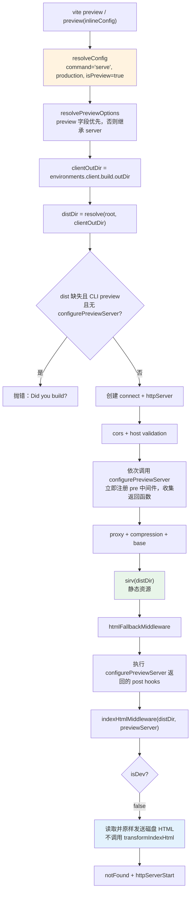

# 12 · preview server 边界：dev / build / preview 各保证什么，不保证什么

> 本节调试目标：看清 `vite preview` 到底是个什么服务——它有多「薄」（基本就是把 `dist/` 当静态文件服务），以及把 dev / build / preview 三者放在一起对比，理清各自保证什么、不保证什么，从源码层面论证「为什么 preview 不能替代真实生产验证」。
>
> 源码基线：Vite 8.1.0。入口：`packages/vite/src/node/preview.ts`。

---

## 一、preview 在三件套里的定位

承接 [11-构建阶段驱动Rolldown.md](./11-构建阶段驱动Rolldown.md)：上一节的输出是 `outDir` 里的成品，preview 不再回到源码图，而是从 `config.environments.client.build.outDir` 找到这些成品并静态服务。

先打好主线断点：

| 推荐断点 | 核心函数 / 位置 | 常见进入路径 | 函数主要作用 | 重点观察 |
|---|---|---|---|---|
| `preview.ts:138` | `preview` → `resolveConfig` | CLI 执行 `vite preview` 或 JS API 调用 `preview(inlineConfig)` 后进入 | 用 `command='serve'`、`mode='production'`、`isPreview=true` 解析配置：preview 复用 serve 侧配置形态，但不会创建 dev server、模块图或 transform middleware | `config.command/mode/isPreview` 的组合；`apply: 'serve'` 插件是否进入已解析插件数组；不要把 `command='serve'` 误判成 dev 请求链路 |
| `preview.ts:58` | `resolvePreviewOptions` | `preview.ts:138` 调用 `resolveConfig` 后，在配置解析内部从 `config.ts:1986` 进入；`config.preview` 最终会使用这里的合并结果 | 让 preview 只继承 `CommonServerOptions` 里的公共服务字段，并把默认端口单独设为 `DEFAULT_PREVIEW_PORT`，避免和 dev server 默认端口冲突 | `preview?.字段 ?? server.字段` 的逐字段兜底；`port` 是否没有继承 `server.port`；`proxy/cors/headers/allowedHosts` 最终来自 preview 还是 server |
| `preview.ts:147` | `clientOutDir/distDir` | `resolveConfig` 完成后立即进入，开始确定 preview 要服务的磁盘目录 | 从 `config.environments.client.build.outDir` 读取 client build 产物目录，再按 `config.root` 解析成绝对 `distDir`，说明 preview 只面向 client 构建产物 | `clientOutDir` 是否来自 client 环境；`distDir` 是否指向当前项目实际 `outDir`；改动 `build.outDir` 后 preview 服务目录是否同步变化 |
| `preview.ts:154` | dist 缺失判断 | 计算出 `distDir` 后、创建 connect/http server 之前进入 | 只在“CLI preview + dist 不存在 + 没有插件接管 preview server”三个条件同时成立时提前报错；JS API 和插件接管场景允许继续启动 | `fs.existsSync(distDir)` 的结果；`config.plugins.every((plugin) => !plugin.configurePreviewServer)` 是否为真；`process.argv[1/2]` 是否确实来自 `vite preview` |
| `preview.ts:246` | `configurePreviewServer` | cors 与 host validation 注册之后、proxy/compression/base/sirv 注册之前进入 | 按排序后的插件 hook 串行执行 `configurePreviewServer(server)`：插件此时直接注册的是 pre 中间件，返回函数会先收进 `postHooks` 延后执行 | 当前 `app` 中间件栈还没装 proxy/sirv/html；hook 的 `watchMode` 为 `false`；返回值是否进入 `postHooks`，以及插件能否在默认静态服务前抢先处理请求 |
| `preview.ts:277` | `sirv(distDir)` | proxy、compression、base 中间件注册后进入；请求静态资源时会实际调用这个 middleware | 用 `sirv` 把 build 后的 `distDir` 当静态目录服务，并套用 preview headers 与 `shouldServeFile` 限制；这里没有按需编译、模块图更新或插件 transform 链 | `distDir` 是否就是 build 产物目录；`headers` 是否来自 `config.preview.headers`；`shouldServe(filePath)` 如何阻止服务目录外文件；`sirv` 的 `dev: true` 不等于 Vite dev 模式 |
| `preview.ts:302` | 执行 post hooks | `sirv(distDir)` 和 `htmlFallbackMiddleware` 注册之后、`indexHtmlMiddleware` 注册之前进入 | 执行 `configurePreviewServer` 返回的 post hook，让插件有机会在 HTML fallback 后、默认 HTML 发送前继续插入中间件 | `postHooks` 中每个函数实际注册了什么 middleware；这些 middleware 位于 fallback 之后还是 `indexHtmlMiddleware` 之前；是否会拦截回退到 HTML 的请求 |
| `indexHtml.ts:563` | `indexHtmlMiddleware` → `if (isDev)` | preview 的 SPA/MPA 请求经过 `htmlFallbackMiddleware` 后进入；dev server 请求 HTML 时也会进入同一个中间件作对照 | 复用 HTML 读取/发送逻辑，但只有 dev server 会调用 `server.transformIndexHtml`；preview 的 `isDev` 为 `false`，因此直接发送磁盘里的构建后 HTML | `isDevServer(server)` 的判断结果；preview 是否跳过 `transformIndexHtml`；`headers` 是取 `server.config.preview.headers` 还是 dev 的 `server.headers`；最终发送的 HTML 是否来自 `distDir` |

很多人对 `vite preview` 有个误解：以为它是「生产环境的本地模拟」。它不是。它的唯一职责是：**把你 `vite build` 产出的 `dist/` 目录，用一个简单的静态文件服务器跑起来**，让你在本地点开看看构建产物能不能正常加载。



它跑在 build 之后，吃的是 build 的产物。理解这条「它只服务静态产物」，几乎就理解了它的全部边界。

源码注释也在反复强调这个边界：`preview.ts:138` 只是解析 preview 形态的配置，不会创建 dev server 的模块图和 transform middleware；`preview.ts:246` 说明 preview 没有按需编译链路；`indexHtml.ts:563` 则直接点出只有 dev 才会走 `transformIndexHtml`，preview 只是发送磁盘 HTML。下面的中间件栈要按这个边界去读。

---

## 二、亲手调试：preview 有多薄

公共 API 是 `preview()`（不是 `createPreviewServer`）。在 `preview.ts:138` 和 `preview.ts:277` 打断点跟一遍，会发现它短得惊人。

### `resolvePreviewOptions`：不是整对象继承，而是逐字段兜底

`PreviewOptions` 与 server 共享 `CommonServerOptions`。`resolvePreviewOptions(preview, server)`（L58–76）对 `strictPort/host/allowedHosts/https/open/proxy/cors/headers` 使用 `preview?.字段 ?? server.字段`；唯独端口使用 `preview.port ?? DEFAULT_PREVIEW_PORT`，这样 dev 与 preview 默认可同时运行。

这意味着 `preview.proxy` 未写时会继承 `server.proxy`，`preview.headers` 未写时也继承 `server.headers`；但 preview 不会继承 dev 专属的 watch、hmr、fs、warmup 等能力，因为这些根本不属于 `CommonServerOptions`。

### 核心函数速查

| 函数 / 结构 | 主要作用 |
|---|---|
| `resolvePreviewOptions` | 合并 preview 与 server 的公共服务选项，并单独设置 preview 默认端口 |
| `preview` | 配置解析、静态目录检查、server/middleware 装配与监听总入口 |
| `configurePreviewServer` | 给插件提供 preview 专用的 pre/post 中间件注入时机 |
| `sirv(distDir)` | 服务构建输出中的静态文件并应用 preview headers |
| `htmlFallbackMiddleware` | 对 SPA/MPA HTML 路由做回退 |
| `indexHtmlMiddleware` | 共用磁盘 HTML 读取/发送逻辑；preview 分支不执行 dev transform |
| `httpServerStart` | 按 preview host/port/strictPort 启动 HTTP(S) server |
| `PreviewServer.close` | 幂等关闭 HTTP server 并清空 resolvedUrls |

文件：`packages/vite/src/node/preview.ts`（L138–147）

```ts
const config = await resolveConfig(
  inlineConfig,
  'serve',         // command 是 serve
  'production',    // 但 mode/env 是 production
  'production',
  true,            // isPreview = true
)
const clientOutDir = config.environments.client.build.outDir
const distDir = path.resolve(config.root, clientOutDir)
```

注意这个组合：`command: 'serve'` 但环境是 `production`、`isPreview: true`。这意味着 [03-插件注册与排序.md](./03-插件注册与排序.md) 里 `apply: 'serve'` 的插件会被纳入（preview 和 dev 同属 serve），但跑的是生产配置。

这里不要继续推导成“serve 插件的所有 dev hook 都会执行”：插件会进入已解析插件数组，但 preview 只主动调用 `configurePreviewServer`；它不会创建 dev `pluginContainer`，也不会执行 `configureServer` 或请求期 `resolveId/load/transform`。

### dist 不存在时，为什么不是所有调用都立刻报错

L154–162 的提前报错需要三个条件同时成立：

1. `distDir` 不存在；
2. 没有任何插件实现 `configurePreviewServer`；
3. 当前进程确实是 CLI 的 `vite preview`。

这里的前提一定是 `distDir` 不存在：如果构建产物目录已经存在，`!fs.existsSync(distDir)` 一开始就为 false，后面的 CLI / 插件判断都不会触发。只有在 **dist 缺失 + 无 `configurePreviewServer` 插件接管 + 当前确实是 CLI 的 `vite preview`** 时，用户才会得到明确的 “Did you build?” 报错。

反过来，JS API 调用或实现了 `configurePreviewServer` 的插件会让这个提前报错分支放行，因为调用方可能要自己往 `httpServer/middlewares` 里提供内容。但放行不代表 Vite 自动创建 `distDir`：后面的 `sirv(distDir)`、`htmlFallbackMiddleware`、`indexHtmlMiddleware` 仍然都会围绕这个目录查文件；如果没有自定义中间件接管，最终还是会落到 404。

核心就是用 `sirv` 把 `distDir` 当静态目录服务：

文件：`packages/vite/src/node/preview.ts`（L250–277，已简化）

```ts
const viteAssetMiddleware = (...args) =>
  sirv(distDir, {
    etag: true,
    dev: true,
    extensions: [],
    ignores: false,
    setHeaders(res) { /* 应用 config.preview.headers */ },
    shouldServe(filePath) { return shouldServeFile(filePath, distDir) },
  })(...args)

app.use(viteAssetMiddleware)
```

`sirv` 的 `dev: true` 是静态服务器自身的开发态文件服务策略，**不是 Vite 开发模式转换**。整个 preview 没有环境模块图、dev 插件容器或 `transformMiddleware`——它服务的是已经在磁盘上的成品文件。

### `configurePreviewServer` 的 pre/post 语义

Vite 按已排序 hook 串行调用 `configurePreviewServer(server)`。hook 调用当下，插件可直接 `server.middlewares.use(...)`，这些中间件位于 proxy/sirv 之前，可视为 pre；hook 若返回函数，Vite 先收进 `postHooks`，等 sirv 与 HTML fallback 注册后、`indexHtmlMiddleware` 注册前，在 L285 执行。返回函数本身通常再注册中间件，所以它有机会在默认 HTML 发送前处理回退后的请求。

### preview 的中间件栈

| 顺序 | 中间件 | 作用 |
|---|---|---|
| 1 | `corsMiddleware` | CORS |
| 2 | `hostValidationMiddleware` | DNS rebinding 防护 |
| 3 | 插件 `configurePreviewServer`（pre） | 自定义中间件注入点 |
| 4 | `proxyMiddleware` | 可选 API 代理 |
| 5 | `compression()` | gzip/br 压缩（**dev 默认没有**） |
| 6 | `baseMiddleware` | 非 `/` base |
| 7 | **`sirv(distDir)`** | **静态服务构建产物** |
| 8 | `htmlFallbackMiddleware` | SPA/MPA 的 `.html` 回退 |
| 9 | `configurePreviewServer` 返回的 post hook | 在 fallback 之后、默认 HTML 发送之前补中间件 |
| 10 | `indexHtmlMiddleware` | 从磁盘读 HTML（**preview 不做 transform**） |

和 dev server 一比就看出差距：dev 有 `transformMiddleware`、WebSocket、public 目录实时服务、`server.fs` 安全限制等一大串，preview 这里全没有。

---

## 三、dev / build / preview 三者对比

把三者并排，边界一目了然：

| | dev（`createServer`） | build（`buildEnvironment`） | preview（`preview`） |
|---|---|---|---|
| config 命令 | `serve`，dev mode | `build`，production | `serve`，production，`isPreview` |
| 模块处理 | 按需 transform + 插件容器 | 一次性 Rolldown 打包 | 无——直出静态文件 |
| 模块图 | 每环境一张 | 打包时构建进 chunk | 无 |
| HTML | `transformIndexHtml` 注入 HMR、转换 | `buildHtmlPlugin` 改写资源 URL | 原样读磁盘文件 |
| HMR / WebSocket | 有 | 无 | 无 |
| 产物来源 | 内存（现编译） | 写到 `outDir` | 读 `outDir` |
| 代码最小化 | 无，dev 转换重在速度和可调试性，Oxc/esbuild 转换不等于 minify | 有，按 `build.minify` 对产物做最小化 | 无，不重新处理代码，只服务 build 后文件 |
| HTTP 响应压缩 | 默认无 | 不适用，build 只产出文件，不负责 HTTP 响应 | `compression()` 启用 |

关键一行——preview 不走 `transformIndexHtml`，HTML 直接读磁盘：

文件：`packages/vite/src/node/server/middlewares/indexHtml.ts`（L563 附近）

```ts
if (isDev) {
  html = await server.transformIndexHtml(url, html, req.originalUrl)
}
// preview(非 dev) 不进这个分支,直接用磁盘上的 html
```

---

## 四、为什么 preview 不能替代真实生产验证

把上面对比落到「能不能拿 preview 当生产用」这个实际问题上，从源码能给出几条硬理由：

1. **它只是静态文件服务**：真实生产可能是 nginx、CDN、边缘函数、SSR 服务器——它们的路由、缓存、压缩、安全头策略各不相同，`sirv` 一个都模拟不了。
2. **不做任何转换**：preview 跳过 `transformIndexHtml`，HTML 是磁盘原样；真实环境若有运行期 HTML 处理（注入 nonce、CSP、A/B 变体），preview 看不到。
3. **没有运行期模块图/依赖分析**：只有打包好的 chunk，无法验证任何按需/运行期行为。
4. **HTTP 响应压缩与响应头不同**：preview 用 `@polka/compression` 做传输层响应压缩；真实服务器可能有不同的 gzip/br 策略、`Cache-Control`、HSTS、CSP——直接影响加载与安全。
5. **SPA 回退是通用实现**：`htmlFallbackMiddleware` 一刀切重写到 `index.html`；生产路由器规则往往更复杂。
6. **代理仅在配置时存在**：`preview.proxy` 继承自配置，生产的 API 路由通常完全不同。
7. **产物可能是旧的**：preview 服务的是 `dist/` 里**当前**的内容，不保证是最新一次 build——忘了重新 build 就 preview 是经典坑。

一句话：**preview 验证的是「构建产物本身能否在浏览器里加载运行」，而不是「它在你的生产基础设施上表现如何」。** dev 同样不是生产——它服务未压缩的源码、注入 HMR、有自己的错误覆盖层和预构建。所以三者都不能替代「部署到真实环境验证」。

### 常见误解

1. **“`command: 'serve'` 说明 preview 就是 dev server”**：错。这个值让 serve 插件能参与配置阶段；preview 并不会创建 dev 环境、模块图或请求期插件容器。
2. **“preview 复用了 `indexHtmlMiddleware`，所以也会转换 HTML”**：错。中间件确实复用，但 `isDevServer(server)` 为 `false`，因此 `transformIndexHtml` 分支被跳过。
3. **“`sirv` 的 `dev: true` 表示 Vite dev 模式”**：错。这只是 sirv 自己的文件服务选项，与 Vite 的按需转换、HMR 无关。
4. **“dist 不存在时 preview 一定在启动前报错”**：错。明确的提前报错只覆盖 CLI 常规路径；JS API 或插件可接管中间件。

### 为什么这样设计

- **复用公共 server 选项和 HTML 发送中间件**，避免重复实现 host、proxy、headers、SPA fallback 等基础服务能力；
- **不复用 dev 转换子系统**，保证 preview 看到的就是磁盘构建产物，不会被运行时转换“修好”而掩盖 build 问题；
- **保留 pre/post hook**，让插件能扩展本地验收服务，同时不把 preview 膨胀成另一套 dev server。

---

## 五、本节小结

**这段实现解决了什么问题？**
preview 用最小成本（一个 `sirv` 静态服务 + 少量中间件）解决了「构建产物在本地能不能正常加载」这个验证需求，让你在部署前先排掉「base 配错、资源路径不对、产物加载失败」这类低级问题。它和 dev、build 在 `resolveConfig` 的命令/模式上各自定位清晰：dev=serve/dev、build=build/prod、preview=serve/prod。

**它带来了什么复杂度 / 代价？**
preview 的「薄」既是优点也是边界：它不做转换、无模块图、用通用静态服务，因此天然无法反映真实生产基础设施的路由、压缩、安全头、SSR/边缘运行时差异。最大的「代价」其实是认知陷阱——把 preview 当生产，会让人误以为「preview 跑通 = 上线没问题」。理解它的边界，才能正确地把它用在「产物自检」这一格，而把「真实环境行为」交给真正的部署验证。这正是第三阶段「dev / build / preview 三套保证不同」要升华的工程判断。

**读完你应当能做到：**

- [ ] 说清 preview 的本质是「静态服务 build 产物」，以及它的中间件栈；
- [ ] 解释 `configurePreviewServer` 立即注册的中间件与返回 post hook 的相对位置；
- [ ] 用一张表说出 dev / build / preview 各保证什么、不保证什么；
- [ ] 从源码（不走 `transformIndexHtml`、无模块图、`sirv` 静态服务）论证为什么 preview ≠ 生产；
- [ ] 在 `indexHtml.ts:563` 用 dev vs preview 对比断点，亲眼验证 preview 不做 HTML 转换。

至此，第二阶段源码篇第一部分（主线 12 节）完。建议回到 [本阶段 README](../README.md) 回顾整条「配置 → 插件 → 预构建 → 按需编译 → 转换 → 容器 → HMR → 模块图 → 多环境 → 构建 → preview」的主干，再进入「专题 · 底层引擎与生态对比」。
