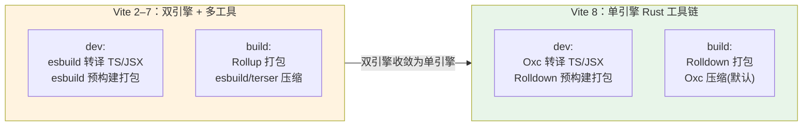

# 专题 00 · 底层引擎与生态对比：总览与阅读地图

> 本专题为：「专题 · 底层引擎与生态对比（实现层）」**。它不在vite源码主线 00–12 节之内，而是把散落在主线各节里的「底层打包器/转译器」这条暗线单独抽出来，从**实现层**讲清楚四件事：双引擎的历史与代价、Rollup vs Rolldown、Oxc 工具链、生态连带影响。
>
> 源码基线：本地 clone 的 **Vite 8.1.0**（`packages/vite/package.json` → `"version": "8.1.0"`），底层 `rolldown@~1.1.2`、`esbuild` 降级为可选 peer（`^0.27.0 || ^0.28.0`）、`terser` 可选 peer。事实基线时间：2026 年中。

---

## 一、为什么需要这个专题

主线 01–12 讲的是 **Vite 自己（TypeScript 部分）怎么实现**：配置、插件、预构建、按需编译、HMR、模块图、构建驱动。但每一节背后都有一个反复出现却没被正面讲透的角色——**底层的打包器与转译器**：

- [04 依赖预构建](../01-Vite实现原理/04-依赖预构建.md) 里真正干打包活的是谁？
- [06 核心转换链路](../01-Vite实现原理/06-核心转换链路.md) 里把 TS/JSX 转成 JS 的是谁？
- [11 构建阶段](../01-Vite实现原理/11-构建阶段驱动Rolldown.md) 里 `rolldown()` 又是从哪冒出来的？

在 Vite 2–7，这些活由 **esbuild + Rollup** 两个引擎分工完成；在 Vite 8，它们被 **Rolldown（内嵌 Oxc）** 这一条 Rust 工具链收敛。这条「双引擎 → 单引擎」的演进，是 Vite 8 最大的架构变更，也是企业升级时最容易踩坑的地方。本专题就把这条暗线拉到台前，逐层讲清。

> 一句话定位：主线讲「Vite 自己怎么实现」，本专题讲「Vite 脚下踩的那几块打包器/转译器，分别是什么、谁取代了谁、换了之后生态会怎样」。

---

## 二、四节安排

| 序号 | 标题 | 回答的问题 | 关键源码锚点 |
|---|---|---|---|
| 01 | [双引擎的历史与代价](./专题01-双引擎的历史与代价.md) | 为什么 Vite 早期要用 esbuild(dev)+Rollup(build)？这套分工带来了什么收益、又埋了什么「dev/prod 不一致」的雷？ | `plugins/esbuild.ts`、`build.ts` |
| 02 | [Rollup vs Rolldown 深度对比](./专题02-Rollup对比Rolldown.md) | 同样是「Rollup 兼容」的打包器，JS 版 Rollup 和 Rust 版 Rolldown 在实现、速度、API、在 Vite 中的角色上到底差在哪？ | `build.ts`、`utils.ts`、`optimizer/` |
| 03 | [Oxc 工具链与边界](./专题03-Oxc工具链与边界.md) | Vite 8 里接管 TS/JSX 转译与压缩的 Oxc 是什么？它和 Rolldown / esbuild / Rollup 是什么关系？边界在哪？ | `plugins/oxc.ts`、`plugins/index.ts`、`config.ts` |
| 04 | [生态连带影响（实现层）](./专题04-生态连带影响.md) | 换引擎后，老的 esbuild `onLoad`/`onResolve` 插件、依赖 Rollup 内部实现的插件会怎样？`rolldown-vite` 又是怎么做迁移隔离的？ | `optimizer/pluginConverter.ts`、`config.ts` |

阅读顺序建议：[专题 01 双引擎的历史与代价](./专题01-双引擎的历史与代价.md) → [专题 02 Rollup vs Rolldown 深度对比](./专题02-Rollup对比Rolldown.md) → [专题 03 Oxc 工具链与边界](./专题03-Oxc工具链与边界.md) → [专题 04 生态连带影响（实现层）](./专题04-生态连带影响.md)，是一条「历史 → 打包器替换 → 转译器替换 → 生态后果」的因果链。如果你只关心升级风险，可直接看 [专题 04 生态连带影响（实现层）](./专题04-生态连带影响.md)，再回头看 [专题 02 Rollup vs Rolldown 深度对比](./专题02-Rollup对比Rolldown.md)、[专题 03 Oxc 工具链与边界](./专题03-Oxc工具链与边界.md) 补背景。

---

## 三、一张图先建立全景

把四个引擎放在「dev / build」两个场景里，对比 Vite 7 与 Vite 8 的分工，是理解整个专题的地基：

读这张图的三个要点：

1. **Vite 7 时代有「两套世界」**：dev 用 esbuild、build 用 Rollup。两者实现不同，导致同一份代码在 dev 和 build 下行为可能不一致（详见专题 01）。
2. **Vite 8 把它们收敛成一条 Rust 工具链**：打包用 Rolldown，转译/压缩用 Oxc，两者同源（Oxc 内嵌在 Rolldown 里），dev/build 行为天然更一致。
3. **esbuild 没有消失，而是降级**：它从核心依赖变成**可选 peer 依赖**，只有你显式 `build.minify: 'esbuild'` 或用到少数兼容路径时才需要它。

---

## 四、四个引擎的「身份证」

为了避免后续四节里反复混淆，先在这里简单解释一下：

| 引擎 | 语言 | 本质职责 | 在 Vite 8 中的角色 |
|---|---|---|---|
| **esbuild** | Go | 极快的转译 + 打包 + 压缩 | 退居二线：可选 peer，仅 `minify:'esbuild'` 等少数路径用 |
| **Rollup** | JavaScript | 产物优秀的生产打包器 | 仅作 devDependency / 类型与少量插件来源，不再是运行时构建引擎 |
| **Rolldown** | Rust | 兼容 Rollup API 的统一打包器 | **核心依赖**，dev 预构建 + build 打包 + 配置文件打包都靠它 |
| **Oxc** | Rust | 解析 / 转译 / 压缩 / lint 工具集 | 通过 `rolldown/utils`、`rolldown/experimental` 提供，接管 TS/JSX 转译与压缩 |

> 一个**最容易被忽略但很关键**的事实：在 Vite 8 的依赖树里，**Oxc 不是一个独立安装的 npm 包**——它的能力是通过 `rolldown` 这个包暴露的（`import { transformSync } from 'rolldown/utils'`、`import { scan } from 'rolldown/experimental'`）。也就是说，装了 Rolldown 就附带了 Oxc。这一点在专题 03 会展开。

---

## 五、与主线各节的衔接

本专题是「实现层暗线」的集中复盘，所以处处与主线呼应：

- 双引擎中 esbuild 的预构建职责 → 主线 [04 依赖预构建](../01-Vite实现原理/04-依赖预构建.md)（Vite 8 已换 Rolldown）。
- Oxc 的转译落点 → 主线 [06 核心转换链路](../01-Vite实现原理/06-核心转换链路.md) 里的 `vite:oxc` 插件。
- Rolldown 的 build 驱动 → 主线 [11 构建阶段](../01-Vite实现原理/11-构建阶段驱动Rolldown.md)。
- 插件钩子的兼容 → 主线 [07 插件容器](../01-Vite实现原理/07-插件容器PluginContainer.md)（讲 Rollup/Rolldown 钩子如何被同一套容器驱动）。

> 如果你还没读主线，建议至少先扫一遍 [00 源码全景](../01-Vite实现原理/00-源码全景与模块关系.md) 和 [11 构建阶段](../01-Vite实现原理/11-构建阶段驱动Rolldown.md)，本专题会假设你对「dev 不打包 / build 打包」「插件钩子」这些概念已有印象。

---

下面进入第一节，从「为什么早期要用双引擎」讲起 → [专题 01 双引擎的历史与代价](./专题01-双引擎的历史与代价.md)。
