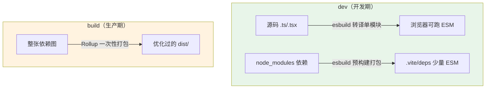

# 专题 01 · 双引擎的历史与代价：esbuild(dev) + Rollup(build) 为什么是当年的最优解

> 本节目标：讲清 Vite 2–7 为什么要用「esbuild 管 dev、Rollup 管 build」这套双引擎分工——它各自解决了什么、代价是什么，以及由此衍生的那类经典 bug「**dev 跑得好好的，build 出来就坏了**」的根源。最后回到 Vite 8.1.0 源码，看看这套双引擎「退役」后还在源码里留下了哪些痕迹。
>
> 源码基线：Vite 8.1.0。痕迹位置：`packages/vite/src/node/plugins/esbuild.ts`、`build.ts`。

---

## 一、先理解「打包工具要同时讨好两个老板」

一个现代构建工具，本质上要同时服务两个诉求完全相反的场景：


| 场景            | 最在乎什么                       | 不太在乎什么               |
| ------------- | --------------------------- | -------------------- |
| **dev（开发）**   | 启动快、改代码后反馈快（毫秒级）            | 产物体积、tree-shaking、压缩 |
| **build（生产）** | 产物小、tree-shaking 干净、可控的代码分割 | 单文件编译速度（可以慢一点）       |


这两个诉求很难用同一个引擎同时做到最好。于是 Vite 早期（2–7）选了一个非常务实的方案：**两个场景各用一个最擅长的引擎**——这就是「双引擎」。

---


## 二、双引擎分工：谁负责什么


### 2.1 dev 用 esbuild：要的是「快」

esbuild 用 Go 写成，并发模型与原生代码让它的转译速度比同期 JS 工具快一两个数量级。Vite 在 dev 期用 esbuild 干两件事：

1. **转译**：把单个 `.ts`/`.tsx`/`.jsx` 模块**只做语法转换**（去类型、降级语法），不做类型检查、不打包。按需编译每个模块时调用，追求毫秒级返回。
2. **依赖预构建**：把 `node_modules` 里的第三方依赖（常常是 CJS、或拆成几百个小文件）用 esbuild 飞快地预打包成少量 ESM 文件，避免浏览器为一个 `lodash-es` 发起几百个请求。

> 注意 dev 期 esbuild **不打包你的源码**——你的源码走的是「按需编译、浏览器原生 ESM」（主线 [05-按需编译与devserver请求处理流程](../01-Vite实现原理/05-按需编译与devserver请求处理流程.md)）。esbuild 只负责「转译单模块」和「预打包第三方依赖」。


### 2.2 build 用 Rollup：要的是「产物好」

Rollup 用 JavaScript 写成，多年打磨出业界最干净的 tree-shaking、最成熟的代码分割与最庞大的插件生态。生产构建对编译速度不那么敏感，但对产物质量极其敏感，所以 build 期交给 Rollup 一次性打包整张依赖图。

一句话概括这套分工：**dev 用 esbuild 换「快」，build 用 Rollup 换「产物优」，各取所长。**



---

## 三、代价：两套引擎 = 两套行为 = 一类经典 bug

双引擎不是没有代价。最大的代价是：**dev 和 build 走的是两条不同代码路径、两个不同引擎，行为无法保证一致。** 这就是那句开发者口口相传的吐槽——「**在我电脑上 dev 跑得好好的，一 build 就出问题**」——的实现层根源。

常见的几类不一致：


| 不一致表现                               | 实现层原因                                            |
| ----------------------------------- | ------------------------------------------------ |
| dev 正常、build 后某段代码被「优化没了」           | Rollup 的 tree-shaking 比 dev 期 esbuild 激进，副作用判断不同 |
| 装饰器 / 某些 TS 语法 dev 能跑、build 报错（或反之） | esbuild 与 Rollup 插件链对同一语法的转译实现不同                 |
| 环境变量 / `define` 替换结果在两端不同           | dev 与 build 的 define 注入时机、引擎不同                   |
| CSS 处理顺序、`import` 提升行为细微差异          | 两套管线对模块顺序的处理不同                                   |


这类 bug 最难排查，因为它**不是你的代码错了，而是两个引擎对「同一份代码」的理解有细微差别**。dev 期反馈快但「不较真」，build 期较真但你已经看不到中间过程。所以这类问题的验证重点不是继续盯着 dev server，而是尽早跑 `vite build`，用生产构建结果暴露两套管线之间的差异。

> 实战建议：在 Vite 2–7 项目里，凡是「dev 正常 build 异常」的问题，第一反应应该是「这俩走的不是一条路」，而不是反复怀疑自己的业务代码。把 `vite build` 加上 sourcemap、对照 dev 产物逐段比对，往往能很快定位到是引擎差异。

---

## 四、为什么当年这是「最优解」而不是「将就」

值得强调：双引擎不是 Vite 偷懒，而是**当时约束下的理性选择**。

- 2020 年前后，**没有任何单一打包器能同时做到 dev 极快 + build 产物极优**。esbuild 快但产物控制弱（代码分割、chunk 控制、插件生态都不如 Rollup），Rollup 产物优但 JS 实现注定不够快。
- 与其等一个「全能引擎」出现，不如先用两个成熟引擎拼出一个「dev 极爽 + build 可用」的组合，把开发体验这个最痛的点先解决掉。

所以双引擎是一个典型的**工程权衡**：用「两套行为可能不一致」的代价，换「现在就能拥有极致 dev 体验 + 成熟生产产物」的收益。这个取舍在第三阶段「架构决策的时机」里会作为核心案例再展开——**为什么双引擎合并成单引擎是「现在」而不是更早，答案就藏在「Rolldown 直到 2026 才成熟到能同时胜任两端」。**

---

## 五、回到源码：Vite 8.1.0 里双引擎留下的痕迹

Vite 8 已经把双引擎收敛为 Rolldown + Oxc 单引擎（详见 [专题 02 Rollup vs Rolldown 深度对比](./专题02-Rollup对比Rolldown.md)、[专题 03 Oxc 工具链与边界](./专题03-Oxc工具链与边界.md)）。但出于向后兼容，源码里还能看到 esbuild 这套老引擎「退而不删」的痕迹。亲手在源码里找一找，能直观感受这场迁移。

### 5.1 痕迹一：`vite:esbuild` 插件还在，但已不再注册进主线

文件：`packages/vite/src/node/plugins/esbuild.ts`（L278）

```ts
export function esbuildPlugin(config: ResolvedConfig): Plugin {
  // ... 老的 dev 期 TS/JSX 转译插件
  return { name: 'vite:esbuild', /* transform... */ }
}
```

这个 `esbuildPlugin` 在 Vite 7 时代是 dev 转译的主力。但在 8.1.0 里，**它已经不在** `plugins/index.ts` **的插件流水线里被注册**——你全局搜 `esbuildPlugin(` 会发现只剩定义、没有调用方。取代它位置的是 `vite:oxc`（专题 03）。它被保留只是为了导出兼容，避免老插件 import 它时报错。

### 5.2 痕迹二：`transformWithEsbuild` 被显式标记为 deprecated

文件：`packages/vite/src/node/plugins/esbuild.ts`（L99，`transformWithEsbuild` 函数声明；函数体内打印弃用警告）

```ts
export async function transformWithEsbuild(/* ... */) {
  // ... 函数体内会打印 deprecation 警告：
  // '`transformWithEsbuild` is deprecated and will be removed in the future.'
}
```

很多老插件/框架曾直接 import Vite 的 `transformWithEsbuild` 复用它的 TS 转译。Vite 8 保留了这个函数（且改为惰性加载 esbuild），但加了 deprecation 警告——这是一条很清晰的「这条老路要废弃了」的信号。

### 5.3 痕迹三：esbuild 唯一还「正经干活」的地方——`minify: 'esbuild'`

文件：`packages/vite/src/node/build.ts`（L540–542）

```ts
post: [
  ...(isBuild ? buildImportAnalysisPlugin(config) : []),
  ...(isBuild && config.build.minify === 'esbuild'   // 🔖断点[专题01] 唯一仍会真正用 esbuild 的路径:显式选择 esbuild 压缩
    ? [buildEsbuildPlugin()]
    : []),
  ...(isBuild ? [terserPlugin(config)] : []),
```

在 Vite 8，build 默认压缩器已是 Oxc（`minify` 默认 `'oxc'`，专题 03）。只有当你**显式**写 `build.minify: 'esbuild'` 时，`buildEsbuildPlugin()` 才会被加进来——这也是 esbuild 在 Vite 8 里唯一还会被真正调用的「正经活」。对应地，`esbuild` 在 `package.json` 里也从核心 `dependencies` 降级成了**可选 peerDependency**（`peerDependenciesMeta.esbuild.optional = true`）。

### 5.4 动手验证

```bash
# 在 vite 源码仓库根目录
node packages/vite/bin/vite.js build playground/html           # 默认:走 Oxc 压缩,无需 esbuild
node packages/vite/bin/vite.js build playground/html --minify esbuild  # 这次才会 require('esbuild')
```

把 `build.minify` 在两种值之间切换，配合断点 `build.ts:540`，能直观看到「esbuild 这条路只有被显式点名才会走」。

---

## 六、本节小结

**这套设计解决了什么问题？**
用「两个各自最擅长的引擎分工」，在「没有全能引擎」的年代，同时拿到了 dev 的极致速度（esbuild）和 build 的优质产物（Rollup）——这是 Vite 早期开发体验碾压 webpack 的关键。

**它带来了什么复杂度 / 代价？**
两套引擎 = 两条代码路径 = 行为无法保证一致，催生了「dev 正常、build 异常」这一类最难排查的 bug；也让 Vite 必须长期维护两套转译/打包逻辑。这个代价正是 Vite 8 用 Rolldown + Oxc 单引擎要消除的目标。

**读完你应当能做到：**

- [ ] 说清 dev 与 build 对引擎的诉求差异，以及 esbuild / Rollup 分别因此被选中的原因；
- [ ] 解释「dev 正常 build 异常」这类 bug 的实现层根源（两引擎、两路径）；
- [ ] 在 Vite 8.1.0 源码里找到双引擎退役后的三处痕迹（`esbuildPlugin` 不再注册、`transformWithEsbuild` 弃用、`minify:'esbuild'` 是 esbuild 唯一干活点）；
- [ ] 理解 esbuild 从核心依赖降级为可选 peer 这一事实。

理解了「为什么要合并」，下一节就看「合并成的那个引擎」——[专题 02 Rollup vs Rolldown 深度对比](./专题02-Rollup对比Rolldown.md)。