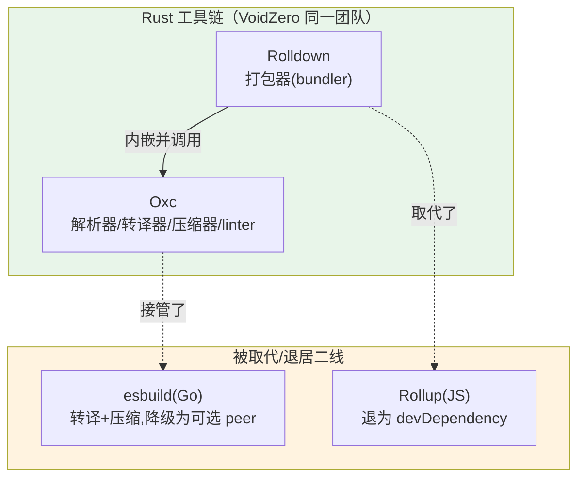

# 专题 03 · Oxc 工具链与边界：谁在 Vite 8 里把 TS/JSX 变成 JS、把产物压缩

> 本节目标：讲清 Vite 8 里那个「不那么显眼但无处不在」的 Oxc——它是什么、在 dev 转译和 build 压缩里分别接管了谁的活、它和 Rolldown / esbuild / Rollup 的边界到底在哪。最后回到 8.1.0 源码，看 `vite:oxc` 插件、默认 `minify:'oxc'`、`esbuild → oxc` 配置迁移这三处实现。
>
> 源码基线：Vite 8.1.0。锚点：`packages/vite/src/node/plugins/oxc.ts`、`plugins/index.ts`、`build.ts`、`config.ts`。

---

## 一、先厘清四个名字的边界（最重要）

Oxc 最容易让人犯迷糊，因为它和 Rolldown「同源」、又干着 esbuild 当年的活。先用一张「职责边界图」搞清楚四者关系：



一句话边界：

- **Rolldown 是「打包器」**：负责把多个模块连成依赖图、tree-shaking、代码分割、产出 chunk。对应取代 **Rollup**。
- **Oxc 是「工具集」**：负责解析（parser）、转译（transformer，去 TS 类型/降 JSX）、压缩（minifier）、lint。对应接管 **esbuild** 的转译与压缩职责。
- **Rolldown 内嵌 Oxc**：打包过程里需要解析和转译时，Rolldown 直接调内部的 Oxc，不跨进程、不序列化 AST。

> 关键事实：在 Vite 8 的依赖树里，**Oxc 不是一个你能单独 `npm i` 的运行时包**。Vite 通过 `rolldown` 这个包暴露的子路径来用它——`import { transformSync } from 'rolldown/utils'`、`import { scan, viteTransformPlugin } from 'rolldown/experimental'`。装了 Rolldown，就附带了 Oxc。这一点直接决定了下面源码里的 import 长什么样。

---

## 二、Oxc 在 Vite 8 里接管了哪两件事

### 2.1 dev/transform 期：转译（取代 esbuild 转译）

dev 期每个 `.ts`/`.tsx`/`.jsx` 模块被请求时，要「只转译、不打包」地变成浏览器可跑的 JS（去掉类型注解、把 JSX 编译成 `createElement`/`jsx` 调用）。Vite 8之前 这步是 `vite:esbuild` 插件干的，Vite 8 换成了 `vite:oxc` 插件。

> 注意「转译 ≠ 类型检查」：和 esbuild 一样，Oxc 也**只做语法转换、不做类型检查**。这意味着第一阶段反复强调的「Vite 不替你做类型检查，要靠 `tsc --noEmit` / `vue-tsc`」这条事实在 Vite 8 依然成立——换了引擎，但「只转译」的边界没变。

### 2.2 build 期：压缩（取代 esbuild/terser 作为默认）

build 产物的压缩（minify），Vite 8 默认用 Oxc（`build.minify` 默认 `'oxc'`），取代了 Vite 8之前 的默认（esbuild 压缩）。terser 和 esbuild 仍可选，但需要你显式指定。

---

## 三、回到源码：三处实现

### 3.1 `vite:oxc` 插件：dev 转译的落点

文件：`packages/vite/src/node/plugins/oxc.ts`（L210、L309）

```ts
export function oxcPlugin(config: ResolvedConfig): Plugin {   // 🔖断点[专题03] Oxc 转译插件,取代 vite:esbuild
  // ...
  return {
    name: 'vite:oxc',
    async transform(code, id) {
      if (filter(id) || filter(cleanUrl(id)) || jsxRefreshFilter?.(id)) {
        const result = await transformWithOxc(/* ... */)   // 调 rolldown/utils 的 transformSync
        // ...
        return { code: result.code, /* map, moduleType */ }
      }
    },
  }
}
```

它的 import 头印证了第一节的边界结论：

文件：`packages/vite/src/node/plugins/oxc.ts`（L1–7）

```ts
import { transformSync } from 'rolldown/utils'                     // Oxc 转译能力,来自 rolldown 包
import { viteTransformPlugin as nativeTransformPlugin } from 'rolldown/experimental'
```

它在插件流水线里被注册的位置：

文件：`packages/vite/src/node/plugins/index.ts`（L118–126）

```ts
config.oxc !== false
  ? ({ ...oxcRuntimePlugin(), applyToEnvironment(e) { return !e.config.isBundled } })
  : null,
config.oxc !== false ? oxcPlugin(config) : null,   // 🔖断点[专题03] 只有 oxc!==false 才注册转译插件
```

两个细节值得注意：

1. **开关是 `config.oxc`**，不是 `config.esbuild`。要彻底关掉默认转译，得写 `oxc: false`（写 `esbuild: false` 在 Vite 8 已无效，见 3.3）。
2. **build（`isBundled`）环境走的是 `nativeTransformPlugin`**（`oxc.ts:293`，由 Rolldown 在打包过程里原生跑 Oxc 转译），dev 才走插件 `transform` 钩子里的 `transformWithOxc`——同一个 Oxc 能力，两种接入方式。

### 3.2 默认压缩器是 `'oxc'`

文件：`packages/vite/src/node/build.ts`（L452、L481–485）

```ts
const merged = mergeWithDefaults({
  // ...
  minify: consumer === 'server' || isBundledDev ? false : 'oxc',   // 🔖断点[专题03] build 默认压缩器为 Oxc
  // ...
}, raw)

// normalize false string into actual false
if ((merged.minify as string) === 'false') {
  merged.minify = false
} else if (merged.minify === true) {
  merged.minify = 'oxc'                 // minify:true 也解析成 'oxc'
}
```

再往后，`resolveRolldownOptions` 把它翻译成 Rolldown 的 output 选项（`build.ts:776–789`）：`minify: 'oxc'` → Rolldown 内部用 Oxc minifier；`minify: false` → `'dce-only'`（只做死代码消除）。`build.minify` 可选值为 `'oxc' | 'terser' | 'esbuild' | boolean`，默认 `'oxc'`。

### 3.3 `esbuild` 配置项的「迁移与降级」

很多老项目在 `vite.config` 里写了 `esbuild: { ... }`（比如配 JSX、`jsxInject`、`target`）。Vite 8 没有直接抛弃这些配置，而是**把它转译成 Oxc 配置**：

文件：`packages/vite/src/node/config.ts`（L1923–1943）

```ts
let oxc: OxcOptions | false | undefined = config.oxc
if (config.esbuild) {
  if (config.oxc) {
    logger.warn(/* 两个都配了,以 oxc 为准,忽略 esbuild */)
  } else {
    oxc = convertEsbuildConfigToOxcConfig(config.esbuild, logger)   // 🔖断点[专题03] esbuild 配置自动转成 oxc 配置
  }
} else if (config.esbuild === false && config.oxc !== false) {
  logger.warn(
    `\`esbuild\` option is set to false, but \`oxc\` option was not set to false. ` +
    `\`esbuild: false\` does not have effect any more. ` +
    `If you want to disable the default transformation, ... please set \`oxc: false\` instead.`,
  )
}
```

这段是企业升级最该看的一段，三条规则：

1. **`esbuild: {...}` 仍可写**：会被 `convertEsbuildConfigToOxcConfig`（`plugins/oxc.ts:345`）自动翻译成 `oxc` 配置——JSX 设置、`jsxInject`、`target` 等大多能平滑迁移。
2. **`esbuild` 和 `oxc` 同时配 → 以 `oxc` 为准**，并打印警告。
3. **`esbuild: false` 不再生效**：想关默认转译，必须改成 `oxc: false`，否则只会收到一条警告而转译照常发生。这是一个静默行为变化的坑。

---

## 四、为什么 Oxc 内嵌在 Rolldown 里是「关键优化」而不只是「打包方便」

先把这个优化点单独说清：Oxc 内嵌进 Rolldown，不只是为了打包方便，实现上还带来一个实打实的性能收益：

- 传统组合（esbuild 转译 + Rollup 打包）里，两个工具是独立进程/独立 AST，模块代码要在它们之间以**字符串**反复传递、各自重新解析。
- Rolldown + Oxc 同为 Rust、同进程，打包时需要解析或转译，直接复用 Oxc 在内存里的同一套 AST，**省掉「解析→序列化→再解析」的往返**。

所以 Vite 8 的「快」不只是「Rust 比 JS 快」，还有「**少了一次工具间的 AST 搬运**」。这也是为什么官方把 Rolldown + Oxc 作为一条工具链整体推进，而不是各自为政。

---

## 五、动手验证

```bash
# 1) 看 Oxc 转译:dev 期请求一个 .tsx,断点 plugins/oxc.ts:309 的 transform
node packages/vite/bin/vite.js dev playground/html
#    在浏览器打开页面触发模块请求,断点停下看 transformWithOxc 的入参/出参

# 2) 看 Oxc 压缩:默认 build 就是 Oxc 压缩
node packages/vite/bin/vite.js build playground/html
#    对比 --minify terser / --minify esbuild,看产物差异与是否需要装对应 peer 依赖

# 3) 验证 esbuild:false 不再生效
#    在 vite.config 里写 esbuild:false,启动 dev,观察 console 的 warning 与「转译照常发生」
```

> 调试提示：`vite:oxc` 的 `transform` 钩子是它和主线 [06 核心转换链路](../01-Vite实现原理/06-核心转换链路.md)、[07 插件容器](../01-Vite实现原理/07-插件容器PluginContainer.md) 的接口——Oxc 只是「被插件容器调用的一个 transform 实现」，它不改变插件管线的形状，只是把「转译」这一步的内部实现从 esbuild 换成了 Oxc。

---

## 六、本节小结

**这套实现解决了什么问题？**
Oxc 接管了 dev 转译（取代 `vite:esbuild`）与 build 默认压缩（取代 esbuild/terser 默认），并与 Rolldown 同进程共享 AST，省掉工具间序列化往返；`convertEsbuildConfigToOxcConfig` 让老的 `esbuild` 配置平滑迁移到 Oxc——共同完成了「转译/压缩」侧的单引擎收敛。

**它带来了什么复杂度 / 代价？**
多了一层「名字边界」的认知负担（Oxc/Rolldown/esbuild/Rollup 谁干啥）；`esbuild: false` 静默失效、要改 `oxc: false` 是一个隐蔽的行为变化坑；Oxc 不可独立安装、与 Rolldown 强绑定，遇到转译细节差异时排查路径更长（要切到 Rust 侧）。

**读完你应当能做到：**

- [ ] 用一句话分别界定 Oxc / Rolldown / esbuild / Rollup 的职责，并说清 Oxc 由 `rolldown` 包暴露这一事实；
- [ ] 指出 Vite 8 里 Oxc 接管的两件事（dev 转译、build 默认压缩）及对应源码位置；
- [ ] 解释 `config.oxc` 才是默认转译开关、`esbuild:false` 已失效，并避免这个升级坑；
- [ ] 说清「Oxc 内嵌 Rolldown」带来的同源零序列化性能收益。

转译、打包、压缩都讲完了。换引擎不是无代价的——它会连带影响整个插件生态，这是企业升级最关心的最后一块 → [专题 04 生态连带影响（实现层）](./专题04-生态连带影响.md)。
