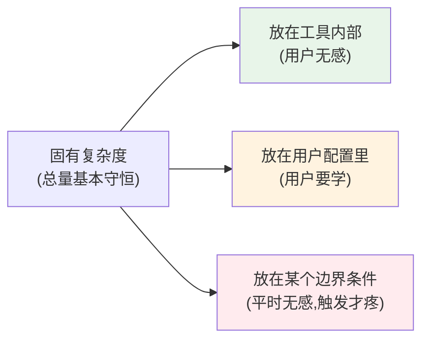

# 01 · 复杂度的管理：在「开发体验」与「生产产物」之间持续做权衡

> 本节核心追问：构建工具的复杂度从哪里来？为什么 Vite 宁愿让 dev 和 build 走两条不同的路、忍受「两套行为」，也要给开发者极致的启动与热更新速度？
>
> 绑定案例：dev 不打包（浏览器原生 ESM + 按需编译）vs build 打包（一次性优化产物）。具体文章可以看第二阶段 [专题01 双引擎的历史与代价](../02-第二阶段-源码篇/02-底层引擎与生态对比/专题01-双引擎的历史与代价.md)、[主线05 按需编译](../02-第二阶段-源码篇/01-Vite实现原理/05-按需编译与devserver请求处理流程.md)、[主线11 构建驱动 Rolldown](../02-第二阶段-源码篇/01-Vite实现原理/11-构建阶段驱动Rolldown.md)。

---

## 一、先复盘：Vite 把复杂度放在了哪里

回到一个最朴素的事实——一个前端构建工具要同时讨好两个诉求完全相反的老板（这张表在第二阶段 [专题01-双引擎的历史与代价](../02-第二阶段-源码篇/02-底层引擎与生态对比/专题01-双引擎的历史与代价.md) 出现过，这里换个角度重读）：

| 场景 | 最在乎 | 能容忍 |
|---|---|---|
| **dev（开发）** | 冷启动快、改完代码毫秒级反馈 | 产物大、没压缩、没 tree-shaking |
| **build（生产）** | 产物小、tree-shaking 干净、分包可控 | 单次编译慢一点 |

webpack 时代的做法是：**dev 和 build 用同一套打包逻辑**。一致性极好——dev 跑通的，build 基本也通。但代价是 dev 也要先把整张依赖图打包一遍才能启动，项目越大启动越慢，几十秒甚至几分钟的冷启动成了那个时代前端的集体记忆。

Vite 的选择截然相反：**dev 不打包**。

- dev 期：把源码交给浏览器原生 ESM，**请求一个模块才编译一个模块**（第二阶段 [主线05-按需编译与devserver请求处理流程](../02-第二阶段-源码篇/01-Vite实现原理/05-按需编译与devserver请求处理流程.md)），只对 `node_modules` 做依赖预构建（第二阶段 [主线04-依赖预构建](../02-第二阶段-源码篇/01-Vite实现原理/04-依赖预构建.md)）。冷启动几乎与项目规模无关。
- build 期：再用打包器（Vite 8 是 Rolldown，第二阶段 [主线11-构建阶段驱动Rolldown](../02-第二阶段-源码篇/01-Vite实现原理/11-构建阶段驱动Rolldown.md)）一次性把整张图打包优化。

这个选择的本质，不是「消灭了复杂度」，而是**把复杂度从「启动时间」搬到了「dev/build 一致性」上**。你换来了梦幻般的开发体验，付出的代价是「dev 正常、build 异常」这一类最难排查的 bug。

> 关键认知：**复杂度不会消失，只会转移。** 一个设计「简单」，往往只是它把复杂度挪到了你暂时看不到的地方。判断一个设计好不好，不是看它「有没有复杂度」，而是看它**把复杂度放在了哪里、那个位置是不是你能承受的**。

---

## 二、抽象：复杂度守恒与「把复杂度放对地方」

把上面的复盘抽象成一个可迁移的判断框架。

### 2.1 复杂度守恒定律（Tesler's Law 的工程版）

任何系统都有一个**无法被消除的固有复杂度**。你能做的不是消灭它，而是决定**由谁来承担**：

Vite 的「dev 不打包」就是典型的第三类：**把复杂度压进「dev/build 一致性」这个边界**——平时（99% 的开发时间）你完全无感、体验极爽；只在「build 跟 dev 行为不一致」这个边界被触发时才疼。这是一个非常划算的赌注，因为不一致是小概率，极致 dev 体验是每分每秒。

### 2.2 三问，判断一个「复杂度搬运」是否划算

面对任何「为了 A 而牺牲 B」的设计，问三个问题：

1. **频率**：你换来的好处发生在高频还是低频路径上？牺牲的代价发生在高频还是低频？
   - Vite：好处（快）在每秒钟，代价（不一致 bug）在低频。**划算**。
2. **可观测性**：当代价被触发时，开发者能不能快速定位到「这是那个权衡导致的」？
   - Vite 早期较弱（"我代码没问题啊"），所以 Vite 8 干脆用单引擎（Rolldown）让 dev/build 同源，从根上削掉这个边界——见 [03 架构决策的时机](./03-架构决策的时机.md)。
3. **可逆性**：万一这个权衡不成立，能不能退回去？
   - Vite 提供 `preview`、提供 sourcemap、提供 `build` 后本地验证，给了退路（第二阶段 [主线12 preview 边界](../02-第二阶段-源码篇/01-Vite实现原理/12-preview-server边界.md)）。

### 2.3 「默认值」是复杂度管理的最高杠杆

Vite 还有一层更隐蔽的复杂度管理：**好的默认值**。依赖预构建自动触发、sourcemap 自动串联、HMR 自动生效——用户不配置也能用对。复杂度被工具默默吃掉了（上图第一类）。

> 一条可迁移的判断：**衡量一个工具的成熟度，看用户使用有多无脑「不需要被改」。** 需要大量配置才能用对的工具，是把复杂度推给了用户。

---

## 三、迁移练习：用「复杂度守恒」拆解 webpack 与 Turbopack

可以先看下面的答案，然后自己用 2.2 的三问分析，最后结合自己的理解重新分析。

**对象：webpack（dev/build 同源）vs Vite（dev/build 分离）vs Turbopack（Next.js 的 Rust 打包器，dev 增量打包）。**

| 工具 | 复杂度放在哪 | 高频路径体验 | 边界代价 |
|---|---|---|---|
| webpack | 放在启动阶段的集中打包与全量模块图构建 | dev 冷启动慢（要先打包） | dev/build 高度一致，几乎无「两套行为」bug |
| Vite 2–7 | 放在「dev/build 一致性」边界 | dev 极快 | 偶发「dev 正常 build 异常」 |
| Vite 8 | 用单引擎消掉该边界 | dev 极快 | 边界被削平，但引入 Rust 工具链的新代价（见 [05-性能与可维护性的边界](./05-性能与可维护性的边界.md)） |
| Turbopack | 放在「增量打包的实现复杂度 + 与 Next 强绑定」 | dev 快（增量） | 生态独立、与通用 Vite 生态不互通 |

读这张表你会发现：**没有一个是「最优」的，每个都只是把复杂度放在了不同位置。** webpack 用启动慢换一致性，Vite 用一致性边界换启动快，Vite 8 又用 Rust 复杂度换回一致性，Turbopack 用生态封闭换 Next 内的极致集成。

之后可以拿任意一个你正在用的工具（比如 Bun 的 bundler、esbuild、SWC），进行复杂度的分析——它的固有复杂度被放在了哪里？那个位置是你的项目能承受的吗？如果答案是「不能承受」，那它就不适合你，无论它跑分多漂亮。

---

## 四、本节小结

**复盘了什么决策？**
Vite「dev 不打包、build 才打包」的核心取舍：用「dev/build 可能不一致」这个低频边界代价，换「dev 体验与项目规模解耦」的高频收益。

**抽象出什么可迁移框架？**

- **复杂度守恒**：复杂度不会消失，只会转移；判断设计优劣，看它把复杂度放在了哪里。
- **三问法**（频率 / 可观测性 / 可逆性）：判断一次「为 A 牺牲 B」的权衡是否划算。
- **默认值是最高杠杆**：好工具用好的默认值默默吃掉复杂度，而不是推给用户。

**读完你应当能做到：**

- [ ] 说清 Vite「dev 不打包」把复杂度从「启动时间」搬到了「dev/build 一致性」，以及这笔交易为什么在 dev 期是划算的；
- [ ] 用「频率 / 可观测性 / 可逆性」三问，判断任意一个工程权衡是否值得；
- [ ] 理解「复杂度守恒」——评价一个设计不是看它有没有复杂度，而是看它把复杂度放在了哪里；
- [ ] 给一个你正在用的工具填上「它的复杂度放在哪」这一行。

下一节我们看复杂度管理里最锋利的一把刀——抽象：[02 抽象的代价与收益](./02-抽象的代价与收益.md)。
