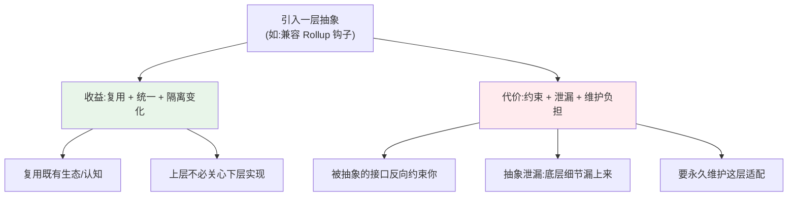

# 02 · 抽象的代价与收益：复用一个生态的抽象层，既带来兼容性也带来约束

> 本节核心追问：Vite 为什么不自己发明一套插件 API，而要去兼容 Rollup 的钩子？这个「复用别人生态」的抽象决定，给它带来了什么、又锁住了什么？
>
> 绑定案例：PluginContainer——Vite 在 dev server 里「模拟」一个 Rollup/Rolldown 运行环境，让一套为「构建时打包」设计的插件钩子，在「dev 不打包」的世界里照常工作。实现层见第二阶段 [主线07 插件容器](../02-第二阶段-源码篇/01-Vite实现原理/07-插件容器PluginContainer.md)，连带影响见 [专题04 生态连带影响](../02-第二阶段-源码篇/02-底层引擎与生态对比/专题04-生态连带影响.md)。

---

## 一、先复盘：Vite 选择「站在 Rollup 的肩膀上」

Vite 插件 API 和 Rollup 高度一致：`resolveId`、`load`、`transform`、`buildStart` 这些钩子名和核心语义都沿用了 Rollup。这不是 Vite 8 才出现的选择，而是 Vite 早期就定下来的生态策略。

这里容易混淆的是：Vite 2–7 里的 esbuild 主要承担依赖预构建、TypeScript/JSX 转换、压缩等高频执行任务；但面向用户和插件作者的接口，仍然不是 esbuild 插件 API，而是 Rollup 风格的 Vite 插件 API。到 Vite 8，底层执行层进一步走向 Rolldown/Oxc，插件抽象层依然延续 Rollup 兼容路线。这是一个**主动的抽象决策**：不另起炉灶，而是复用 Rollup 这套已经被千百个插件验证过的接口。

但这个选择马上带来一个根本矛盾：Rollup 的钩子是为**构建时打包**设计的，它假设存在一个完整构建上下文（`this.emitFile`、`this.parse`、模块缓存等）；而 Vite dev **不打包**，只是来一个请求转一个模块。

Vite 的解法是 PluginContainer——**在 dev server 里模拟出一个 Rollup 运行环境**：同样的钩子、同样的 `this` 上下文 API，底层却是「按需调用」而非「整体构建」。插件以为自己跑在 Rollup 里，其实跑在 Vite dev server 里（第二阶段 [主线07-插件容器PluginContainer](../02-第二阶段-源码篇/01-Vite实现原理/07-插件容器PluginContainer.md) 第一节那句类比：「PluginContainer 是一个 Rollup 模拟器」）。

### 收益：一夜之间拥有一个成熟生态

这个抽象的收益是巨大的，几乎是 Vite 早期能起飞的关键之一：

- **生态复用**：Rollup 多年积累的插件（CommonJS 转换、别名、各种文件类型加载器……）几乎可以原样在 Vite 里用；
- **认知复用**：会写 Rollup 插件的人，零成本会写 Vite 插件；
- **dev/build 统一**：同一套插件，dev 期由 PluginContainer 驱动、build 期由真正的打包器驱动，开发者写一次到处用。

### 代价：模拟永远不等于真品

但「模拟」有它的天花板。第二阶段 [插件容器 PluginContainer](../02-第二阶段-源码篇/01-Vite实现原理/07-插件容器PluginContainer.md) 的「刻意不支持的部分」小节列得很清楚——dev 期有一批 Rollup API 是被**刻意「不支持/告警」**的：

| Rollup 能力 | dev 期处理 | 为什么 |
|---|---|---|
| `this.cache` | 类型上直接 `Omit` 掉，不提供 | dev 没有 build 那种整体构建缓存 |
| `this.emitFile` / `getFileName` | 调用即 `_warnIncompatibleMethod` 告警 | dev 没有「产物」概念 |
| `buildStart` 生命周期 | 第一次 `resolveId` 时**惰性补**触发 | dev 没有「构建开始」这个时刻 |

也就是说：**抽象层复用了 Rollup 的接口，但 dev 环境填不满这个接口的所有语义。** 那些填不满的缝隙，正是「插件在 dev 能跑、build 行为却不同」这类问题的温床。更进一步，到了 Vite 8 换 Rolldown，那些**依赖 Rollup 内部实现细节**（而非公开 API）的插件就可能失效（第二阶段 [专题04-生态连带影响](../02-第二阶段-源码篇/02-底层引擎与生态对比/专题04-生态连带影响.md)）——因为你兼容的是「接口」，而有些插件偷偷依赖了「实现」。

> 关键认知：**当你复用一个抽象，你同时继承了它的能力边界和它的历史包袱。** Rollup 钩子带来的不只是生态，还有「为打包设计、对 dev 水土不服」的先天约束。抽象是一份合同：它给你接口的稳定，也要求你永远不能完全自由。

---

## 二、抽象：抽象层的「收益-约束」天平

把这个案例抽象成一个判断框架。

### 2.1 任何抽象都同时做两件事

PluginContainer 完美演示了两边：左边是「复用 Rollup 生态 + dev/build 用一套插件」，右边是「dev 填不满 Rollup 语义 + 依赖内部实现的插件会泄漏 + 永久维护这层模拟」。

### 2.2 抽象泄漏定律（Leaky Abstraction）

> 所有非平凡的抽象，在某种程度上都是会泄漏的。——Joel Spolsky

「dev 跑得好好的、build 行为不同」就是抽象泄漏的典型：你以为 PluginContainer 完美等价于 Rollup，但底层「dev 不打包」的现实，总会在某个边界漏出来。**判断一个抽象是否健康，不是看它泄不泄漏（一定会），而是看它泄漏时是否「以非隐晦的方式失败」**——这正是第二阶段 [主线07-插件容器PluginContainer](../02-第二阶段-源码篇/01-Vite实现原理/07-插件容器PluginContainer.md) 强调的：dev 期对不支持的 API 明确告警，而不是悄悄返回错值。

> 一条可迁移的判断：**好的抽象在被突破时会大声报错，坏的抽象在被突破时会假装没事。** 评估任何抽象层，专门去试它的边界，看它失败时是「明确告知」还是「悄悄出错」。

### 2.3 三问，决定「要不要复用一个外部抽象」

1. **生态成熟度**：被复用的抽象，背后的生态有多大？（Rollup 插件生态足够大，复用极划算）
2. **语义契合度**：你的运行环境，能填满这个抽象多少语义？填不满的部分多不多、关键不关键？（dev 填不满 build 语义，但填不满的部分多是 build-only，dev 用不到，所以可接受）
3. **退出成本**：将来这个抽象要换底层实现（Rollup→Rolldown），你受多大牵连？（公开 API 兼容层能挡住大部分，依赖内部实现的少数插件要适配）

这三问，正是 Vite 当年决定「兼容 Rollup」、以及 Vite 8 决定「用 Rolldown 兼容 Rollup API」时实际在算的账。

---

## 三、迁移练习：用「收益-约束天平」拆解三个抽象决策

**对象：① Rolldown 兼容 Rollup 插件 API；② React 的 JSX 抽象；③ ORM（如 Prisma）对 SQL 的抽象。**

| 抽象决策 | 主要收益 | 主要约束/泄漏 | 失败时是否「明确」 |
|---|---|---|---|
| Rolldown 兼容 Rollup API | 一夜继承 Rollup 全部插件生态 | 依赖 Rollup 内部实现的插件失效；要永久维护兼容层（`rolldown-vite` 隔离层） | 较明确（迁移期有 `rolldown-vite` 过渡、有告警） |
| JSX | 用类 HTML 语法写 UI，心智负担低 | 它不是真 HTML（`class`→`className`、必须单根…），泄漏出 React 的实现约束 | 较明确（编译/运行期报错） |
| ORM 抽象 SQL | 不写 SQL 也能 CRUD，跨数据库 | 复杂查询性能/能力泄漏，最终还得写原生 SQL；"N+1" 等问题被掩盖 | **常常不明确**（悄悄生成低效 SQL，不报错） |

这张表里最值得警惕的是 ORM：它的抽象在被突破时**往往不报错，而是悄悄退化**（生成一条慢查询、一个 N+1），属于 2.2 里的「坏抽象」征兆。这不代表 ORM 不能用，而是说：**用它时你必须知道它会在哪里悄悄泄漏，并主动补上可观测性**（打开 SQL 日志、监控慢查询）。

可以自己选一个你重度依赖的抽象（你的状态管理库、你的 RPC 框架、你的 CSS-in-JS），回答：它复用了什么生态？它在哪个边界会泄漏？它泄漏时是「大声报错」还是「悄悄出错」？最后一问决定了你要不要为它额外加监控。

---

## 四、本节小结

**复盘了什么决策？**
Vite 兼容 Rollup 钩子、用 PluginContainer 在 dev 期模拟 Rollup 环境的抽象决策——它换来了整个 Rollup 生态与「dev/build 一套插件」的统一，代价是 dev 填不满 build 语义的缝隙、依赖内部实现的插件会泄漏、以及一层必须永久维护的模拟/兼容层。

**抽象出什么可迁移框架？**

- **抽象天平**：每一层抽象同时给你收益（复用/统一/隔离）和代价（约束/泄漏/维护），没有只赚不赔的抽象。
- **抽象泄漏定律**：非平凡抽象一定会泄漏；好抽象泄漏时「大声报错」，坏抽象泄漏时「悄悄出错」。
- **复用三问**（生态成熟度 / 语义契合度 / 退出成本）：决定是否复用一个外部抽象。

**读完你应当能做到：**

- [ ] 解释 Vite 复用 Rollup 钩子的收益（生态+认知+dev/build 统一）与代价（dev 语义填不满、依赖内部实现的插件失效、永久维护成本）；
- [ ] 用「抽象会不会大声报错」区分好抽象与坏抽象，并理解 PluginContainer 为何刻意对不支持的 API 告警；
- [ ] 用「生态成熟度 / 语义契合度 / 退出成本」三问，判断是否该复用一个外部抽象；
- [ ] 找出自己项目里一个「会悄悄泄漏」的抽象，并决定要不要为它加可观测性。

抽象是「在哪一层解决问题」，下一节谈「在哪个时间点做决定」——[03 架构决策的时机](./03-架构决策的时机.md)。
