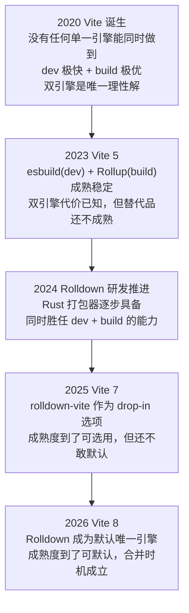
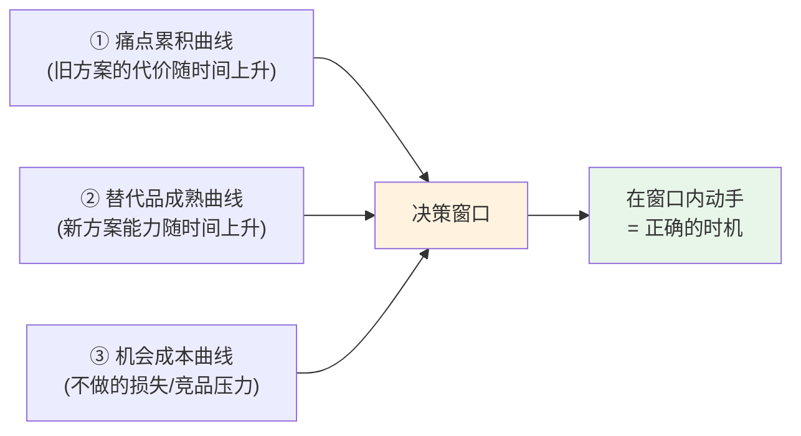

# 03 · 架构决策的时机：双引擎 → 单引擎，为什么是「现在」而不是更早或更晚

> 本节核心追问：双引擎（esbuild 管 dev、Rollup 管 build）的「行为不一致」代价，Vite 团队从第一天就知道。那为什么不早点合并成单引擎？为什么偏偏是 Vite 7/8（2025–2026）才动手？换个问法：一个「正确但昂贵」的架构决策，正确的执行时机由什么决定？
>
> 绑定案例：双引擎 → 单引擎（Rolldown）。历史与代价见第二阶段 [专题01-双引擎的历史与代价](../02-第二阶段-源码篇/02-底层引擎与生态对比/专题01-双引擎的历史与代价.md)，两个引擎的对比见 [专题02 Rollup vs Rolldown](../02-第二阶段-源码篇/02-底层引擎与生态对比/专题02-Rollup对比Rolldown.md)。

---

## 一、先复盘：一个「早就该做、却不能太早做」的决策

第二阶段 [专题01-双引擎的历史与代价](../02-第二阶段-源码篇/02-底层引擎与生态对比/专题01-双引擎的历史与代价.md) 把账算得很透：双引擎的代价是 dev 和 build 走两条代码路径、两个引擎，**行为无法保证一致**，催生了「dev 正常、build 异常」这一类最难排查的 bug，还逼 Vite 长期维护两套转译/打包逻辑。

「合并成单引擎」这个目标的收益是确定的：一致性、少维护一套。但它直到 Vite 7（2025.06 引入 `rolldown-vite`）、Vite 8（2026.03 默认）才落地。中间隔了好几年。为什么？

把时间轴上的约束摊开看：

关键不在「Vite 想不想合并」，而在**那个能替代双引擎的单引擎（Rolldown）什么时候成熟到可以同时胜任 dev 和 build**。这件事 Vite 团队控制不了进度（Rolldown 是另一条 Rust 工具链的长期投入），只能等它跨过成熟度阈值。

最终转换时机的本质：**「为什么双引擎合并成单引擎是『现在』而不是更早，答案就藏在『Rolldown 直到 2026 才成熟到能同时胜任两端』。」**

### 早做错在哪、晚做又错在哪

- **太早做**（比如 2022 强行上 Rust 打包器）：Rolldown 还不成熟，强行替换会让 build 产物质量、插件兼容性大幅倒退——用一个「不一致 bug」换来一堆「根本跑不通」，得不偿失。
- **太晚做**（比如一直拖着）：双引擎的维护成本和「dev/build 不一致」的口碑损耗持续累积，而竞品（Turbopack 等 Rust 方案）已经在抢「快」的叙事。错过窗口，Vite 的核心优势会被蚕食。

所以「时机」是一个**窗口**：早于窗口，替代品没准备好；晚于窗口，代价已经溢出、机会已经流失。Vite 7 的 `rolldown-vite` drop-in 更是神来之笔——它不是「一步到位默认」，而是**先开一个可选入口让生态去验证成熟度**，等真实项目跑够了，Vite 8 才敢设为默认。这是「在窗口期内进一步降低决策风险」的手法。

---

## 二、抽象：架构决策时机的判断框架

把这个案例抽象成一套「什么时候动手」的判断方法。

### 2.1 决策时机由三条曲线的交点决定

- **痛点足够痛**（双引擎不一致 bug + 双份维护，已经痛了好几年）；
- **替代品足够成熟**（Rolldown 2025–2026 跨过「能同时胜任 dev+build」阈值）；
- **不做的代价开始显现**（竞品用「Rust = 快」抢叙事）。

三者同时满足，才是最佳动手的时机。**只看其中一条可能会做错决定**：只看痛点会太早动手（替代品没好），只看成熟度会错过窗口（痛点早就溢出）。

### 2.2 「可逆地试」比「一步到位」更聪明

Vite 7 `rolldown-vite` 作为 drop-in 可选项的做法，提炼出一条极重要的工程智慧：**当一个大决策的时机判断有不确定性时，不要赌「一步到位」，而要设计一个「可逆的试点」去采集真实信号。**

- 试点（opt-in）阶段：愿意尝鲜的项目先用，暴露兼容问题，零强迫；
- 验证够了，再把默认值翻过来（Vite 8）。

这把「一次性的高风险决策」拆成了「低风险试点 + 基于证据的默认切换」两步。**时机不是一个点，而是一段可以主动缩短风险的过程。**

### 2.3 区分「可逆决策」与「不可逆决策」

> 这是 Bezos 著名的「单向门 / 双向门」框架，在架构决策里同样好用。

- **不可逆决策（单向门）**：一旦做了很难退回（如对外 API 的破坏性变更、数据格式迁移）。必须等窗口非常确定才动手。
- **可逆决策（双向门）**：可以试、可以退（如 `rolldown-vite` opt-in）。应该尽早、低成本地试。

Vite 的高明之处：**把一个看似不可逆的大决策（换打包器），通过 `rolldown-vite` 隔离层和兼容层，改造成了一个相对可逆的渐进决策。** 这也直接衔接下一节 [04 渐进式演进](./04-渐进式演进.md)。

---

## 三、迁移练习：用「三曲线 + 单双向门」判断技术升级时机

**对象：你的团队该不该现在从 Vite 5 升级到 Vite 8？（也可换成：该不该现在上某个新框架/新数据库/新语言）**

逐条套用框架：

1. **痛点累积**：你现在的构建慢/产物大/维护成本，到「忍不了」的程度了吗？还是只是「听说新版本更快」？
   - 如果痛点不痛，时机就还没到——为升级而升级是在制造风险。
2. **替代品成熟**：Vite 8 + Rolldown 对你用的插件、框架、CI 流程，成熟到可默认了吗？（去查你依赖的关键插件是否已适配，参考第一阶段 [05 版本差异与升级迁移](../01-第一阶段-使用篇/05-版本差异与升级迁移/README.md)）
3. **机会成本**：不升级，你会错过什么？（Module Federation、模块级持久缓存等 Vite 8 单引擎解锁的能力，详见第一阶段 [05 版本差异与升级迁移](../01-第一阶段-使用篇/05-版本差异与升级迁移/README.md)）
4. **单/双向门**：这次升级可逆吗？
   - Vite 刻意把它做成偏双向门：可以先在一个非核心项目 / 一个 CI 分支上试 `rolldown-vite`，跑通了再全量。**先走可逆的试点，别直接在主干一步到位。**

给「现在升级 Vite 8」这个决策画出你团队的三条曲线，判断窗口到了没；并明确设计一个「可逆试点」方案（在哪个项目、跑多久、看哪些信号才决定全量）。把同一套流程换到「该不该现在引入 Rust 工具/换 ORM/上 monorepo」，结论框架完全一样。

---

## 四、本节小结

**复盘了什么决策？**
双引擎 → 单引擎为什么是 Vite 7/8 而非更早：合并的收益（一致性、少维护）一直都在，但执行时机被「Rolldown 何时成熟到能同时胜任 dev+build」这条曲线卡着；早做替代品没准备好，晚做痛点溢出、机会流失。Vite 7 用 `rolldown-vite` opt-in 先采集信号，Vite 8 才默认——把一次性高风险决策拆成了低风险试点 + 基于证据的切换。

**抽象出什么可迁移框架？**

- **三曲线交点**：决策时机 = 痛点累积 ∩ 替代品成熟 ∩ 机会成本同时满足的窗口。
- **可逆试点**：大决策有不确定性时，设计 opt-in 试点采集真实信号，而非赌一步到位。
- **单向门 / 双向门**：不可逆决策要等窗口极确定；可逆决策应尽早低成本试，并尽量把不可逆决策改造成可逆的。

**读完你应当能做到：**

- [ ] 解释「合并单引擎的收益一直在，但时机被 Rolldown 成熟度卡住」，说清太早/太晚各错在哪；
- [ ] 用三条曲线（痛点 / 成熟度 / 机会成本）判断一项架构升级的时机窗口；
- [ ] 区分单向门与双向门决策，并能像 `rolldown-vite` 那样把大决策改造成可逆试点；
- [ ] 为「团队现在该不该升级 Vite 8」给出一个带可逆试点的决策方案。

时机解决「何时动手」，下一节解决「动手时如何不掀翻存量生态」——[04 渐进式演进](./04-渐进式演进.md)。
