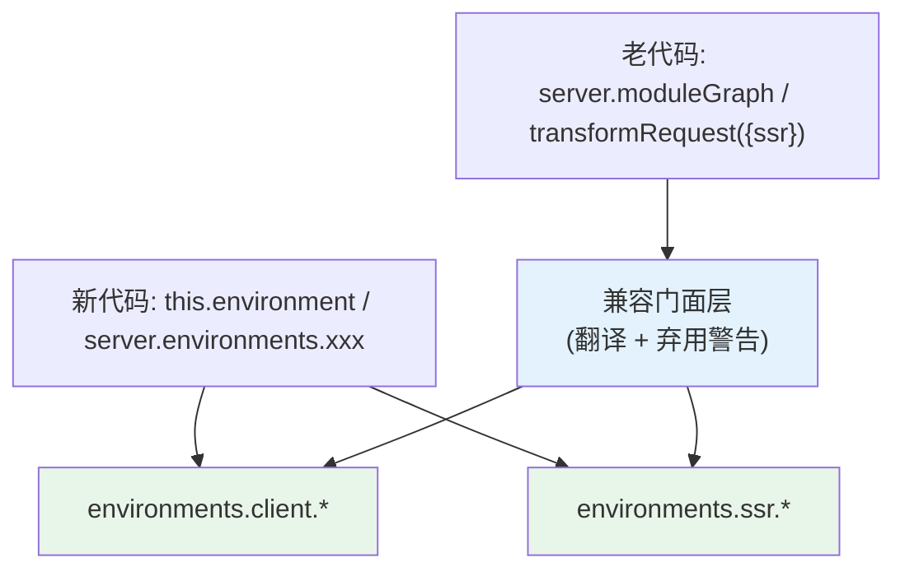
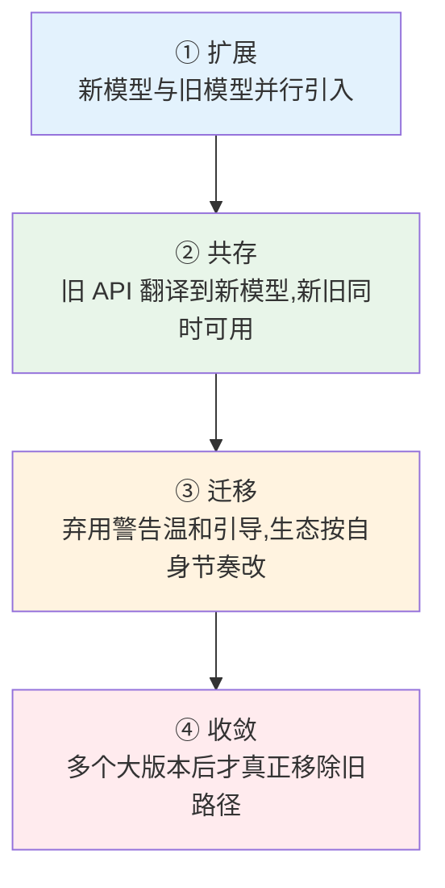

# 04 · 渐进式演进：大规模重构如何保持向后兼容

> 本节核心追问：Environment API 是 Vite 6 以来最大的内部重构——它要把「一张模块图、一个 `ssr: boolean` 布尔」的旧世界，换成「每个环境一套独立模块图/插件容器/优化器」的新世界。这么伤筋动骨的改动，为什么没有把存量生态炸成两半？「渐进式演进」到底是一种善意，还是一套可复制的工程方法？
>
> 绑定案例：Environment API 的多版本共存与兼容门面。实现层见第二阶段 [主线10 多环境模型](../02-第二阶段-源码篇/01-Vite实现原理/10-多环境模型EnvironmentAPI实现.md)，以及 [主线07 插件容器](../02-第二阶段-源码篇/01-Vite实现原理/07-插件容器PluginContainer.md) 里 `ssr` 参数的兼容垫片。

---

## 一、先复盘：一次「换地基却不停业」的重构

第二阶段 [主线10-多环境模型EnvironmentAPI实现](../02-第二阶段-源码篇/01-Vite实现原理/10-多环境模型EnvironmentAPI实现.md) 讲清了 Environment API 在做的事：把「一个构建/运行目标」抽象成 `Environment` 对象，client、ssr、edge 各自拥有独立的配置、插件列表、模块图、插件容器、预构建器、HMR 通道，从根上取代到处打补丁的 `ssr: boolean`。

这是典型的「换地基」级改动。但 Vite 必须满足一个残酷约束：**存量成千上万的项目和插件不能炸。** 老插件里写满了 `transform(code, id, { ssr })`、老代码里到处是 `server.moduleGraph`、`server.transformRequest(url, { ssr })`。

Vite 的兼容手法，第二阶段主线10 第五节总结成一句话：**「老的 server 级 API 都变成『某个环境上操作』的读穿透门面。」** 拆开看是三层：

| 旧 API | 新世界里它变成了什么 | 手法 |
|---|---|---|
| `server.moduleGraph` | 读穿透到 `environments.client/ssr.moduleGraph` 的门面，访问给弃用警告 | **门面 + 弃用警告** |
| `server.transformRequest(url, {ssr})` | `ssr` 布尔只用来「选哪个环境」，再路由到对应环境 | **参数语义降级** |
| 插件 `transform(code,id,{ssr})` 的 `ssr` 参数 | getter/setter 垫片，访问 `options.ssr` 给弃用警告但仍正确路由 | **兼容垫片** |

注意这套手法的精髓：**新旧不是「切换」，而是「共存」。** 新代码用 `this.environment`、`server.environments.xxx`；老代码用 `server.moduleGraph`、`{ ssr }`——两者同时有效，老 API 在底层被翻译成新模型上的操作，并通过弃用警告**温和地**把人往新写法引导。

### 代价也要诚实地说

渐进式演进不是没有代价（第二阶段主线10 第七节）：

- **结构变深、概念变多**：PartialEnvironment → BaseEnvironment → DevEnvironment → Runnable/Fetchable 一整套类型层级，外加「全局配置 vs 每环境配置」「全局插件 vs 每环境插件」的双轨结构；
- **要长期背着兼容层**：那层把老 API 读穿透到环境的门面，是必须长期维护的「技术债式善意」——它让迁移平滑，但也让代码库长期保有两套心智。

这正是渐进式演进的本质交易：**用「代码库一段时间内更复杂、要维护兼容层」的代价，换「生态不断裂、用户可按自己节奏迁移」的收益。**

---

## 二、抽象：渐进式演进的工程套路

把这套手法抽象成可复制的方法论。它不是 Vite 独有的灵感，而是大型系统演进的通用范式。

### 2.1 渐进式演进 = 扩展 / 共存 / 迁移 / 收敛 四拍

Vite 正踩在这四拍上：Environment API（扩展）→ 老 server API 门面共存（共存）→ 弃用警告（迁移）→ 未来某个大版本才会真正删掉旧门面（收敛）。**最关键的是②③之间那段「共存期」可以很长**——它是用户的缓冲带，长到足以让生态自然完成迁移。

### 2.2 兼容的三种武器

从案例里能提炼出三件具体工具，按「破坏性从小到大」排序，能用小的就别用大的：

| 武器 | 作用 | Vite 里的例子 |
|---|---|---|
| **门面 / 适配器** | 旧入口仍在，底层转调新实现 | `server.moduleGraph` 读穿透到环境图 |
| **垫片 + 语义降级** | 旧参数保留但意义被重新解释 | `{ ssr }` 从「开关」降级为「选环境」 |
| **弃用警告** | 不阻断运行，只提示「这条路要废了」 | 访问旧 API 时打印 deprecation |

注意：**弃用警告本身就是一种契约**——它给了用户「现在还能用、但请尽快改」的明确信号，而不是某天突然删掉让人猝不及防。第二阶段专题01 里 `transformWithEsbuild` 被标记 deprecated、esbuild 从核心依赖降级为可选 peer，也是同一套武器。

### 2.3 「破坏性变更预算」

> 每一个破坏性变更，都在花费用户对你的信任。

可迁移的判断：**把破坏性变更当成一种有限预算来花。** 能用门面/垫片/弃用警告（非破坏性）解决的，绝不直接 break；真要 break，集中在大版本（Vite 6→7→8 的节奏），并配套迁移指南与隔离层（`rolldown-vite` 就是把「换引擎」这个潜在 break 关进一个可选隔离层，呼应 [03 架构决策的时机](./03-架构决策的时机.md)）。

> 反面教材人人都熟：Python 2→3 一刀切、大版本不兼容，导致生态分裂、迁移拖了十年。Vite 的渐进式演进，本质就是在主动避免「Python 2→3 时刻」。

---

## 三、迁移练习：用「四拍 + 三武器」设计一次你自己的重构

**对象：假设你要给团队的内部组件库做一次破坏性 API 重构（比如把一个用了三年、被几十个项目依赖的核心组件的 props 结构换掉）。**

别再想着「发个大版本，让大家自己改」。用本节框架设计：

1. **扩展**：新 API 与旧 API 并行加入，不删旧的；
2. **共存**：旧 props 在内部被适配成新结构（门面/垫片），保证老用法继续工作；
3. **迁移**：旧用法触发 `console.warn` 弃用提示（弃用警告），并在文档给出 codemod / 迁移指南；给生态留足够长的共存期；
4. **收敛**：约定「再过两个大版本」才真正移除旧 API，而不是下个小版本就删。

再回头对照 Vite：你会发现你设计的，和 Vite 对 `server.moduleGraph`、`{ ssr }` 做的事情**结构完全一致**。

选一个你维护的、有外部依赖者的 API，写出它的四拍演进计划，并为每一步选定具体武器（门面 / 垫片 / 弃用警告）。如果你发现自己只能想到「发大版本直接改」，那正是这一节要纠正的本能。

---

## 四、本节小结

**复盘了什么决策？**
Environment API 这场「换地基」重构如何不炸生态：用门面（`server.moduleGraph` 读穿透）、参数语义降级（`{ssr}` 从开关变选环境）、兼容垫片 + 弃用警告，让新模型与旧 API **共存**而非切换，用户按自己节奏迁移。代价是代码库一段时间内更复杂、要长期维护兼容层。

**抽象出什么可迁移框架？**

- **四拍演进**：扩展 → 共存 → 迁移 → 收敛，关键是②③之间留足够长的共存缓冲期；
- **三种武器**（门面 / 垫片+语义降级 / 弃用警告）：按破坏性从小到大，能用小的不用大的；
- **破坏性变更预算**：break 是在花用户信任，要省着用、集中在大版本、配迁移路径，主动避免「Python 2→3 时刻」。

**读完你应当能做到：**

- [ ] 说清 Environment API 如何用门面/垫片/弃用警告让新旧模型共存，以及它付出的复杂度代价；
- [ ] 用「扩展→共存→迁移→收敛」四拍描述一次大型重构的节奏；
- [ ] 区分门面、垫片、弃用警告三种兼容武器的破坏性强弱并按需选用；
- [ ] 为自己维护的一个有外部依赖的 API 设计一份非破坏性的渐进迁移计划。

演进谈的是「如何平滑地变」，下一节谈这次变化最锋利的那把双刃剑——用 Rust 换速度的真实代价：[05 性能与可维护性的边界](./05-性能与可维护性的边界.md)。
