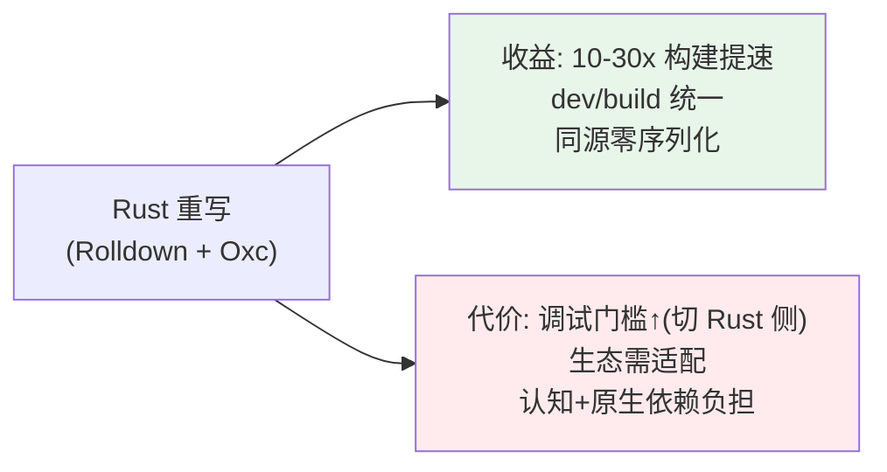
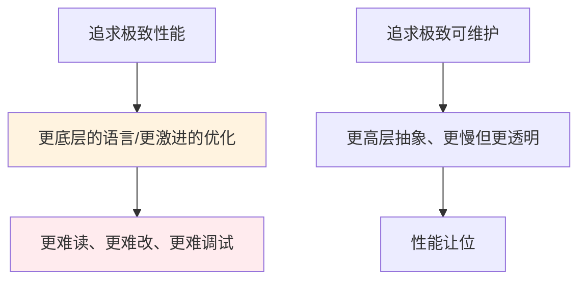

# 05 · 性能与可维护性的边界：用 Rust 换来的速度，代价是什么

> 本节核心追问：Vite 8 用 Rolldown + Oxc（Rust 工具链）换来了 10–30x 的构建提速，这是写在所有标题里的收益。但「快」从来不是免费的——这场 Rust 重写，在安装体积、生态适配、调试门槛上分别让我们付出了什么？什么时候「用更难维护换更快」是值得的，什么时候不是？
>
> 绑定案例：Rolldown/Oxc 这条 Rust 工具链的代价。实现层见第二阶段 [专题02 Rollup vs Rolldown](../02-第二阶段-源码篇/02-底层引擎与生态对比/专题02-Rollup对比Rolldown.md)、[专题03 Oxc 工具链与边界](../02-第二阶段-源码篇/02-底层引擎与生态对比/专题03-Oxc工具链与边界.md)、[专题04 生态连带影响](../02-第二阶段-源码篇/02-底层引擎与生态对比/专题04-生态连带影响.md)。

---

## 一、先复盘：「快」的账单背面写了什么

收益这一面，前两阶段已经讲透：Rolldown 用 Rust 把构建做到比 Rollup 快约 10–30x，Oxc 接管转译/压缩、与 Rolldown 同进程共享 AST，连「工具间序列化往返」都省掉了（第二阶段 [专题03-Oxc工具链与边界](../02-第二阶段-源码篇/02-底层引擎与生态对比/专题03-Oxc工具链与边界.md) 第四节）。dev/build 统一到一套 Rust 引擎，连「dev/build 不一致」这个老边界也一起削平了。

现在把账单翻到背面，老实列出这场 Rust 重写让我们付了哪些代价。

### 代价一：调试门槛——从「能断点的 JS」到「要切 Rust 侧」

这是对**本书读者最直接**的代价，也是理解 Vite 8 Rust 工具链时绕不开的一条。

- Rollup 是 JavaScript 写的：你可以直接 clone、打断点、单步看它怎么 tree-shaking。第二阶段主线那套「亲手调源码」的方法，在 TS 实现的部分（dev server、HMR、插件容器、模块图、预构建）依然成立。
- 但 Rolldown / Oxc 是 Rust 写的：第二阶段 [专题03-Oxc工具链与边界](../02-第二阶段-源码篇/02-底层引擎与生态对比/专题03-Oxc工具链与边界.md) 小结里那句话点了关键——**「遇到转译细节差异时排查路径更长（要切到 Rust 侧）」**。你没法像跟 JS 那样轻松在打包器内部打断点，得靠日志、靠 Rust 侧的调试入口。

这正是第二阶段源码篇把调试重点放在「Vite 8 仍是 TS 的那部分」、对 Rust 工具链「以架构与边界视角讲清、给调试切入点，不强求逐行啃 Rust」的根本原因——**Rust 把性能拉上去了，也把「人人可调试」这道门槛抬高了。**

### 代价二：生态适配——兼容接口挡不住依赖实现的插件

第二阶段 [专题04-生态连带影响](../02-第二阶段-源码篇/02-底层引擎与生态对比/专题04-生态连带影响.md) 讲的连带影响：Rolldown 兼容 Rollup 的**公开 API**，但那些偷偷依赖 Rollup **内部实现细节**的插件会失效；esbuild 的 `onLoad`/`onResolve` 风格插件也不再适用。换引擎不是「就改个名字」，而是整个插件生态要跟着做一轮适配——这也是 [02 抽象的代价与收益](./02-抽象的代价与收益.md) 里「你兼容的是接口，有些插件却依赖了实现」的现实回响。

### 代价三：认知与安装——多了一层「名字边界」和原生依赖

- **认知成本**：Oxc / Rolldown / esbuild / Rollup 四个名字谁干啥、谁取代谁，本身就是新的学习负担（第二阶段 [专题03-Oxc工具链与边界](../02-第二阶段-源码篇/02-底层引擎与生态对比/专题03-Oxc工具链与边界.md) 第一节专门画图钉边界）。还有 `esbuild: false` 静默失效要改 `oxc: false` 这种隐蔽迁移坑。
- **原生依赖**：Rust 工具链是平台相关的原生二进制（按 OS/架构分发），不再是「纯 JS、到处能跑」，安装体积也比纯 JS 实现更大。这对 CI 缓存、跨平台构建、冷门平台支持提出了新要求。

> 关键认知：**性能优化的代价，几乎总是「可维护性」**——更难调试、更难定制、更高的认知门槛、更强的平台耦合。把一段逻辑从「人人能读能改的高级语言」换成「极快但难碰的底层实现」，本质是用「未来改它的难度」换「现在跑它的速度」。

---

## 二、抽象：性能 / 可维护性的边界判断

把这个案例抽象成一套「该不该为性能牺牲可维护性」的判断框架。

### 2.1 性能与可维护性是一对此消彼长的张力

这不是说「性能和可维护不能兼得」，而是说**在边界附近，它们互相挤压**。Vite 的选择是：在「热路径」（打包、转译、压缩这些跑得最频繁、最吃 CPU 的环节）上不惜牺牲可维护性换性能（用 Rust）；而在「需要被频繁理解和定制」的环节（dev server、插件 API、配置归一化）上保留 TypeScript 的可维护性。

> 一条可迁移的判断：**不要全局地在性能和可维护性之间二选一，而要分路径选。** 把系统拆成「热路径」和「冷路径」，只在热路径上用难维护换性能，冷路径保持透明可改。Vite 8 的「Rust 引擎 + TS 外壳」正是这种分层。

### 2.2 三问，判断一次「为性能牺牲可维护性」是否值得

1. **这段逻辑在热路径上吗？** 它是否被高频执行、是否是真实瓶颈？（构建是，所以值得用 Rust；一个一年跑一次的脚本不值得）
   - 先用第一阶段 [08 性能优化、产物分析与报错排查](../01-第一阶段-使用篇/01-核心使用/08-性能优化产物分析与报错排查手册.md) 类方法**测量**确认瓶颈，别凭感觉优化。**过早优化是用可维护性买不存在的性能。**
2. **它需要被频繁理解/定制吗？** 越需要被人读、被人改的代码，越不该为性能牺牲可读性。
3. **代价被谁承担、能否被封装？** Vite 把 Rust 的复杂度封装在引擎里，大多数用户无感（呼应 [01 复杂度管理](./01-复杂度的管理.md) 的「复杂度放对地方」）。如果代价能被一层好抽象关住、不外溢给使用者，那这笔交易就划算得多。

### 2.3 「快」要扣掉的隐性成本

评估一个性能方案，别只看跑分。把这些隐性成本一起算进去，才是真实 TCO（总拥有成本）：

| 隐性成本 | 在 Vite 8 的体现 |
|---|---|
| 调试/排障成本 | 出问题要切 Rust 侧，普通开发者难下手 |
| 生态迁移成本 | 插件适配、`rollupOptions`→`rolldownOptions`、`esbuild:false` 失效坑 |
| 平台/分发成本 | 原生二进制按平台分发，影响 CI 与冷门平台 |
| 学习成本 | 四个工具的名字边界、双轨配置 |

**跑分快 10 倍、但每次诡异问题都要多花两天排查、还有插件用不了——这笔账是否划算，取决于你的项目把构建速度排在多高的优先级。** 对大型项目，构建从 3 分钟降到 10 秒是天大的事，值；对一个小 demo，这点提速可能根本感知不到，反而徒增依赖复杂度。

---

## 三、迁移练习：用「热/冷路径 + 隐性成本」拆解一次 Rust/Native 改写

**对象：你的团队在考虑把某个 JS/TS 实现的模块换成 Rust/Go/原生扩展（比如把一个数据处理脚本、一个 lint 规则引擎、一个序列化库换成 Rust）。**

逐条套：

1. **它在热路径上吗？** 先 profile，确认它是不是真瓶颈、被多频繁地跑。不是瓶颈就别动——你会用可维护性买来感知不到的提速。
2. **它需要被频繁改吗？** 如果业务逻辑还在快速迭代、规则天天变，换成难改的 Rust 会让迭代变慢，得不偿失；如果它是稳定的底层计算，换 Rust 才划算。
3. **代价能被封装吗？** 你能不能像 Vite 把 Rust 关进引擎那样，给它一层稳定接口，让团队大多数人不必碰 Rust？还是说全队以后都得会 Rust 才能维护它？
4. **隐性成本清单**：列出调试、CI/分发、跨平台、招聘/学习四项成本，加进总账。

对照 Vite：你会发现 Vite 的选择之所以成立，恰恰因为「构建是确凿热路径 + 引擎逻辑相对稳定 + 复杂度被封装在引擎内 + 提速量级足够大（10–30x）」四个条件同时满足。**少满足一条，这笔交易就要重新算。**

给你那个「想换成 Rust」的模块逐条打分，给出「换 / 不换」的结论与理由。如果你发现自己只是因为「Rust 听起来很快」就想换，那正是本节要拦住的冲动。

---

## 四、本节小结

**复盘了什么决策？**
Vite 8 用 Rust（Rolldown + Oxc）换 10–30x 构建提速的真实账单背面：调试门槛抬高（要切 Rust 侧）、生态需适配（依赖内部实现的插件失效）、认知与原生依赖负担（四个名字的边界、平台相关二进制）。性能的代价几乎总是可维护性。

**抽象出什么可迁移框架？**

- **分路径选择**：性能与可维护性在边界互相挤压；别全局二选一，要按「热路径 vs 冷路径」分层——Vite 的「Rust 引擎 + TS 外壳」就是范本。
- **值不值三问**（在热路径吗 / 需频繁改吗 / 代价能否被封装）：先测量再优化，警惕过早优化。
- **隐性成本清单**：评估性能方案要扣掉调试、迁移、分发、学习四项隐性成本，算真实 TCO 而非只看跑分。

**读完你应当能做到：**

- [ ] 完整说出 Vite 8 Rust 重写的三类代价，并解释为何第二阶段源码篇把调试重点放在「仍是 TS 的那部分」；
- [ ] 用「热路径 / 冷路径」解释 Vite 为何只在引擎层上 Rust、外壳层保留 TS；
- [ ] 用「值不值三问」判断一次 Rust/原生改写是否划算，并主动避免过早优化；
- [ ] 为一次「想换 Rust」的改写列出隐性成本清单并给出结论。

至此，关于 Vite 设计本身的五条哲学讲完了。下一节把视角拉到当下——在 AI 能生成配置、能解释源码的时代，工程判断还剩什么不可替代：[06 AI 时代的工程判断](./06-AI时代的工程判断.md)。
