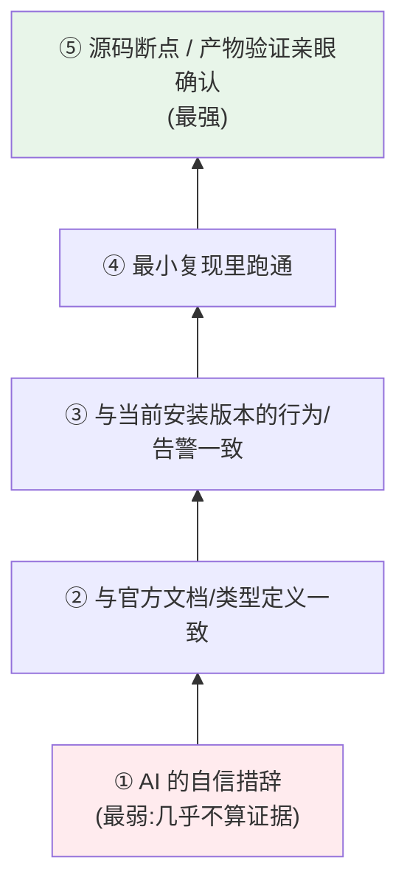
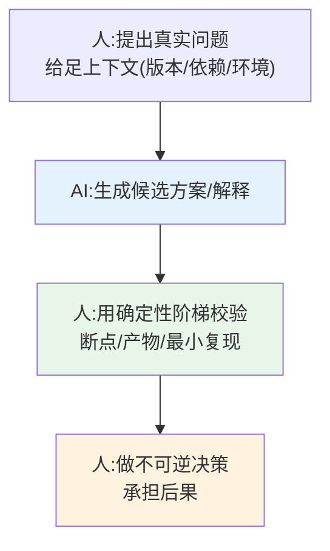

# 06 · AI 时代的工程判断：AI 能生成配置、能解释源码，确定性从哪来

> 本节核心追问：这本小册的立项前提就是「AI 能随手给出能跑的 Vite 配置」。既然如此，我们辛苦学使用、调源码、悟设计，到底图什么？AI 替代不了的那部分工程判断具体是什么？当 AI 给出一个自信满满的答案，你凭什么相信或推翻它？
>
> 绑定案例：第一阶段 [07 AI 辅助 Vite 开发](../01-第一阶段-使用篇/07-AI辅助Vite开发/README.md) 给出的「用最小复现、官方文档、源码断点、产物验证校验 AI」这套方法，以及前五节反复用到的「事实基线」与「亲手调试」。

---

## 一、先复盘：AI 在 Vite 这件事上，强在哪、错在哪

第一阶段开篇已经把话说得很直白：AI 能随手给出能跑的配置，却替代不了三件事——**理解配置背后的取舍、出问题时的定位能力、版本迁移时的工程判断。** 这三件事恰好是前五节哲学篇在讲的东西。

但这里不能把 AI 简化成“它不知道”。今天的 AI 如果接入项目上下文，确实可以读 `package.json`、看源码、查类型定义、跑构建、分析产物。真正的问题不是“AI 能不能知道”，而是：**它给出的这个答案，是默认语料里的猜测，还是已经被当前项目事实校验过的结论？**

在 Vite 这种**版本演进极快**的领域，AI 最容易出错的地方，往往正是“没有进入事实闭环”的地方（第一阶段 [07-AI辅助Vite开发/README.md](../01-第一阶段-使用篇/07-AI辅助Vite开发/README.md) 列得很细，这里从「为什么会错」的角度重读）：

| AI 常见错误 | 缺少的事实动作 | 本书里的反例 |
|---|---|---|
| 版本 API 混淆 | 没先确认当前 Vite 版本、类型定义和配置 schema | 把 `manualChunks` 当 Vite 8 推荐写法（其实是 `output.codeSplitting`，`advancedChunks` 已 deprecated） |
| 过时配置 | 没跑当前版本的配置校验或构建告警 | 让你 `esbuild: false` 关转译（Vite 8 已失效，要 `oxc: false`） |
| 插件兼容性误判 | 没检查插件版本、源码依赖和实际构建行为 | 说「Rollup 插件都能直接在 Rolldown 用」（依赖内部实现的会失效） |
| SSR/edge 环境差异忽略 | 没确认代码运行在哪个 environment、是否引用 client-only 能力 | 给 SSR 配置却注入了 client-only 逻辑 |

所以这一节真正要讨论的不是“AI 不知道事实”，而是**如何让 AI 的候选答案被事实约束**：先让它读当前版本、当前依赖、当前源码，再用最小复现、源码断点、产物验证把答案往前推一层。

> 关键认知：**AI 可以扩展可能性，也可以帮助收集事实；工程师的价值，是把事实组织成确定性。** AI 把你从「不知道怎么写」带到「有一个候选方案」，甚至可以帮你查证这个方案；但从「查过一些材料」到「这个项目可以采用」之间那道坎，仍然要靠工程判断跨过去。而这本小册前两阶段教的所有东西——版本事实、源码断点、产物验证——本质都是**建立确定性的工具**。

---

## 二、抽象：用「确定性阶梯」校验任何 AI 输出

把第一阶段那套校验方法抽象成一个通用的、不限于 Vite 的判断框架。

### 2.1 确定性阶梯：证据等级从低到高

面对 AI（或任何来源）给的一个技术论断，它的可信度取决于你用什么证据支撑它。按证据强度排成一架梯子：

- **①AI 的语气不是证据**。它对错答案一样自信。
- **②官方文档/类型**：把答案和你安装版本的官方文档、`.d.ts` 类型对一遍。类型不骗人——`build.minify` 的可选值、`rolldownOptions` 的字段，类型里写得清清楚楚。
- **③当前版本行为/告警**：跑起来看有没有 deprecation 警告（呼应 [04 渐进式演进](./04-渐进式演进.md) 里弃用警告的价值——它正是版本给你的事实信号）。
- **④最小复现**：把问题剥到最小、能稳定复现，AI 的解释才有了可证伪的载体。
- **⑤源码断点 / 产物验证**：这是最强证据，也是第二阶段整套「调源码」方法的意义。AI 说「Vite 在这里这样处理」，你打个断点亲眼看一次，对就是对、错就是错——**没有比这更高的确定性了。**

> 一条可迁移的判断：**别问「AI 说得对不对」，问「我把它放在确定性阶梯的第几级」。** 越是高风险、不可逆的决定（线上配置、版本迁移），越要把证据往④⑤推；低风险的（本地试个写法），到②③即可。

### 2.2 人机分工：AI 扩展可能性，人收敛确定性

注意两端都是人：**给上下文**是人的活（第一阶段 [07-AI辅助Vite开发/README](../01-第一阶段-使用篇/07-AI辅助Vite开发/README.md) 强调「给上下文、限定版本、要求解释取舍」），**最终拍板和担责**也是人的活。AI 是中间那段「扩展可能性」的加速器。把这条记牢：**AI 越强，人「给对上下文」和「验对结果」这两端的价值越高，而不是越低。**

### 2.3 反过来，AI 也是强力的校验工具

确定性阶梯不是用来「防 AI」的，它也能**借 AI 爬得更快**：让 AI 帮你写最小复现、帮你定位该在源码哪里打断点、帮你解释一段 Rust 日志。**关键是让 AI 服务于「建立证据」，而不是替代证据本身。** 用 AI 加速②③④⑤的获取过程，但确定性最终仍由证据给出，而非由 AI 的措辞给出。

---

## 三、迁移练习：用「确定性阶梯」校验一个 AI 给的技术结论

**对象：让 AI 回答一个你领域内的版本敏感问题**（例："Vite 8 里怎么做手动分包？"、或你熟悉的任意框架的"X 在最新版怎么配？"）。

按阶梯逐级校验，记录每一级的结果：

1. **听它怎么说**（①）：它给的答案是什么？语气多自信？（先不信）
2. **对类型/文档**（②）：去翻当前版本官方文档和类型定义。AI 说的字段/选项真的存在吗、是不是这个版本的？（很可能你会在这步抓到「它把旧版本写法当新的」）
3. **跑起来看告警**（③）：在最小项目里照它说的写，看 console 有没有 deprecation 警告或报错。
4. **最小复现**（④）：把场景剥到最小，确认行为。
5. **断点/产物**（⑤）：必要时打断点或检查构建产物，亲眼确认。

跑完你会得到两个产出：一是这个具体问题的**确定答案**；二是更重要的——你会直观感受到「AI 给的看起来对的答案」和「证据确认过的答案」之间那道坎有多真实。**这道坎，就是 AI 时代工程师不可替代的价值所在。**

**进阶**：把同一套阶梯用到非 Vite 场景——AI 给的一段 SQL 优化建议、一个 K8s 配置、一段算法复杂度分析。框架完全通用：**任何技术论断，都该被钉在确定性阶梯的某一级上，而不是飘在「AI 说的」这层空气里。**

---

## 四、本节小结

**复盘了什么决策/现象？**
AI 在 Vite 上的强（快速生成配置、解释源码）与结构性弱（版本 API 混淆、过时配置、插件兼容误判、环境差异忽略），根因都是「它没有你的事实上下文」。它提供可能性，确定性仍要工程师用前两阶段学到的方法亲手建立。

**抽象出什么可迁移框架？**

- **确定性阶梯**：AI 措辞 < 文档/类型 < 当前版本行为/告警 < 最小复现 < 源码断点/产物验证。证据越强越可信，越高风险的决定越要往高级推。
- **人机分工**：AI 扩展可能性，人负责「给对上下文」和「验对结果 + 担责」两端；AI 越强，这两端越值钱。
- **AI 也是校验加速器**：用 AI 帮你更快爬阶梯（写复现、定位断点、解释日志），但确定性最终由证据而非措辞给出。

**读完你应当能做到：**

- [ ] 解释 AI 在 Vite 上犯错的共同根因（缺少你的版本/依赖/环境事实上下文）；
- [ ] 用「确定性阶梯」给任意一个 AI 技术结论评定证据等级，并按风险决定要爬到第几级；
- [ ] 说清 AI 时代人不可替代的两端——给对上下文、验对结果并担责；
- [ ] 完整跑一遍「用阶梯校验一个 AI 版本敏感答案」，并能把它迁移到非 Vite 场景。

最后一节，我们把前六节的所有判断框架收束成一套可以套用到任意工具的方法论——[07 通用心智模型](./07-通用心智模型.md)。
