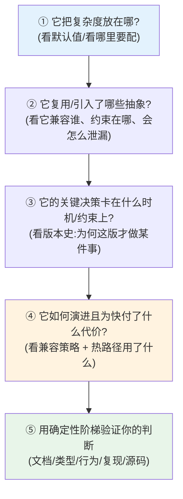

# 07 · 通用心智模型：把以上经验抽象成评估/设计任意工具的方法论

> 本节核心追问：前六节每节都抽出一个判断框架。但散着的框架记不住、也用不顺手。这一节把它们拧成**一套统一的心智模型**——一份你拿到任何一个陌生构建工具/框架，都能照着走一遍的清单。读完这节，你带走的不是「关于 Vite 的知识」，而是「读懂一类系统的能力」。
>
> 绑定案例：本节是全书主线的收束，会把前六节、以及第一/第二阶段的关键案例串成一张网。

---

## 一、先复盘：六节其实在回答同一个母问题

回头看前六节，它们看似各讲各的，其实都在回答同一个母问题——**「一个工程系统，在约束下如何做取舍」**：

| 节 | 它在追问的取舍 | 一句话结论 |
|---|---|---|
| 01 复杂度管理 | 复杂度放在哪 | 复杂度守恒，只能转移，要放对位置 |
| 02 抽象的代价 | 在哪一层解决问题 | 抽象同时给收益和约束，会泄漏 |
| 03 决策的时机 | 何时动手 | 时机是痛点/成熟度/机会三曲线的交点 |
| 04 渐进式演进 | 如何变而不破坏 | 扩展→共存→迁移→收敛，省着花破坏性预算 |
| 05 性能边界 | 为快牺牲什么 | 性能的代价是可维护性，按热/冷路径分层 |
| 06 AI 时代判断 | 确定性从哪来 | AI 给可能性，人用证据阶梯给确定性 |

**它们是同一套工程思维的六个切面。** 把这六个切面合起来，就是一套可以套用到任意系统的心智模型。

---

## 二、抽象：一套「四问 + 一阶梯」的通用评估模型

拿到任何一个陌生工具/框架（webpack、Turbopack、Bun、Next.js、某个内部平台……），按下面四问走一遍，你就能在一两个小时内看懂它的「设计骨架」，而不是淹没在 API 文档里。

### 四问清单（拿来即用）

**① 复杂度坐标问**（源自 01）

- 它把固有复杂度放在了哪里：工具内部（默认值消化）、用户配置（要学）、还是某个边界条件（平时无感、触发才疼）？
- 它的默认值「需不需要被改」？需要大量配置才能用对 = 复杂度推给了用户。
- _Vite 答案：dev 把复杂度放在「dev/build 一致性」边界，默认值高度可用。_

**② 抽象天平问**（源自 02）

- 它复用了谁的抽象/生态（继承了什么能力，也继承了什么包袱）？
- 这层抽象在哪个边界会泄漏？泄漏时是「大声报错」还是「悄悄出错」？
- _Vite 答案：复用 Rollup 钩子，dev 填不满 build 语义，但对不支持的 API 明确告警。_

**③ 时机与约束问**（源自 03）

- 翻它的版本史：某个关键能力为什么是「这一版」才出现，而不是更早？它在等什么成熟（替代品/生态/共识）？
- 它做不可逆决策时，有没有先用可逆试点（opt-in）采集证据？
- _Vite 答案：单引擎等 Rolldown 成熟，先 `rolldown-vite` opt-in 再默认。_

**④ 演进与代价问**（源自 04 + 05）

- 它做破坏性变更时用什么武器（门面/垫片/弃用警告），还是直接 break？
- 它的「快」来自哪条热路径的优化？为此在可维护性/调试/生态上付了什么代价？
- _Vite 答案：用兼容门面渐进迁移；热路径上 Rust 提速，代价是调试要切 Rust 侧、生态需适配。_

**⑤ 用确定性阶梯收口**（源自 06）

- 以上四问的答案，你是「读文档猜的」还是「跑起来/打断点确认的」？把关键判断钉到确定性阶梯（文档/类型 < 行为/告警 < 最小复现 < 源码/产物）的尽量高处。

> 这套模型的内核可以浓缩成一句话：**任何系统都是在约束下做取舍的产物；看懂它 = 还原它的约束 + 找到它的取舍 + 用证据验证你的还原。** Vite 只是这句话的一个特别精彩的案例。

---

## 三、迁移练习：用通用模型完整拆解一个非 Vite 系统

这是全书的「毕业设计」。**选一个你不太熟、但想搞懂的构建工具或框架**（例如：Turbopack、Bun、esbuild、Parcel、Next.js App Router，或你公司的内部框架），用第二节的四问 + 一阶梯走一遍，产出一页纸的「设计画像」。

下面用 **Turbopack** 做个示范开头（你来补全、并换成自己的对象）：

| 问 | Turbopack 的初步画像（待你用证据验证） |
|---|---|
| ① 复杂度放哪 | 放在「增量计算图」的实现复杂度 + 与 Next.js 强绑定；对用户隐藏，默认开箱即用 |
| ② 复用/引入哪些抽象 | 不复用 Rollup/Vite 生态，自建 loader 体系；约束=生态不互通，泄漏点=非 Next 场景适配差 |
| ③ 时机/约束 | 押注「Rust + 增量」,等的是 Next 自身规模大到必须自研构建以掌控性能 |
| ④ 演进/代价 | 与 Next 版本强耦合演进；为快用 Rust，代价=封闭生态 + 调试门槛 + 平台二进制 |
| ⑤ 证据 | 翻 Next 官方文档、跑一个最小 Next 项目看构建行为、必要时读其公开设计文档验证以上猜测 |

填完你会发现一件事：**Turbopack 和 Vite 的每一个取舍几乎都不同，但它们用的是同一套取舍语言。** 你不再需要「专门学 Turbopack」，你只是把同一套四问套了上去。这，就是「通用心智模型」生效的样子。

---

## 四、全阶段收束：你带走的到底是什么

走到这里，回看《Vite：从使用到精通》三个阶段：

- 第一阶段给你**手上的功夫**（会配、会排障、会升级）；
- 第二阶段给你**眼里的链路**（能 clone、能断点、能跟真实流程）；
- 第三阶段给你**脑中的模型**（能还原约束、能评判取舍、能预判演进）。

Vite 会继续迭代到 9、10，今天的某些实现细节终将过时——这也是本书反复强调「事实基线」的原因。但**这套「在约束下看取舍」的心智模型不会过时**，因为它讲的从来不是 Vite，而是「优秀的工程系统如何被设计出来」。

> 把这一句作为整本小册的结语：**学 Vite 的终点，不是成为 Vite 专家，而是借 Vite 这个绝佳样本，长出一双能看懂任何工具设计的眼睛。**

---

## 五、本节小结

**复盘了什么？**
把前六节六个判断框架还原成同一个母问题——「系统如何在约束下做取舍」，并合成一套通用评估模型。

**抽象出什么可迁移框架？**

- **四问 + 一阶梯**：① 复杂度放哪 → ② 复用/引入哪些抽象（怎么泄漏）→ ③ 关键决策卡在什么时机/约束 → ④ 如何演进、为快付什么代价 → ⑤ 用确定性阶梯验证。
- **核心一句话**：看懂一个系统 = 还原它的约束 + 找到它的取舍 + 用证据验证你的还原。

**读完你应当能做到：**

- [ ] 复述前六节如何统一到「约束下做取舍」这个母问题；
- [ ] 不看本文，凭记忆走一遍「四问 + 一阶梯」通用评估模型；
- [ ] 对一个**非 Vite** 的工具/框架产出一页纸的「设计画像」（四问表 + 确定性来源）；
- [ ] 说清三阶段分别给了你什么（手上功夫 / 眼里链路 / 脑中模型），以及为什么心智模型比实现细节更耐用。

恭喜你走完《Vite：从使用到精通》全部三个阶段。从这里开始，去找下一个值得你用这套眼睛去拆解的系统吧。
